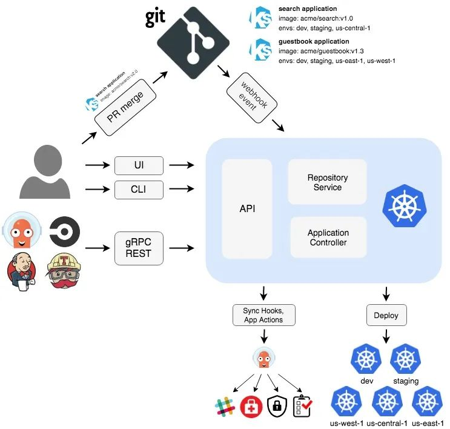
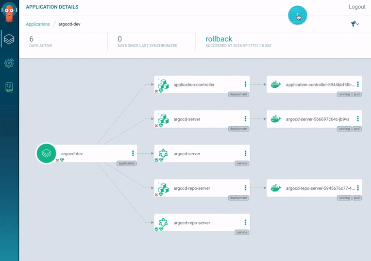
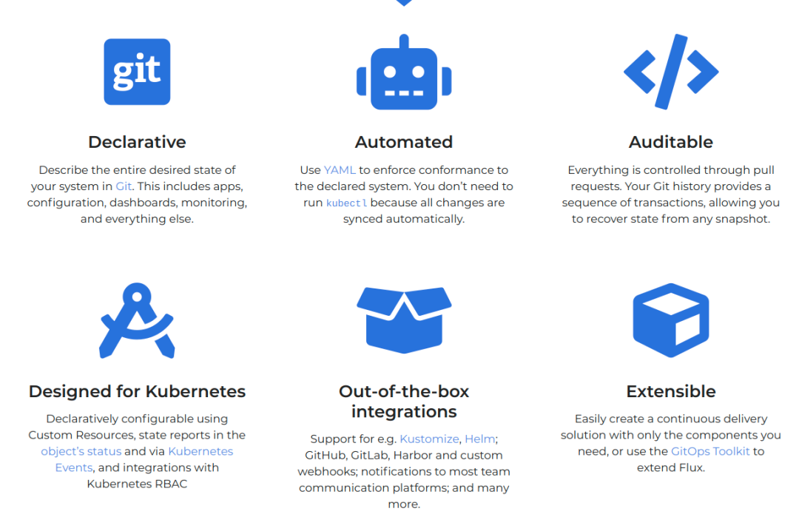
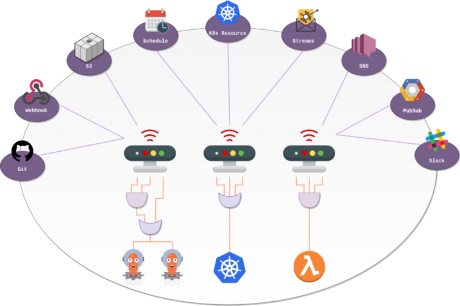
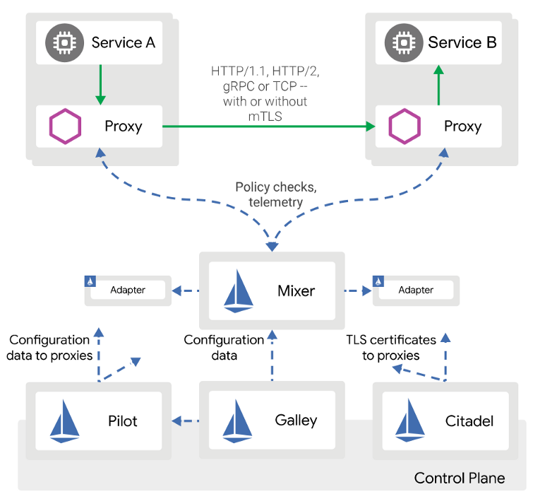
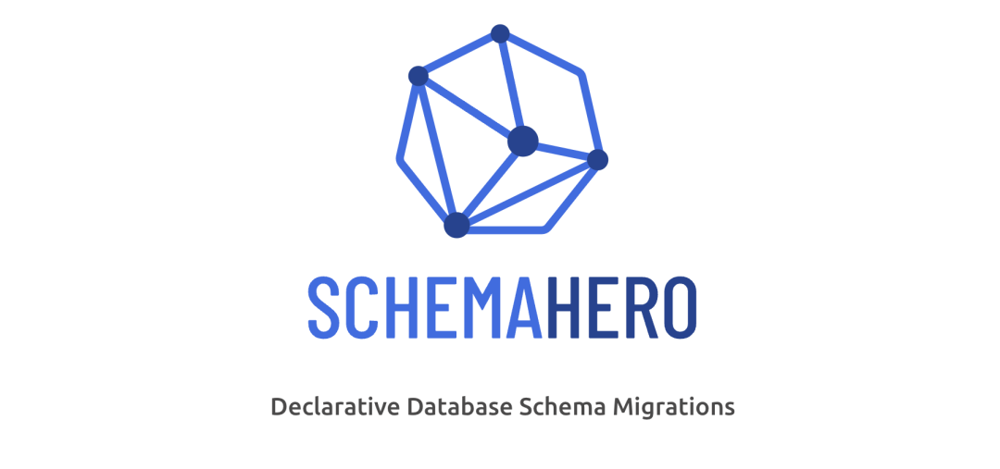
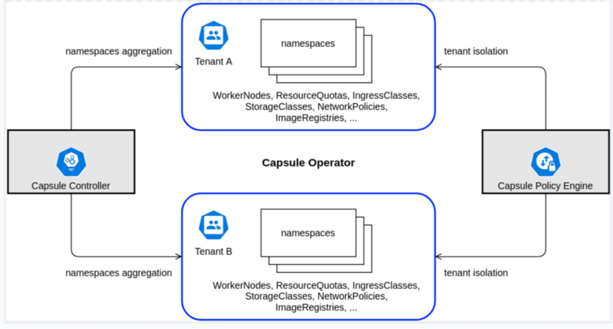

# GitOps 常用工具盘点

Kubernetes 的优势主要在于它的声明式性质与控制循环相结合，并通过这些控制循环持续监控集群的活动状态，确保它与 etcd 中存储的期望状态保持一致。

**这种方式非常强大，但同时其数据库也被限制为etcd(etcd仅提供了有限的可观察性)，并影响到了集群变更时的责任性和审计性。**

**另外一个缺点是将etcd和代码仓库作为两个SOT(sources of truth)，有可能会导致配置漂移，造成管理上的困难。**

 开发者使用代码仓库这种安全且可追溯的方式来保存代码，并开发出了 [Workflows](https://www.atlassian.com/git/tutorials/comparing-workflows/gitflow-workflow) 这种方式来高效地管理中央仓库，不同的团队可以并行工作，且不会产生过多的冲突，同时保证对所有变更进行审核，并支持追溯和回滚。
 
如果我们能够从围绕 Git 仓库创建的流程中获得这些优势，并将它们扩展到基础设施或是 kubernetes 中，那不是很好吗？

## 什么是 GitOps？

**GitOps 的目的是将 etcd 的这种声明式特性扩展到(保存代码的) Git 仓库，并作为 SSOT(single source of truth)**。

通过这种方式，我们可以利用 Git 带来的优势，如代码监视、历史变更、快速回滚、可追溯性等等。

> GitOps 的核心观点是使用包含当前期望的(生产环境基础设施的)声明式描述的 GIt 仓库，并通过自动化流程来确保生产环境与仓库中的期望状态保持一致。
> 
> 如果你想要部署一个新的应用或更新一个现有的应用，只需要更新相应的仓库即可(自动化流程会处理后续的事情)。这就像在生产中使用巡航控制来管理应用程序一样。

GitOps 不仅限于 Kubernetes，实际上它还可以通过将 **[基础设施作为代码](https://www.ibm.com/cloud/learn/infrastructure-as-code)** 保存到GIt仓库中来将应用代码延伸到基础设施中，这通常是通过 **Terraform** 这样的工具进行普及的。

**[声明式基础设施既代码](https://www.ibm.com/cloud/learn/infrastructure-as-code)** 在实现GitOps中扮演着一个重要的作用，但不仅限于此。

GitOps围绕Git构建了整个生态系统和工具，并将其应用到基础设施，仅仅在Git中使用Terraform并不能保证基础设施的状态能够与生产环境保持一致，还需要持续运行Terraform命令(terraform apply)来监控实时版本的变化，以及在流水线中实现手动审批等功能。

## Kubernetes 中的 Gitops

Kubernetes 从一开始就有控制循环的想法，这意味着 Kunernetes 总是会监控集群的状态来保证达到期望状态。例如，使运行的副本数与期望的副本数匹配。将 GitOps 的理念延申到应用，这样就可以将服务定义为代码，例如，通过定义 Helm Charts，并使用一个通过K8s提供的功能来监控App状态的工具来调整对应的集群状态，即，更新了代码仓库，或更新了生产集群的 helm chart。这才是真正的持续部署。其中的核心原则是，应用部署和生命周期管理应该是自动化的、可审计并易于理解的。

每个环境都应该有一个代码仓库，用于定义给定集群的期望状态。然后 Kubernetes Operators 会持续监控特定分支(通常是master分支)，并在探测到 Git 发生变更后，将此次变更传递到集群，并更新etcd中的状态。在这种方式中，**etcd只作为一个数据库，且不是唯一的SOT**。

可以在包含声明式Kubernetes基础设施的Git仓库中定义应用的Helm chart。此外，还可以链接存储库，这样一个存储库可以监视另一个存储库，以此类推。

Kubernetes GitOps工具可以监控其他仓库(如Helm Chart仓库)的状态，这样你的集群环境仓库中无需包含Helm Chart，只需要一条到Helm 仓库的连接，并使用该链接监控其变更即可，这样当你发布的一个新的chart时，后续会将该chart自动部署到集群。通过这种方式自动执行端到端的声明式CI/CD流水线。

## 声明式 GitOps 工具

### ArgoCD

Kubernetes 上最好的 GitOps 工具就是 ArgoCD[9] 。ArgoCD 是Argo生态系统的一部分，该生态系统包含了很多很好的工具，后续会进行讨论。

使用 ArgoCD，可以在代码库中定义每个环境的所有配置。Argo CD 会在特定的目标环境中自动部署所需的应用状态。

Argo CD 作为一个 kubernetes controller，持续监控运行的应用，并将当前的活动状态与所需的目标状态(如 Git repo 中描述的状态)进行比较。Argo CD 会报告并呈现这种差异，并通过自动或手动的方式将实时状态同步到期望的目标状态

**ArgoCD** 有一个非常棒的 UI，支持 SSO，它是安全、可扩展且易于使用的。

**Flux**

Flux 是除 ArgoCD 外另一个非常有名项目。最近的版本包含很多改进，功能上非常接近 ArgoCD，Flux 是 CNCF 孵化项目

## GitOps 工具

### helm

Helm 无需多言，它是 Kubernetes 上最著名的包管理器，当然，你应该像在编程语言中使用包一样，在K8s中使用包管理器。Helm 允许使用 Charts 的方式打包应用，将复杂的应用抽象为可重用的简单组件，便于定义、安装和升级。

它还提供了一个强大的模板引擎，Helm 已经很成熟，它包含很多预定义的charts，支持性强，使用方便。

Helm 可以很好地集成到 ArgoCD 或 Flux，后者可以监控 Helm 仓库的变化，并在发布新的 charts 时进行部署。实现思路是将 ArgoCD 或 Flux 指向 Helm 仓库，并指定一个特定的版本或通配版本。

如果使用通配版本，一旦发布了新的版本，就会进行自动部署。你可以使用主版本或次版本的方式进行命名。我通常倾向于将应用打包到 charts 中，将其作为 CI/CD 的一部分进行构建，并让 ArgoCD 监控特定的仓库。这种关注点分离允许开发者在独立于环境的仓库中管理应用，并让 ArgoCD 选择在哪个环境中部署哪个 charts。你可以使用多个 Helm 仓库并根据不同的环境推送变更。

例如，在合并一个 PR 后，可以执行一次 "bronce" 构建，该构建会将 Helm chart 发布到一个名为 "bronce" 的仓库中。dev 环境的 ArgoCD 仓库指向 "bronce" 仓库，并在可用时部署新版本。staging 环境的 ArgoCD 仓库会指向名为 "silver" 仓库，而 production 环境则指向名为 "gold" 的仓库。当需要向 staging 或 production 环境推送某些内容时，CI/CD 只需将该 chart 发布到下一个仓库即可。

**ArgoCD 可以覆盖任何环境的特定 Helm 值。**

Kustomize 是一个新的 helm 的替代品，它不需要模板引擎，而使用了一个 overlay 引擎，之上有基本定义和 overlays 。

### Argo Workflows 和 Argo Events

在 Kubernetes 中，你可能需要运行批量任务或复杂的工作流，作为数据处理流程、异步处理或 CI/CD 的一部分。

除此之外，你可能需要运行驱动微服务来响应特定的事件，如文件上传或发送消息到某个队列。为了实现这些功能，可以使用 [Argo Workflows](https://argoproj.github.io/argo-workflows/)和 [Argo Events](https://argoproj.github.io/argo-events/)。

虽然它们是独立的项目，但趋向于部署到一起。

Argo Workflows 是一个类似 Apache Airflow 的编排引擎，但天然适用于Kubernetes。

它使用CRDs来定义复杂的workflows(使用YAML表示的steps或 DAGs[15] 来表达工作流)。它还有个不错的UI，支持重试机制，定时任务，输入输出跟踪等。你可以使用它来编排数据处理流水线和批量任务等。

**有时你可能希望将流水线与异步服务(如 Kafka、队列、webhook 或底层存储服务)集成到一起。例如，你可能希望对上传文件到S3这样的事件做出响应，此时你可以使用 Argo Events。**

上述两种工具为需要 CI/CD 流水线提供了简单且强大的解决方案，可以在 Kubernetes 上运行 CI/CD 流水线。

由于所有 workflows 定义都可以打包到 Helm charts 中，因此 Argo Workflows 可以很好地集成到 ArgoCD。

对于 ML 流水线，可以使用 Kubeflow 实现相同的目的。

对于 CI/CD 流水线，可以使用 Tekton。

### Istio

**Istio 是市面上最著名的 服务网格** ，它是开源的，且非常流行。由于服务网格内容庞大，因此这里不会讨论细节，但如果你在构建微服务，有可能你会需要一个服务网格来管理通信、可观测性、错误处理、安全以及(作为微服务架构一部分的)其他交叉方面。使用服务网格可以避免因为重复的逻辑而污染微服务的代码。

简而言之，一个服务网格就是一个特定的基础设施层，你可以在上面添加应用，它允许透明地添加可观测性、流量管理和安全，而无需自己实现这些功能。

Istio 使用 CRDs 来实现其所有功能，因此可以将virtual services、gateways、policies等作为代码打包在Helm charts中，并使用ArgoCD或Flux来让Istio变得GitOps友好(虽然不是那么强大)。

还可以使用 Linkerd 或 Consul 替代Istio。

### Argo Rollouts

上面已经提到过，你可以使用 Kubernetes 来运行使用Argo Workflows 或类似工具的 CI/CD 流水线。**下一步逻辑上是执行持续部署，但在现实场景中，由于其风险较高，因此大部分公司只做了持续交付，这意味着他们可以实现自动化，但仍然采用手动方式进行审批和校验，这类手动步骤的根因是这些团队无法完全信任其自动化**。

那么该如何构建这种信任度来避免使用脚本，进而实现从代码到生产的完全自动化。答案是：可观测性。你需要关注资源的指标，并通过采集所有的数据来精确地传达应用的状态，即使用一组指标来构建信任度。如果 Prometheus 中包含所有的数据，那么就可以实现自动化部署，因为此时你可以根据指标来实现滚动更新应用。

简单地说，你可以使用 K8s 提供的开箱即用的高级部署技术-- 滚动升级。我们需要使用金丝雀部署来实现渐进式发布，目的是将流量逐步路由到新版本的应用，等待指标采集，然后进行分析并于预先定义的规则进行匹配。**如果检查正常，则增加流量；如果发现问题，则回滚部署**。

**在 Kubernetes 上可以使用 Argo Rollouts 来实现金丝雀发布**。

> Argo Rollouts 是一个 Kubernetes controller，它使用一组 CRDs 来提供高级部署能力，如蓝绿、金丝雀、金丝雀分析、实验等，并向Kubernetes提供渐进式交付功能。

虽然像 Istio 这样的服务网格可以提供金丝雀发布，但Argo Rollouts简化了处理流程，且以开发者为中心。除此之外，Argo Rollouts还可以集成到任何服务网格中。

Argo Rollouts 是 GitOps 友好的，且能很好地与 Argo Workflows 和 ArgoCD 进行集成。使用这三种工具可以为部署创建一个非常强大的声明式工具集。

Flagger 和Argo Rollouts非常类似，可以很好地与 Flux 进行集成，因此如果你正在使用Flux，可以考虑使用Flagger。

### Crossplane

[Crossplane](https://crossplane.io/) 它填补了Kubernetes的一个关键空白：像管理K8s资源一样管理第三方服务。这意味着，你可以使用YAML中定义的K8s资源，像在K8s中配置数据库一样配置AWS RDS或GCP cloud SQL等云供应商的数据库。

Crossplane 扩展了 Kubernetes 集群，使用 CRDs 来提供基础设施或管理云服务。再者，相比于 Terraform 这样的工具，它可以完全实现自动部署。Crossplane 使用现成的 K8s 能力，如使用控制循环来持续监控集群，并自动检测配置漂移。

例如，如果定义了一个可管理的数据库实例，后续有人手动进行了变更，Crossplane 会自动检测该问题，并将其设置回先前的值。它将基础设施作为代码并按照 GitOps 原则来执行。

**Crossplane 可以与 ArgoCD 配合起来，监控源代码，并保证代码库是唯一的信任源(SOT)，代码中的任何变更都会传递到集群以及外部云服务**。

如果没有 Crossplane，你可以在 K8s 服务中实现 GitOps，但无法在没有额外处理的前提下实现云服务的GitOps。

### Schema Hero

软件开发中另一种常见的的处理流程是在使用关系型数据库时，需要管理 schema 的演进。

[SchemaHero](https://schemahero.io/) 是一个开源数据库的schema迁移工具，可以将schema定义转化为可以在任何环境运行的迁移脚本。它使用了Kubernetes的声明特性来管理数据库schema的迁移。你可以指定期望的状态，并让 SchemaHero 管理剩下的工作。

### Bitnami Sealed Secrets

至此，我们已经涵盖了很多 GitOps 工具，我们的目标是将所有内容保存到 Git，并使用 Kubernetes 的声明特性来让环境保持同步。我们可以（也应该）在 Git 中保证 SOT，并让自动化流程处理配置更改。

有一种资源通常难以保存到 Git 中，即 secret，如 DB 密码或 API 密钥。一种常见的解决方案是使用外部"保险库"，如 AWS Secret Manager 或 HashiCorp Vault 来保存这些secret，但这样也产生了冲突，你需要一个单独的流程来处理secrets。

理想情况下，我们希望通过某种方式将secrets像其他资源一样安全地保存到Git中。

Sealed Secrets 就是用来解决这种问题的，它允许你将敏感数据通过强加密保存到Git中，**Bitnami Sealed Secrets天然集成进了Kubernetes中，可以使用Kubernetes中运行的Kubernetes controller来解密secret，而无需依赖其他组件**。

controller可以解密数据并创建原生的K8s secrets资源。通过这种方式可以将所有内容作为代码保存到仓库中，进而可以安全地执行持续部署，不需要依赖外部资源。

Sealed Secrets 包含两部分：

* 集群侧的控制器
* 客户端侧程序：kubeseal

kubeseal 程序使用非对称加密来对 secrets 进行加密，且只有 controller 可以解密。这些加密的 secrets 被编码到了 K8s 的 SealedSecret 资源中(可以保存到 Git 中)。

### Capsule

很多公司使用多租户来管理不同的客户，这在软件开发中很常见，但很难在 Kubernetes 中实现。一种方式是通过 命名空间 将集群划分为独立的逻辑分区，但无法完全隔离用户，还需要引入网络策略、配额等等。你可以在每个命名空间中创建网络策略和规则，但这是一个让人乏味的过程，且无法扩展，而且租户无法使用多个命名空间，这是一个很大的限制。

**分层命名空间** 可以用来解决这些问题。方法是为每个租户分配分配一个父命名空间，并为该租户配置通用的网络策略和配额，并允许创建子命名空间。这是一个很大的改进，但在租户层面，缺少安全性和治理方面的原生支持。此外，它还没有达到生产状态，但预计将在未来几个月发布1.0版本。

一种常见的方式是为每个客户创建一个集群，这样做相对比较安全，并给租户提供了所需的一切内容，但这种方式很难管理，费用也很高。

**Capsule 是一种在单个集群中为Kubernetes提供多租户功能的工具。使用Capsule，你可以将所有租户放到一个集群中。Capsul会为租户提供一个"近乎"原生的体验(虽然有一些小小的限制)，租户可以在其集群中创建多个命名空间。这种方式隐藏了多租户共享底层集群的事实。**

**<mark>在一个集群中，Capsule 控制器将多个命名空间聚合到一起，抽象为一个轻量级的 Kubernetes，称为租户，它是一组 Kubernetes 命名空间</mark>**。

在每个租户中，用户可以创建其命名空间并共享分配到的资源，Policy Engine 保证租户间的隔离性。

网络和安全策略、资源配额、LimitRanges、RBAC 和在租户级别定义的其他策略由租户中的所有命名空间自动继承，类似于分层命名空间。然后，用户可以自主地操作租户，而无需集群管理员的干预。

Capsel 是 GitOps 的，因为它是声明性的，所有的配置都可以存储在 Git 中。