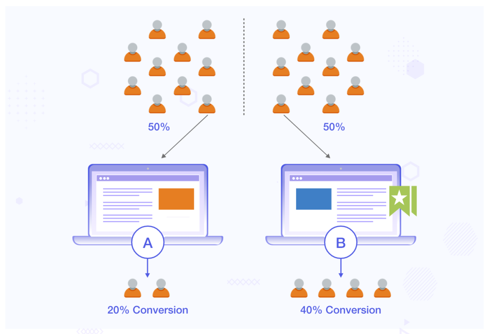
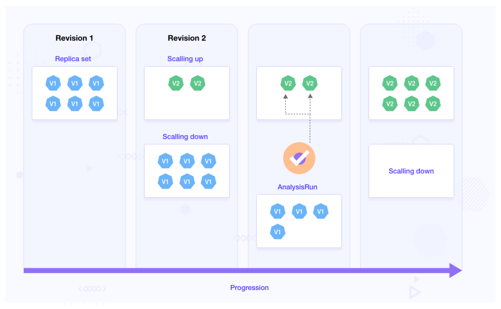
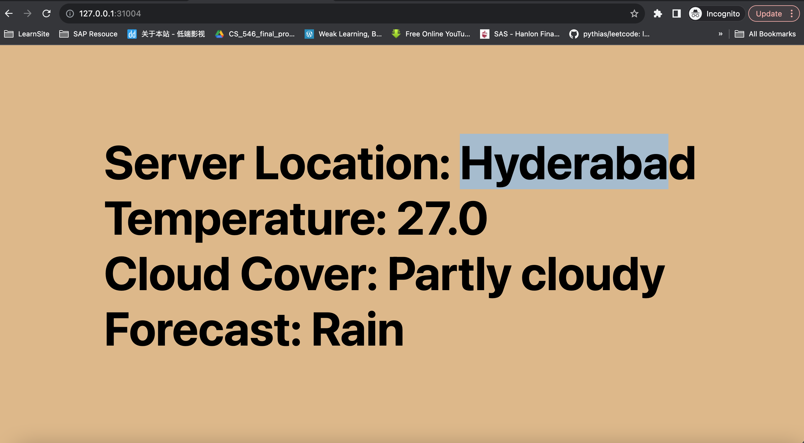
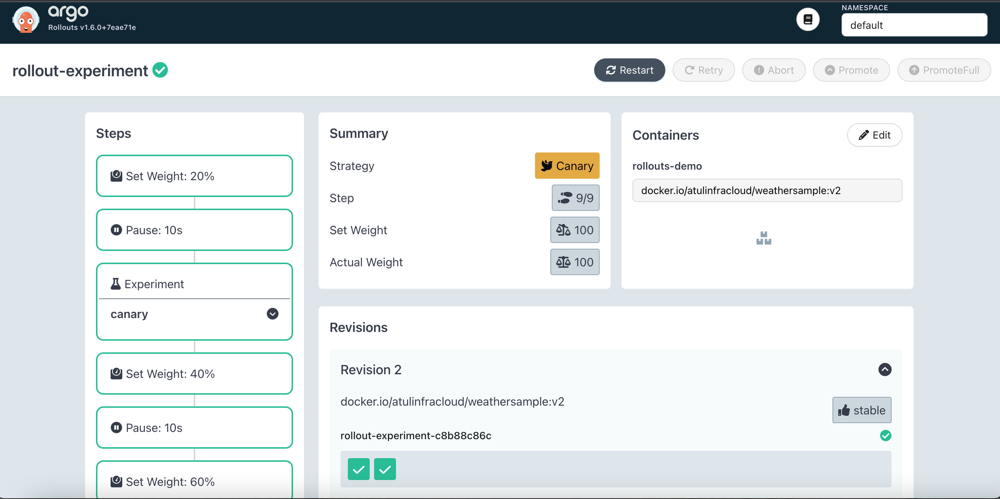
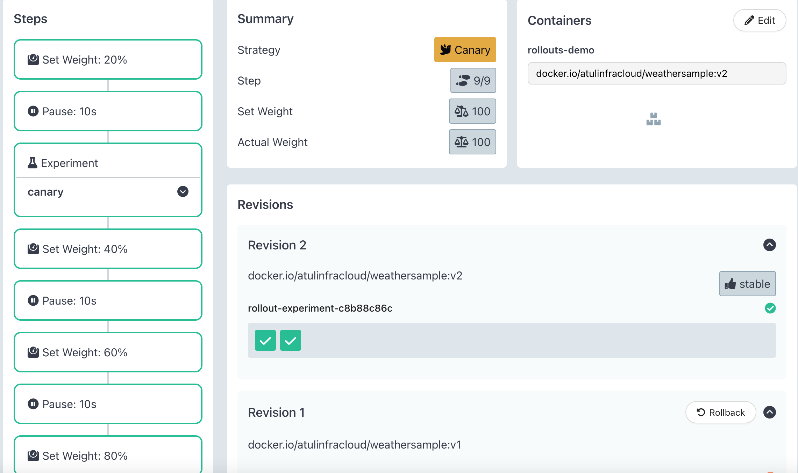
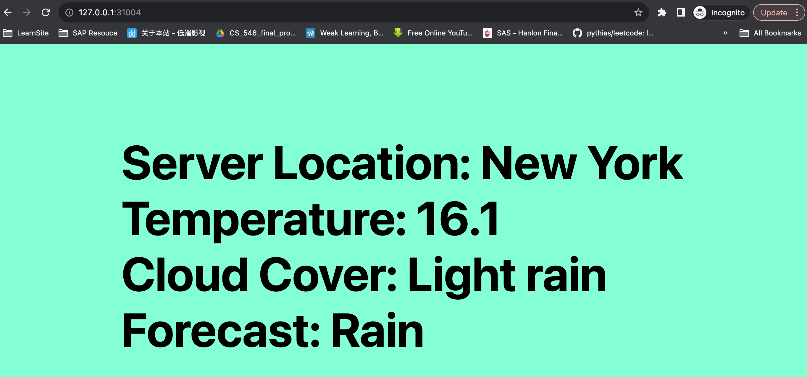

# A/B测试: 如何使用Argo Rollouts 进行渐进式交付

传统上，软件和应用程序如果升级出现任何问题，工程团队无能为力，因为应用程序发布后他们几乎无法控制该应用程序。

然而，**随着渐进式交付策略的出现**，团队可以更好地控制他们的发布。这使得他们可以更轻松地快速回滚到以前的版本，以防出现问题。

**大多数部署策略（例如 Canary 和 Blue-Green）允许我们快速回滚应用程序版本，同时维护应用程序的不同版本**。

谈到多个版本，其中一个版本打开了一项功能，另一个版本则关闭了该功能。但是，在将其发布给更大的群体之前，您如何知道哪一个更好呢？

在这篇博文中，我们将讨论 A/B 测试，它允许您利用数据来帮助您确定哪个版本更好。我们将了解什么是 A/B 测试，了解其在渐进式交付中的作用，并使用一个简单的示例展示 A/B 测试如何与Argo Rollouts配合使用。

## A/B 测试 101

A/B 测试是一个**对应用程序的两个不同版本进行比较和评估的过程**，以确定哪个版本性能更好。这也称为对比测试。**不同的版本会显示给不同的用户组，并通过收集不同的指标来执行统计分析，以帮助确定哪个版本性能更好**。

A/B 测试流行的主要原因之一是**它允许团队根据数据而不是他们的意见对其产品进行更改**。团队可以对产品有一个愿景，但是，用户的反馈有助于塑造产品的未来。基于此类反馈，产品可以随着时间的推移而得到改进。



这种方法非常流行，用于衡量登陆页面和应用程序的性能。使用 A/B 测试，他们不仅能够做出设计决策，还能了解影响应用程序性能的用户体验。我们中的许多人可能很难相信按钮颜色的简单改变就能使转化率提高 21%。

## 使用 A/B 测试的数据驱动渐进式交付


在渐进式交付的情况下，您有两个不同的部署，您可以在这两个部署上运行测试，以帮助您确定两个版本中哪个版本更好。在决定继续进行哪一个之前，我们可以对不同版本的应用程序启动多个长时间运行的实验。


您运行的测试和收集的指标完全取决于您的用例。**您可以对应用程序版本本身运行测试，或使用外部指标来决定最终版本。**

**团队通常使用延迟、点击率和跳出率等指标**来选择升级到生产的版本。

在渐进式交付中使用 A/B 测试不仅可以使您的流程更具弹性和快速，还可以帮助您根据数据确定用户的最佳体验。


让我们看看如何使用 Argo Rollouts 进行渐进式交付中的 A/B 测试。

## 使用 Argo 推出实验进行 A/B 测试


Argo Rollouts是一个 Kubernetes 控制器以及一组 CRD，可提供高级部署策略，例如 Canary、Blue Green 和 Experiments 等。

它创建类似于部署的ReplicaSet 。

控制器根据rollout 对象中定义的spec.template管理这些 ReplicaSet 的创建和删除。

**Argo Rollouts Experiment 是一个 Kubernetes CRD，它允许我们对应用程序执行 A/B 测试和 Kayenta 式分析**。Experiment由三个组成部分组成。让我们了解一下这些是什么：

* Experiment：**旨在在 ReplicaSet 上运行以进行分析。Experiment可以按照预定的持续时间或无限期地运行直至停止**。如果未指定持续时间，它将无限期地运行，**直到停止或直到所有标记requiredForCompletion的分析完成**。在内部，它还引用 **AnalysisTemplate**。这用于并行创建基线和金丝雀部署，并比较两者生成的指标以决定后续步骤。
* AnalysisTemplate：**此模板定义如何执行分析。它包括频率、持续时间和成功/失败值等详细信息**，用于确定实验是成功还是失败。
* AnalysisRun：这些是根据 AnalysisTemplate 中提供的详细信息运行的作业。它们被分类为成功、失败或不确定，**根据这些来决定Rollout的更新。因此，仅当 AnalysisRun 成功时，部署才会继续**。




Experiment可以独立运行、作为部署的一部分或与流量路由一起运行。在这篇文章中，我们将讨论如何使用 Argo Rollouts Experiment进行金丝雀部署。

以下是 Argo Rollouts Experiment如何与金丝雀推出配合使用：


* 副本集被创建，一旦它们达到完全可用性，Experiment就会开始并很快进入运行状态。
* 当Experiment运行时，它会根据 AnalysisTemplate 中提供的详细信息启动 AnalysisRun。
* 如果指定了持续时间，则Experiment将在完成之前持续运行。
* 如果 AnalysisRun 成功，则Experiment成功并且部署将继续，如果失败，则部署不会发生。
* 一旦 AnalysisRun 完成并且Experiment结束，ReplicaSets 将缩放为零。

## Argo Rollouts 金丝雀部署

我们将使用带有金丝雀部署策略的 Argo Rollouts Experiment，并了解Experiment如何帮助我们执行 A/B 测试并自动确定推出进度状态。

### 使用案例

我们将使用一个天气应用程序。天气应用程序有两个版本，将使用金丝雀部署策略推出。我们将在金丝雀策略中进行一个Experiment。**该Experiment引用了一个 AnalysisTemplate，它基本上从 API 获取响应。根据响应，Experiment将被标记为通过或失败。如果Experiment成功，则将推出应用程序的新版本，否则不会**。

了解了用例后，让我们进入代码：


### Argo Rollouts Experiment的实施

首先，您需要一个 Kubernetes 集群。您可以让它在本地系统或托管云提供商上运行。然后，您可以通过配置终端来访问该集群来连接到该集群。在本例中，我们使用 Minikube。**如果您使用 Minikube，请确保启用 ingress 插件**。


下一步是克隆包含此示例的存储库：

```
git clone https://github.com/infracloudio/ArgoRollouts-ABTesting-WeatherExample.git
```

### 设置 Argo Rollouts 控制器

创建一个命名空间以将 Argo Rollouts 控制器安装：

```
kubectl create namespace argo-rollouts
```

安装最新版本的 Argo Rollouts 控制器：

```
kubectl apply -n argo-rollouts -f https://github.com/argoproj/argo-rollouts/releases/latest/download/install.yaml
```

确保用于 argo 部署的所有组件和 Pod 均处于运行状态。您可以通过运行以下命令来检查它：

```
kubectl get all -n argo-rollouts
```

与 Argo Rollouts 控制器交互的最简单且推荐的方法之一是使用**`kubectl argo rollout`** 插件。您可以通过执行以下命令来安装它：

```

curl -LO https://github.com/argoproj/argo-rollouts/releases/latest/download/kubectl-argo-rollouts-linux-amd64
chmod +x ./kubectl-argo-rollouts-linux-amd64
sudo mv ./kubectl-argo-rollouts-linux-amd64 /usr/local/bin/kubectl-argo-rollouts
kubectl argo rollouts version
```

至此，我们已经在 Kubernetes 集群上成功配置了 Argo Rollouts 控制器。


### Argo Rollouts金丝雀部署

如前所述，我们将使用 `Argo Rollouts Experiment`和 `Canary` 部署。

为此，我们将创建一个金丝雀`rollout.yaml`和一个`AnalysisTemplate`。
rollout规格：

```
apiVersion: argoproj.io/v1alpha1
kind: Rollout
metadata:
 name: rollout-experiment
spec:
 replicas: 2
 strategy:
   canary:
     steps:
     - setWeight: 20
     - pause: {duration: 10}
     # The second step is the experiment which starts a single canary pod
     - experiment:
         duration: 5m
         templates:
         - name: canary
           specRef: canary
         # This experiment performs its own analysis by referencing an AnalysisTemplates
         # The success or failure of these runs will progress or abort the rollout respectively.
         analyses:
         - name: canary-experiment
           templateName: webmetric
     - setWeight: 40
     - pause: {duration: 10}
     - setWeight: 60
     - pause: {duration: 10}
     - setWeight: 80
     - pause: {duration: 10}
 revisionHistoryLimit: 2
 selector:
   matchLabels:
     app: rollout-experiment
 template:
   metadata:
     labels:
       app: rollout-experiment
   spec:
     containers:
     - name: rollouts-demo
       image: docker.io/atulinfracloud/weathersample:v1
       imagePullPolicy: Always
       ports:
       - containerPort: 5000

---
apiVersion: v1
kind: Service
metadata:
 name: rollout-weather-svc
spec:
 selector:
   app: rollout-experiment
 ports:
   - protocol: "TCP"
     port: 80
     targetPort: 5000
 type: NodePort

---
apiVersion: networking.k8s.io/v1
kind: Ingress
metadata:
 name: rollout-ingress
 annotations:
   nginx.ingress.kubernetes.io/rewrite-target: /
spec:
	ingressClassName: nginx
 rules:
 - http:
     paths:
     - path: /
       pathType: Prefix
       backend:
         service:
           name: rollout-weather-svc
           port:
             number: 80
```

在上面，`rollout.yaml`我们创建了一个金丝雀策略并提供了一个experiment作为步骤。

**无论结果如何，experiment都计划运行 5 分钟。它创建一个 `Canary ReplicaSet` 并引用一个 `AnalysisTemplate` 对象**。

AnalysisTemplate 
 
```
apiVersion: argoproj.io/v1alpha1
kind: AnalysisTemplate
metadata:
 name: webmetric
spec:
 metrics:
 - name: webmetric
   successCondition: result.completed == true # Change this value to `result.completed == false` to fail the test
   provider:
     web:
       url: "https://jsonplaceholder.typicode.com/todos/4" # URL returns a JSON object with completed being one of the values, it returns true by default
       timeoutSeconds: 10
 ```
 
 AnalysisTemplate 名称为webmetric。
 
 它调用返回 JSON 对象的 API。该对象有多个变量，其中之一是completed. 下面是一个 JSON 对象示例：
 
 ```
{
    "userId": 1,
    "id": 4,
    "title": "et porro tempora",
    "completed": true
  }
 ```
 
**该模板指定successConditionas的值为`result.completed == true`。**

**这意味着只有当completed值为true时 AnalysisRun 才会成功**。即，仅当该 AnalysisRun 成功时，更新才会继续进行。

为了便于部署，我们将上面提到的服务和部署合并到一个 YAML 文件中：`rollout.yaml.` 我们将首先部署 `AnalysisTemplate`，然后进行部署。

```

$ kubectl apply -f analysis.yaml
analysistemplate.argoproj.io/webmetric created
```

使用以下命令检查创建的 AnalysisTemplate 的状态：


```
$ kubectl describe AnalysisTemplate

Name:         webmetric
Namespace:    default
Labels:       <none>
Annotations:  <none>
API Version:  argoproj.io/v1alpha1
Kind:         AnalysisTemplate
Metadata:
  Creation Timestamp:  2022-09-26T07:03:32Z
  Generation:          1
  Managed Fields:
    API Version:  argoproj.io/v1alpha1
    Fields Type:  FieldsV1
    fieldsV1:
      f:metadata:
        f:annotations:
          .:
          f:kubectl.kubernetes.io/last-applied-configuration:
      f:spec:
        .:
        f:metrics:
    Manager:         kubectl-client-side-apply
    Operation:       Update
    Time:            2022-09-26T07:03:32Z
  Resource Version:  8231
  UID:               43717fbe-8126-4564-87a1-6c45b1d45ba8
Spec:
  Metrics:
    Name:  webmetric
    Provider:
      Web:
        Timeout Seconds:  10
        URL:              https://jsonplaceholder.typicode.com/todos/1
    Success Condition:    result.completed == true
Events:                   <none>
```

部署 AnalysisTemplate 后，让我们使用以下命令部署rollout：

```

kubectl apply -f rollout.yaml

rollout.argoproj.io/rollout-experiment created
service/weather-test-app-hyd created
service/weather-test-app-ny created
```

您可以通过运行以下命令来验证rollout是否成功：

```
$ kubectl argo rollouts get rollout rollout-experiment

Name:            rollout-experiment
Namespace:       default
Status:          ✔ Healthy
Strategy:        Canary
  Step:          9/9
  SetWeight:     100
  ActualWeight:  100
Images:          docker.io/atulinfracloud/weathersample:v1 (stable)
Replicas:
  Desired:       2
  Current:       2
  Updated:       2
  Ready:         2
  Available:     2

NAME                                           KIND        STATUS     AGE   INFO
⟳ rollout-experiment                           Rollout     ✔ Healthy  116s  
└──# revision:1                                                             
   └──⧉ rollout-experiment-9fb48bdbf           ReplicaSet  ✔ Healthy  116s  stable
      ├──□ rollout-experiment-9fb48bdbf-czvsh  Pod         ✔ Running  116s  ready:1/1
      └──□ rollout-experiment-9fb48bdbf-qnk2s  Pod         ✔ Running  116s  ready:1/1
```

```
$ kubectl get all -n argo-rollouts 
NAME                                READY   STATUS    RESTARTS      AGE
pod/argo-rollouts-b9bbbc884-mrgkp   1/1     Running   1 (22h ago)   22h

NAME                            TYPE        CLUSTER-IP        EXTERNAL-IP   PORT(S)    AGE
service/argo-rollouts-metrics   ClusterIP   192.168.194.247   <none>        8090/TCP   23h

NAME                            READY   UP-TO-DATE   AVAILABLE   AGE
deployment.apps/argo-rollouts   1/1     1            1           23h

NAME                                      DESIRED   CURRENT   READY   AGE
replicaset.apps/argo-rollouts-b9bbbc884   1         1         1       23h
```

此时，我们的应用程序正在使用天气应用程序 v1 运行。为了访问该应用程序，您需要执行以下操作：

* 在新的终端中运行`minikube tunnel`；这将创建一个隧道，以便我们可以从本地主机访问入口。
* 在另一个终端中，公开`rollout-weather-sv`c通过命令 `minikube service rollout-weather-svc --url`
* 使用您从上述步骤中获得的 URL 访问该应用程序。



现在让我们使用金丝雀策略将Docker镜像更新为新的Docker镜像。

```
kubectl argo rollouts set image rollout-experiment rollouts-demo=docker.io/atulinfracloud/weathersample:v2
```

当我们运行此命令时，以下活动将同时启动：

* 金丝雀部署将开始rollout过程。
* **Experiments将启动并触发提供的 AnalysisTemplate，它将处于模板中指定的running状态 5 分钟**。
* AnalysisRun 将根据 AnalysisTemplate 启动并运行直至测试结束。
* AnalysisRun 将成功结束，但Experiments将运行 5 分钟。
* 5 分钟后，Experiments将成功，部署将继续并部署天气应用程序 v2。

在以下部分中，我们将看到上述每项活动。

Experiments状况

```
$ kubectl get Experiments

NAME                               STATUS    AGE
rollout-experiment-c8b88c86c-2-2   Running   9s
```

AnalysisRun 的状态

```
$ kubectl get AnalysisRun
NAME                                                 STATUS       AGE
rollout-experiment-c8b88c86c-2-2-canary-experiment   Successful   16s
```

让我们描述 AnalysisRun 并查看 AnalysisRun 执行时发生的事件。

```
$ kubectl describe AnalysisRun rollout-experiment-c8b88c86c-2-2-canary-experiment
Name:         rollout-experiment-c8b88c86c-2-2-canary-experiment
Namespace:    default
Labels:       <none>
Annotations:  <none>
API Version:  argoproj.io/v1alpha1
Kind:         AnalysisRun
Metadata:
  Creation Timestamp:  2023-10-20T14:00:16Z
  Generation:          2
  Managed Fields:
    API Version:  argoproj.io/v1alpha1
    Fields Type:  FieldsV1
    fieldsV1:
      f:metadata:
        f:ownerReferences:
          .:
          k:{"uid":"4fd270a1-f7aa-4854-a0ed-aa51f07f024e"}:
      f:spec:
        .:
        f:metrics:
      f:status:
        .:
        f:dryRunSummary:
        f:metricResults:
        f:phase:
        f:runSummary:
          .:
          f:count:
          f:successful:
        f:startedAt:
    Manager:    rollouts-controller
    Operation:  Update
    Time:       2023-10-20T14:00:18Z
  Owner References:
    API Version:           argoproj.io/v1alpha1
    Block Owner Deletion:  true
    Controller:            true
    Kind:                  Experiment
    Name:                  rollout-experiment-c8b88c86c-2-2
    UID:                   4fd270a1-f7aa-4854-a0ed-aa51f07f024e
  Resource Version:        63932
  UID:                     9ac528be-e255-42e7-a045-e1e90373a29f
Spec:
  Metrics:
    Name:  webmetric
    Provider:
      Web:
        Timeout Seconds:  10
        URL:              https://jsonplaceholder.typicode.com/todos/4
    Success Condition:    result.completed == true
Status:
  Dry Run Summary:
  Metric Results:
    Count:  1
    Measurements:
      Finished At:  2023-10-20T14:00:18Z
      Phase:        Successful
      Started At:   2023-10-20T14:00:16Z
      Value:        {"completed":true,"id":4,"title":"et porro tempora","userId":1}
    Name:           webmetric
    Phase:          Successful
    Successful:     1
  Phase:            Successful
  Run Summary:
    Count:       1
    Successful:  1
  Started At:    2023-10-20T14:00:18Z
Events:
  Type    Reason                 Age   From                 Message
  ----    ------                 ----  ----                 -------
  Normal  MetricSuccessful       49s   rollouts-controller  Metric 'webmetric' Completed. Result: Successful
  Normal  AnalysisRunSuccessful  49s   rollouts-controller  Analysis Completed. Result: Successful
```

现在让我们看看 AnalysisRun 成功后Experiments的状态：

```
$ kubectl describe Experiment rollout-experiment-698fdb45bf-2-2

...
Status:
  Analysis Runs:
    Analysis Run:  rollout-experiment-698fdb45bf-2-2-canary-experiment
    Name:          canary-experiment
    Phase:         Successful
  Available At:    2022-09-26T07:44:49Z
  Conditions:
    Last Transition Time:  2022-09-26T07:44:35Z
    Last Update Time:      2022-09-26T07:44:49Z
    Message:               Experiment "rollout-experiment-698fdb45bf-2-2" is running.
    Reason:                NewReplicaSetAvailable
    Status:                True
    Type:                  Progressing
  Phase:                   Running
  Template Statuses:
    Available Replicas:    1
    Last Transition Time:  2022-09-26T07:44:49Z
    Name:                  canary
    Ready Replicas:        1
    Replicas:              1
    Status:                Running
    Updated Replicas:      1
Events:
  Type    Reason                 Age   From                 Message
  ----    ------                 ----  ----                 -------
  Normal  TemplateProgressing    48s   rollouts-controller  Template 'canary' transitioned from  -> Progressing
  Normal  ExperimentPending      48s   rollouts-controller  Experiment transitioned from  -> Pending
  Normal  ScalingReplicaSet      48s   rollouts-controller  Scaled up ReplicaSet rollout-experiment-698fdb45bf-2-2-canary from 0 to 1
  Normal  TemplateRunning        34s   rollouts-controller  Template 'canary' transitioned from Progressing -> Running
  Normal  ExperimentRunning      34s   rollouts-controller  Experiment transitioned from Pending -> Running
  Normal  AnalysisRunPending     34s   rollouts-controller  AnalysisRun 'canary-experiment' transitioned from  -> Pending
  Normal  AnalysisRunSuccessful  29s   rollouts-controller  AnalysisRun 'canary-experiment' transitioned from  -> Successful
```

Argo Rollouts 还带有自己的GUI，您可以使用以下命令进行访问：

```
kubectl argo rollouts dashboard
```

您可以通过浏览器访问`http://localhost:3100`来访问 Argo Rollouts 控制台。如果您在Experiments运行时查看 Argo Rollouts 仪表板，您应该会看到如下内容：





Experiments持续时间过后，Experiments将通过，部署将继续进行后续步骤，并最终部署应用程序的较新版本。



在现实场景中，您运行的测试可以包括来自 Grafana 和Prometheus等监控工具的指标，并且您将能够根据这些值推进部署。

要测试故障场景，请将`analysis.yaml`文件中`successConditionin`更改为`successCondition: result.completed == false`。


由于 API 的结果始终为true，这将使 `AnalysisRun` 失败并且Experiments将失败。

由于Experiments失败，部署将不会继续进行后续步骤，并且不会部署较新的版本。
更改值后，更新docker镜像并注意 AnalysisRun 对象。


```
 kubectl describe AnalysisRun rollout-experiment-c8b88c86c-2-2-canary-experiment 
Name:         rollout-experiment-c8b88c86c-2-2-canary-experiment
Namespace:    default
Labels:       <none>
Annotations:  <none>
API Version:  argoproj.io/v1alpha1
Kind:         AnalysisRun
Metadata:
  Creation Timestamp:  2023-10-20T14:00:16Z
  Generation:          2
  Managed Fields:
    API Version:  argoproj.io/v1alpha1
    Fields Type:  FieldsV1
    fieldsV1:
      f:metadata:
        f:ownerReferences:
          .:
          k:{"uid":"4fd270a1-f7aa-4854-a0ed-aa51f07f024e"}:
      f:spec:
        .:
        f:metrics:
      f:status:
        .:
        f:dryRunSummary:
        f:metricResults:
        f:phase:
        f:runSummary:
          .:
          f:count:
          f:successful:
        f:startedAt:
    Manager:    rollouts-controller
    Operation:  Update
    Time:       2023-10-20T14:00:18Z
  Owner References:
    API Version:           argoproj.io/v1alpha1
    Block Owner Deletion:  true
    Controller:            true
    Kind:                  Experiment
    Name:                  rollout-experiment-c8b88c86c-2-2
    UID:                   4fd270a1-f7aa-4854-a0ed-aa51f07f024e
  Resource Version:        63932
  UID:                     9ac528be-e255-42e7-a045-e1e90373a29f
Spec:
  Metrics:
    Name:  webmetric
    Provider:
      Web:
        Timeout Seconds:  10
        URL:              https://jsonplaceholder.typicode.com/todos/4
    Success Condition:    result.completed == true
Status:
  Dry Run Summary:
  Metric Results:
    Count:  1
    Measurements:
      Finished At:  2023-10-20T14:00:18Z
      Phase:        Successful
      Started At:   2023-10-20T14:00:16Z
      Value:        {"completed":true,"id":4,"title":"et porro tempora","userId":1}
    Name:           webmetric
    Phase:          Successful
    Successful:     1
  Phase:            Successful
  Run Summary:
    Count:       1
    Successful:  1
  Started At:    2023-10-20T14:00:18Z
Events:
  Type    Reason                 Age    From                 Message
  ----    ------                 ----   ----                 -------
  Normal  MetricSuccessful       9m33s  rollouts-controller  Metric 'webmetric' Completed. Result: Successful
  Normal  AnalysisRunSuccessful  9m33s  rollouts-controller  Analysis Completed. Result: Successful
```
 
这是一个简短的演示，展示了如何使用 Argo Rollouts 进行渐进式交付中的 A/B 测试。这是一个简单的例子，展示了 Argo Rollouts Experiments的 A/B 测试能力。

### A/B 测试在渐进式交付中的好处

A/B 测试本身有很多好处。然而，通过将其与金丝雀部署一起使用，我们能够更进一步。通过这种方法，我们能够：

* 在特定持续时间内或无限期地运行Experiments，直到那时才会进行部署。
* 根据我们定义的指标和标准自动推进部署。
* 更快的灾难恢复如果Experiments失败，部署将停止。


### 概括

渐进式交付和 A/B 测试使团队能够执行自定义 A/B 测试并更快地部署应用程序。在这篇博文中，我们了解了如何使用 Argo Rollouts 的Experiments功能通过金丝雀部署执行 A/B 测试。我们了解了 AnalysisTemplates 和 AnalysisRuns 以及它们的输出如何影响推出。