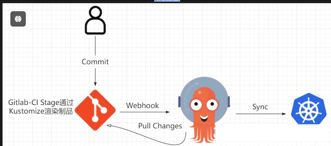
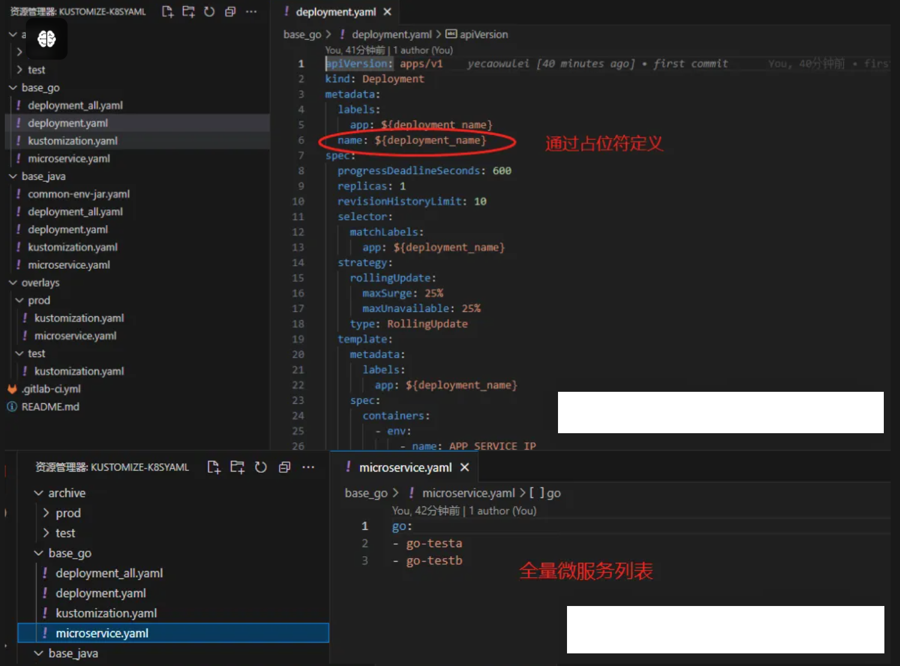
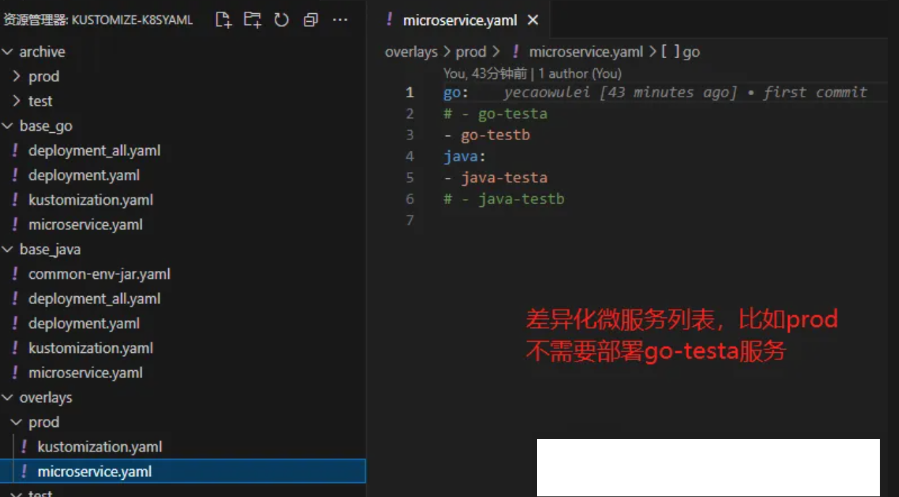
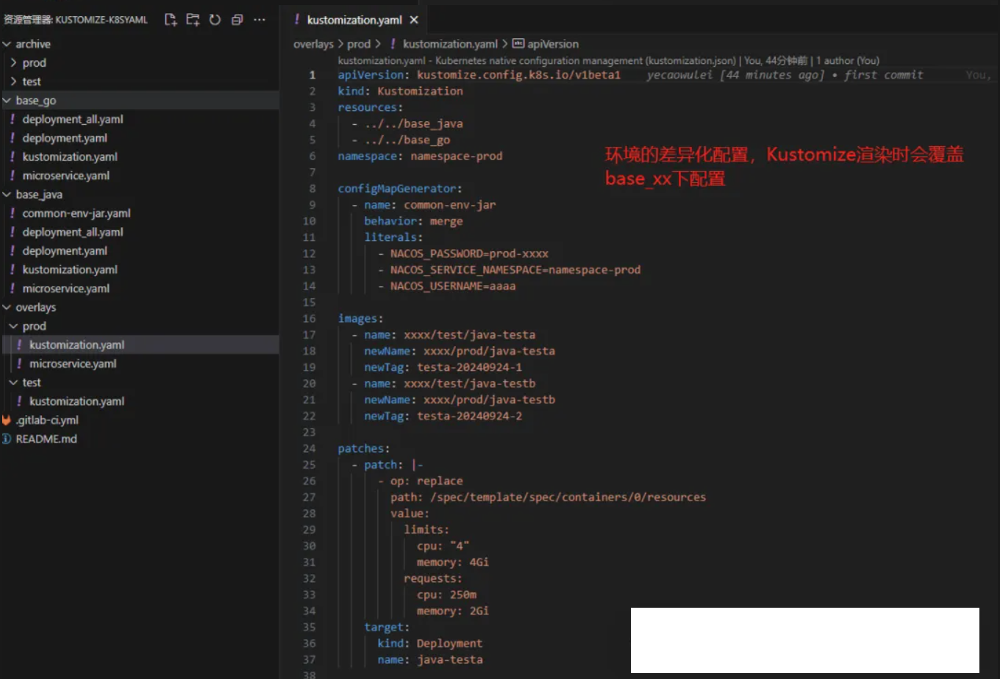
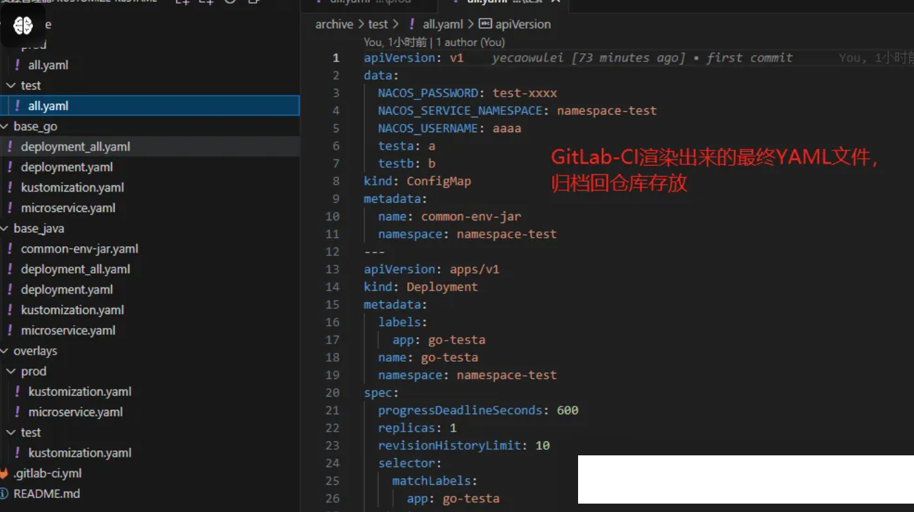

# K8S YAML 资源清单管理方案

**本文介绍的方案能够达到如下效果：**

* 通过Git归档所有YAMl文件，所有变更源头在Git仓库，保留所有变更记录，方便后续追溯
* 通过Git仓库实现所有环境YAML文件的统一管理
* **通过GitOps方式实现自动化更新YAML文件，无需登录服务器，减少手动敲命令行为，从而降低误操作风险**
* 复制环境时也是直接操作Git仓库，新增对应环境差异化目录即可

## Kustomize工具介绍

Kustomize 是一款 Kubernetes 原生的配置管理工具，其核心理念是允许用户自定义 Kubernetes 资源配置，而无需直接修改原始的 YAML 文件。这在很大程度上提高了配置的可维护性和可重用性。

Kustomize 使用声明式的方式来定制资源，通过一系列预定义的指令和规则，用户可以对基础资源进行修改、添加或删除

**Kustomize的目录主要包含Base和Overlays，Base下存放的是模版文件，Overlays是不同环境的差异化管理目录，这两个目录下都需要有kustomization.yaml文件，这个文件用于描述如何生成定制的资源。**

* https://github.com/kubernetes-sigs/kustomize

* https://kubectl.docs.kubernetes.io/zh/api-reference/kustomization/

## ArgoCD工具介绍

ArgoCD 是一个声明式的 GitOps 持续交付工具，用于 Kubernetes 集群。它通过持续监控 Git 仓库中的 Kubernetes 资源配置文件，将这些配置应用到指定的 Kubernetes 集群中，确保集群的实际状态与仓库中的配置保持一致。

ArgoCD 支持各种 Kubernetes 清单格式，如 Kustomize、Helm Charts、Ksonnet、YAML 和 JSON，允许你通过 Git 仓库管理和部署 Kubernetes 资源，本文介绍的是ArgoCD YAMl文件的方式

* https://github.com/argoproj/argo-cd
* https://argo-cd.readthedocs.io/en/stable/

## 具体实践

原生的Kustomize用法一般是在base下维护所有微服务的全量yaml，这种方式如果微服务很多的话会显得比较臃肿，这里进行了一层抽象化，将不同开发语言统一使用一份deployment.yaml，通过占位符定义名字，然后在Gitlab-CI处理，渲染出全量base deployment.yaml后，再由Kustomize渲染最终制品。

* 这种方式减少了base下的yaml文件数，避免过多的文件增加维护成本
* 新增服务时很简单，只需要在`base_xx/microservice.yaml`增加对应的微服务名字即可
* 考虑到可能有服务上了test环境后还不上生产，所以在`overlays/env`目录下也增加了microservice.yaml，用于微服务的差异化
* `overlays/env/kustomization.yaml`这个是最重要的文件，环境的差异化配置都在这里，如微服务镜像/副本数/资源/配置差异化都统一在这个文件进行配置，具体配置方法官方文档有详细介绍
* 新增环境的话，只需要复制一个`overlays/env`，然后修改kustomization.yaml即可
* 最终YAML文件渲染出来后归档回仓库，Argocd配置关联即可，这里就不截图介绍了，可自行了解Argocd用法。Argocd支持开启AutoSync，所以非生产环境开启后，在GitLab仓库修改后就可以直接生效