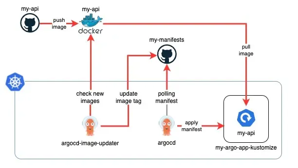
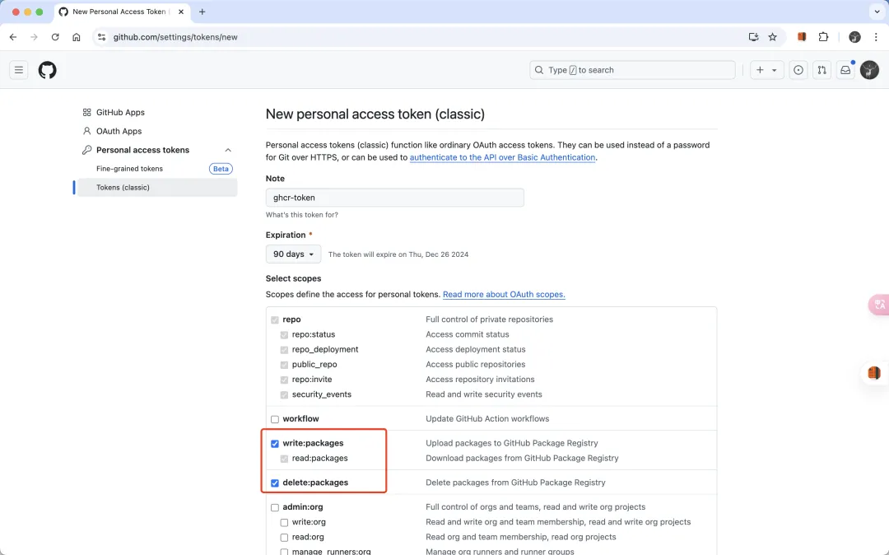
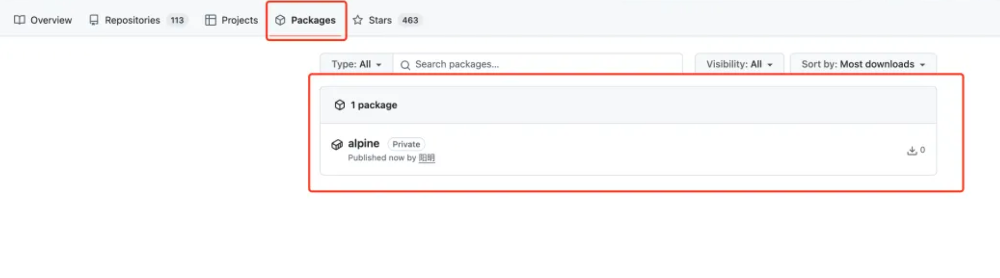
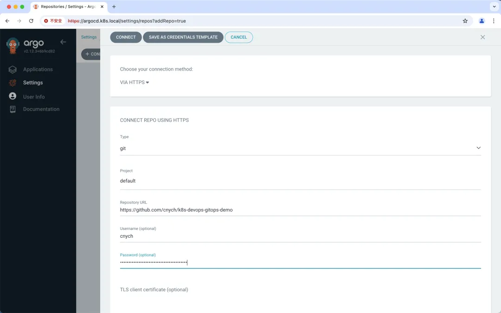
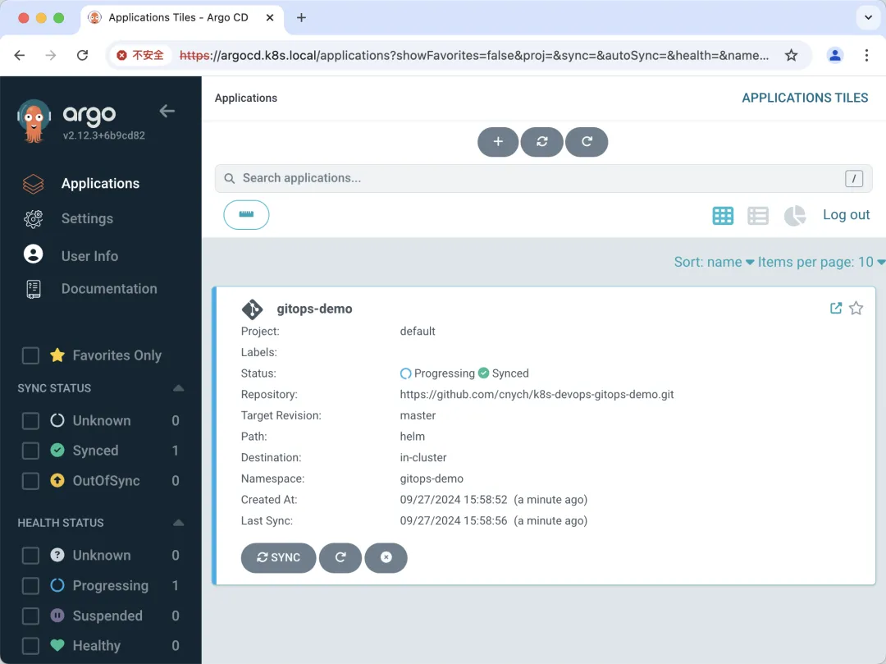
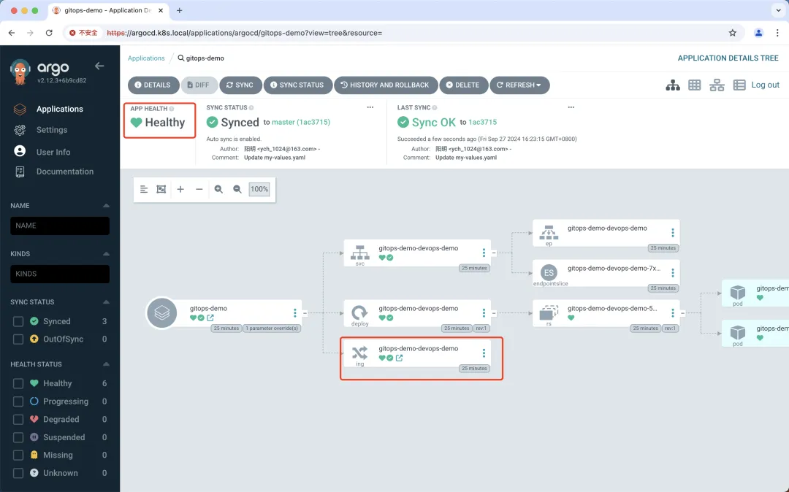
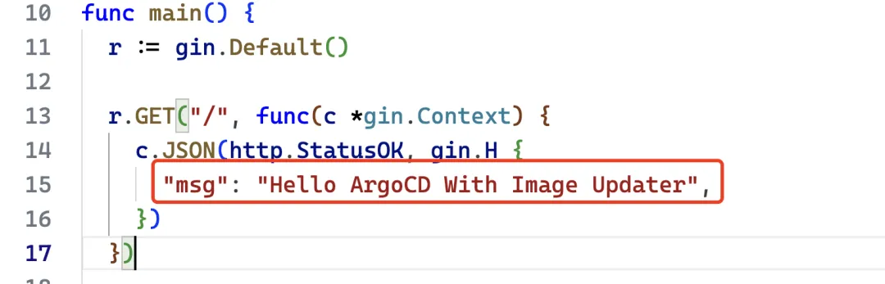
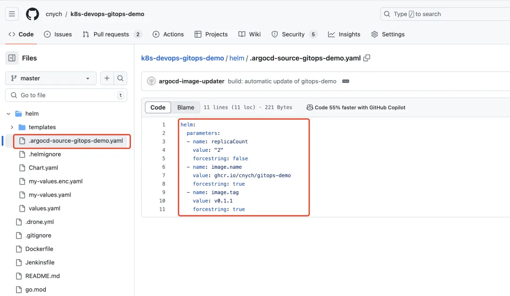
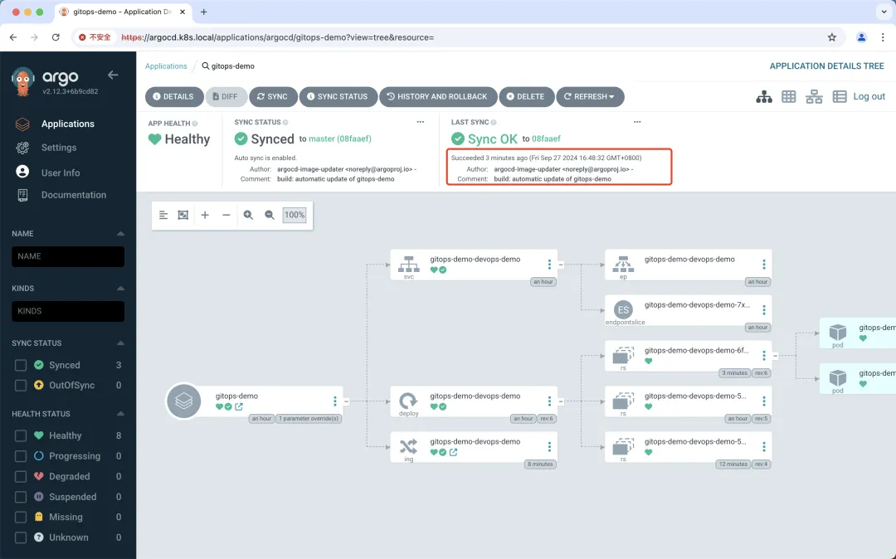

# ArgoCD Image Updater

Argo CD Image Updater 是一种自动更新由 Argo CD 管理的 Kubernetes 工作负载的容器镜像的工具。 

该工具可以检查与 Kubernetes 工作负载一起部署的容器镜像的新版本，并使用 Argo CD 自动将其更新到允许的最新版本。

它通过为 Argo CD 应用程序设置适当的应用程序参数来工作，类似于 `argocd app set --helm-set image.tag=v1.0.1`，但以完全自动化的方式。

Argo CD Image Updater 会定期轮询 Argo CD 中配置的应用程序，并查询相应的镜像仓库以获取可能的新版本。

如果在仓库中找到新版本的镜像，并且满足版本约束，Argo CD 镜像更新程序将指示 Argo CD 使用新版本的镜像更新应用程序。

根据您的应用程序自动同步策略，**Argo CD 将自动部署新的镜像版本或将应用程序标记为不同步，您可以通过同步应用程序来手动触发镜像更新**

## 它是如何运作的？

Image Updater 程序通过读取 ArgoCD 应用程序资源中的 **annotations** 来工作，这些注解指定应自动更新哪些镜像。

它会检查指定镜像仓库中是否有较新的标签，如果它们与预定义的模式或规则匹配，则使用这些较新的标签更新应用程序清单。此自动化过程可确保您的应用程序始终运行最新版本的镜像，遵循 GitOps 的一致性和可追溯性原则



Image Updater 基本的工作流程如下所示：

1. **Annotation 配置**：开发人员注解 **ArgoCD 应用程序以告诉 Image Updater 要跟踪哪些镜像**，包括**标签过滤和更新策略的规则**。
2. **镜像仓库轮询**：Image Updater 定期轮询配置的镜像仓库以查找符合指定条件的新标签。
3. **自动更新**：当找到新的匹配标签时，**Image Updater 会自动更新应用程序的 Kubernetes 清单中的镜像标签，并将更改提交回源 Git 存储库**。
4. **同步变更**：**ArgoCD 检测到提交的更改，同步更新的清单**，并将它们应用到 Kubernetes 集群。

## 特征

* 更新由 Argo CD 管理且由 Helm 或 Kustomize 工具生成的应用程序镜像
* 根据不同的更新策略更新应用镜像
	* semver：根据给定的镜像约束更新到允许的最高版本
	* latest：更新到最近创建的镜像标签
	* name：更新到按字母顺序排序的列表中的最后一个标签
	* digest：更新到可变标签的最新推送版本
* 支持广泛使用的容器镜像仓库
* 通过配置支持私有容器镜像仓库
* 可以将更改写回 Git
* 能够使用匹配器函数过滤镜像仓库返回的标签列表
* 在 Kubernetes 集群中运行，或者可以从命令行独立使用
* 能够执行应用程序的并行更新

另外需要注意的是使用该工具目前有几个限制：

* 想要更新容器镜像的应用程序必须使用 Argo CD 进行管理。**不支持未使用 Argo CD 管理的工作负载**。
* Argo CD 镜像更新程序只能更新其清单使用 Kustomize 或 Helm 呈现的应用程序的容器镜像，**特别是在 Helm 的情况下，模板需要支持使用参数（即image.tag）**。
* **镜像拉取密钥必须存在于 Argo CD Image Updater 运行（或有权访问）的同一 Kubernetes 集群中**。目前无法从其他集群获取这些机密信息

## 安装

建议在运行 Argo CD 的同一个 Kubernetes 命名空间集群中运行 Argo CD Image Updater，但这不是必需的。

事实上，甚至不需要在 Kubernetes 集群中运行 Argo CD Image Updater 或根本不需要访问任何 Kubernetes 集群。但如果不访问 Kubernetes，某些功能可能无法使用，所以强烈建议使用第一种安装方法。

运行镜像更新程序的最直接方法是将其作为 Kubernetes 工作负载安装到运行 Argo CD 的命名空间中。这样就不需要任何配置，也不会对你的工作负载产生任何影响。

```
kubectl apply -n argocd -f https://raw.githubusercontent.com/argoproj-labs/argocd-image-updater/stable/manifests/install.yaml
```

安装完成后我们就可以在 Argo CD 中看到 Argo CD Image Updater 组件了：

```
$ kubectl get pods -n argocd
NAME                                                READY   STATUS    RESTARTS      AGE
argocd-notifications-controller-7f85bc8d8-sdqcd     1/1     Running   1 (13d ago)   14d
argocd-applicationset-controller-5f7687fbb4-jl6hf   1/1     Running   1 (13d ago)   14d
argocd-dex-server-665cfbbc8b-nqjf7                  1/1     Running   1 (13d ago)   14d
argocd-server-84cb8fdcdc-g4wmt                      1/1     Running   1 (13d ago)   14d
argocd-application-controller-0                     1/1     Running   1 (13d ago)   14d
argocd-repo-server-bb5d9cc8b-c8f6b                  1/1     Running   1 (13d ago)   14d
argocd-redis-5f87c6b5d7-n9d6v                       1/1     Running   1 (13d ago)   14d
argocd-image-updater-57b64976b-kgtkf                1/1     Running   0             20s
```

现在我们就可以直接去监听镜像是否发生了变化，而不需要在 CI 流水线中去手动提交修改资源清单到代码仓库了。

## 配置

要充分利用 ArgoCD 镜像更新程序，将其配置连接到镜像仓库至关重要，尤其是在使用私有仓库或公共仓库上的私有存储库时。以下是如何配置必要的凭据并了解可用的不同方法。

ArgoCD Image Updater 可以使用以下方法获取凭据

* 从 Kubernetes Secret 中获取凭据：标准的 Docker Pull Secret 或自定义 Secret，凭证格式为 `<username>:<password>` ，比如我们可以用下面的命令来创建一个

```
kubectl create -n argocd secret docker-registry dockerhub-secret \
  --docker-username someuser \
  --docker-password s0m3p4ssw0rd \
  --docker-server "https://registry-1.docker.io"
```

这个 secret 可以被引用为 `pullsecret:<namespace>/<secret_name> (pullsecret:argocd/dockerhub-secret)`。

通用 `Secret：`通用 Secret 是包含单个键值对的 `Secret`，键值对可以是任何格式，比如我们可以用下面的命令来创建一个：

```
kubectl create -n argocd secret generic some-secret \
  --from-literal=creds=someuser:s0m3p4ssw0rd
```

该 secret 可以用 `env:<name_of_environment_variable>` (`env:DOCKER_HUB_CREDS`) 的方式引用

* 环境变量：将凭证存储在环境变量中，该变量可以传递到 ArgoCD Image Updater pod，我们可以在 pod 的配置中设置

```
env:
  - name: DOCKER_HUB_CREDS
    value: "someuser:s0m3p4ssw0rd"
```

* Script 脚本：使用以 `<username>:<password>` 格式输出凭据的脚本。

```
#!/bin/sh
echo "someuser:s0m3p4ssw0rd"
```

将其引用为 `ext:<full_path_to_script>`。

**我们这里就以 Github 的 Container Registry 为例，来演示下如何使用 ArgoCD Image Updater 来更新镜像。**

首先我们在 Github 个人设置页面中创建一个个人访问令牌，如下图所示：



这个 Token 的权限要包括 `write:packages `和 `read:packages`，这样我们才能推送和拉取镜像，创建后会得到一个 Token。

然后我们可以在终端或命令行中，使用 GitHub 用户名和 GitHub 的个人访问令牌（PAT）登录 GitHub Container Registry。

```

export PAT=<your-token>
echo $PAT | docker login ghcr.io -u <your-github-username> --password-stdin
```

将替换为个人访问令牌，将替换为 GitHub 用户名。

登录成功后我们可以使用以下命令将 Docker 镜像标记为 GitHub Container Registry 镜像：


```
docker tag <your-image-name>:<tag> ghcr.io/<your-github-username>/<your-image-name>:<tag>
```

将 `<your-image-name>:<tag>` 替换为本地 Docker 镜像名与 tag 名，将 `<your-github-username>` 替换为 GitHub 用户名，`<tag>` 替换想要使用的标签（例如默认的 latest 标签）。

然后使用以下命令将 Docker 镜像推送到 GitHub Container Registry 即可：

```
docker push ghcr.io/<your-github-username>/<your-image-name>:<tag>
```

完成以上步骤后，就可以在 GitHub 个人账号的 的 Packages 部分看到 Docker 镜像了，但是该镜像默认为 private 镜像，Pull 使用时需要先登录



```
kubectl create -n argocd secret docker-registry ghcr-secret \
  --docker-username=cnych \
  --docker-password=$PAT \
  --docker-server="https://ghcr.io"
```
 
设置凭据后，将它们配置在 ArgoCD 镜像更新程序的配置中，以通过镜像仓库进行身份验证，我们可以修改镜像更新程序的配置：

```
apiVersion: v1
kind: ConfigMap
metadata:
  name: argocd-image-updater-config
  namespace: argocd
data:
  registries.conf: |
    registries:
      - name: ghcr-hub
        api_url: https://ghcr.io # 镜像仓库地址
        credentials: pullsecret:argocd/ghcr-secret # 凭据
        defaultns: library # 默认命名空间
        default: true # 默认仓库
```

上面配置中我们指定了 GitHub 镜像仓库的凭据为 `pullsecret:argocd/ghcr-secret`，这样 ArgoCD Image Updater 在访问 ghcr.io 时就会使用这个凭据。

接下来我们还需要将 ArgoCD Image Updater 与 Git 集成，这也是重点，这样 ArgoCD Image Updater 就可以将镜像更新直接提交回源 Git 仓库。

我们可以在 ArgoCD 的 Dashboard 中先添加一个 Git 仓库 `https://github.com/test/k8s-devops-gitops-demo`：
 
 
 
 接下来我们可以按照正常使用方式创建一个新的 Application 对象，对应的资源清单文件如下所示：
 
```
apiVersion: argoproj.io/v1alpha1
kind: Application
metadata:
  name: gitops-demo
  namespace: argocd
spec:
  destination:
    namespace: gitops-demo
    server: https://kubernetes.default.svc
  project: default
  source:
    path: helm # 从 Helm 存储库创建应用程序时，chart 必须指定 path
    repoURL: https://github.com/cnych/k8s-devops-gitops-demo.git
    targetRevision: master
    helm:
      parameters:
        - name: replicaCount
          value: "2"
      valueFiles:
        - my-values.yaml
  syncPolicy:
    automated:
      prune: true
      selfHeal: true
    syncOptions:
      - CreateNamespace=true
```

直接创建上面的资源清单文件后，ArgoCD 会自动创建一个 Application 资源对象，并且会自动同步到 Git 仓库中，我们可以在 Git 仓库中看到对应的资源清单文件

 
 
 如果该应用出现了如下所示的错误信息：

```
Namespace                gitops-demo                            SyncFailed        resource :Namespace is not permitted in project default
```

则表面当前使用的 project 没有权限创建 namespace，我们只需要为其添加对应的权限即可：

```
apiVersion: argoproj.io/v1alpha1
kind: AppProject
metadata:
  name: default
  namespace: argocd
spec:
  clusterResourceWhitelist: # 白名单，表示允许访问的资源
    - group: "*"
      kind: "*"
  destinations:
    - name: "*"
      namespace: "*"
      server: "*"
  sourceRepos:
    - "*"
```

我们可以使用 argocd app get 命令来查看 Application 资源对象的状态：

```
$ argocd app get argocd/gitops-demo
Name:               argocd/gitops-demo
Project:            default
Server:             https://kubernetes.default.svc
Namespace:          gitops-demo
URL:                https://grpc.argocd.k8s.local/applications/gitops-demo
Source:
- Repo:             https://github.com/cnych/k8s-devops-gitops-demo.git
  Target:           master
  Path:             helm
  Helm Values:      my-values.yaml
SyncWindow:         Sync Allowed
Sync Policy:        Automated (Prune)
Sync Status:        Synced to master (53d91ed)
Health Status:      Progressing

GROUP              KIND        NAMESPACE    NAME                        STATUS     HEALTH       HOOK  MESSAGE
                   Namespace                gitops-demo                 Running    Synced             namespace/gitops-demo created
apps               Deployment  default      gitops-demo-helm-guestbook  Succeeded  Pruned             pruned
                   Service     default      gitops-demo-helm-guestbook  Succeeded  Pruned             pruned
                   Service     gitops-demo  gitops-demo-devops-demo     Synced     Healthy            service/gitops-demo-devops-demo created
apps               Deployment  gitops-demo  gitops-demo-devops-demo     Synced     Progressing        deployment.apps/gitops-demo-devops-demo created
networking.k8s.io  Ingress     gitops-demo  gitops-demo-devops-demo     Synced     Progressing        ingress.networking.k8s.io/gitops-demo-devops-demo created
```

> 需要注意要在目标命名空间中添加 Image Pull Secret。

正常我们这个应用就可以运行了：

```
$ curl http://gitops-demo.k8s.local/
{"msg":"Hello Tekton On GitLab With ArgoCD"}
```

但是在 Dashboard 中我们可以看到应用虽然已经是 Synced 状态，但是 APP HEALTH 一直显示为 Progressing 状态。

 

这是因为 ArgoCD 的健康状态机制引起的，我们可以在源码 

[https://github.com/argoproj/gitops-engine/blob/master/pkg/health/health_ingress.go#L7](https://github.com/argoproj/gitops-engine/blob/master/pkg/health/health_ingress.go#L7)

中看到健康状态的检查逻辑。

```
func getIngressHealth(obj *unstructured.Unstructured) (*HealthStatus, error) {
 ingresses, _, _ := unstructured.NestedSlice(obj.Object, "status", "loadBalancer", "ingress")
 health := HealthStatus{}
 if len(ingresses) > 0 {
  health.Status = HealthStatusHealthy
 } else {
  health.Status = HealthStatusProgressing
 }
 return &health, nil
}
```

他需要检查 Ingress 资源对象的 `status.loadBalancer.ingress` 字段是否为空，如果为空则表示健康状态为 `Progressing`，否则为 Healthy，但实际情况却是并不是所有的 `Ingress` 资源对象都会自动生成 `status.loadBalancer.ingress` 字段，比如我们这里就并没有生成。

这个时候我们可以通过配置 argocd-cm 的配置资源来修改健康状态检查逻辑，添加如下所示的配置：

```
apiVersion: v1
kind: ConfigMap
metadata:
  name: argocd-cm
  namespace: argocd
data:
  resource.customizations: |
    networking.k8s.io/Ingress:
      health.lua: |
        hs = {}
        if obj.metadata ~= nil and obj.metadata.creationTimestamp ~= nil then
          hs.status = "Healthy"
          hs.message = "Ingress 已创建"
        else
          hs.status = "Progressing"
          hs.message = "Ingress 正在创建中"
        end
        return hs
```

上面的配置表示如果 Ingress 资源对象的 `metadata.creationTimestamp` 字段不为空，则表示健康状态为 Healthy，否则为 Progressing，更新上面的配置后，我们再次查看应用的健康状态就会发现已经变成了 Healthy 状态：

 
 
 接下来我们就可以使用 ArgoCD Image Updater 来更新镜像了，修改上面的 Application 资源清单文件，我们需要添加一些注解来指定需要更新的镜像规则策略，如下所示：

```
apiVersion: argoproj.io/v1alpha1
kind: Application
metadata:
  name: gitops-demo
  namespace: argocd
  annotations:
    argocd-image-updater.argoproj.io/image-list: myalias=ghcr.io/cnych/gitops-demo # 指定镜像仓库
    argocd-image-updater.argoproj.io/myalias.allow-tags: regexp:^.*$ # 允许所有标签
    argocd-image-updater.argoproj.io/myalias.pull-secret: pullsecret:argocd/ghcr-secret # 指定凭据
    argocd-image-updater.argoproj.io/myalias.update-strategy: latest # 指定更新策略
    # argocd-image-updater.argoproj.io/myalias.ignore-tags: latest, master # 指定忽略的标签
    argocd-image-updater.argoproj.io/write-back-method: git # 指定写回方法
    argocd-image-updater.argoproj.io/git-branch: master # 指定 Git 分支
    argocd-image-updater.argoproj.io/myalias.force-update: "true" # 强制更新
spec:
  destination:
    namespace: gitops-demo
    server: https://kubernetes.default.svc
  project: default
  source:
    path: helm # 从 Helm 存储库创建应用程序时，chart 必须指定 path
    repoURL: https://github.com/cnych/k8s-devops-gitops-demo.git
    targetRevision: master
    helm:
      parameters:
        - name: replicaCount
          value: "2"
      valueFiles:
        - my-values.yaml
  syncPolicy:
    automated:
      prune: true
      selfHeal: true
    syncOptions:
      - CreateNamespace=true
```

这个新的资源对象中，我们添加了一些注释，这些注释用于配置 Argo CD Image Updater。这些配置用于指定自动更新容器镜像的策略、参数和相关信息。以下是对这些注释的详细解释：

* `argocd-image-updater.argoproj.io/image-list`: 这个注解定义了应用中使用的镜像列表。
* `argocd-image-updater.argoproj.io/allow-tags`: 这个注解指定了允许更新的镜像标签，可以使用正则表达式的方式。
* `argocd-image-updater.argoproj.io/<alias>.pull-secret`: 这个注解指定了用于拉取镜像的 Secret。
* `argocd-image-updater.argoproj.io/update-strategy:` 这个注解定义了镜像更新策略。这里的值是 latest，表示使用最新的镜像标签进行更新，还可以指定的值包括：digest、name、semver。

	* latest: 使用最新的镜像标签进行更新。
	* digest: 使用镜像的 digest 进行更新。
	* name: 使用镜像的名称进行更新。
	* semver: 使用 semver 进行更新

`argocd-image-updater.argoproj.io/write-back-method`: 这个注解定义了更新后的配置写回方法。git 表示将更新后的配置写回到 Git 仓库。

* git: 将更新后的配置写回到 Git 仓库。
* patch: 使用 kubectl patch 命令更新资源。
* replace: 使用 kubectl replace 命令更新资源。


* `argocd-image-updater.argoproj.io/git-branch`: 这个注解定义了更新后的配置写回到 Git 仓库的分支。

现在我们重新更新 Application 资源对象即可。接下来我们只需要重新推送一个新的镜像到 GitHub Container Registry 即可自动触发 ArgoCD Image Updater 更新镜像。

我们更新下仓库中的 main.go 文件：

 

现在我们重新构建一个新的镜像并推送到 GitHub Container Registry：

```
docker build --platform linux/amd64 -t ghcr.io/cnych/gitops-demo:v0.1.1 .
docker push ghcr.io/cnych/gitops-demo:v0.1.1
```

推送新的镜像后，然后 Argo CD Image Updater 将会每 2 分钟从镜像仓库去检索镜像版本变化，一旦发现有新的镜像版本，它将自动使用新版本来更新集群内工作负载的镜像，并将镜像版本回写到 Git 仓库中去，我们可以去查看 Argo CD Image Updater 的日志变化：

```
$ kubectl logs -f argocd-image-updater-57b788886d-d4qh5 -n argocd
time="2024-09-27T06:51:32Z" level=info msg="argocd-image-updater v0.14.0+af844fe starting [loglevel:INFO, interval:2m0s, healthport:8080]"
time="2024-09-27T06:51:32Z" level=warning msg="commit message template at /app/config/commit.template does not exist, using default"
time="2024-09-27T08:35:39Z" level=warning msg="\"latest\" strategy has been renamed to \"newest-build\". Please switch to the new convention as support for the old naming convention will be removed in future versions." image_alias=myalias image_name=ghcr.io/cnych/gitops-demo registry_url=ghcr.io
time="2024-09-27T08:35:40Z" level=info msg="Processing results: applications=1 images_considered=1 images_skipped=0 images_updated=0 errors=0"
xxxxxxxxxxxxxxtime="2024-09-27T08:37:40Z" level=info msg="Starting image update cycle, considering 1 annotated application(s) for update"
time="2024-09-27T08:37:40Z" level=warning msg="\"latest\" strategy has been renamed to \"newest-build\". Please switch to the new convention as support for the old naming convention will be removed in future versions." image_alias=myalias image_name=ghcr.io/cnych/gitops-demo registry_url=ghcr.io
time="2024-09-27T08:37:44Z" level=info msg="Setting new image to ghcr.io/cnych/gitops-demo:v0.1.1" alias=myalias application=gitops-demo image_name=cnych/gitops-demo image_tag=latest registry=ghcr.io
time="2024-09-27T08:37:44Z" level=info msg="Successfully updated image 'ghcr.io/cnych/gitops-demo:latest' to 'ghcr.io/cnych/gitops-demo:v0.1.1', but pending spec update (dry run=false)" alias=myalias application=gitops-demo image_name=cnych/gitops-demo image_tag=latest registry=ghcr.io
time="2024-09-27T08:37:44Z" level=info msg="Committing 1 parameter update(s) for application gitops-demo" application=gitops-demo
time="2024-09-27T08:37:44Z" level=info msg="Starting configmap/secret informers"
time="2024-09-27T08:37:44Z" level=info msg="Configmap/secret informer synced"
time="2024-09-27T08:37:44Z" level=info msg="Initializing https://github.com/cnych/k8s-devops-gitops-demo.git to /tmp/git-gitops-demo1873820104"
time="2024-09-27T08:37:44Z" level=info msg="secrets informer cancelled"
time="2024-09-27T08:37:44Z" level=info msg="configmap informer cancelled"
time="2024-09-27T08:37:44Z" level=info msg="git fetch origin --tags --force --prune" dir=/tmp/git-gitops-demo1873820104 execID=acebc
time="2024-09-27T08:37:46Z" level=info msg=Trace args="[git fetch origin --tags --force --prune]" dir=/tmp/git-gitops-demo1873820104 operation_name="exec git" time_ms=1640.146246
time="2024-09-27T08:37:46Z" level=info msg="git config user.name argocd-image-updater" dir=/tmp/git-gitops-demo1873820104 execID=7ec2d
time="2024-09-27T08:37:46Z" level=info msg=Trace args="[git config user.name argocd-image-updater]" dir=/tmp/git-gitops-demo1873820104 operation_name="exec git" time_ms=1.5687190000000002
time="2024-09-27T08:37:46Z" level=info msg="git config user.email noreply@argoproj.io" dir=/tmp/git-gitops-demo1873820104 execID=6e796
time="2024-09-27T08:37:46Z" level=info msg=Trace args="[git config user.email noreply@argoproj.io]" dir=/tmp/git-gitops-demo1873820104 operation_name="exec git" time_ms=1.688394
time="2024-09-27T08:37:46Z" level=info msg="git checkout --force master" dir=/tmp/git-gitops-demo1873820104 execID=403bb
time="2024-09-27T08:37:46Z" level=info msg=Trace args="[git checkout --force master]" dir=/tmp/git-gitops-demo1873820104 operation_name="exec git" time_ms=4.522311
time="2024-09-27T08:37:46Z" level=info msg="git clean -ffdx" dir=/tmp/git-gitops-demo1873820104 execID=b3f03
time="2024-09-27T08:37:46Z" level=info msg=Trace args="[git clean -ffdx]" dir=/tmp/git-gitops-demo1873820104 operation_name="exec git" time_ms=1.429556
time="2024-09-27T08:37:46Z" level=info msg="git -c gpg.format=openpgp commit -a -F /tmp/image-updater-commit-msg441967746" dir=/tmp/git-gitops-demo1873820104 execID=0efc6
time="2024-09-27T08:37:46Z" level=info msg=Trace args="[git -c gpg.format=openpgp commit -a -F /tmp/image-updater-commit-msg441967746]" dir=/tmp/git-gitops-demo1873820104 operation_name="exec git" time_ms=5.239213
time="2024-09-27T08:37:46Z" level=info msg="git push origin master" dir=/tmp/git-gitops-demo1873820104 execID=fcd1f
time="2024-09-27T08:37:47Z" level=info msg=Trace args="[git push origin master]" dir=/tmp/git-gitops-demo1873820104 operation_name="exec git" time_ms=1934.14529
time="2024-09-27T08:37:47Z" level=info msg="Successfully updated the live application spec" application=gitops-demo
time="2024-09-27T08:37:47Z" level=info msg="Processing results: applications=1 images_considered=1 images_skipped=0 images_updated=1 errors=0"
```

然后在 Git 仓库中我们也可以看到有一条新的 commit 提交记录，可以看到在回写时，ArgoCD Image Updater 并不会直接修改仓库的 `values.yaml` 文件，而是会创建一个专门用于覆盖 `Helm Chart values.yaml` 的 `.argocd-source-devops-demo.yaml` 文件。

 

自动提交变更后，Argo CD 就会自动同步部署应用了。

当然现在访问应用结果就是我们更改后的内容了：

```
$ curl http://gitops-demo.k8s.local/
{"msg":"Hello ArgoCD With Image Updater"}
```

 

另外我们可以注意到每次 Git 提交都与作者的姓名和电子邮件地址相关联。如果未配置，Argo CD 镜像更新程序执行的提交将使用 `argocd-image-updater <noreply@argoproj.io>` 作为作者。

您可以使用 `--git-commit-user` 和 `--git-commit-email `命令行开关覆盖作者，或在 `argocd-image-updater-config ConfigMap` 中设置 `git.user` 和 `git.email` 即可。


同样我们可以将 Argo CD Image Updater 使用的默认提交消息更改为适合你的方式。可以创建一个简单的模板（使用 Golang Template），并通过将 `argocd-image-updater-config ConfigMap` 中的密钥 `git.commit-message-template` 设置为模板的内容来使其可用，例如：

```
data:
  git.commit-message-template: |
    build: automatic update of {{ .AppName }}

    {{ range .AppChanges -}}
    updates image {{ .Image }} tag '{{ .OldTag }}' to '{{ .NewTag }}'
    {{ end -}}
```

模板中提供了两个顶级变量：

* `.AppName` 是正在更新的应用程序的名称
* `.AppChanges` 是更新所执行的更改的列表。此列表中的每个条目都是一个结构体，为每个更改提供以下信息：

	* `.Image` 保存已更新图像的全名
	* `.OldTag` 保存更新之前的标签名称或 SHA 摘要
	* `.NewTag` 保存更新为的标签名称或 SHA 摘要
