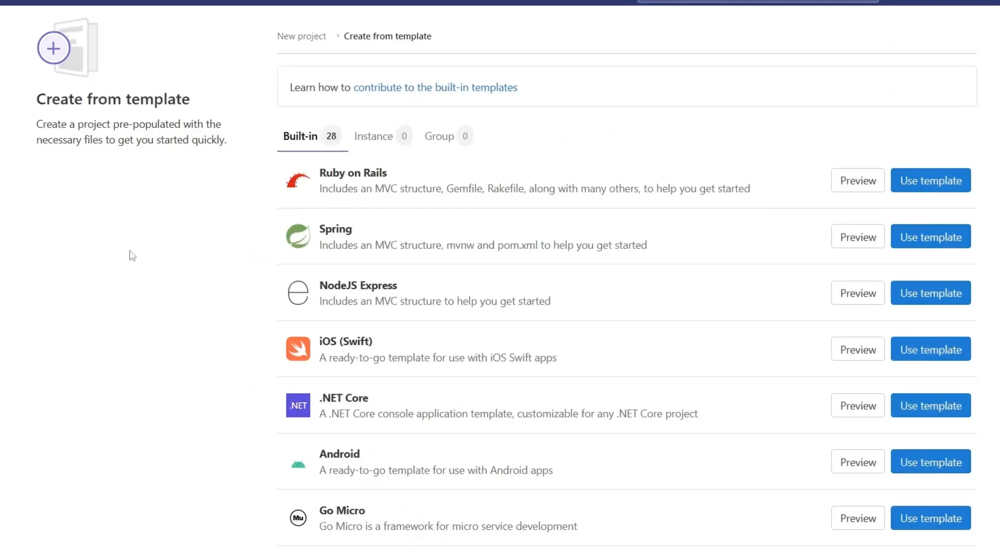
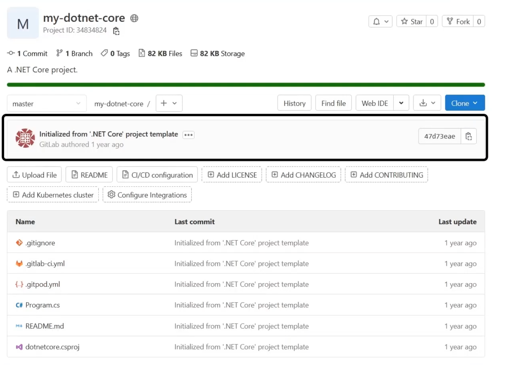
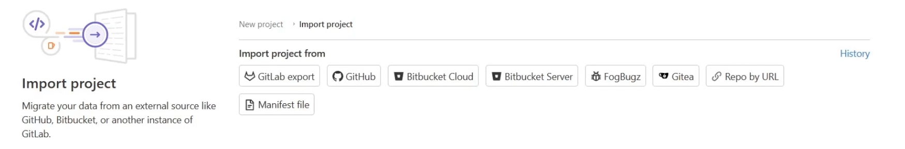
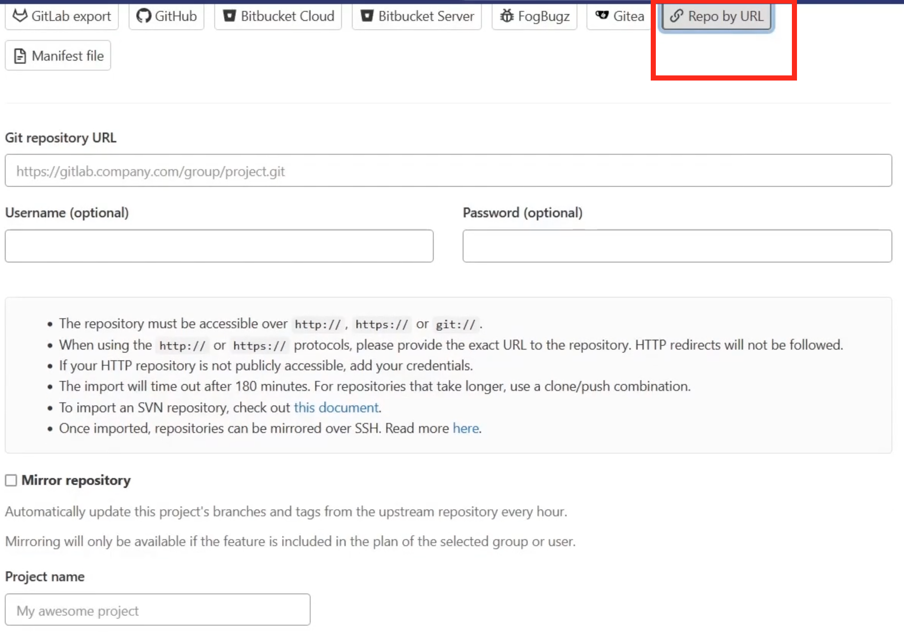
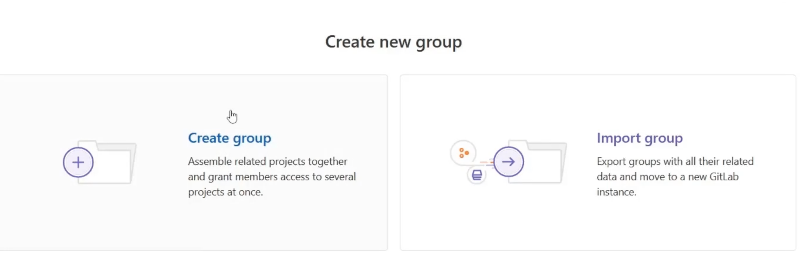
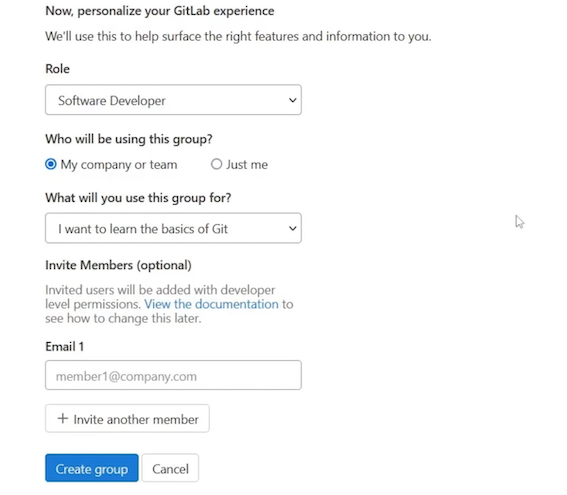
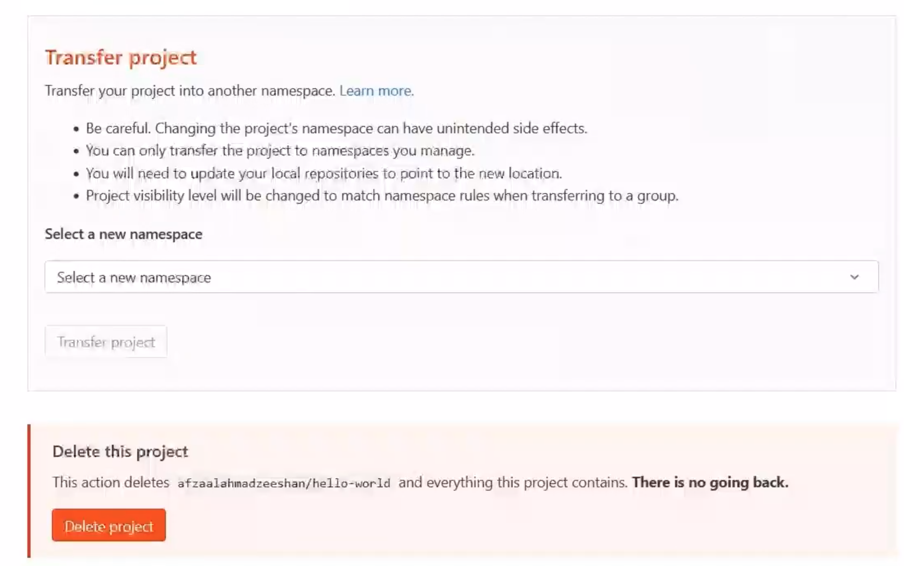

# **Project and Repositoires**

## **1 Git Repository**

* **Central**: Every GitLab project has a shared, central Git repository
* **Tracked**: Git repository maintains the history for your project
* **Accessible**: Everyone with the access can work on the contents of the repository


### **GitLab Project**

* GitLab Project is the entry point for collaboration between teams
* Every user can create unlimited number of GitLab projects
* Every GitLab project has a Git repository at its core


Different roles and job profiles, first and foremost being able to **provide a repository** to work in. 

On top of the repository, GitLab offers teams and users to **create and manage their tasks, tickets, and issues**.

**GitLab offers a web IDE** for the developers and engineers to write the code and also to edit the files as needed on the fly.

**GitLab is a DevOps tool**. It enables teams to use DevOps and C/CD pipelines to build,test, and validate the software products that are being developed. 

GitLab allows code owners, project maintainers, and organization owners to review the code before accepting it in the mainstream project branch.

GitLab provides various options for the teams to **document their projects** apart from iust writing the comments in the source code.


## **2 Creating a GitLab Project**

* **Blank Project**： Start a project from scratch with an empty Git repository
* **Use a Template**  Create a project based on a template made available by GitLab
* **Import a Project** Bring an external Git project to GitLab and use GitLab features such as Auto DevOps

## **3 Updating the Project**

* **Tile**
* The **topics** are the tags that you can use to reflect the category of the project. GitLab offers to explore public
* Description
* Avatar

## **3 Creating a Templated Project**

### **Project Templates**

* Templates are **provided officially by GitLab for users**
* Templates **speed up creation** of new projects and repositories

They're also used to reduce the boilerplate code in case a team needs **to create multiple projects of the same structure.**

* Templates are provided officially by GitLab for users
* Templates speed up creation of new projects and repositories
* Sources:
	* https://gitlab.com/gitlab-org/project-templates
	* https://gitlab.com/pages





## **4 Importing a Project**

it can be done from an internal source such as from a GitLab project or external Git sources, such as GitHub. GitLab enables you to connect to other cloud-hosted services, **such as GitHub, or use authentication to connect to external Git repositories**.

### Import Project to GitLab

* Import from external Git sources
* Connect cloud-hosted Git providers
* Use credentials for private and authenticated repositories
* Importing a repository is not like the Git mirror feature





## **5 Cloning the Project**

### **Git CLI**

* GitLab Ul provides basic features of Git version control
* Advanced functionalities require Git CLI
* Use SSH keys for actions that require trust and authentication
* Offline development is faster with custom software and processes


### **Git Clone**

**Local Copy**

Git clone copies the repository contents to your own machine

**Connection**

Remote connections can be created to synchronize the work

**Use SSH**

Git CLI allows authenticating with SSH keys if needed


## **6 GitLab Groups**

### **Repositories in a Project**

* A project can only contain a single repository
* **A project requires multiple repositories for different source code**
* Developers and operations work together on a project
* **Hiding the secrets and infrastructure files is harder in a single project**

**The groups form a collection of the projects** that are created for the same business requirements. 

GitLab groups can be the departments within your organizations, so a group of developers,  a group of infrastructure, and group of  operations. 

And you can also create cross-departmental groups, such as a group of security and a group of frontend teams. **This helps keep every team separate in their own group with their own roles** and the permissions as are needed by their iob profiles.

But the groups can always interact with each other and follow a unique hierarchy and a pattern that can be used to mimic the structure of the organization.

### **Group Properties**

* Different profiles
* Unique permissions
* Dedicated members
* Organizational hierarchy
* Resource ownership
* 20 levels of subgroups


### **Creating a GitLab Group**





## **7 Grouping the Projects**

```
https://gitlab.com/projects/new?namespace_id=51247002#create_from_template
```

**Move an existing project**




```
git remote add gitlab https://gitlab.com/t8985/hello-world
git remote -v
gitlab  https://gitlab.com/t8985/hello-world (fetch)
gitlab  https://gitlab.com/t8985/hello-world (push)
```


* Git repositories and projects
	* Creating projects
	* Using project templates
* Importing external projects
	*  Projects with credentials
* GitLab groups
* Moving projects between groups