# **Gitlab Issues and Timelines**

## **1 Overview**

GitLab offers visual boards on top of the backlog list of the issues. 

**GitLab Issues**

* Issues
* Incidents

**Project labels**

**Issue board**

* Creating boards
* Moving issues between boards

**Project members**

**Milestones**

## **2 GitLab Issues**

### **2-1 Features of GitLab Issues**

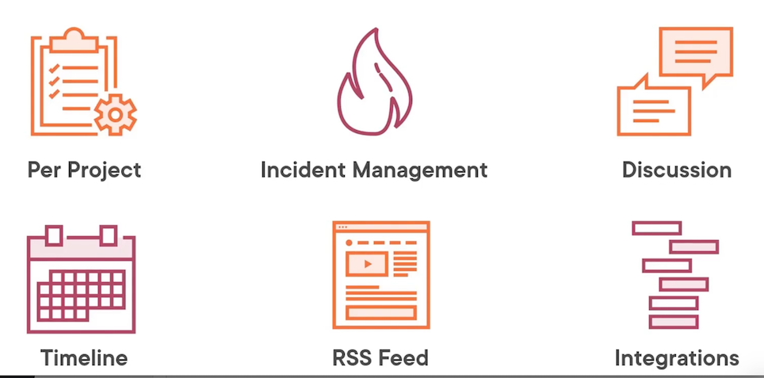

The **issues on GitLab are created per project**, so each project has its own dedicated space for the **issues and incident management**. In other systems, you might call them **tasks or tickets**, such as in Jira.

**The incidents are provided on top of the issue management system with a few extra details.** 

Another aspect of the issues is that they enable teams to **collaborate and discuss on the features and bugs in the project**.

Everything that happens in an issue ticket is maintained **as a timeline based on the date and the time of the activitv.** You can fetch this activity from GitLab using RSS feed as needed, or you can integrate with the GitLab API or other third-party solutions that provide nice features, such as Jira for ticket

When we create an issue in GitLab instance, **we can specify the title, labels, and basic information to explain the main feature** or requirements for the ticket. 

Once created, or when we are creating, we can always include collaborators.

GitLab also enables organizations to provide the list of owners who can review each contribution for a feature last but a very important feature. **Being that every issue can be added to a milestone that helps track the work**

### **2-2 Demo**

Create an issue

* Provide title
* Describe the issue
* Assign to yourself

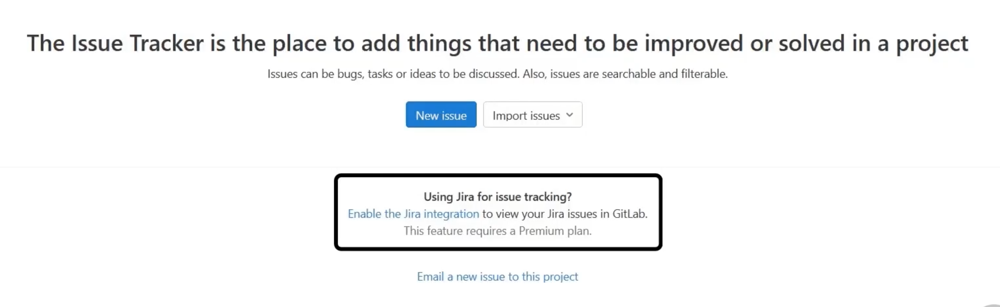

You can import issues from Jira by enabling the integration between Jira and GitLab. **GitLab helps you receive issues and incidents by email**

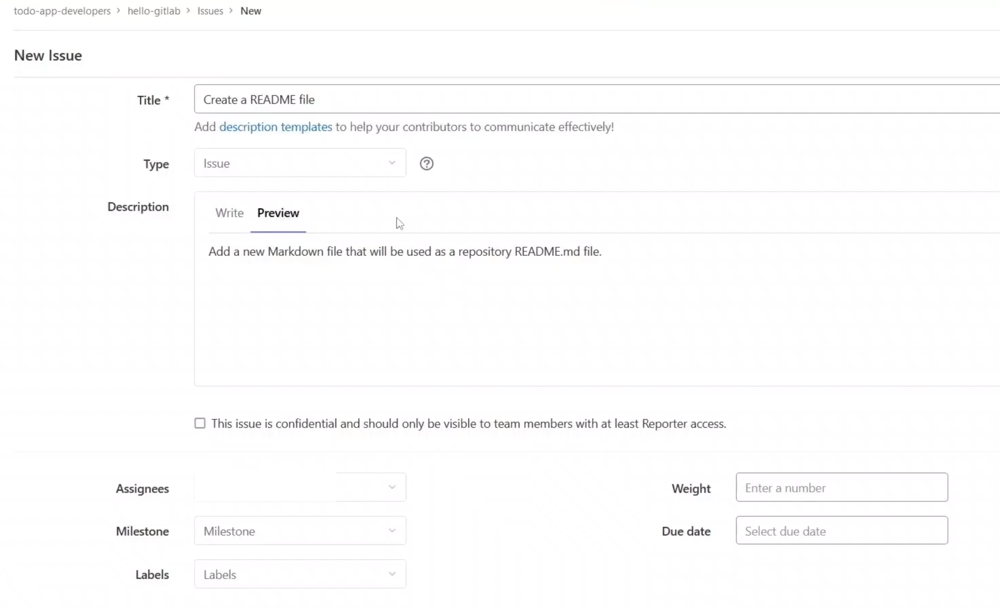

## **3 GitLab Labels**

GitLab provides an interesting feature called **labels**, which are a nice way to categorize the content within your projects.

The Git Lab labels are used to create a nice scope around your content.

For example, they're a nice way to categorize your issues, such as the front-end issues or the back-end issues or the issues for the infrastructure teams to look into. 

And GitLab uses the labels to create the columns for your issue boards in the projects as well. 

### Demo

In this demonstration, we will create the labels in a GitLab project. We will learn how to create the default labels for a project that GitLab provides. 

You see a button to **create a new label and also a button to generate default labels**.

## **4 Issue Board**

Let's learn about the issue boards that GitLab offers. The issue boards are a nice feature of GitLab that offers teams with the capabilities to manage the projects.

### **Purpose of GitLab Labels**

* **Scope**
	* Define scoped areas of focus within your GitLab organization

* **Categorization**
	* Group together similar issues for a better management

* **Issue boards**
	* Define the columns where the issues reside in Issue board.

	
Think of kanban boards, for example. The boards are powered by the labels and your issues, and **the issues move from one column in the swim lane to another based on the changes in the labels**.
	
The boards also help with the **milestones and timeline** 

The boards can be created for each team separately so everyone can work on their own tasks,

### Demo

* Exploring the board
* Moving the issues

In this demonstration, we will learn about the boards, how to access the board. and some areas around it. We will also learn how to move the issues between the columns on a board.

**By default, GitLab takes you to the backlog page where you can see the list** of the **active and open issues available in the project**.

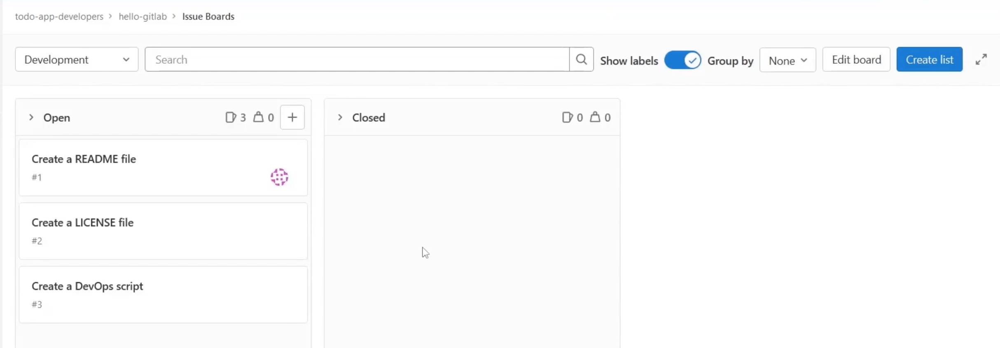

**Edit Board**

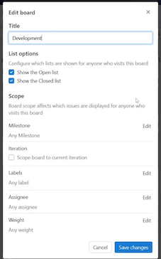

> Add labels to list of board

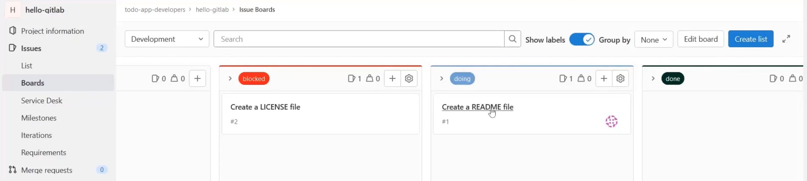

## **5 Inviting Members to Project**

Let's learn how to invite members to our projects. we will learn how to invite new members to our project using **their email addresses or their usernames on GitLab**.

We will also learn **how do we define the roles for the users** that we invite to the projects. Open the project and select the **Members menu** 

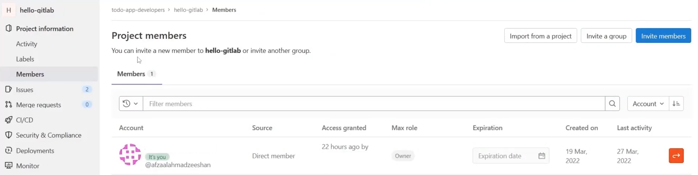

We can invite a member to the group using the **Invite members button** 

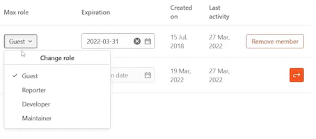

## **6 Working on Issues**

Now, let's learn how to work on the issues with our teams in a collaborative manner. 

### Demo

In this demonstration, we will learn how to change the assignees on the issues. 

* We will also learn how to update the labels on the issue. 
* Then, we will learn how to leave comments on the issues, such as our feedback, questions, or suggestions,

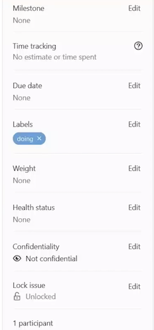

## **7 Milestones**

Milestones are a great way of tracking the work and keeping timelines active in a project. 

The milestones are a part of the team planning as they work on the features of the project.
 
**Milestones, however, do not contain everything that a project needs worked on.**  Each milestone aims to collect a **set of the issues and focus on them only**.

**Milestones can be labeled as the quarterly releases** or the version number that is being aimed for.

### **Using Milestones**

* **Team Planning**: Work closely with stakeholders for business planning
* **Prioritize Work**: Focus on the issues and tickets for upcoming milestones
* **Create Releases**:  Publish releases for the milestones and work done

Once your milestone is complete, everything from that milestone **can be built,validated, packaged, and shipped to market for your customers to use**.

### Demo

In this demonstration, we will create a milestone and see what GitLab offers.

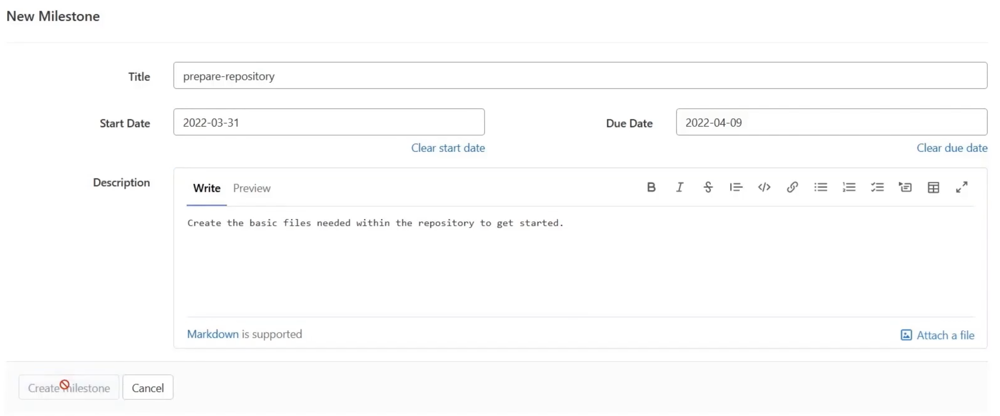

The Milestone page on GitLab offers an interesting insight in how the project is being developed. **It shows Upcoming because this milestone has not yet begun**.

At the time of this recording, the milestone was still a few days behind the start date. **It shows the percentage of the completion based on the issues in the milestone**.

It also shows how many issues this milestone has and how many of them are open or closed. we have the merge requests for this milestone and if there were any **releases created with this milestone**.

The main canvas for the milestone shows the charts that are useful to see how the team works. 

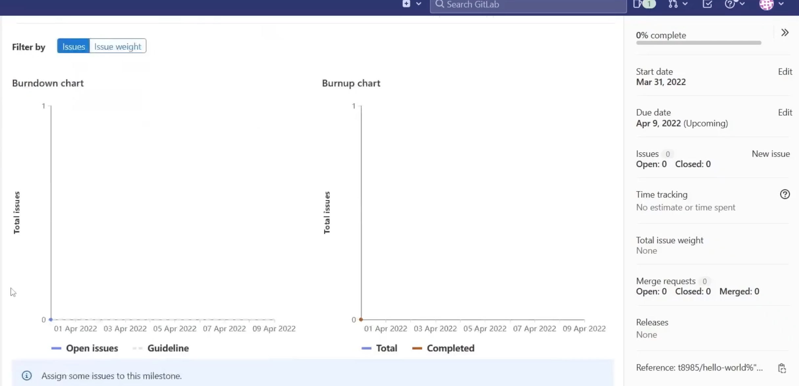

In the below, It shows how many issues are open and how much work has been done.

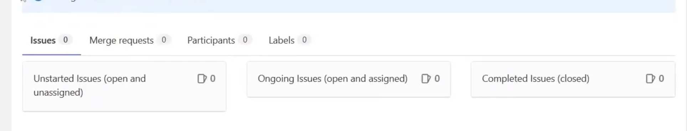

You have a list of the participating issues and any merge requests.

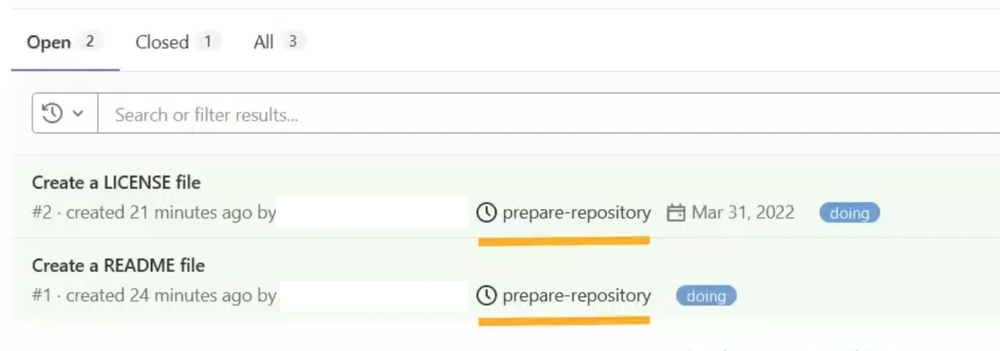

**This helps identify and categorize the issues based on their milestone,** and you can easily filter the issues for a specific milestone. 

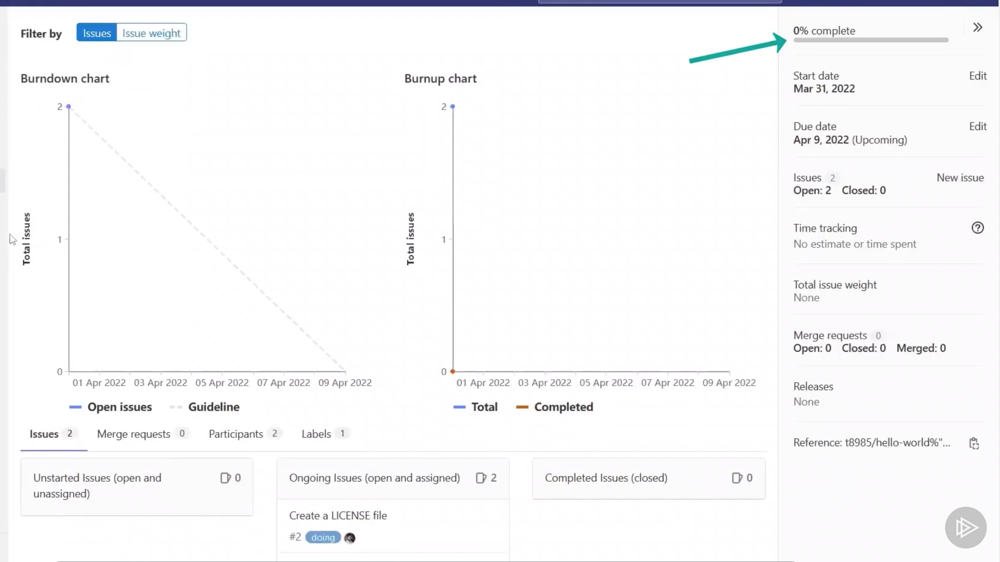

## **8 Service Desk**

Let's explore how to engage our customers. The Service Desk is a nice feature of GitLab that offers organizations to **use an email address where customers can send** their issues and complaints for your project. 

This feature does not require integrations or configurations on your or your customers part as this is just an email address, but it is always better to avoid being spammed on this address so proceed with caution and do not publish it outside without unnecessary need.

GitLab would collect and centralize all the incidents and issues in a single place for your project.

### **Service Desk**

* **Customer Service:**  GitLab enables businesses to capture feedback continuously
* **No Integrations:**   Service Desk uses email messages, thus no integration is required
* **Centralize:**   Bring the feedback closer to the teams, with issues and incidents

We will send an email to the address and also assign someone to the work.

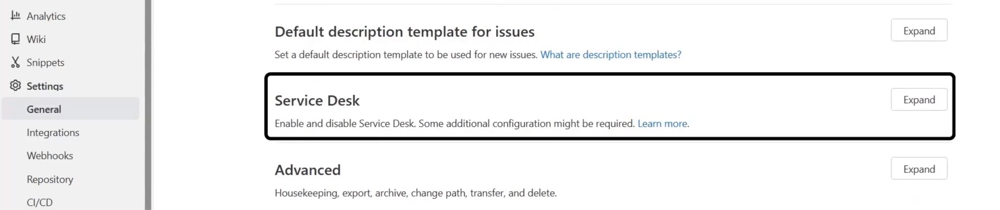

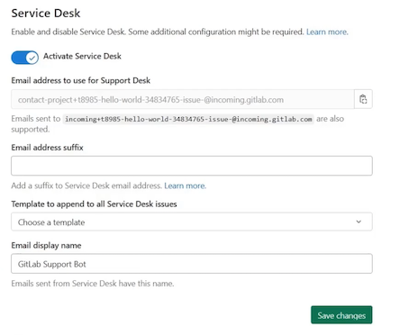

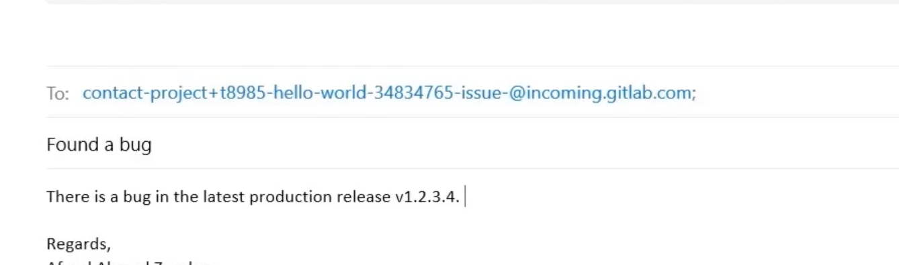

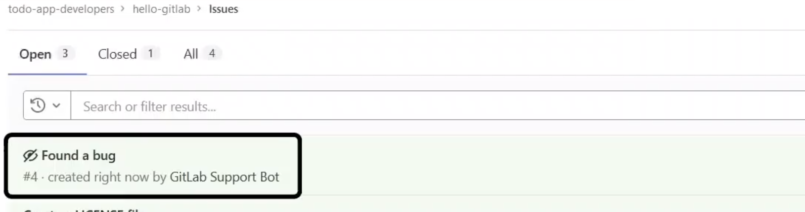

If you submit any changes to this issue, the email address would receive a notification automatically so **you do not need to reach out to the person via email directly**.