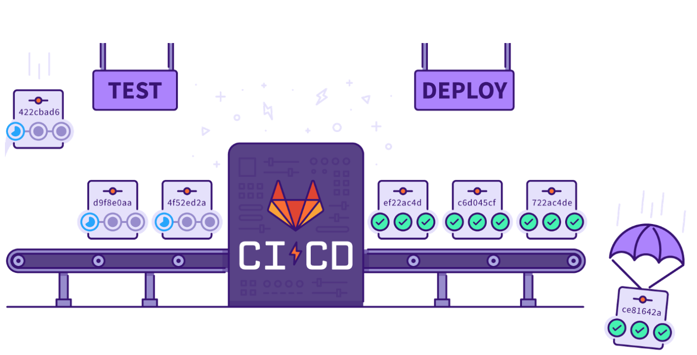
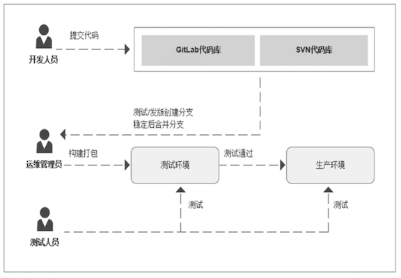
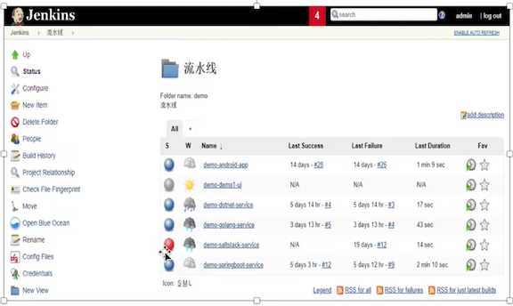
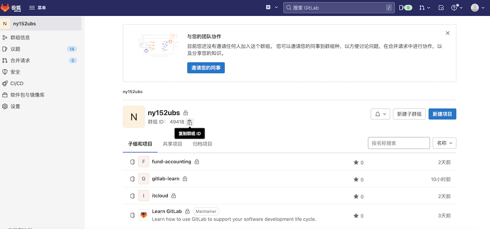

# **第一节 Gitlab 基本介绍（CI/CD)**

## **1 传统应用发布模式**

**1 开发团队** 

在开发环境中完成软件开发，单元测试，测试通过，提交到代码版本管理库。

**2 运维团队** 

把应用部署到测试环境，供QA团队测试，测试通过后部署生产环境。 

**3 QA团队**

进行测试，测试通过后通知部署人员发布到生产环境。 

## **2 面临挑战**

**1 错误发现不及时**

很多错误在项目的早期可能就存在，到最后集成的时候才发现问题。 

**2 人工低级错误发生**

产品和服务交付中的 关键活动全都需要手动操作。

**3 团队工作效率低**

需要等待他人的工作 完成后才能进行自己的工作。 

**4 开发运维对立**

开发人员想要快速更新，运维人员追求稳定，各自的针对的方向不同 

## **3 CI/CD**

### **持续集成（CI）** 

持续集成(Continuous integration，缩写为 CI)是一种软件开发实践，团队 开发成员经常集成他们的工作。利用自动测试来验证并断言其代码不会与现有代码库产生冲突。

理想情况下，代码更改应该每天在 CI 工具的帮助下，在每次提交时进 行自动化构建(包括编译，发布，自动化测试)，从而尽早地发现集成错误，以确 保合并的代码没有破坏主分支。

> Continuous integration (CI for short) is a software development practice in which team development members
frequently integrate their work. Utilize automated tests to verify and assert that their code does not conflict
with existing codebases. Ideally, code changes should be automated on a daily basis with the help of CI tools,
with automated builds (including compile, release, automated tests) on each commit, to catch integration errors
early enough to ensure that the merged code doesn't break the master branch

* 合并开发人员正在开发编写的所有代码的一种做法。 
* 通常一天内进行多次合并和提交代码。 
* 从存储库或生产环境中进行构建和自动化测试，以确保没有集成问题并毕发现任何问题。

### **连续交付（CD)**

持续交付(Continuous delivery，缩写为 CD)以及持续集成为交付代码包提 供了完整的流程。

在此阶段，将使用自动构建工具来编译工件，并使其准备好交付 给最终用户。它的目标在于让软件的构建、测试与发布变得更快以及更频繁。这种 方式可以减少软件开发的成本与时间，减少风险。

* 通常可以通过将更改自动推送到发布系统来随时将软件发布到生产环境中。 
* 持续部署会更进一步，并自动将更改推送到生产中。 

> Continuous delivery (CD) and continuous integration provide a complete process for delivering code packages.
At this stage, automated build tools are used to compile the artifacts and make them ready for delivery to end
users. Its goal is to make software build, test, and release faster and more frequently. This approach can reduce
the cost and time of software development and reduce risks.

### **连续交付（CD)**

持续部署(Continuous deployment)通过集成新的代码更改并将其自动交付 到发布分支，从而将持续交付提升到一个新的水平。

更具体地说，一旦更新通过了 生产流程的所有阶段，便将它们直接部署到最终用户，而无需人工干预。因此，要 成功利用连续部署，软件工件必须先经过严格建立的自动化测试和工具，然后才能 部署到生产环境中。

> **Continuous deployment** takes continuous delivery to the next level by integrating new code
changes and automatically delivering them to release branches. More specifically, once
updates have passed all stages of the production process, they are deployed directly to
end users without human intervention. Therefore, to successfully leverage continuous deployment, software artifacts must undergo rigorously established automated testing and
tooling before they can be deployed into production.

## **4 CI-Jenkins**

* 可扩展自动化服务器  
* 安装配置简单 
* 丰富的插件库 
* 分布式架构设计 
* 支持所有的平台 
* 可视化的管理页面 

## **5 代码版本管理——Gitlab**

**代码审查  / 问题跟踪  / 动态订阅 / 易于扩展 / 项目wiki / 多角色项目管理  / 项目代码在线预览  / CI工具集成**

### **1 持续集成（CI)**

* 集成团队中每个开发人员提交的代码到代码存储库中。 
* 开发人员在Merge或者Pull请求中合并拉取新代码。 
* 在提交或者合环更改到代码存储库之前，会触发了构建，测试和新代码验证的管道。 
* CI可帮助您在开发周期的早期发现并减少错误 

### **2 持续交付（CD)**

* 可通过结构化的部署管道确保将经过CI验证的代码交付给您的应用程序。
*  CD可以将经过验证的代码更快地移至您的应用程序。 

CI/CD 一起可以加快团队为客户和利益相关者交付成果的速度。CI和CD必须无缝协作，以使您的团队快速有效进行构建，并且对于确保完全优化的开发实践至关重要。

### **3 Gitlab CI/CD 优势**

* 开源：CI/CD是开源GitLab社区版和专有GitLab企业版的一部分。 
* 易于学习：具有详细的入门文档。 
* 无缝集成：GitLab CI/CD 是GitLab的一部分，支持从计划到部署，具有出色的用户体验。 
* 可扩展：测试可以在单独的计算机上分布式运行，可以根据需要添加任意数量的计算机。 
* 更快的结果：每个构建可以拆分为多个作业，这些作业可以在多台计算机上并行运行。 
* 针对交付进行了优化：多个阶段，手动部署，环境和变量。 

### **4 Gitlab CI/CD 组件**

**GitLab CI/CD**

* GitLab的一部分，GitLab是一个Web应用程序，具有将其状态存储在数据库中的API
* 除了GitLab的所有功能之外，它还管理项目／构建并提供一个不错的用户界面。 

**GitLab Runner** 

* **是一个处理构建的应用程序**。 
* 它可以单独部署，并通过API与GitLab CI/CD一起使用。 

**`.gitlab-ci.yml`**

**为了运行测试，至少需要一个GitLab实例和一个GitLab Runner**。

### **5 Gitlab CI/CD 组件**

* 多平台：Unix, Windows, macOS和任何其他支持Go的平台上执行构建。 * 多语言：构建脚本是命令行驱动的，并且可以与Java, PHP, Ruby, C和任何其他语言一华使用。 
* 稳定构建：构建在与GitLab不同的机器上运行。 
* 并行构建：GitLab CI/CD在多台机器上拆分构建，以实现快速执行。 
* 实时日志记录：合并请求中的链接将您带到动态更新的当前构建日志。 
* 灵活的管道：您可以在每个阶段定义多个并行作业，并且可以触发其他构建。 
* 版本管道：一个`.gitlab-ci.yml`文件包含您的测试，整个过程的步骤，使每个人都能贡献更改， 支获得所需的管道。 

### **6 Gitlab CI/CD 特点**

* 自动缩放：您可以自动缩放构建机器，以确保立即处理您的构建并将成本降至最低。 
* 构建工件：您可以将二进制文件脚其他构建工件上载到GitLab并浏览和下载它们。 
* Docker支持：可以使用自定义Docker映像，作为测试的一部分启动服务，构建新的Docker映像，甚至可以在 Kubernetes上运行。 
* 容器注册表：内置的容器注册表，用于存储，共享和使用容器映像。 
* 受保护的变量：在部署期间使用受每个环境保护的变量安全地存储和使用机密。 
* 环境：定义多个环境 

### **7 Gitlab CI/CD 工作原理**

* 将代码托管到Git存储库。 
* 在项目根目录创建CI文件`.gitlab-ci.yml`, 在文件中指定构建，测试和部署脚本。  
* GitLab将检测到它并使用名为`GitLab Runner`的工具运行脚本。 
* 脚本被分组为**作业**，它们共同组成了一个**管道**。 

