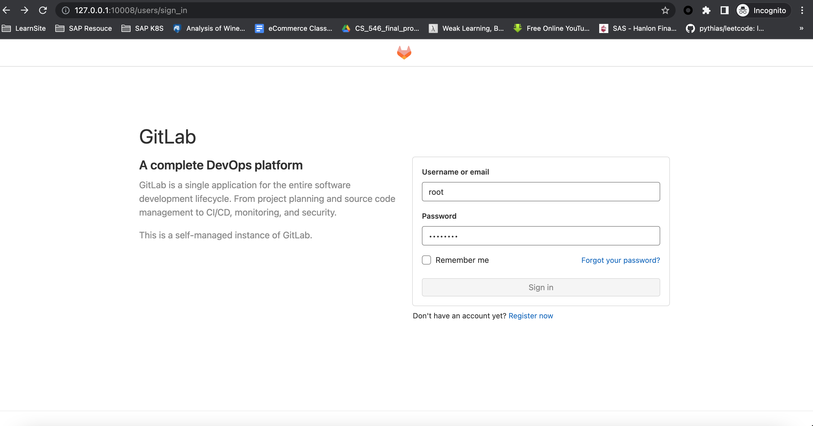
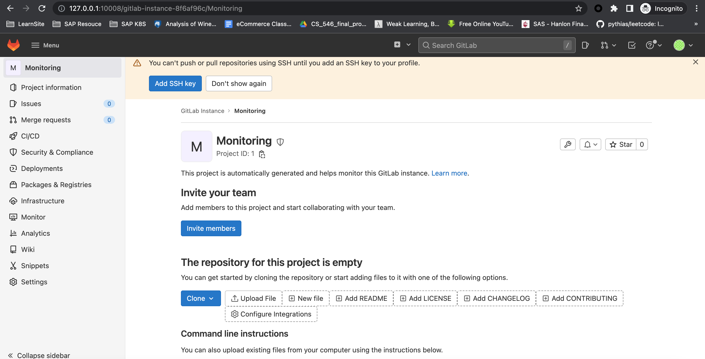
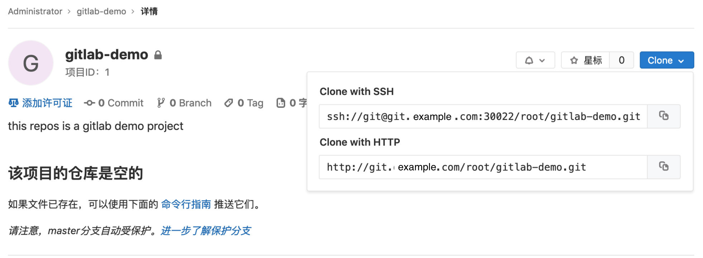

# **4 在Kubernetes上安装Gitlab**

Gitlab 官方提供了 Helm 的方式在 Kubernetes 集群中来快速安装，但是在使用的过程中发现 Helm 提供的 Chart 包中有很多其他额外的配置，所以我们这里使用自定义的方式来安装，也就是自己来定义一些资源清单文件。

Gitlab 主要涉及到3个应用：Redis、Postgresql、Gitlab 核心程序，实际上我们只要将这3个应用分别启动起来，然后加上对应的配置就可以很方便的安装 Gitlab 了，我们这里选择使用的镜像不是官方的，而是 Gitlab 容器化中使用非常多的一个第三方镜像：sameersbn/gitlab，基本上和官方保持同步更新，地址：http://www.damagehead.com/docker-gitlab/

[https://github.com/sameersbn/docker-gitlab#installation](https://github.com/sameersbn/docker-gitlab#installation)

## **安装**

如果我们已经有可使用的 Redis 或 Postgresql 服务的话，那么直接配置在 Gitlab 环境变量中即可，如果没有的话就单独部署。

首先部署需要的 Redis 服务，对应的资源清单文件如下：(`gitlab-redis.yaml`)

```
apiVersion: apps/v1
kind: Deployment
metadata:
  name: redis
  namespace: devops
  labels:
    name: redis
spec:
  replicas: 1
  selector:
    matchLabels:
      name: redis
  template:
    metadata:
      name: redis
      labels:
        name: redis
    spec:
      containers:
      - name: redis
        image: sameersbn/redis
        imagePullPolicy: IfNotPresent
        ports:
        - name: redis
          containerPort: 6379
        volumeMounts:
        - mountPath: /var/lib/redis
          name: data
        livenessProbe:
          exec:
            command:
            - redis-cli
            - ping
          initialDelaySeconds: 30
          timeoutSeconds: 5
        readinessProbe:
          exec:
            command:
            - redis-cli
            - ping
          initialDelaySeconds: 5
          timeoutSeconds: 1
      volumes:
      - name: data
        emptyDir: {}

---
apiVersion: v1
kind: Service
metadata:
  name: redis
  namespace: devops
  labels:
    name: redis
spec:
  ports:
    - name: redis
      port: 6379
      targetPort: redis
  selector:
    name: redis
```

然后是数据库 Postgresql，对应的资源清单文件如下：(`gitlab-postgresql.yaml`)

```
apiVersion: apps/v1
kind: Deployment
metadata:
  name: postgresql
  namespace: devops
  labels:
    name: postgresql
spec:
  replicas: 1
  selector:
    matchLabels:
      name: postgresql
  template:
    metadata:
      name: postgresql
      labels:
        name: postgresql
    spec:
      containers:
      - name: postgresql
        image: sameersbn/postgresql:12-20200524
        imagePullPolicy: IfNotPresent
        env:
        - name: DB_USER
          value: gitlab
        - name: DB_PASS
          value: passw0rd
        - name: DB_NAME
          value: gitlab_production
        - name: DB_EXTENSION
          value: "pg_trgm,btree_gist"
        ports:
        - name: postgres
          containerPort: 5432
        volumeMounts:
        - mountPath: /var/lib/postgresql
          name: data
        livenessProbe:
          exec:
            command:
            - pg_isready
            - -h
            - localhost
            - -U
            - postgres
          initialDelaySeconds: 30
          timeoutSeconds: 5
        readinessProbe:
          exec:
            command:
            - pg_isready
            - -h
            - localhost
            - -U
            - postgres
          initialDelaySeconds: 5
          timeoutSeconds: 1
      volumes:
      - name: data
        emptyDir: {}

---
apiVersion: v1
kind: Service
metadata:
  name: postgresql
  namespace: devops
  labels:
    name: postgresql
spec:
  ports:
    - name: postgres
      port: 5432
      targetPort: postgres
  selector:
    name: postgresql
```

然后就是我们最核心的 Gitlab 的应用，对应的资源清单文件如下：(gitlab.yaml)

```
---
apiVersion: v1
kind: PersistentVolumeClaim
metadata:
  name: gitlab-pvc-volume
  namespace: devops
spec:
  accessModes:
    - ReadWriteOnce
  resources:
    requests:
      storage: 2Gi
  storageClassName: hostpath

---
apiVersion: apps/v1
kind: Deployment
metadata:
  name: gitlab
  namespace: devops
  labels:
    name: gitlab
spec:
  selector:
    matchLabels:
      name: gitlab
  template:
    metadata:
      name: gitlab
      labels:
        name: gitlab
    spec:
      containers:
      - name: gitlab
        image: sameersbn/gitlab
        imagePullPolicy: IfNotPresent
        env:
        - name: TZ
          value: Asia/Shanghai
        - name: GITLAB_TIMEZONE
          value: Beijing
        - name: GITLAB_SECRETS_DB_KEY_BASE
          value: long-and-random-alpha-numeric-string
        - name: GITLAB_SECRETS_SECRET_KEY_BASE
          value: long-and-random-alpha-numeric-string
        - name: GITLAB_SECRETS_OTP_KEY_BASE
          value: long-and-random-alpha-numeric-string
        - name: GITLAB_ROOT_PASSWORD
          value: admin321
        - name: GITLAB_ROOT_EMAIL
          value: example@gmail.com
        - name: GITLAB_HOST
          value: "localhost"
        - name: GITLAB_PORT
          value: "32220"   #这里极其重要
        - name: GITLAB_SSH_PORT
          value: "30022"
        - name: GITLAB_NOTIFY_ON_BROKEN_BUILDS
          value: "true"
        - name: GITLAB_NOTIFY_PUSHER
          value: "false"
        - name: GITLAB_BACKUP_SCHEDULE
          value: daily
        - name: GITLAB_BACKUP_TIME
          value: 01:00
        - name: DB_TYPE
          value: postgres
        - name: DB_HOST
          value: postgresql
        - name: DB_PORT
          value: "5432"
        - name: DB_USER
          value: gitlab
        - name: DB_PASS
          value: passw0rd
        - name: DB_NAME
          value: gitlab_production
        - name: REDIS_HOST
          value: redis
        - name: REDIS_PORT
          value: "6379"
        ports:
        - name: http
          containerPort: 80
        - name: ssh
          containerPort: 22
        volumeMounts:
        - mountPath: /home/git/data
          name: data
        livenessProbe:
          httpGet:
            path: /
            port: 80
          initialDelaySeconds: 180
          timeoutSeconds: 5
        readinessProbe:
          httpGet:
            path: /
            port: 80
          initialDelaySeconds: 5
          timeoutSeconds: 1
      volumes:
      - name: data
        persistentVolumeClaim:
          claimName: gitlab-pvc-volume 
---
apiVersion: v1
kind: Service
metadata:
  name: gitlab
  namespace: devops
  labels:
    name: gitlab
spec:
  ports:
    - name: http
      port: 80
      targetPort: http
      nodePort: 32220
    - name: ssh
      port: 22
      targetPort: ssh
      nodePort: 30022
  type: NodePort
  selector:
    name: gitlab
```

要注意我们这里应用数据没有做数据持久化，只是使用的`emptyDir: {}`类型的 volume，Pod 挂掉后，对应的数据 也就没有了，所以要在正式的环境中使用一定要做数据的持久化，比如添加 PV/PVC 或者 StorageClass。

```
$ kubectl create -f gitlab-redis.yaml gitlab-postgresql.yaml gitlab.yaml
```

创建完成后，查看 Pod 的部署状态：

```
$ kubectl get pod -n devops 
NAME                         READY   STATUS    RESTARTS   AGE
gitlab-6f4d75595d-jh6nf      1/1     Running   0          43m
postgresql-6d5878b74-gkwzv   1/1     Running   0          50m
redis-65668f87b8-ww5n2       1/1     Running   0          100m
```
```
$ kubectl get svc -n devops
NAME         TYPE        CLUSTER-IP      EXTERNAL-IP   PORT(S)                     AGE
gitlab       NodePort    10.108.212.14   <none>        80:32220/TCP,22:30022/TCP   45m
postgresql   ClusterIP   10.101.62.211   <none>        5432/TCP                    52m
redis        ClusterIP   10.97.115.239   <none>        6379/TCP                    102m
```

### **或者可以部署`Ingress`，通过域名访问**

```
---
apiVersion: extensions/v1beta1
kind: Ingress
metadata:
  name: gitlab
  namespace: kube-ops
  annotations:
    kubernetes.io/ingress.class: traefik
spec:
  rules:
  - host: git.example.com
    http:
      paths:
      - backend:
          serviceName: gitlab
          servicePort: http
```

## **使用**


```
kubectl port-forward svc/gitlab 10008:80 -n kube-ops
```

`localhost:10008`

* root
* admin321





`settings -> ssh`

### **创建新的`gitlab-project`**

使用用户名 root，和部署的时候指定的超级用户密码`GITLAB_ROOT_PASSWORD=admin321`即可登录进入到首页：

Gitlab 运行后，我们可以注册为新用户并创建一个项目，还可以做很多的其他系统设置，比如设置语言、设置应用风格样式等等。

点击`Create a project`创建一个新的项目，和之前 Github 使用上没有多大的差别

创建完成后，我们可以添加本地用户的一个`SSH-KEY`，这样我们就可以通过 SSH 来拉取或者推送代码了。


SSH 公钥通常包含在`~/.ssh/id_rsa.pub` 文件中，并以`ssh-rsa`开头。如果没有的话可以使用`ssh-keygen`命令来生成，`id_rsa.pub`里面的内容就是我们需要的 SSH 公钥，然后添加到 Gitlab 中。

由于平时使用的 ssh 默认是 22 端口，现在如果用默认的 22 端口去连接，是没办法和 Gitlab 容器中的 22 端口进行映射的，因为我们只是通过 Service 的 22 端口进行了映射，要想通过节点去进行 ssh 链接就需要在节点上一个端口和容器内部的22端口进行绑定，所以这里我们可以通过 NodePort 去映射 Gitlab 容器内部的22端口，比如我们将环境变量设置为`GITLAB_SSH_PORT=30022`，将 `Gitlab` 的 `Service` 也设置为 `NodePort` 类型：

```
---
apiVersion: v1
kind: Service
metadata:
  name: gitlab
  namespace: devops
  labels:
    name: gitlab
spec:
  ports:
    - name: http
      port: 80
      targetPort: http
    - name: ssh
      port: 22
      targetPort: ssh
      nodePort: 30022
  type: NodePort
  selector:
    name: gitlab
```

上面 ssh 对应的 nodePort 端口设置为 30022，这样就不会随机生成了，重新更新下 `Deployment` 和 `Service`，更新完成后，现在我们在项目上面 Clone 的时候使用 ssh 就会带上端口号了：



```
 git clone ssh://git@localhost:30022/root/gitlab-demo.git
Cloning into 'gitlab-demo'...
The authenticity of host '[localhost]:30022 ([::1]:30022)' can't be established.
ECDSA key fingerprint is SHA256:m7ViaaMBdYKdedh4xQrefW+kpV+8xQ9e9+dJ+8+cAJw.
Are you sure you want to continue connecting (yes/no/[fingerprint])? yes
Warning: Permanently added '[localhost]:30022' (ECDSA) to the list of known hosts.
warning: You appear to have cloned an empty repository.

$ cd gitlab-demo
$ echo "# hello world" >  README.md
$ git add .
 git commit -m 'hello world'
[master (root-commit) aff3a72] hello world
 1 file changed, 1 insertion(+)
 create mode 100644 README.md
 
$ git push origin master
Enumerating objects: 3, done.
Counting objects: 100% (3/3), done.
Writing objects: 100% (3/3), 221 bytes | 221.00 KiB/s, done.
Total 3 (delta 0), reused 0 (delta 0)
To ssh://localhost:30022/root/gitlab-demo.git
 * [new branch]      master -> master
```