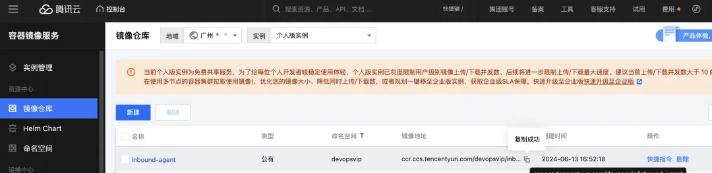
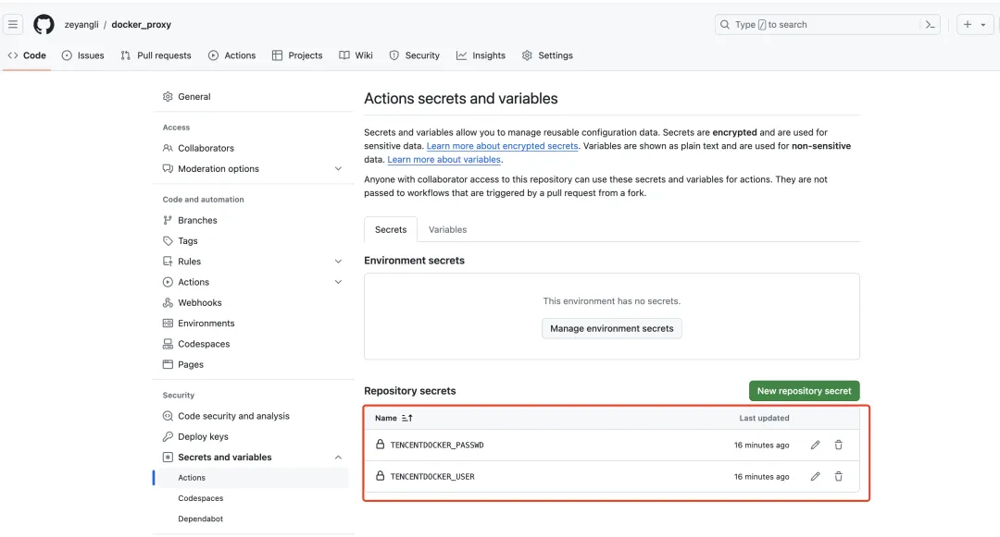
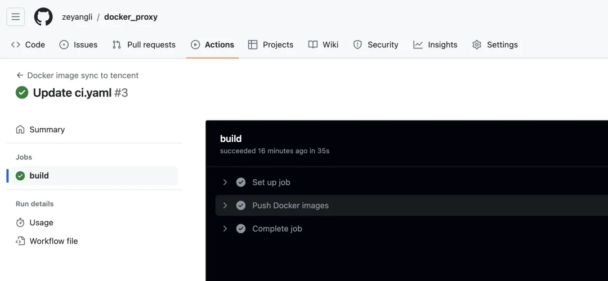
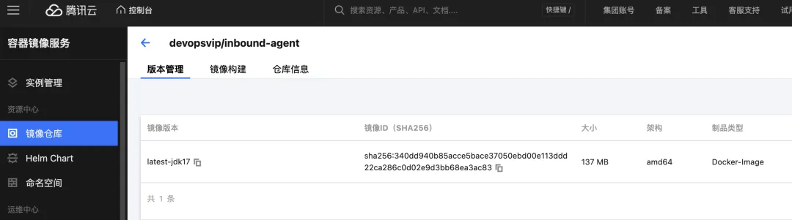

# 基于GitHubActions同步Docker镜像实践

## GitHub Actions简介

GitHub Actions 是 GitHub 推出的一款强大的持续集成和持续部署(CI/CD)工具。它可以帮助开发者在 GitHub 上自动化软件开发生命周期中的各种任务,从而提高开发效率和交付质量。

GitHub Actions 的核心思想是基于事件驱动的工作流(Workflow)。开发者可以定义各种事件(如代码提交、拉取请求、计划任务等)触发相应的工作流,在工作流中执行一系列的操作和动作。这些操作包括编译、测试、打包、部署等各种软件开发相关的任务。

工作流的定义采用 YAML 格式,非常简洁易读。开发者只需要在代码仓库中创建一个 `.github/workflows` 目录,并在其中添加 YAML 格式的工作流定义文件即可。这些文件描述了在特定事件发生时应该执行哪些操作步骤。

GitHub Actions 提供了大量的现成动作(Actions),开发者可以直接拿来使用。这些动作封装了各种常见的构建、测试、部署等功能,涵盖了从 Java、Python、Node.js 到 Docker、AWS 等各种技术栈。开发者也可以自定义动作,实现更复杂的功能。

除了灵活的工作流定义和丰富的动作库,GitHub Actions 还提供了方便的日志查看、状态检查等功能,帮助开发者更好地监控和管理自动化流程。同时,它还支持矩阵构建、缓存依赖、secrets 管理等高级特性,满足复杂场景下的需求。

GitHub Actions 的另一大优势在于它与 GitHub 本身深度集成。开发者无需额外配置第三方 CI/CD 工具,只需利用熟悉的 GitHub 环境即可实现自动化。这不仅简化了工具链,也使得开发、构建、部署的全流程可以无缝衔接。

总的来说,GitHub Actions 为开发者提供了一个强大、灵活、集成度高的 CI/CD 解决方案。它不仅能够帮助开发者提高交付效率,还能促进代码仓库、自动化流程和部署环境的良性互动,为软件开发注入新的活力。随着 GitHub Actions 的持续发展和完善,相信它将在未来成为业界领先的 CI/CD 工具之一。

## Docker镜像同步

将外网的镜像同步到国内的镜像仓库是一个常见的需求,特别是对于一些需要访问国外资源的企业和开发者来说。这样可以提高镜像拉取的速度,同时也能规避因网络问题导致的镜像拉取失败。下面我将详细介绍如何实现这一同步过程:

**1.选择合适的国内镜像仓库服务商**

国内常见的镜像仓库服务商有阿里云容器镜像服务、腾讯云镜像仓库、华为云镜像仓库等。选择时可以考虑服务质量、价格、使用便利性等因素。

**2.创建国内镜像仓库**

登录选定的镜像仓库服务商平台,创建一个新的镜像仓库。这个镜像仓库将作为同步目标仓库,用于存储从外网同步过来的镜像。

**3.配置镜像同步任务**

* 大多数镜像仓库服务商都提供了镜像同步的功能。在服务商的控制台上,找到镜像同步的相关功能,配置同步任务的源镜像仓库(通常是外网仓库)和目标镜像仓库(刚刚创建的国内仓库)。
* 同时可以设置同步的镜像名称、标签、同步频率等参数,以满足业务需求。

**4.触发首次同步**

* 配置好同步任务后,通常需要手动触发首次同步,之后就可以设置为自动同步。
* 同步过程中,服务商的控制台会实时显示同步进度和状态,方便监控。

**5.验证同步结果**

同步完成后,登录国内镜像仓库检查目标镜像是否已经同步成功。可以尝试拉取镜像并运行容器,验证镜像的完整性。

**6.调整同步策略**

根据实际使用情况,可以适当调整同步的镜像名称、标签、频率等参数,以优化同步效果。比如可以同步常用的基础镜像,而对于变更频率较高的业务镜像可以缩短同步间隔。

通过以上步骤,就可以将外网的镜像资源同步到国内的镜像仓库了。这样不仅可以加快镜像拉取速度,提高应用部署效率,还能规避因网络问题导致的镜像拉取失败。

**对于需要访问国外资源的企业和开发者来说,这是一个非常有价值的解决方案。**

## GitHub Actions同步镜像

使用 GitHub Actions 可以非常方便地实现 Docker 镜像的同步。下面我们来详细介绍一下具体的配置步骤:

1.在 GitHub 仓库中创建一个新的工作流文件:

在 `.github/workflows` 目录下创建一个新的 YAML 文件,例如 `docker-sync.yml`。

2.在工作流文件中添加以下内容:

```
name: Docker Image Sync

on:
  push:
    branches: [ "main" ]
  pull_request:
    branches: [ "main" ]

jobs:

  sync:
    runs-on: ubuntu-latest
    
    steps:
    - uses: actions/checkout@v2
    
    - name: Set up QEMU
      uses: docker/setup-qemu-action@v1
    
    - name: Set up Docker Buildx
      uses: docker/setup-buildx-action@v1
      
    - name: Login to Docker Hub
      uses: docker/login-action@v1
      with:
        username: ${{ secrets.DOCKER_USERNAME }}
        password: ${{ secrets.DOCKER_PASSWORD }}
        
    - name: Sync Docker Image
      run: |
        docker pull <source-image-name>:<source-tag>
        docker tag <source-image-name>:<source-tag> <target-image-name>:<target-tag>
        docker push <target-image-name>:<target-tag>
```

这个工作流定义了在 main 分支上的 `push` 和 `pull_request` 事件触发时执行同步任务。

3.配置 Docker 登录凭证:

在 GitHub 仓库的 `Settings > Secrets` 页面添加 `DOCKER_USERNAME` 和 `DOCKER_PASSWORD` 两个 secret,分别存储 Docker 镜像仓库的用户名和密码。

4.配置同步源和目标镜像:

在 `Sync Docker Image` 步骤中,将 `<source-image-name>` 和 `<source-tag>` 替换为源镜像的名称和标签,将 `<target-image-name>` 和` <target-tag>` 替换为目标镜像的名称和标签。

5.提交工作流文件并推送到 GitHub 仓库:

保存工作流文件并推送到 GitHub 仓库的 main 分支。

完成以上步骤后,每次 main 分支上有 push 或 `pull_request `事件发生时,GitHub Actions 就会自动触发镜像同步任务。

需要注意的是,在实际使用时,您需要根据实际情况修改镜像名称、标签、Docker 仓库等相关信息。同时,如果需要同步多个镜像,可以在工作流中添加多个 Sync Docker Image 步骤。

通过使用 GitHub Actions 实现 Docker 镜像同步,您可以轻松地将外网镜像同步到国内仓库,提高应用部署的效率和可靠性。如果您有任何其他问题,欢迎随时与我交流。

## 实践过程


新建了一个GitHub仓库用于个人同步镜像到腾讯云TCR。

地址: `https://github.com/xxx/docker_proxy`

注意：GitHub Actions语法有很多，目前很简单手动修改ci.yaml会自动触发action pipeline.

创建目标镜像仓库

`ccr.ccs.tencentyun.com/devopsvip/inbound-agent`



添加仓库Secrets

保存目标镜像仓库的认证信息




CI文件（.github/workflow/ci.yaml）

```
# This is a basic workflow to help you get started with Actions
#VERSION 2
#renew

name: Docker image sync to tencent
env:
  REGISTRY_URL: "ccr.ccs.tencentyun.com/devopsvip"
on:
  push:
    paths:
      - '.github/workflows/**'

jobs:
  build:
    runs-on: ubuntu-20.04
    steps:
    - name: Push Docker images
      run: |
        docker pull jenkins/inbound-agent:latest-jdk17 
        docker tag jenkins/inbound-agent:latest-jdk17 ${REGISTRY_URL}/inbound-agent:latest-jdk17
        docker login -u ${{ secrets.TENCENTDOCKER_USER}} -p ${{ secrets.TENCENTDOCKER_PASSWD}} ${REGISTRY_URL}
        docker push ${REGISTRY_URL}/inbound-agent:latest-jdk17
```

效果验证



