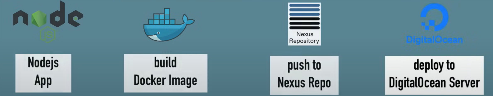
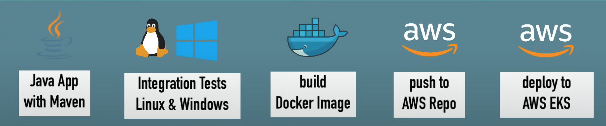
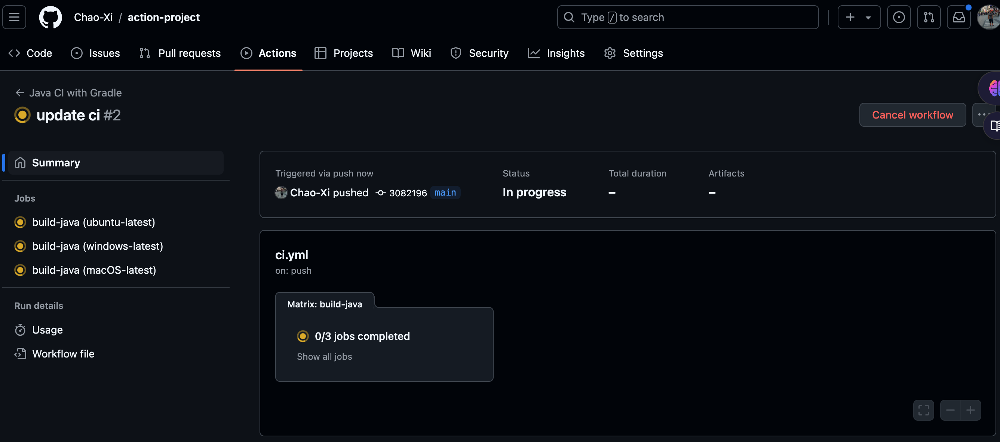

# GitHub Action - CI/CD Pipeline with Docker

## What are those workflows?

### Organizational tasks

**WORKFLOWS**


1. Merged Code
2. Test
3. Build
4. Deployment

### **How GitHub Actions automate these workflows?**

when something happens **IN or TO your repository**

* PR created
* Contr. joined
* other apps
* Issue created
* PR merged

**automatic ACTIONS** are executed in response


1. **LISTEN TO EVENT**
2. **TRIGGER WORKFLOW**

### CI/CD with Github Actions

integration with other technologies is important!





[https://github.com/Chao-Xi/action-project](https://github.com/Chao-Xi/action-project)

```
$ tree .github/
.github/
└── workflows
    └── ci.yml

1 directory, 1 file
```

```
# This workflow will build a Java project with Gradle
# For more information see: https://help.github.com/actions/language-and-framework-guides/building-and-testing-java-with-gradle

name: Java CI with Gradle

on:
  push:
    branches: [ main ]
  pull_request:
    branches: [ main ]

jobs:
  build-java:

    runs-on: ubuntu-latest
    # runs-on: ${{matrix.os}}
    # strategy:
    #     matrix:
    #       os: [ubuntu-latest, windows-latest, macOS-latest]
    
    steps:
    - uses: actions/checkout@v2

    - name: Set up JDK 1.8
      uses: actions/setup-java@v1
      with:
        java-version: 1.8

    - name: Grant execute permission for gradlew
      run: chmod +x gradlew

    - name: Build with Gradle
      run: ./gradlew build --warning-mode all

    - name: Build and Push Docker Image
      uses: mr-smithers-excellent/docker-build-push@v4
      with:
        image: nyjxi/action-demo-app
        registry: docker.io
        username: ${{ secrets.DOCKER_USERNAME }}
        password: ${{ secrets.DOCKER_PASSWORD }}
```

### Syntax

1.name [optional]  name of GitHub event that triggers the workflow

2.on [required]

3.jobs [required]


- One or more jobs (**jobs. <job id>**)
- sequence of tasks (steps)
- Steps can run commands, setup tasks OR run an action

Uses - selects an action


* **uses: actions/checkout@v2**

[https://github.com/actions/checkout](https://github.com/actions/checkout)

4 steps  [required]

can run commands, setup tasks OR run an action

5 uses - selects an action

6 run - runs a command-line command

* **runs on Ubuntu, Windows or macOS**

```
runs-on: ubuntu-latest
```




* **Docker Build & Push Action**

```
uses: mr-smithers-excellent/docker-build-push@v4
```

[https://github.com/docker/build-push-action](https://github.com/docker/build-push-action)

https://github.com/mr-smithers-excellent/docker-build-push

```
- name: Build and Push Docker Image
  uses: mr-smithers-excellent/docker-build-push@v4
  with:
    image: nyjxi/action-demo-app
    registry: docker.io
    username: ${{ secrets.DOCKER_USERNAME }}
    password: ${{ secrets.DOCKER_PASSWORD }}
```


