# GitHub Actions basic learning

**Workflow Templates**

**GitHub provided**

* Recommended based on repo code
* Deployment (CD)
* Continuous Integration (CI)
* Security (code scanning)

**Create for your organization**

- Promote consistency and best practice

[https://github.com/Chao-Xi/action-project](https://github.com/Chao-Xi/action-project)

## 1 Triggering Workflows with Events


```
# This is a basic workflow to help you get started with Actions

name: test

# Controls when the workflow will run
on:
  # Triggers the workflow on push or pull request events but only for the "main" branch
  push:
  # schedule:
  # - cron: "* * * * *" 
  #   branches: [ "main" ]
  # pull_request:
  #   branches: [ "main" ]

  # Allows you to run this workflow manually from the Actions tab
  workflow_dispatch: # manual

# A workflow run is made up of one or more jobs that can run sequentially or in parallel
jobs:
  # This workflow contains a single job called "build"
  build:
    # The type of runner that the job will run on
    runs-on: ubuntu-latest

    # Steps represent a sequence of tasks that will be executed as part of the job
    steps:
      # Checks-out your repository under $GITHUB_WORKSPACE, so your job can access it
      - uses: actions/checkout@v4

      # Runs a single command using the runners shell
      - name: Run a one-line script
        run: sleep 5

      # Runs a set of commands using the runners shell
      - name: Run a multi-line script
        run: |
          echo Add other actions to build,
          echo test, and deploy your project.
```

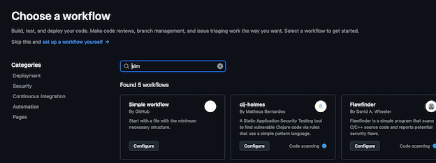

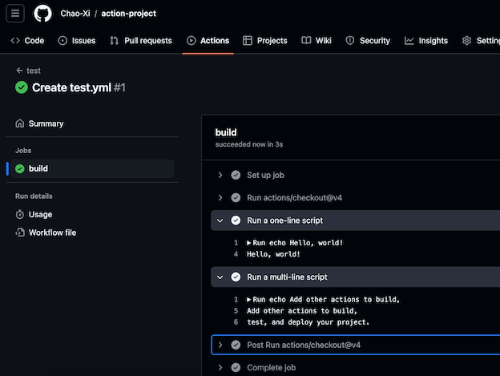


### Push Triggers Workflow Run

```
on:
  # Triggers the workflow on push or pull request events but only for the "main" branch
  push:
```

### Triggering on a Schedule

```
schedule:
- cron: "* * * * *" 
```

https://docs.github.com/en/actions/writing-workflows/choosing-when-your-workflow-runs/events-that-trigger-workflows

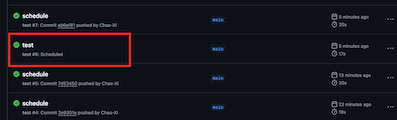


### Manual Triggers with workflow_dispatch

```
 # Allows you to run this workflow manually from the Actions tab
  workflow_dispatch: # manual
```

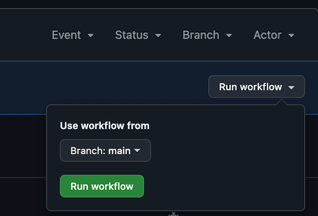


### build on Every Path

[https://github.com/Chao-Xi/sampleapp-action/blob/main/.github/workflows/build.yaml](https://github.com/Chao-Xi/sampleapp-action/blob/main/.github/workflows/build.yaml)

```
on:
  push:
    paths:
      - ".github/workflows/build.yaml"
      - "."
```


### Using the gh CLI to View Runs and Workflows

```
gh auth status

gh auth login

gh workflow list

gh run list

gh run view 9474112383

gh workflow list -repo gût4/course-gh-actions
```


## 2 Using Steps on Runners

[https://github.com/Chao-Xi/action-sample/blob/main/.github/workflows/upper-build.yml](https://github.com/Chao-Xi/action-sample/blob/main/.github/workflows/upper-build.yml)

### 2-1 Jobs Have Steps

```
name: upper-build

on:
  push:
    paths:
      - ".github/workflows/upper-build.yml"
      - "upper/**"
  workflow_dispatch: # manual

jobs:
  build:
    runs-on: ubuntu-latest
    steps:
      - run: go version
```

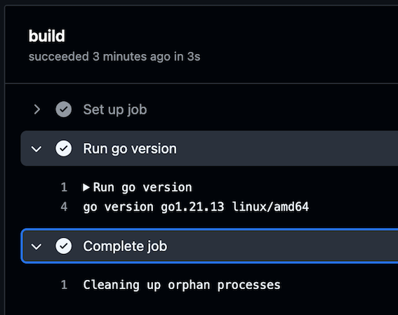

### 2-2 A New Workflow for the Upper Build and Adding actions/setup-go

[https://github.com/actions/setup-go](https://github.com/actions/setup-go)

```
....
jobs:
  build:
    runs-on: ubuntu-latest
    steps:
      - run: go version
      - uses: actions/setup-go@v5
        with:
          go-version: '1.22'
      - run: go version
```


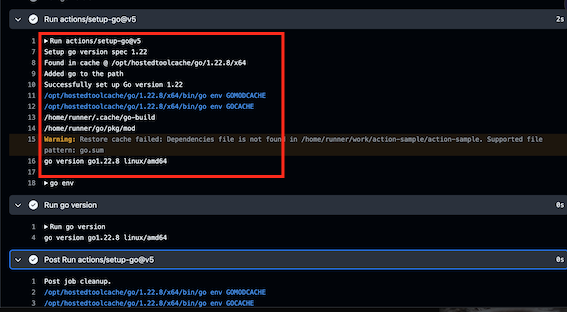


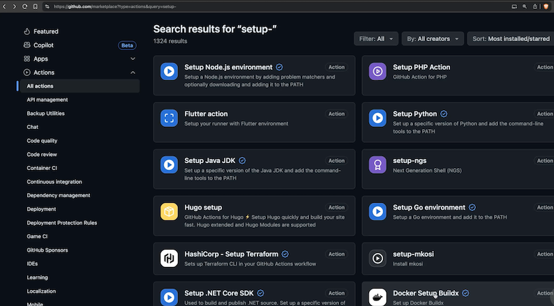


### 2-3 Understanding actions/checkout

[https://github.com/actions/checkout](https://github.com/actions/checkout)

```
...
jobs:
  build:
    runs-on: ubuntu-latest
    steps:
      - run: pwd && ls -al
      - uses: actions/checkout@v4
      - run: pwd && ls -al
      - run: go version
      - uses: actions/setup-go@v5
        with:
          go-version: '1.22'
      - run: go version
```

**Set Working Directory on the Multiline Run Step**


### 2-4 Set Working Directory on the Multiline Run Step

```
jobs:
  build:
    runs-on: ubuntu-latest
    steps:
      - run: pwd && ls -al
      - uses: actions/checkout@v4
      - run: pwd && ls -al
      - run: go version
      - uses: actions/setup-go@v5
        with:
          go-version: '1.22'
      - run: go version
      - run: |
          ls
          go build
          ls
          go test
          ./upper foo the bar
        working-directory: upper
        name: build and test
```

**working-directory: upper**

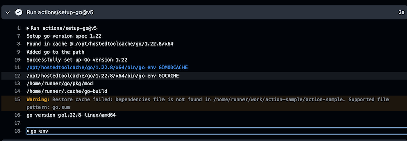

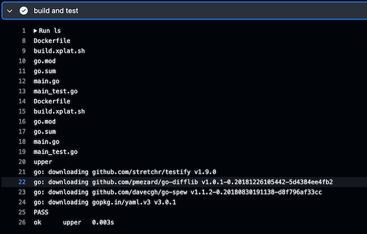


### 2-5 go-version-file and Cached vs. Downloaded Go Version

```
 - uses: actions/setup-go@v5
   with:
    # go-version: '1.22'
     go-version-file: ./upper/go.mod
```
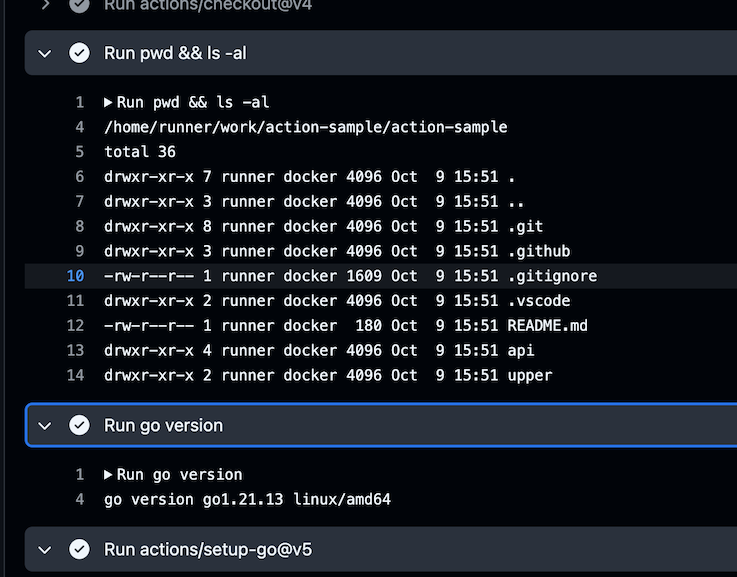

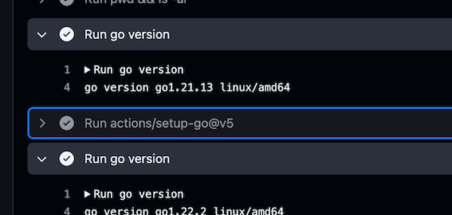

**Fix Caching of Dependencies**

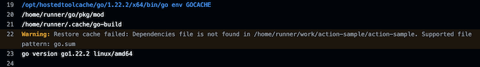

```
...
steps:
  - run: pwd && ls -al
  - uses: actions/checkout@v4
  - run: pwd && ls -al
  - run: go version
  - uses: actions/setup-go@v5
    with:
      # go-version: '1.22'
      go-version-file: ./upper/go.mod
      cache-dependency-path: ./upper/go.sum
...
```

### 2-6 Fix Caching of Dependencies

```
 with:
  # go-version: '1.22'
   $    go-version-file: ./upper/go.mod
          cache-dependency-path: ./upper/go.sum
      - run: go mod download
        working-directory: upper
```


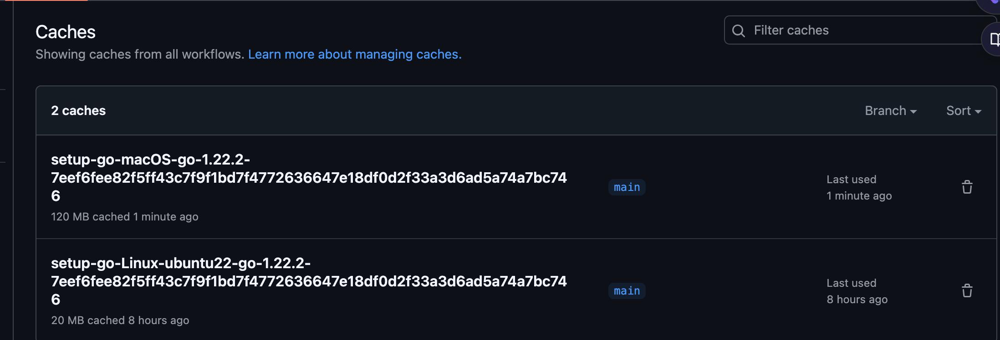


### 2-7 Running on macos-latest

```
- uses: actions/setup-go@v5
    with:
      # go-version: '1.22'
      go-version-file: ./upper/go.mod
      cache-dependency-path: ./upper/go.sum
```
 
 
### 2-8 Running on macos-latest

Macos-latest

```
..
jobs:
  build:
    # runs-on: ubuntu-latest
    runs-on: macos-latest
    steps:
      - run: pwd && ls -al
      - uses: actions/checkout@v4
      - run: pwd && ls -al
...
```

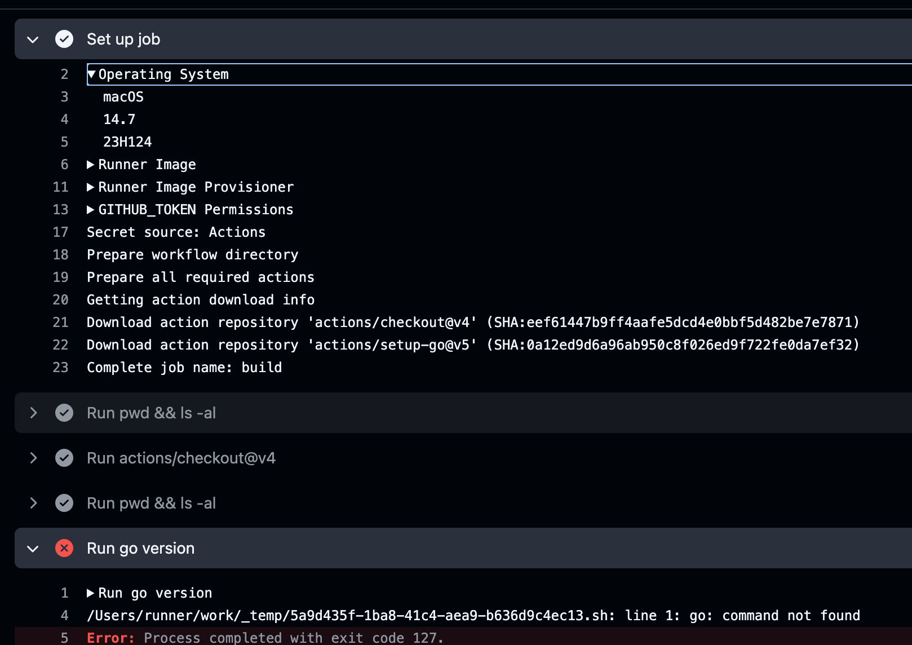


### 2-9 Registering a Self-hosted Runner 

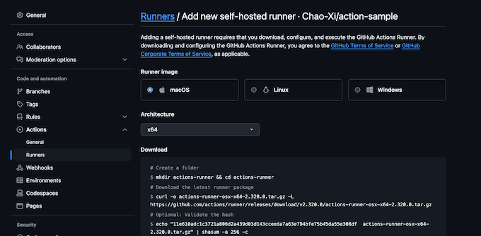


```
$ curl -o actions-runner-osx-x64-2.320.0.tar.gz -L https://github.com/actions/runner/releases/download/v2.320.0/actions-runner-osx-x64-2.320.0.tar.gz
 
$ echo "11e610adc1c3721a806d2a439d03d143cceeda7a63e794bfe75b45da55e308df  actions-runner-osx-x64-2.320.0.tar.gz" | shasum -a 256 -c

mkdir actions-runner && cd actions-runner

$ tar xzf ./actions-runner-osx-x64-2.320.0.tar.gz
$ ./config.sh --url https://github.com/Chao-Xi/action-sample --token ....


--------------------------------------------------------------------------------
|        ____ _ _   _   _       _          _        _   _                      |
|       / ___(_) |_| | | |_   _| |__      / \   ___| |_(_) ___  _ __  ___      |
|      | |  _| | __| |_| | | | | '_ \    / _ \ / __| __| |/ _ \| '_ \/ __|     |
|      | |_| | | |_|  _  | |_| | |_) |  / ___ \ (__| |_| | (_) | | | \__ \     |
|       \____|_|\__|_| |_|\__,_|_.__/  /_/   \_\___|\__|_|\___/|_| |_|___/     |
|                                                                              |
|                       Self-hosted runner registration                        |
|                                                                              |
--------------------------------------------------------------------------------

# Authentication


√ Connected to GitHub

# Runner Registration

Enter the name of the runner group to add this runner to: [press Enter for Default] 

Enter the name of runner: [press Enter for C02S710EG8WM] jacob1

This runner will have the following labels: 'self-hosted', 'macOS', 'X64' 
Enter any additional labels (ex. label-1,label-2): [press Enter to skip] 

√ Runner successfully added
√ Runner connection is good

# Runner settings

Enter name of work folder: [press Enter for _work] 

√ Settings Saved.

```

```
...
jobs:
  build:
    # runs-on: ubuntu-latest
    # runs-on: macos-latest
    runs-on: self-hosted
...
```

[https://github.com/Chao-Xi/action-sample/actions/runs/11275759756](https://github.com/Chao-Xi/action-sample/actions/runs/11275759756)

```
$ ./run.sh

√ Connected to GitHub

Current runner version: '2.320.0'
2024-10-10 14:07:53Z: Listening for Jobs
2024-10-10 14:08:32Z: Running job: build
2024-10-10 14:17:54Z: Job build completed with result: Canceled
^CExiting...
Runner listener exit with 0 return code, stop the service, no retry needed.
Exiting runner...
```

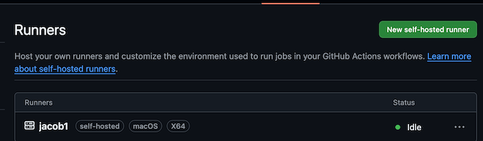

## 3 Injecting Secrets and Environment Variables

**gh.yml**

```
name: gh

on:
  push:
    paths:
      - ".github/workflows/gh.yaml"
  workflow_dispatch: # manual

jobs:
  cli:
    runs-on: ubuntu-latest
    env:
      GH_TOKEN: ${{ secrets.GITHUB_TOKEN }}
    steps:
      - uses: actions/checkout@v4
      - run: env
      - run: gh --version
      - run: gh auth status
      - run: gh repo list
      - run: gh issue list
      - run: gh workflow list
      - run: gh api /repos/:owner/:repo/actions/workflows
```

### 3-1 Injecting the `GH_TOKEN` Environment Variable

```
env:
  GH_TOKEN: ${{ secrets.GITHUB_TOKEN }}
```

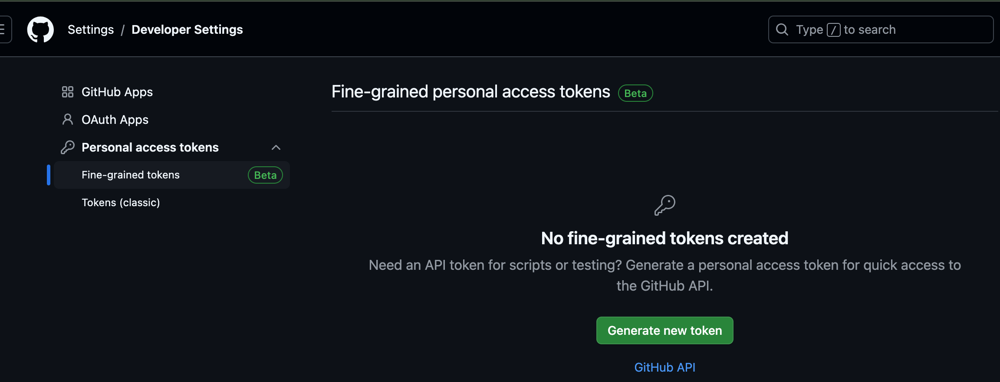

[https://github.com/Chao-Xi/action-sample/actions/runs/11294465133/job/31414962742](https://github.com/Chao-Xi/action-sample/actions/runs/11294465133/job/31414962742)

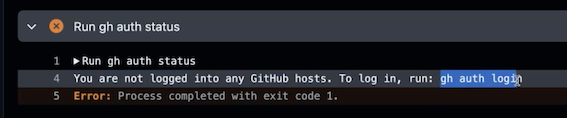


```
steps:
  - uses: actions/checkout@v4
```


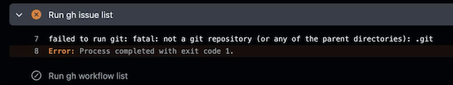
[
https://github.com/Chao-Xi/action-sample/issues](https://github.com/Chao-Xi/action-sample/issues)

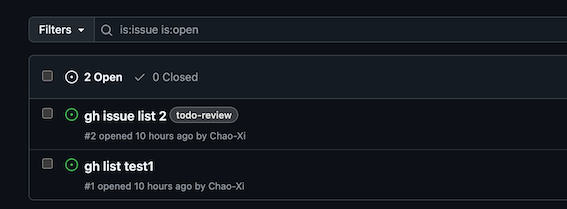

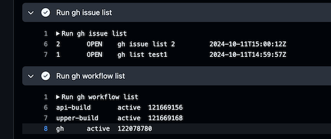

```
Run gh api /repos/:owner/:repo/actions/workflows
{"total_count":3,"workflows":
[{"id":121669156,"node_id":"W_kwDOM9zvsc4HQIYk","name":"api-build","path":".github/workflows/api-build.yml","state":"active","created_at":"2024-10-09T13:33:30.000Z","updated_at":"2024-10-09T13:33:30.000Z","url":"https://api.github.com/repos/Chao-Xi/action-sample/actions/workflows/121669156","html_url":"https://github.com/Chao-Xi/action-sample/blob/main/.github/workflows/api-build.yml","badge_url":"https://github.com/Chao-Xi/action-sample/workflows/api-build/badge.svg"},
{"id":121669168,"node_id":"W_kwDOM9zvsc4HQIYw","name":"upper-build","path":".github/workflows/upper-build.yml","state":"active","created_at":"2024-10-09T13:33:30.000Z","updated_at":"2024-10-09T13:33:30.000Z","url":"https://api.github.com/repos/Chao-Xi/action-sample/actions/workflows/121669168","html_url":"https://github.com/Chao-Xi/action-sample/blob/main/.github/workflows/upper-build.yml","badge_url":"https://github.com/Chao-Xi/action-sample/workflows/upper-build/badge.svg"},
{"id":122078780,"node_id":"W_kwDOM9zvsc4HRsY8","name":"gh","path":".github/workflows/gh.yaml","state":"active","created_at":"2024-10-11T14:42:47.000Z","updated_at":"2024-10-11T14:42:47.000Z","url":"https://api.github.com/repos/Chao-Xi/action-sample/actions/workflows/122078780","html_url":"https://github.com/Chao-Xi/action-sample/blob/main/.github/workflows/gh.yaml","badge_url":"https://github.com/Chao-Xi/action-sample/workflows/gh/badge.svg"}]}
```

### 3-2 Commenting on Issues with actions/github-scripts

**write-thanks.yml**

```
name: thanks

on:
  issues:
    types: opened
  workflow_dispatch: # manual

jobs:
  thanks:
    runs-on: ubuntu-latest
    permissions:
      issues: write
    steps:
      - uses: actions/github-script@v7
        id: issue_script
        with:
          github-token: ${{ secrets.GITHUB_TOKEN }}
          script: |
            const issue_number = context.issue.number || 2;
            console.log(`issue_number: ${issue_number}`);

            const owner = context.repo.owner;
            const repo = context.repo.repo;

            // lookup issue info
            const issue = await github.rest.issues.get({
              repo, owner, issue_number
            });
            console.log(`issue: ${issue}`);

            // create comment thanking contributor
            const comment = await github.rest.issues.createComment({
              repo, owner, issue_number,
              body: "Thanks for your contribution!"
            });
            console.log(`comment id: ${comment.data.id}`);
            console.log(comment.data);

            // auto label
            github.rest.issues.addLabels({
              repo, owner, issue_number,
              labels: ['todo-review']
            })

            // make comment id available to subsequent steps
            return comment.data.id;

      - run: echo 'comment id=${{ steps.issue_script.outputs.result }}'
```

**actions/github-script@v7**

[https://github.com/actions/github-script](https://github.com/actions/github-script)

[https://github.com/Chao-Xi/action-sample/actions/workflows/write-thanks.yml](https://github.com/Chao-Xi/action-sample/actions/workflows/write-thanks.yml)

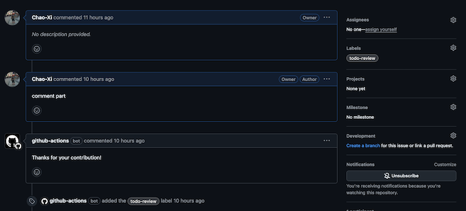

**Set Token Permissions to Write to Issues**

```
permissions:
      issues: write
```

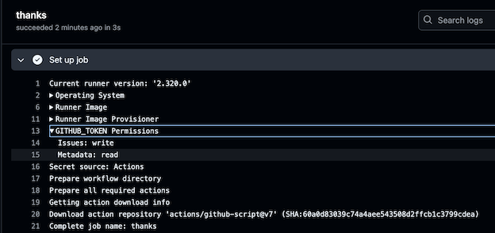

```
with:
   github-token: ${{ secrets.GITHUB_TOKEN }}
```

### 3-3 **Adding a Secret for an `OPENAI_API_KEY`**

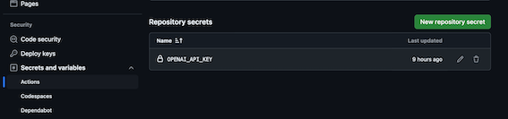

```
name: butler

on:
  issue_comment:
    types: [created]

permissions:
  pull-requests: write

jobs:
  chat:
    runs-on: ubuntu-latest
    steps:
      - uses: ca-dp/code-butler@v1
        with:
          GITHUB_TOKEN: ${{ secrets.GITHUB_TOKEN }}
          # OPENAI_API_URL: ${{ vars.OPENAI_API_URL }}
          OPENAI_API_KEY: ${{ secrets.OPENAI_API_KEY }}
          cmd: chat
          comment_body: ${{ github.event.comment.body }}
```


## 4 Publishing Artifacts


### 4-1 actions/upload-artifact

```
name: upper-capture

on:
  push:
    paths:
      - ".github/workflows/upper-capture.yml"
      - "upper/**"
  workflow_dispatch: # manual

jobs:
  capture:
    runs-on: macos-latest
    defaults:
      run:
        working-directory: upper
    steps:
      - uses: actions/checkout@v4
      - uses: actions/setup-go@v5
        with:
          go-version: 1.22
          cache-dependency-path: ./upper/go.sum
      - run: ls
      - run: go build
      - run: ls
      - run: go test -v
      - uses: actions/upload-artifact@v4
        with:
          path: ./upper/upper*
          name: build
```

[https://github.com/Chao-Xi/action-sample/actions/runs/11302253576/job/31437834265](https://github.com/Chao-Xi/action-sample/actions/runs/11302253576/job/31437834265)

```
- uses: actions/upload-artifact@v4
        with:
          path: ./upper/upper*
          name: build
```

[https://github.com/Chao-Xi/action-sample/actions/runs/11302382442/job/31438123876](https://github.com/Chao-Xi/action-sample/actions/runs/11302382442/job/31438123876)


### 4-2 Matrix Strategy for Runner OS

**upper-capture.yml**

```
name: upper-capture

on:
  push:
    paths:
      - ".github/workflows/upper-capture.yml"
      - "upper/**"
  workflow_dispatch: # manual

jobs:
  capture:
    strategy:
      matrix:
        os: [ ubuntu-latest, windows-latest, macos-12 ]
    runs-on: ${{ matrix.os }}
    defaults:
      run:
        working-directory: upper
    steps:
      - uses: actions/checkout@v4
      - uses: actions/setup-go@v5
        with:
          go-version: 1.22
          cache-dependency-path: ./upper/go.sum
      - run: ls
      - run: go build
      - run: ls
      - run: go test -v
      - uses: actions/upload-artifact@v4
        with:
          path: ./upper/upper*
          name: "build-${{ matrix.os }}"

```

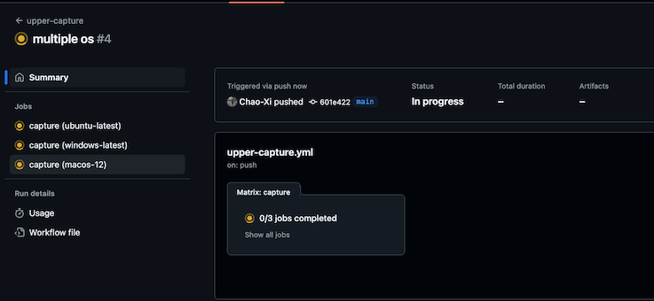

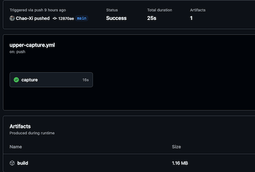


### 4-2 Matrix Strategy for Runner OS

```
name: upper-capture

on:
  push:
    paths:
      - ".github/workflows/upper-capture.yml"
      - "upper/**"
  workflow_dispatch: # manual

jobs:
  capture:
    strategy:
      matrix:
        os: [ ubuntu-latest, windows-latest, macos-12 ]
    runs-on: ${{ matrix.os }}
    defaults:
      run:
        working-directory: upper
    steps:
      - uses: actions/checkout@v4
      - uses: actions/setup-go@v5
        with:
          go-version: 1.22
          cache-dependency-path: ./upper/go.sum
      - run: ls
      - run: go build
      - run: ls
      - run: go test -v
      - uses: actions/upload-artifact@v4
        with:
          path: ./upper/upper*
          name: "build-${{ matrix.os }}"
```

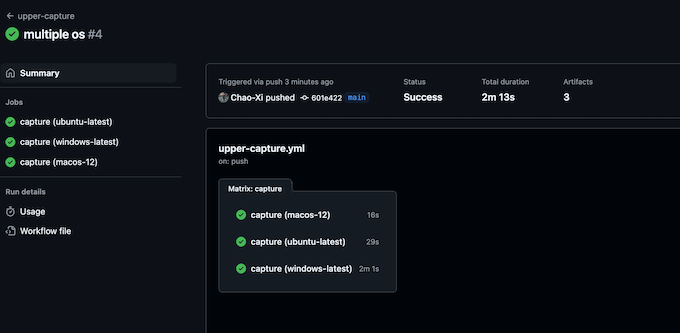

[https://github.com/Chao-Xi/action-sample/actions/runs/11302490544](https://github.com/Chao-Xi/action-sample/actions/runs/11302490544)

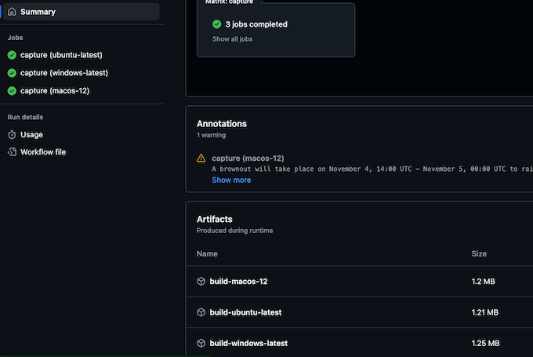

### 4-3 Using a Script to Cross Compile

**`build.xplat.sh`**

```
#!/bin/bash
set -e

echo "::group::Testing..."
go test -v
echo "::endgroup::"

APP_NAME=upper
OUTPUT_DIR=bin

mkdir -p $OUTPUT_DIR

platforms=("windows/amd64" "linux/amd64" "darwin/amd64")
for platform in "${platforms[@]}"
do
    platform_split=(${platform//\// })
    GOOS=${platform_split[0]}
    GOARCH=${platform_split[1]}
    output_name=$OUTPUT_DIR/$APP_NAME'-'$GOOS'-'$GOARCH
    if [ $GOOS = "windows" ]; then
        output_name+='.exe'
    fi

    echo "::group::Building $output_name..."
    go clean # remove prior build (triggers more logging too)
    env GOOS=$GOOS GOARCH=$GOARCH go build -x -o $output_name .
    echo "::endgroup::"

done

echo "::group::tree..."
tree
echo "::endgroup::"
```

**`upper-capture-script.yml`**

```
name: upper-cross

on:
  push:
    paths:
      - ".github/workflows/upper-capture-script.yml"
      - "upper/**"
  workflow_dispatch: # manual

jobs:
  cross:
    runs-on: ubuntu-latest
    defaults:
      run:
        working-directory: upper
    steps:
      - uses: actions/checkout@v4
      - uses: actions/setup-go@v5
        with:
          go-version: 1.22
          cache-dependency-path: ./upper/go.sum
      - run: ./build.xplat.sh
      - uses: actions/upload-artifact@v4
        with:
          path: ./upper/bin/upper*
          name: build
```

[https://github.com/Chao-Xi/action-sample/actions/runs/11302653121/job/31438797061](https://github.com/Chao-Xi/action-sample/actions/runs/11302653121/job/31438797061)

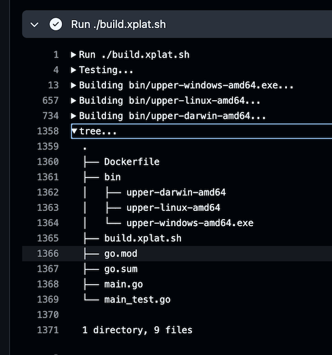

### 4-4 Creating a GitHub Release

**`upper-capture-tag.yml`**

```
name: upper-cross

on:
  push:
    paths:
      - ".github/workflows/upper-capture-tag.yml"
      - "upper/**"
  workflow_dispatch: # manual

jobs:
  cross:
    permissions:
      contents: write
    runs-on: ubuntu-latest
    defaults:
      run:
        working-directory: upper
    steps:
      - uses: actions/checkout@v4
      - uses: actions/setup-go@v5
        with:
          go-version: 1.22
          cache-dependency-path: ./upper/go.sum
      - run: ./build.xplat.sh
      - uses: softprops/action-gh-release@v2
        with:
          files: ./upper/bin/upper*
          body: "Binaries for the upper (go) command line tool!!!"
          tag_name: ${{ github.ref_name }}
        if: startsWith(github.ref_name, 'refs/tags/')
```

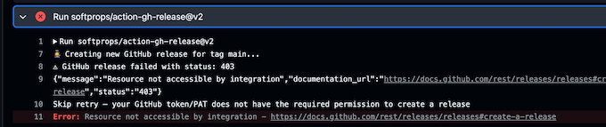


```
cross:
    permissions:
      contents: write
```


[https://github.com/Chao-Xi/action-sample/actions/runs/11302862521/job/31439286571](https://github.com/Chao-Xi/action-sample/actions/runs/11302862521/job/31439286571)

```
Run softprops/action-gh-release@v2
👩‍🏭 Creating new GitHub release for tag main...
⬆️ Uploading upper-windows-amd64.exe...
⬆️ Uploading upper-linux-amd64...
⬆️ Uploading upper-darwin-amd64...
🎉 Release ready at https://github.com/Chao-Xi/action-sample/releases/tag/main
```

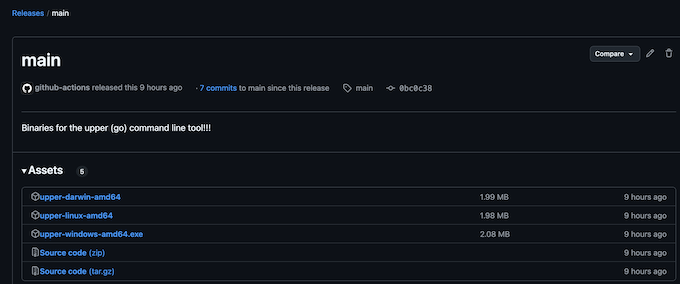

**Release on Tags Only**

**add new tag**

**`if: startsWith(github.ref_name, 'refs/tags/')`**

```
$ git tag v1.1.0


$ git tag
v1.0.0
v1.1.0
v4.0.1

$ git push --tags
```

[https://github.com/Chao-Xi/action-sample/actions/runs/11303044702/job/31439694800](https://github.com/Chao-Xi/action-sample/actions/runs/11303044702/job/31439694800)


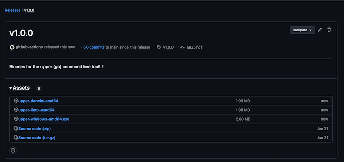


[https://github.com/Chao-Xi/action-sample/releases](https://github.com/Chao-Xi/action-sample/releases)

### Workflow Status Badges


**docker build #1**


[https://github.com/Chao-Xi/action-sample/actions/runs/11303941783](https://github.com/Chao-Xi/action-sample/actions/runs/11303941783)

```
name: upper-images

on:
  push:
    paths:
      - ".github/workflows/upper-images.yml"
      - "upper/**"
  workflow_dispatch: # manual

permissions:
  packages: write
  contents: read # not needed in public repos

jobs:
  image:
    runs-on: ubuntu-latest
    steps:
      - uses: actions/checkout@v4
      - run: docker version
      - run: docker image build -t upper .
        working-directory: ./upper
      - name: test it
        run: docker container run upper hello wes
```

```
Run docker container run upper hello wes
HELLO WES
```

### Workflow Status Badges

```
[](https://github.com/Chao-Xi/action-sample/actions/workflows/upper-capture-tag.yml)
```

[](https://github.com/Chao-Xi/action-sample/actions/workflows/upper-capture-tag.yml)


### Check docker registry variables

```
name: Print environment variables

on:
  workflow_dispatch:

jobs:
  debug:
    runs-on: ubuntu-latest

    steps:
      - name: Print
        run: env | sort
```

[https://github.com/Chao-Xi/action-sample/actions/runs/11304271867/job/31442445265](https://github.com/Chao-Xi/action-sample/actions/runs/11304271867/job/31442445265)

```
...
GITHUB_REPOSITORY=Chao-Xi/action-sample
GITHUB_REPOSITORY_ID=870117297
GITHUB_REPOSITORY_OWNER=Chao-Xi
...
```

### Push the Image to ghcr.io to Create a Package

```
name: upper-images

on:
  push:
    paths:
      - ".github/workflows/upper-images.yml"
      - "upper/**"
  workflow_dispatch: # manual

permissions:
  packages: write
  contents: read # not needed in public repos

jobs:
  image:
    runs-on: ubuntu-latest
    steps:
      - uses: actions/checkout@v4
      - run: docker version
      - run: docker image build -t upper .
        working-directory: ./upper
      - name: test it
        run: docker container run upper hello wes
      - uses: docker/login-action@v3
        with:
          registry: ghcr.io
          username: ${{ github.repository_owner }} # Chao-Xi
          password: ${{ secrets.GITHUB_TOKEN }}
      - run: docker tag upper ghcr.io/chao-xi/upper:latest
      - run: docker tag upper ghcr.io/chao-xi/upper:${{ github.ref_name }}
      - run: docker push ghcr.io/chao-xi/upper:latest
      - run: docker push ghcr.io/chao-xi/upper:${{ github.ref_name }}
```

[https://github.com/Chao-Xi/action-sample/actions/runs/11304324230/job/31442561439](https://github.com/Chao-Xi/action-sample/actions/runs/11304324230/job/31442561439)


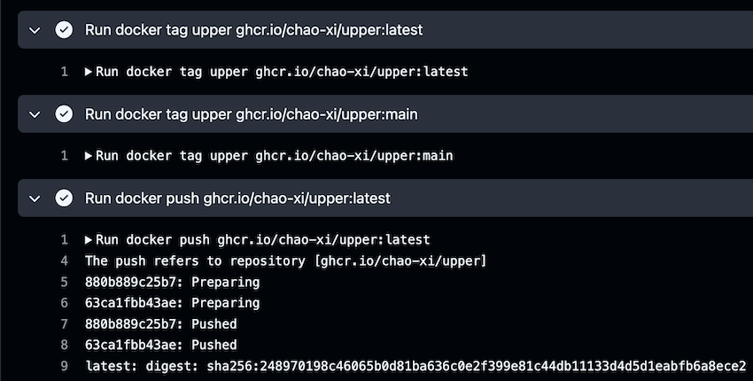

[https://github.com/Chao-Xi/action-sample/actions/runs/11304324230](https://github.com/Chao-Xi/action-sample/actions/runs/11304324230)

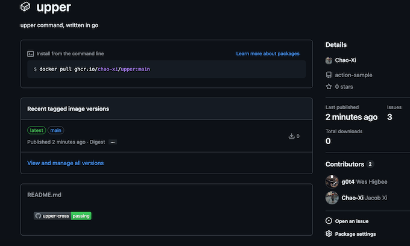


```
$ docker run --rm -i -t ghcr.io/chao-xi/
upper:latest test test test
Unable to find image 'ghcr.io/chao-xi/upper:latest' locally
latest: Pulling from chao-xi/upper
43c4264eed91: Already exists 
46d22ddfd777: Pull complete 
Digest: sha256:248970198c46065b0d81ba636c0e2f399e81c44db11133d4d5d1eabfb6a8ece2
Status: Downloaded newer image for ghcr.io/chao-xi/upper:latest
TEST TEST TEST
```


### Push the Image to ghcr.io to Create a Package

[https://github.com/Chao-Xi/action-sample/actions/workflows/upper-capture-tag.yml](https://github.com/Chao-Xi/action-sample/actions/workflows/upper-capture-tag.yml)

```
$ git push tag v1.1.1

$ git push --tags 

Total 0 (delta 0), reused 0 (delta 0), pack-reused 0
To github.com:Chao-Xi/action-sample.git
 * [new tag]         v1.1.1 -> v1.1.1
```

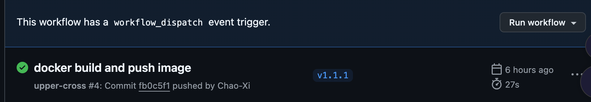


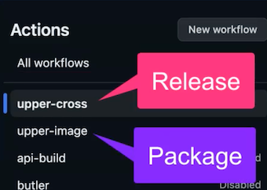

* https://github.com/Chao-Xi/action-sample/actions/runs/11304435072
* https://github.com/Chao-Xi/action-sample/actions/workflows/upper-images.yml

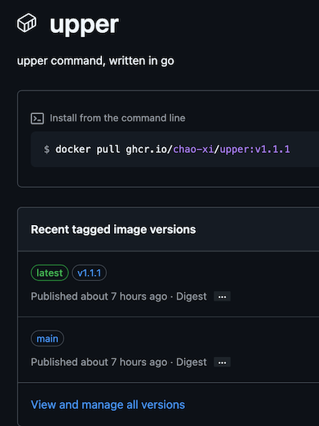

## 5 Deployment Pipelines

### 5-1 Building an Image for the dotnet Web API

[https://github.com/Chao-Xi/action-sample/tree/main/api](https://github.com/Chao-Xi/action-sample/tree/main/api)

**compose.yaml**

```
services:
  api:
    image: nyjxi/actions-web:latest
    build:
      context: .
      target: runner
      platforms:
        - linux/amd64
    ports:
      - 8080:80
```

**build-only.sh**

```
#!/bin/bash

my_app_version=$(git describe --tag)

docker compose build --pull --build-arg "MY_APP_VERSION=$my_app_version"
```

**build-push.sh**

```
#!/bin/bash

./build-only.sh
docker compose push
```

### 5-2 Workflow to Push an Image to Docker Hub

**cd.yaml**

```
name: cd

on:
  push:
    paths:
      - ".github/workflows/cd.yml"
      - "api/**"
  workflow_dispatch: # manual

jobs:
  build:
    runs-on: ubuntu-latest
    steps:
      - uses: actions/checkout@v4
        with:
          fetch-depth: 0 # all commits, so we can generate version off of tags/commit sha...
      - uses: docker/setup-buildx-action@v3
      - run: docker buildx ls
      - uses: docker/login-action@v3
        with:
          username: ${{ secrets.DOCKERHUB_USERNAME }}
          password: ${{ secrets.DOCKERHUB_PASS }}
      - run: ./build-push.sh # can reuse local build scripts for CI/CD
        working-directory: api
        name: push to docker hub
```

```
username: ${{ secrets.DOCKERHUB_USERNAME }}
password: ${{ secrets.DOCKERHUB_PASS }}
```

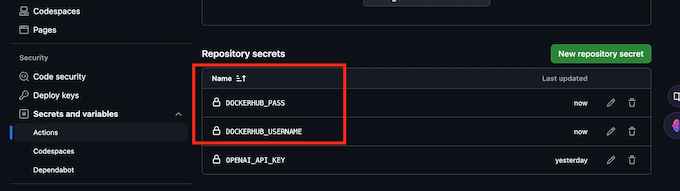

[https://github.com/Chao-Xi/action-sample/actions/runs/11310904227](https://github.com/Chao-Xi/action-sample/actions/runs/11310904227)

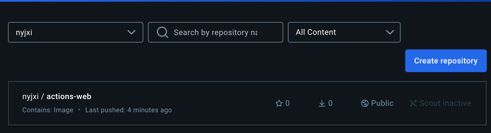


### 5-3 Production Environment Requires Approval to Deploy

```
deploy:
  runs-on: ubuntu-latest
  environment:
    name: production
```

Add environment: production

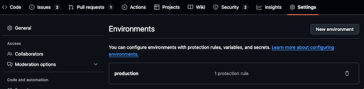

Add environment: secret

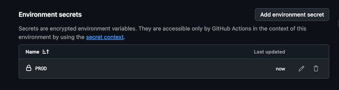

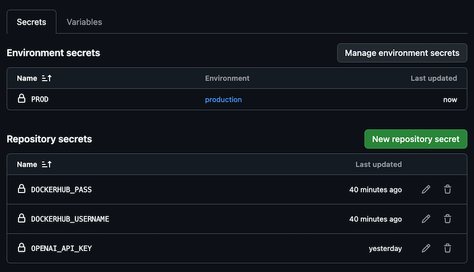

```
...
  deploy:
    runs-on: ubuntu-latest
    environment:
      name: production
      url: ${{ steps.deploy.outputs.webapp-url }}
    # needs: build
    steps:
      - uses: azure/login@v2
        with:
          creds: ${{ secrets.PROD }}
```

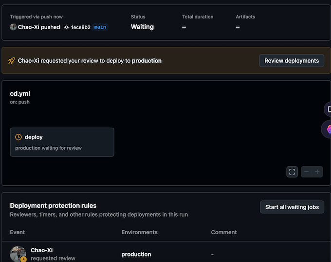

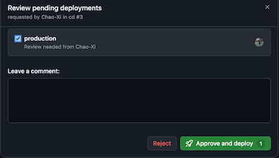

### 5-4 azure/webapps-deploy Action

```
...
  deploy:
    runs-on: ubuntu-latest
    environment:
      name: production
      url: ${{ steps.deploy.outputs.webapp-url }}
    # needs: build
    steps:
      - uses: azure/login@v2
        with:
          creds: ${{ secrets.PROD }}
      - uses: azure/webapps-deploy@v3
        id: deploy
        with:
          app-name: gh-actions-web-api
          images: weshigbee/actions-web:latest
          resource-group-name: gh-actions
```

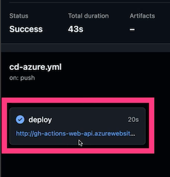

### 5-5 The Entire CD Pipeline Works!

```
name: cd

on:
  push:
    paths:
      - ".github/workflows/cd.yml"
      - "api/**"
  workflow_dispatch: # manual

jobs:
  build:
    runs-on: ubuntu-latest
    steps:
      - uses: actions/checkout@v4
        with:
          fetch-depth: 0 # all commits, so we can generate version off of tags/commit sha...
      - uses: docker/setup-buildx-action@v3
      - run: docker buildx ls
      - uses: docker/login-action@v3
        with:
          username: ${{ secrets.DOCKERHUB_USERNAME }}
          password: ${{ secrets.DOCKERHUB_PASS }}
      - run: ./build-push.sh # can reuse local build scripts for CI/CD
        working-directory: api
        name: push to docker hub
  deploy:
    runs-on: ubuntu-latest
    environment:
      name: production
      url: ${{ steps.deploy.outputs.webapp-url }}
    needs: build
    steps:
      - uses: azure/login@v2
        with:
          creds: ${{ secrets.PROD }}
      - uses: azure/webapps-deploy@v3
        id: deploy
        with:
          app-name: gh-actions-web-api
          images: weshigbee/actions-web:latest
          resource-group-name: gh-actions
```

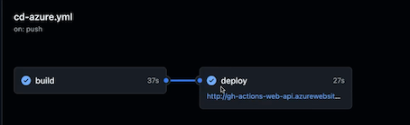

### 5-6 Triggering a New Workflow on Deployment Created

**`cd-on-deploy.yml`**

```
name: cd-on-deploy

on:
  deployment: # trigger when a deployment is created

jobs:
  alerts:
    runs-on: ubuntu-latest
    steps:
      - run: echo "sending slack alert to get deploy approved..."
      - run: echo "${{ toJson(github.event) }}"
```

[https://github.com/Chao-Xi/action-sample/actions/runs/11311547429/job/31457914181](https://github.com/Chao-Xi/action-sample/actions/runs/11311547429/job/31457914181)

[https://github.com/Chao-Xi/action-sample/actions/runs/11311544551](https://github.com/Chao-Xi/action-sample/actions/runs/11311544551)

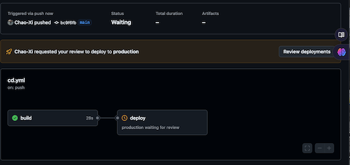

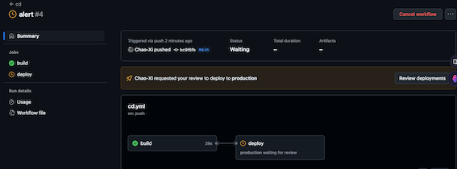


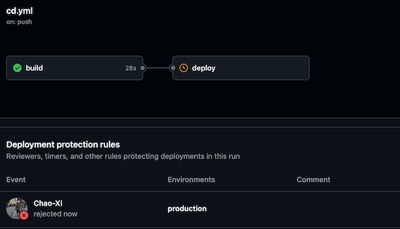


### Passing Environment Variables with `GITHUB_ENV` Environment File

`integration-tests.yml`

```
name: integration-tests

on:
  push:
    paths:
      - ".github/workflows/integration-tests.yml"
  workflow_dispatch: # manual

jobs:
  generate:
    outputs:
      RANDOM_PASSWORD: ${{ env.RANDOM_PASSWORD }}
    runs-on: ubuntu-latest
    steps:
      - run: env | sort
      - run: echo "RANDOM_PASSWORD=$(LC_ALL=C tr -dc A-Za-z0-9 </dev/urandom | head -c 12)" >> "$GITHUB_ENV"
      - run: echo "$RANDOM_PASSWORD / ${{ env.RANDOM_PASSWORD }}"
      - run: env | sort
      # - run: mysql ... -p $RANDOM_PASSWORD
```

[https://github.com/Chao-Xi/action-sample/actions/runs/11311660841](https://github.com/Chao-Xi/action-sample/actions/runs/11311660841)

[https://github.com/Chao-Xi/action-sample/actions/runs/11311660841/job/31458165238](https://github.com/Chao-Xi/action-sample/actions/runs/11311660841/job/31458165238)

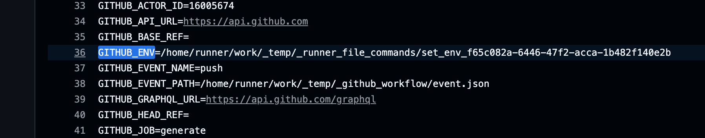

### Passing Outputs between Dependent Jobs

**`integration-tests.yml`**

```
name: integration-tests

on:
  push:
    paths:
      - ".github/workflows/integration-tests.yml"
  workflow_dispatch: # manual

jobs:
  generate:
    outputs:
      RANDOM_PASSWORD: ${{ env.RANDOM_PASSWORD }}
    runs-on: ubuntu-latest
    steps:
      - run: env | sort
      - run: echo "RANDOM_PASSWORD=$(LC_ALL=C tr -dc A-Za-z0-9 </dev/urandom | head -c 12)" >> "$GITHUB_ENV"
      - run: echo "$RANDOM_PASSWORD / ${{ env.RANDOM_PASSWORD }}"
      - run: env | sort
      # - run: mysql ... -p $RANDOM_PASSWORD
  testing:
    runs-on: ubuntu-latest
    needs: generate
    steps:
       - run: echo "${{ needs.generate.output.RANDOM_PASSWORD }}"
```

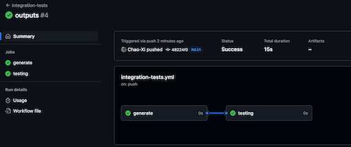

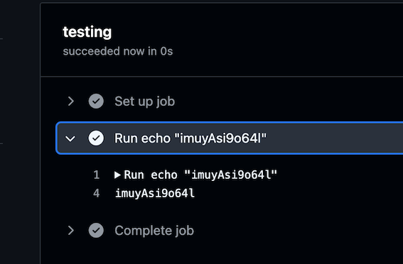

### Using a Job Container to Provide the MySQL CLI

```
name: integration-tests

on:
  push:
    paths:
      - ".github/workflows/integration-tests.yml"
  workflow_dispatch: # manual

jobs:
  generate:
    outputs:
      RANDOM_PASSWORD: ${{ env.RANDOM_PASSWORD }}
    runs-on: ubuntu-latest
    steps:
      - run: env | sort
      - run: echo "RANDOM_PASSWORD=$(LC_ALL=C tr -dc A-Za-z0-9 </dev/urandom | head -c 12)" >> "$GITHUB_ENV"
      - run: echo "$RANDOM_PASSWORD / ${{ env.RANDOM_PASSWORD }}"
      - run: env | sort
      # - run: mysql ... -p $RANDOM_PASSWORD
  testing:
    runs-on: ubuntu-latest
    needs: generate
    container:
      image: mysql:8.4
    steps:
       - run: echo "${{ needs.generate.outputs.RANDOM_PASSWORD }}"
       - run: mysql --version
```

[https://github.com/Chao-Xi/action-sample/actions/runs/11311814333](https://github.com/Chao-Xi/action-sample/actions/runs/11311814333)


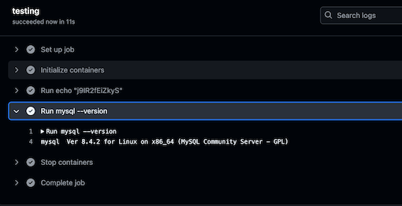

### Connecting to a MySQL Service Container!

```
name: integration-tests

on:
  push:
    paths:
      - ".github/workflows/integration-tests.yml"
  workflow_dispatch: # manual

jobs:
  generate:
    outputs:
      RANDOM_PASSWORD: ${{ env.RANDOM_PASSWORD }}
    runs-on: ubuntu-latest
    steps:
      - run: env | sort
      - run: echo "RANDOM_PASSWORD=$(LC_ALL=C tr -dc A-Za-z0-9 </dev/urandom | head -c 12)" >> "$GITHUB_ENV"
      - run: echo "$RANDOM_PASSWORD / ${{ env.RANDOM_PASSWORD }}"
      - run: env | sort
      # - run: mysql ... -p $RANDOM_PASSWORD
  testing:
    runs-on: ubuntu-latest
    needs: generate
    container:
      image: mysql:8.4
    services:
      mysqlserver:
        image: mysql:8.4
        env:
          MYSQL_ROOT_PASSWORD: ${{ needs.generate.outputs.RANDOM_PASSWORD }}
          MYSQL_DATABASE: foothebar
        options: --health-cmd="mysqladmin ping" --health-interval=10s --health-timeout=5s --health-retries=3
    steps:
      - run: echo "${{ needs.generate.outputs.RANDOM_PASSWORD }}"
      - run: mysql --version
      - run: mysql -h mysqlserver -u root -p${{ needs.generate.outputs.RANDOM_PASSWORD }} -e "SHOW DATABASES;"
      - run: echo "job.services= ${{ toJson(job.services)}}"
      - run: echo "job.container= ${{ toJson(job.container)}}"
```

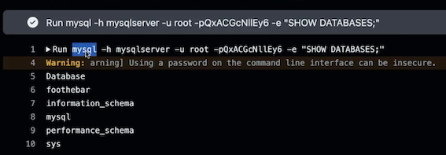

### Setting up a CodeQL Workflow

[https://github.com/Chao-Xi/action-sample/settings/security_analysis](https://github.com/Chao-Xi/action-sample/settings/security_analysis)


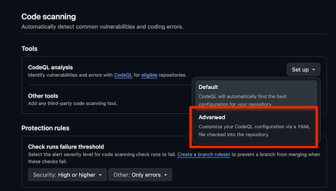

[https://github.com/Chao-Xi/action-sample/blob/main/.github/workflows/codeql.yml](https://github.com/Chao-Xi/action-sample/blob/main/.github/workflows/codeql.yml)

```
name: "CodeQL Advanced"

on:
  push:
    paths:
      - ".github/workflows/codeql.yml"
      - "api/*"
  workflow_dispatch: # manual

jobs:
  analyze:
    name: Analyze (${{ matrix.language }})
    # Runner size impacts CodeQL analysis time. To learn more, please see:
    #   - https://gh.io/recommended-hardware-resources-for-running-codeql
    #   - https://gh.io/supported-runners-and-hardware-resources
    #   - https://gh.io/using-larger-runners (GitHub.com only)
    # Consider using larger runners or machines with greater resources for possible analysis time improvements.
    runs-on: ${{ (matrix.language == 'swift' && 'macos-latest') || 'ubuntu-latest' }}
    permissions:
      # required for all workflows
      security-events: write

      # required to fetch internal or private CodeQL packs
      packages: read

      # only required for workflows in private repositories
      actions: read
      contents: read

    strategy:
      fail-fast: false
      matrix:
        include:
        - language: csharp
          build-mode: autobuild
        - language: go
          build-mode: autobuild
        # CodeQL supports the following values keywords for 'language': 'c-cpp', 'csharp', 'go', 'java-kotlin', 'javascript-typescript', 'python', 'ruby', 'swift'
        # Use `c-cpp` to analyze code written in C, C++ or both
        # Use 'java-kotlin' to analyze code written in Java, Kotlin or both
        # Use 'javascript-typescript' to analyze code written in JavaScript, TypeScript or both
        # To learn more about changing the languages that are analyzed or customizing the build mode for your analysis,
        # see https://docs.github.com/en/code-security/code-scanning/creating-an-advanced-setup-for-code-scanning/customizing-your-advanced-setup-for-code-scanning.
        # If you are analyzing a compiled language, you can modify the 'build-mode' for that language to customize how
        # your codebase is analyzed, see https://docs.github.com/en/code-security/code-scanning/creating-an-advanced-setup-for-code-scanning/codeql-code-scanning-for-compiled-languages
    steps:
    - name: Checkout repository
      uses: actions/checkout@v4

    # Initializes the CodeQL tools for scanning.
    - name: Initialize CodeQL
      uses: github/codeql-action/init@v3
      with:
        languages: ${{ matrix.language }}
        build-mode: ${{ matrix.build-mode }}
        queries: "+security-and-quality"
        # If you wish to specify custom queries, you can do so here or in a config file.
        # By default, queries listed here will override any specified in a config file.
        # Prefix the list here with "+" to use these queries and those in the config file.

        # For more details on CodeQL's query packs, refer to: https://docs.github.com/en/code-security/code-scanning/automatically-scanning-your-code-for-vulnerabilities-and-errors/configuring-code-scanning#using-queries-in-ql-packs
        # queries: security-extended,security-and-quality

    # If the analyze step fails for one of the languages you are analyzing with
    # "We were unable to automatically build your code", modify the matrix above
    # to set the build mode to "manual" for that language. Then modify this step
    # to build your code.
    # ℹ️ Command-line programs to run using the OS shell.
    # 📚 See https://docs.github.com/en/actions/using-workflows/workflow-syntax-for-github-actions#jobsjob_idstepsrun
    - if: matrix.build-mode == 'manual'
      shell: bash
      run: |
        echo 'If you are using a "manual" build mode for one or more of the' \
          'languages you are analyzing, replace this with the commands to build' \
          'your code, for example:'
        echo '  make bootstrap'
        echo '  make release'
        exit 1

    - name: Perform CodeQL Analysis
      uses: github/codeql-action/analyze@v3
      with:
        category: "/language:${{matrix.language}}"
```

[https://github.com/Chao-Xi/action-sample/actions/runs/11314646150](https://github.com/Chao-Xi/action-sample/actions/runs/11314646150)

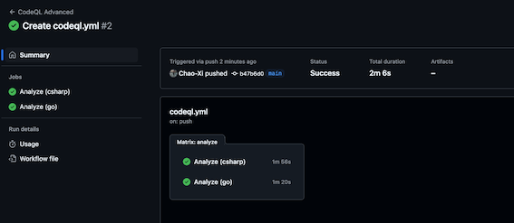


### Alerts from the security-and-quality Suite
