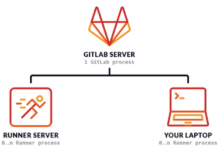

# **1 GitLab Runner 简介**

## **GitLab Runner 简介**

* `GitLab Runner`是一个开源项目，用于运行作业并将结果发送回GitLab0 
* 与`GitLabCI`结合使用，`GitLabCI`是`GitLab`随附的用于协调作业的开源持续集成服务。 
* GitLab Runner是用Go编写的，可以在Linux, macOS和Windows操作系统上运行。 
* 容器部署需使用最新Docker版本。`GitLab Runner`需要最少的`Docker V1.13.0`。 
* **GitLab Runner版本应与GitLab版本同步**。（避免版本不一致导致差异化） 
* 可以根据需要配置任意数量的 Runner

**GitLab Runner类似于Jenkins的agent，执行CI持续集成、构建的脚本任务。** 

## **GitLab Runner 简介**

* **作业运行控制**：同时执行多个作业。 

* **作业运行环境：** 

	* 在本地、使用Docker容器、使用Docker容器并通过SSH执行作业。 
	* 使用Docker容器在不同的云和虚拟化管理程序上自动缩放。 
	* 连接到远程SSH服务器。 

* 支持Bash, Windows Batch和Windows PowerShell。 
* 允许自定义作业运行环境。 
* 自动重新加载配置，无需重启。 
* 易于安装，可作为Linux, macOS和Windows的服务。 

 
## **GitLab Runner 类型与状态**
 
**类型** 

* **shared共享类型，运行整个平台项目的作业（gitlab)**
* group项目组类型，运行特定group下的所有项目的作业（group)
* specific项目类型，运行指定的项目作业（project) 

**状态** 

* locked：锁定状态，无法运行项目作业 
* **paused：暂停状态，暂时不会接受新的作业** 

