# **2 GitLab Runner安装注册配置管理**

GitLab Runner是一个开源项目，用于运行您的作业并将结果发送回GitLab。它与GitLab CI结合使用，GitLab CI是GitLab随附的用于协调作业的开源持续集成服务。


## **安装要求**

GitLab Runner是用Go编写的，可以作为一个二进制文件运行，不需要特定于语言的要求。它旨在在GNU / Linux，macOS和Windows操作系统上运行。只要您可以在其他操作系统上编译Go二进制文件，其他操作系统就可能会运行。
如果要使用Docker，请安装最新版本。`GitLab Runner`需要最少的`Docker v1.13.0`。

`GitLab Runner`版本应与`GitLab`版本同步。

可以在GNU / Linux，macOS，FreeBSD和Windows上安装和使用GitLab Runner 。您可以使用Docker安装它，手动下载二进制文件，也可以使用GitLab提供的rpm / deb软件包的存储库。


**Add GitLab's official repository：添加官方仓库**

```
# For Debian/Ubuntu/Mint 
curl -L https://packages.gitlab.com/install/repositories/runner/ditlab-runner/script.deb.sh | sudo bash

# For RHEL/CentOS/Fedora 
curl -L https://packages.gitlab.com/install/repositorles/runner/gatlab-runner/script.rpm.sh | sudo bash
```

**Install the test vers!on of GitLab Runner: 安装最新版本**

``` 
#For Debian/Ubuntu/Mint 
sudo apt-get install gitlab-runner 


#For RHEL/Centos/Fedora 
sudo yum install gitlab-runner 
```

**更新runner** 

```
#For Debian/Ubuntu/Mint 
sudo apt-get update
sudo apt-get install gitlab-runner 

#For RHEL/CentOS/Fedora 
sudo  yum  update 
sudo install gitlab-runner 
```

**To install a specific version of GitLab Runner 安装指定版本** 

```
#for DEB based systems 
apt-cache madison gitlab-runner 
sudo apt-get install gitlab-runner=10.0.0 

#for RPM based systems 
yum list gitlab-runner --showduplicates | sort -r
sudo yum install gitlab-runner-10.0.0-1 
```

### **基于centos安装**

**下载软件包**

* `https://gitlab-runner-downloads.s3.amazonaws.com/latest/index.html`上找到最新的文件名和选项。 
* 选择一个版本并下载二进制文件，如文档所述，该文件**_用于下载任何其他标记的_**GitLab Runner发行版。 

```
curl -LJO https://gitlab-runner-downloads.s3.amazonaws.com/latest/deb/gitlab-runner_<arch>.deb

dpkg -i gitlab-runner_<arch>.deb

dpkg -i gitlab-runner_<arch>.deb
```

```
curl -LJO https://gitlab-runner-downloads.s3.amazonaws.com/latest/rpm/gitlab-runner_<arch>.rpm

rpm -i gitlab-runner_<arch>.rpm

rpm -Uvh gitlab-runner_<arch>.rpm
```


### **Gitlab runner安装二进制文件**

```
#Linux x86-64 
sudo curl -L -output /usr/local/bin/gitlab-runner https://gitiab-runner-downloads.s3.amazonaws.com/latest/binaries/gitlab-runner-linux-amd64 

#Linux x86 
sudo curl -L -output /usr/local/bin/gitlab-runner https://gitiab-runner-downloads.s3.amazonaws.com/latest/binaries/gitlab-runner-linux-386
 
#Linux arm 
sudo curl -L -output /usr/local/bin/gitlab-runner https://gitiab-runner-downloads.s3.amazonaws.com/latest/binaries/gitlab-runner-linux-arm


#Linux arm64 
sudo curl -L -output /usr/local/bin/gitlab-runner https://gitiab-runner-downloads.s3.amazonaws.com/latest/binaries/gitlab-runner-linux-arm64
```


### **基于macos系统安装**

* 手动安装

**下载二进制**

```
sudo curl --output /usr/local/bin/gitlab-runner https://gitlab-runner-downloads.s3.amazonaws.com/v12.6/binaries/gitlab-runner-darwin-amd64
```

**授予其执行权力**

```
sudo chmod +x /usr/local/bin/gitlab-runner
```

**将runner作为服务安装并启动它**

```
gitlab-runner install
gitlab-runner start
```

* 自动安装

**安装，启动**

```
brew install gitlab-runner 
brew services start gitlab-runner 
```


**更新**


```
gitlab-runner stop 

sudo curl --output /usr/local/bin/gitlab-runner https://gitlab-runner-downloads.s3.amazonaws.com/v12.6/binaries/gitlab-runner-darwin-amd64
 
sudo chrnod +x /usr/local/bin/gitlab-runner 
gitlab-runner start 
```


### **基于Docker运行**

```
mkdir ~/data/gitlab-runner/config
docker run --rm -t -id -v  ~/data/gitlab-runner/config:/etc/gitlab-runner gitlab/gitlab-runner:v15.1.0
```


### **安装总结**

Linux：在清华源下载`runner rpm`包/配置`yum`源安装。

```
https://mirrors.tuna.tsinghua.edu.cn/gitlab-runner/yum/el7/gitlab-runner-12.9.0-1.x86_64.rpm
```

### **我的实验**

```
mkdir ~/k8s_test/gitlab/runner-config

docker run --rm -t -id -v  ~/k8s_test/gitlab/runner-config:/etc/gitlab-runner gitlab/gitlab-runner:latest

```

```
$ docker ps | grep gitlab-runner
b55224151446   gitlab/gitlab-runner:latest   "/usr/bin/dumb-init …"   3 minutes ago   Up 3 minutes             inspiring_merkle

docker exec -it b55224151446 sh

# gitlab-runner -h 
NAME:
   gitlab-runner - a GitLab Runner

USAGE:
   gitlab-runner [global options] command [command options] [arguments...]

VERSION:
   15.1.0 (76984217)

AUTHOR:
   GitLab Inc. <support@gitlab.com>

COMMANDS:
     exec                  execute a build locally
     list                  List all configured runners
     run                   run multi runner service
     register              register a new runner
     install               install service
     uninstall             uninstall service
 ...
```

## **2 GitLab Runner注册**

* **注册步骤：**
	* **`获取 runner token -› 进行注册`**

* **GitLabRunner 类型**
	* **shared**：运行整个平台项目的作业(gitlab)
	* **group**: 运行特定group下的所有项目的作业(group)
	* **specific**：运行指定的项目作业(project)
	* **locked： 无法运行项目作业**
	* **paused： 不会运行作业**

	
### **2-1  获取注册token-shared类型**

获取 `shared` 类型 `runnertoken`

进入系统设置-＞ Runners

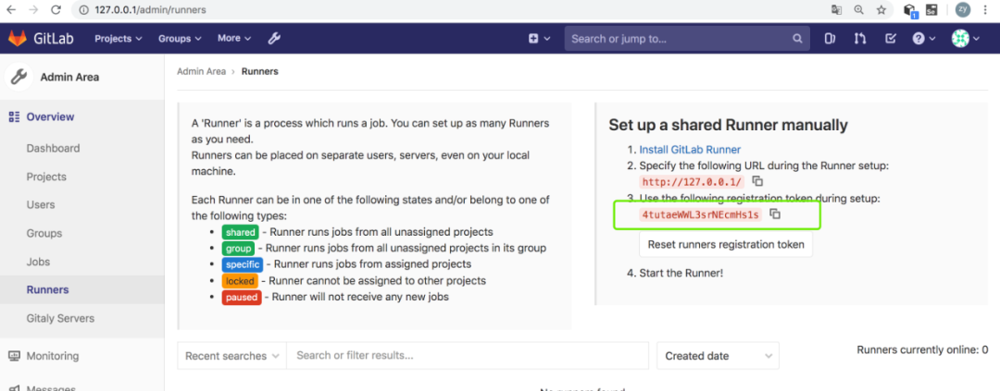


### **2-2 获取group类型的runnertoken**

**进入group -> Settings -> CI/CD -> Runners -> Group Runners**

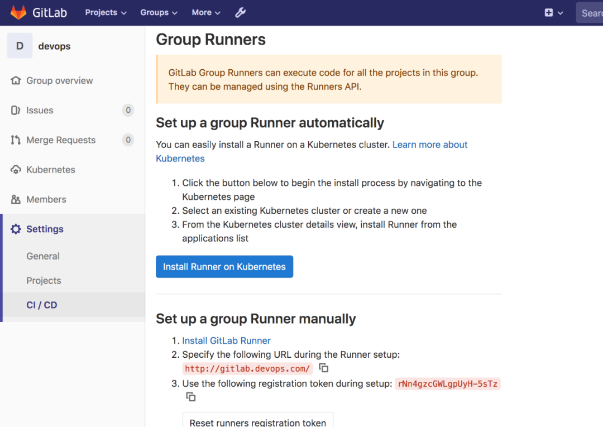

### **2-3 获取注册token-specific类型**

**进入具体的项目 -> Settings -> CI/CD -> Runners -> Specific Runners**

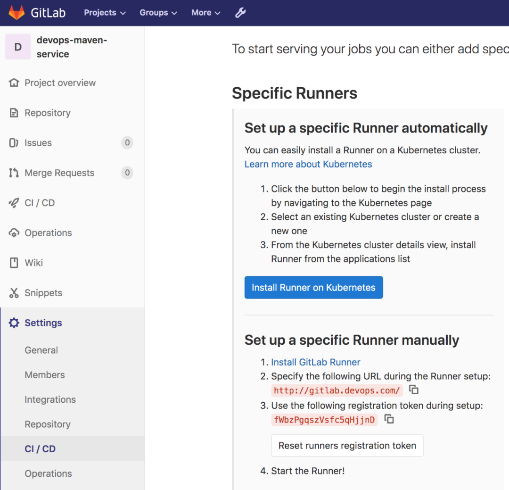

### **进行注册-交互式**

**`http://127.0.0.1:32220`**

启动容器交互式注册

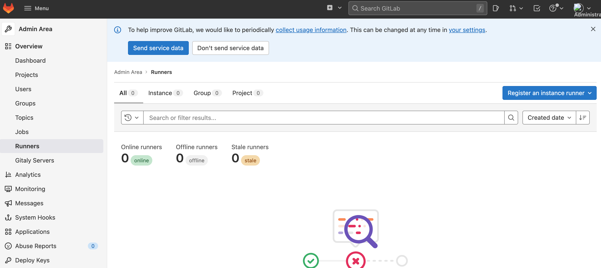

* `http://127.0.0.1:32220/`
* `nzTshoYwsnCttkyzZBxE`
* `devops-service-runner`
* `build`

```
docker run -it  -v  ~/data/gitlab-runner/config:/etc/gitlab-runner --network=host gitlab/gitlab-runner:v15.1.0 register
```

* **`--network=host` 是关键中的关键，因为你要访问本地的localhost**

```
$ docker run -it  --rm -v  ~/k8s_test/gitlab/runner-config:/etc/gitlab-runner --network=host  --restart=always gitlab/gitlab-runner:v15.1.0 register
Runtime platform                                    arch=amd64 os=linux pid=7 revision=76984217 version=15.1.0
Running in system-mode.                            
                                                   
Enter the GitLab instance URL (for example, https://gitlab.com/):
http://127.0.0.1:32220/
Enter the registration token:
nzTshoYwsnCttkyzZBxE
Enter a description for the runner:
[docker-desktop]: devops-service-runner
Enter tags for the runner (comma-separated):
build,deploy
Enter optional maintenance note for the runner:
n
Registering runner... succeeded                     runner=nzTshoYw
Enter an executor: custom, docker, parallels, ssh, docker+machine, kubernetes, docker-ssh, shell, virtualbox, docker-ssh+machine:
shell   
Runner registered successfully. Feel free to start it, but if it's running already the config should be automatically reloaded!
```

```
$ docker run -it -v  ~/k8s_test/gitlab/runner-config:/etc/gitlab-runner --network=host  --restart=always gitlab/gitlab-runner:v15.1.0 register
```

* Enter the GitLab instance URL (for example, https://gitlab.com/):
	* 输入gitlab的服务URL
* Enter the registration token:
	* 输入令牌,参考上图
* Enter a description for the runner:
	* 输入Runner描述
* Enter tags for the runner (comma-separated)
	* 给这个gitlab-runner输入一个标记，这个tag非常重要，在后续的使用过程中需要使用这个tag来指定gitlab-runner（yml文件，job通过设置tags标签选用指定的Runner)
* Enter optional maintenance note for the runner:
	* 输入可选维护说明: Enter an executor: docker+machine, docker-ssh+machine, custom, docker-windows, docker-ssh, ssh, kubernetes, docker, parallels, shell, virtualbox:

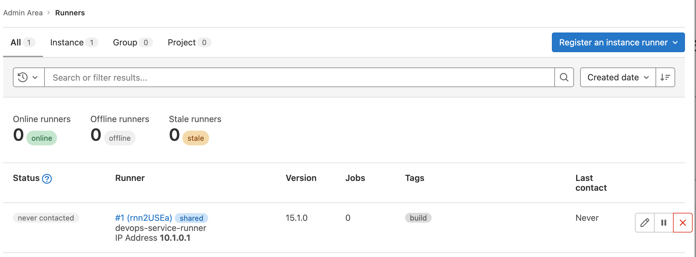

```
$ docker exec -it aed10f1e614c sh
# gitlab-runner run 
Runtime platform                                    arch=amd64 os=linux pid=21 revision=76984217 version=15.1.0
Starting multi-runner from /etc/gitlab-runner/config.toml...  builds=0
Running in system-mode.                            
                                                   
Configuration loaded                                builds=0
listen_address not defined, metrics & debug endpoints disabled  builds=0
[session_server].listen_address not defined, session endpoints disabled  builds=0
ERROR: Checking for jobs... forbidden               runner=faDQf6_F
ERROR: Checking for jobs... forbidden               runner=MsUXFgx3
ERROR: Checking for jobs... forbidden               runner=faDQf6_F
ERROR: Checking for jobs... forbidden               runner=MsUXFgx3
ERROR: Checking for jobs... forbidden               runner=faDQf6_F
ERROR: Runner http://127.0.0.1:32220/faDQf6_F1G4Ai1bM3yet is not healthy and will be disabled! 
ERROR: Checking for jobs... forbidden               runner=MsUXFgx3
ERROR: Runner http://127.0.0.1:32220/MsUXFgx3dnRHknKssGoS is not healthy and will be disabled! 
```

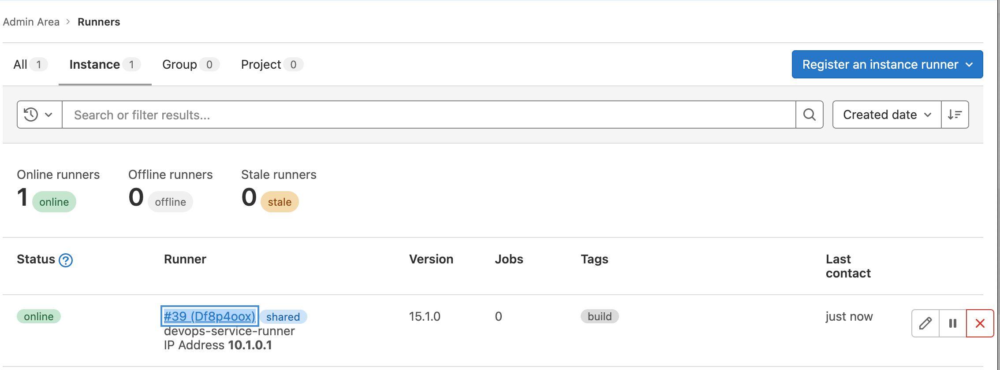

* **http://localhost:32220/admin/runners/39**
* http://localhost:32220/admin/runners/39/edit

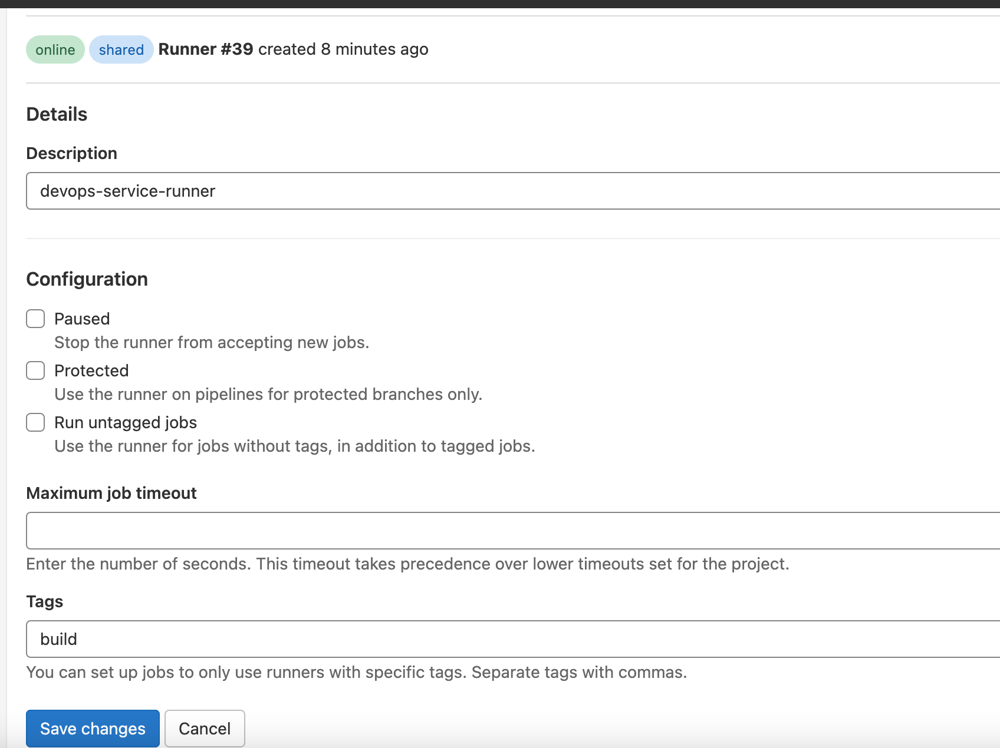

### **执行器功能对比表**

* Shell
* Docker
* Kubernetes

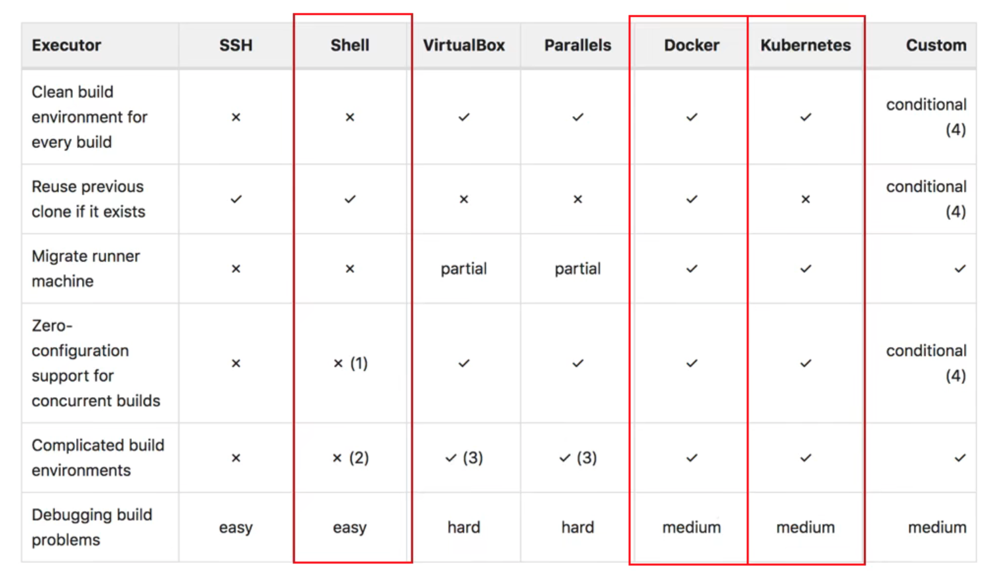


### **进行注册-非交互式**

```
docker run -itd --rm -v  /Users/i515190/k8s_test/gitlab/runner-config:/etc/gitlab-runner --network=host gitlab/gitlab-runner:v15.1.0 register \
  --non-interactive \
  --executor "shell" \
  --url "http://127.0.0.1:32220/" \
  --registration-token "nzTshoYwsnCttkyzZBxE" \
  --description "devops-runner" \
  --tag-list "build,deploy" \
  --run-untagged="true" \
  --locked="false" \
  --access-level="not_protected"
```

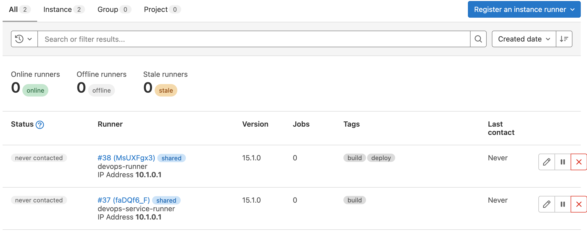

## **常用命令**

### **启动命令**

```
gitlab-runner --debug <command>   #调试模式排查错误特别有用。
gitlab-runner <command> --help    #获取帮助信息
gitlab-runner run       #普通用户模式  配置文件位置 ~/.gitlab-runner/config.toml
sudo gitlab-runner run  # 超级用户模式  配置文件位置/etc/gitlab-runner/config.toml
```

### **注册命令**

```
gitlab-runner register  #默认交互模式下使用，非交互模式添加 --non-interactive
gitlab-runner list      #此命令列出了保存在配置文件中的所有运行程序
gitlab-runner verify    #此命令检查注册的runner是否可以连接，但不验证GitLab服务是否正在使用runner。--delete 删除
gitlab-runner unregister   #该命令使用GitLab取消已注册的runner。


#使用令牌注销
gitlab-runner unregister --url http://gitlab.example.com/ --token t0k3n

#使用名称注销（同名删除第一个）
gitlab-runner unregister --name test-runner

#注销所有
gitlab-runner unregister --all-runners
```

### **服务管理**

```
gitlab-runner install --user=gitlab-runner --working-directory=/home/gitlab-runner

# --user指定将用于执行构建的用户
#`--working-directory  指定将使用**Shell** executor 运行构建时所有数据将存储在其中的根目录

gitlab-runner uninstall #该命令停止运行并从服务中卸载GitLab Runner。

gitlab-runner start     #该命令启动GitLab Runner服务。

gitlab-runner stop      #该命令停止GitLab Runner服务。

gitlab-runner restart   #该命令将停止，然后启动GitLab Runner服务。

gitlab-runner status #此命令显示GitLab Runner服务的状态。当服务正在运行时，退出代码为零；而当服务未运行时，退出代码为非零
```


## **3 GitLab的cicd自动发布构建流程**

```
$ docker exec -it aed10f1e614c sh
# gitlab-runner run 
```

### **Create Sample Gitlab Maven repo**

```
http://localhost:32220/-/profile/preferences
```

**User Settings** -> SSH keys

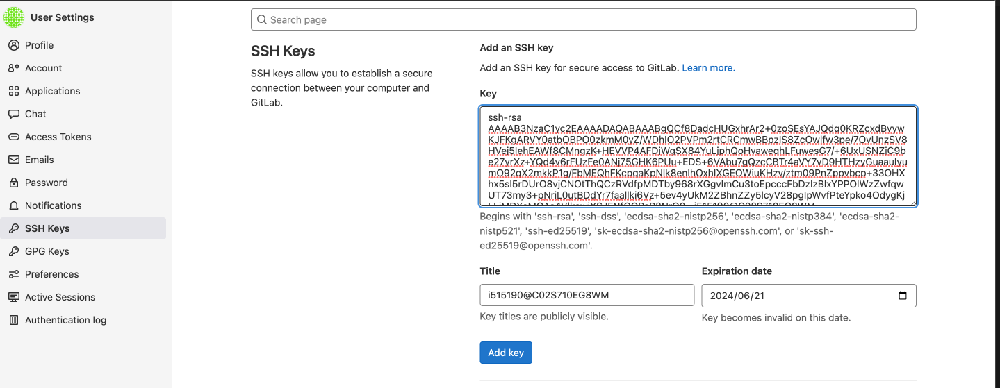

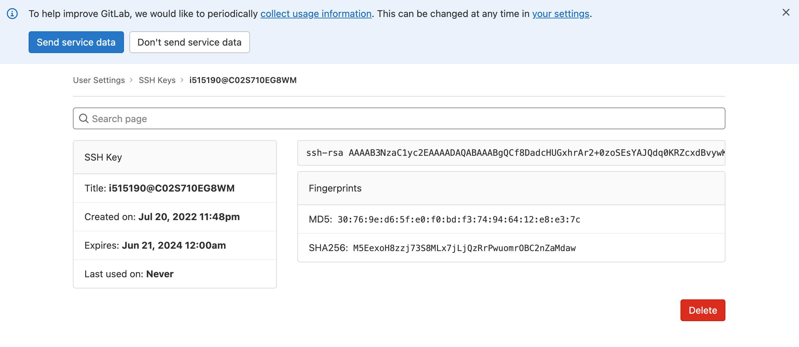


```
$ git clone ssh://git@localhost:30022/gitlab-instance-8f6af96c/demo-mvn-project.git
Cloning into 'demo-mvn-project'...
remote: Enumerating objects: 3, done.
remote: Counting objects: 100% (3/3), done.
remote: Compressing objects: 100% (2/2), done.
remote: Total 3 (delta 0), reused 0 (delta 0), pack-reused 0
Receiving objects: 100% (3/3), done.
```

**Clone Sample Maven Code**

`https://github.com/jenkins-docs/simple-java-maven-app`

```
cd simple-java-maven-app
cp * ../demo-mvn-project


git add -A
git push -uf origin main

```


### **运行流水线任务**

`.gitlab-ci.yml`

```
stages:
  - build
  - deploy
 

build:
  stage: build
  tags:
    - build
  only:
    - main
  script:
    - echo "mvn clean "
    - echo "mvn install"


deploy:
  stage: deploy
  tags:
    - deploy
  only:
    - main
  script:
    - echo "hello deploy"
```

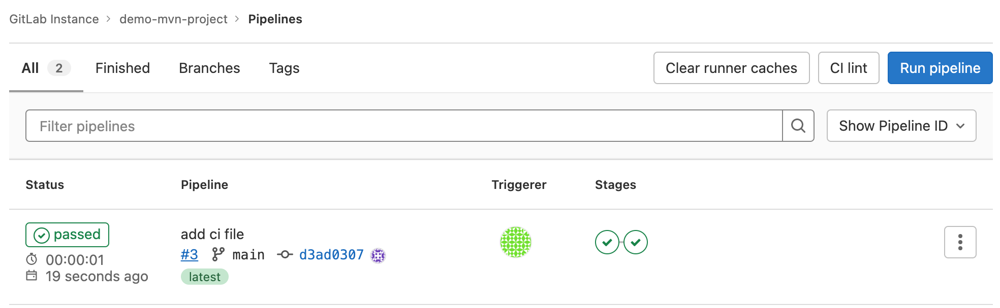

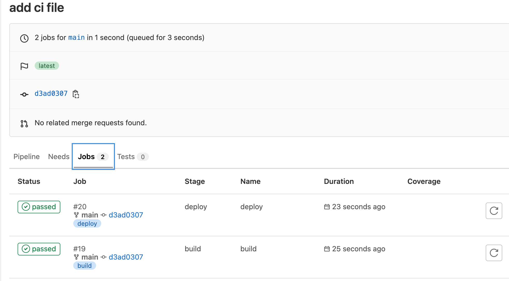


