# **GitLabCI系列之流水线语法**

## **1 Pipeline 语法 1**

**`job/script/before_script/after_script/stages/stage/variables`**

```
$ docker exec -it aed10f1e614c sh
# gitlab-runner start
# gitlab-runner verify
Runtime platform                                    arch=amd64 os=linux pid=561 revision=76984217 version=15.1.0
Running in system-mode.                            
                                                   
ERROR: Verifying runner... is removed               runner=faDQf6_F
ERROR: Verifying runner... is removed               runner=MsUXFgx3
Verifying runner... is alive                        runner=Df8p4oox
FATAL: Failed to verify runners  
```

### **job**

在每个项目中，我们使用名为 `.gitlab-ci.yml` 的YAML文件配置`GitLab CI / CD` 管道。

* **可以定义一个或多个作业(job)**。
* **每个作业必须具有唯一的名称**（不能使用关键字）。
* **每个作业是独立执行的**。
* 每个作业至少要包含一个script。

```
job1:
  script: "execute-script-for-job1"

job2:
  script: "execute-script-for-job2"
```

这里在pipeline中定义了两个作业，每个作业运行不通的命令。命令可以是shell 或脚本。

### **script**

```
job:
script:
  - uname -a
  -  bundle exec rspec
```

注意：有时， script命令将需要用单引号或双引号引起来. 例如，包含冒号命令（ : ）需要加引号，以便被包裹的YAML解析器知道来解释整个事情作为一个字符串，而不是一个"键：值"对. 使用特殊字符时要小心：`: ， { ， } ， [ ， ] ， , ， & ， * ， # ， ? ， | ， - ， < ， > ， = ! ， % ， @`	


```
before_script:
  - echo "before-script!!"

variables:
  DOMAIN: example.com

stages:
  - build
  - test
  - codescan
  - deploy
 
build:
  before_script:
    - echo "before-script in job"
  stage: build
  only:
    - main
  script:
    - echo "mvn clean "
    - echo "mvn install"
    - echo "$DOMAIN"
  after_script:
    - echo "after script in job"
  
codescan:
  stage: codescan
  tags:
    - build
  script:
    - echo "codescan"
  when: on_success

unittest:
  stage: test
  script:
    - echo "run test"  
  when: delayed
  start_in: '5'


# deploy:
#   stage: deploy
#   tags:
#     - deploy
#   only:
#     - main
#   script:
#     - echo "hello deploy"
#   when: on_success

deploy:
  stage: deploy
  script:
    - echo "hello deploy"
    - sleep 2;
  when: manual

after_script:
  - echo "after-script"
``` 

### **`before_script`**

用于定义一个命令，该命令在每个作业之前运行。

必须是一个数组。指定的script与主脚本中指定的任何脚本串联在一起，并在单个shell中一起执行。

**`before_script`失败导致整个作业失败，其他作业将不再执行。作业失败不会影响`after_script`运行。**

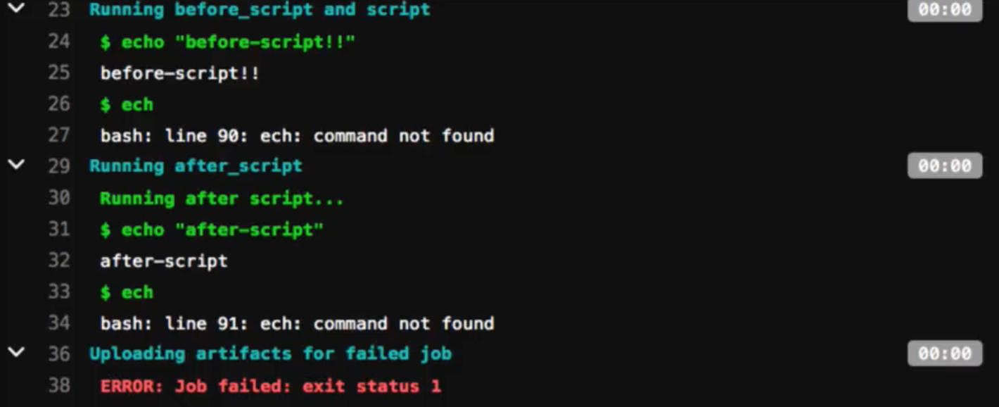

### **`after_script`**

* 用于定义将在每个作业（包括失败的作业）之后运行的命令。
* 这必须是一个数组。
* 指定的脚本在新的shell中执行，与任何`before_script`或script脚本分开。

**可以在全局定义，也可以在job中定义。在job中定义会覆盖全局**

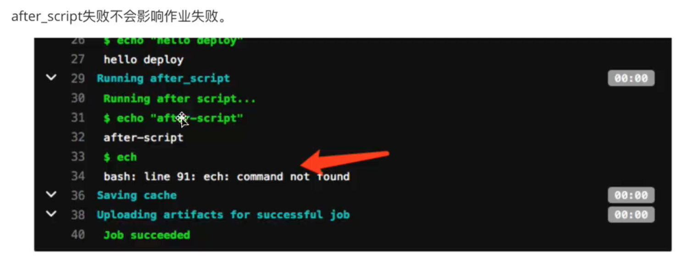

```
$ echo "before-script!!"
before-script!!
$ echo "hello deploy"
hello deploy
....
....
....
Running after script...
$ echo "after-script"
after-script
Job succeeded
```

### stage

用于定义作业可以使用的阶段，并且是全局定义的。同一阶段的作业并行运行，不同阶段按顺序执行。

```
stages：
  - build
  - test
  - codescan
  - deploy
```

这里定义了三个阶段，首先build阶段并行运行，然后test阶段并行运行，最后deploy阶段并行运行。

deploy阶段运行成功后将提交状态标记为passed状态。如果任何一个阶段运行失败，最后提交状态为failed。

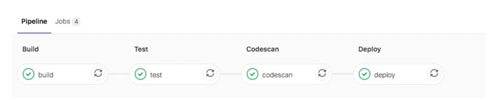

### `. pre` & `.post`

`.pre` 始终是整个管道的第一个运行阶段，`.post` 始终是整个管道的最后一个运行阶段。

用户定义的阶段都在两者之间运行。`.pre`和`.post`的顺序无法更改。**如果管道仅包含`.pre`或`.post`阶段的作业，则不会创建管道。**


**未定义stages**

全局定义的stages是来自于每个job。如果job没有定义stage则默认是test阶段。如果全局未定义stages,则按顺序运行 build,test,deploy。

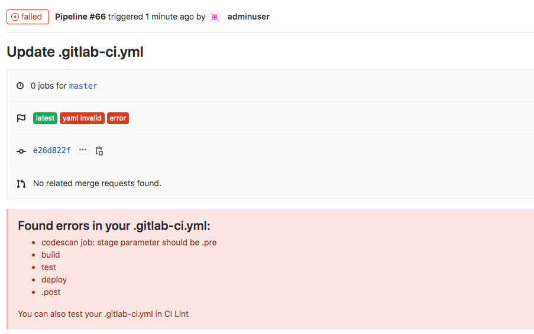

如果作业中定义了其他阶段，例如`"codescan"`则会出现错误。原因是因为除了`build test deploy`阶段外的其他阶段作为`.pre`运行（也就是作为第一个阶段运行，需要将此作业的stage指定为`.pre`）。

```
codescan:
  stage: .pre
  script:
    - echo "codescan"
```

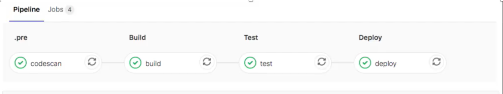


### **定义stages控制stage运行顺序**

一个标准的yaml文件中是需要定义stages，可以帮助我们对每个stage进行排序。

```
stages:
  - build
  - test
  - codescan
  - deploy
```


### **stage**

是按JOB定义的，并且依赖于全局定义的stages 。它允许将作业分为不同的阶段，并且同一stage作业可以并行执行（取决于特定条件 ）

```
unittest:
  stage: test
  script:
    - echo "run test"
    
interfacetest:
  stage: test
  script:
    - echo "run test"
```

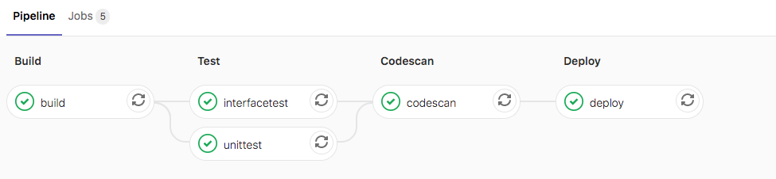

可能遇到的问题：**阶段并没有并行运行**。

**在这里我把这两个阶段在同一个runner运行了，所以需要修改runner每次运行的作业数量。默认是1，改为10**.

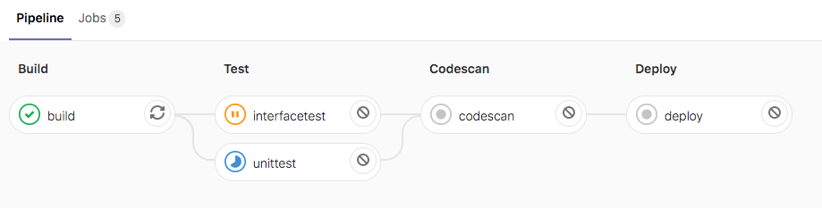

### **variables**

定义变量，pipeline变量、job变量、Runner变量。job变量优先级最大。


## **2 Pipeline 语法 2**

**`tags/allow failure/when/retry/timeout/parallel`**

### tags-指定runner

用于从允许运行该项目的所有Runner列表中选择特定的Runner,在Runner注册期间，您可以指定Runner的标签。tags可让您使用指定了标签的跑步者来运行作业,此runner具有ruby和postgres标签。

```
job:
  tags:
    - ruby
    - postgres
```

给定带有osx标签的OS X Runner和带有windows标签的Windows Runner，以下作业将在各自的平台上运行。

```

windows job:
  stage:
    - build
  tags:
    - windows
  script:
    - echo Hello, %USERNAME%!

osx job:
  stage:
    - build
  tags:
    - osx
  script:
    - echo "Hello, $USER!"
```

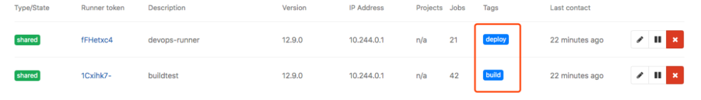

### `allow_failure`


**`allow_failure` 允许作业失败，默认值为false** 。启用后，如果作业失败，该作业将在用户界面中显示橙色警告. 但是，管道的逻辑流程将认为作业成功/通过，并且不会被阻塞。

**假设所有其他作业均成功，则该作业的阶段及其管道将显示相同的橙色警告。但是，关联的提交将被标记为"通过"，而不会发出警告。**

```
job1:
  stage: test
  script:
    - execute_script_that_will_fail
  allow_failure: true
```

```
codescan:
  stage: codescan
  tags:
    - build
  script:
    - ech "codescan"
  allow_failure: failure
```

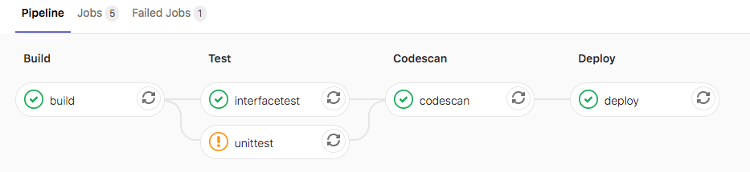

### **when-控制作业运行**

* **`on_success`前面阶段中的所有作业都成功（或由于标记为`allow_failure`而被视为成功）时才执行作业。这是默认值**。
* **`on_failure`当前面阶段出现失败则执行**。
* `always` 执行作业，而不管先前阶段的作业状态如何，放到最后执行。总是执行。
* `on_failure` 当前面阶段出现失败时执行。
* `manual` 手动执行作业。
* `delayed` 延迟执行作业。

**manual 手动**

`manual` - 手动执行作业,不会自动执行，需要由用户显式启动. 手动操作的示例用法是部署到生产环境. 可以从管道，作业，环境和部署视图开始手动操作。

此时在deploy阶段添加`manual`，则流水线运行到`deploy`阶段为锁定状态，需要手动点击按钮才能运行`deploy`阶段。


```
codescan:
  stage: codescan
  tags:
    - build
  script:
    - echo "codescan"
  when: on_success

unittest:
  stage: test
  script:
    - echo "run test"  
  when: delayed
  start_in: '5'

deploy:
  stage: deploy
  script:
    - echo "hello deploy"
    - sleep 2;
  when: manual
```

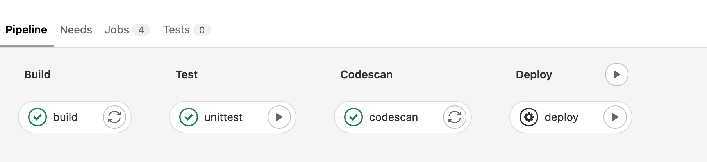

### **delayed 延迟**

delayed 延迟一定时间后执行作业（在GitLab 11.14中已添加）。

有效值`'5',10 seconds,30 minutes, 1 day, 1 week` 。

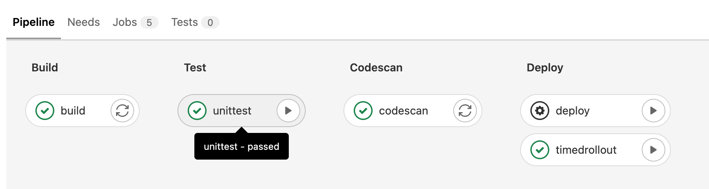

### retry

配置在失败的情况下重试作业的次数。

当作业失败并配置了retry ，将再次处理该作业，直到达到retry关键字指定的次数。如果retry设置为2，并且作业在第二次运行成功（第一次重试），则不会再次重试. **retry值必须是一个正整数，等于或大于0，但小于或等于2（最多两次重试，总共运行3次）**

```
unittest:
  stage: test
  retry: 2
  script:
    - ech "run test"
```

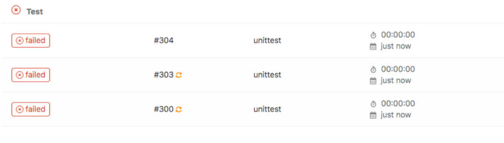

默认情况下，将在所有失败情况下重试作业。为了更好地控制retry哪些失败，可以是具有以下键的哈希值：

* max ：最大重试次数.
* when ：重试失败的案例.

根据错误原因设置重试的次数。

```
always ：在发生任何故障时重试（默认）.
unknown_failure ：当失败原因未知时。
script_failure ：脚本失败时重试。
api_failure ：API失败重试。
stuck_or_timeout_failure ：作业卡住或超时时。
runner_system_failure ：运行系统发生故障。
missing_dependency_failure: 如果依赖丢失。
runner_unsupported ：Runner不受支持。
stale_schedule ：无法执行延迟的作业。
job_execution_timeout ：脚本超出了为作业设置的最大执行时间。
archived_failure ：作业已存档且无法运行。
unmet_prerequisites ：作业未能完成先决条件任务。
scheduler_failure ：调度程序未能将作业分配给运行scheduler_failure。
data_integrity_failure ：检测到结构完整性问题。
```

定义当出现脚本错误重试两次，也就是会运行三次。

```
unittest:
  stage: test
  tags:
  	- build
  script:
    - ech "run test"  
  when: delayed
  retry:
  	max: 2
  	when: script_failure
```

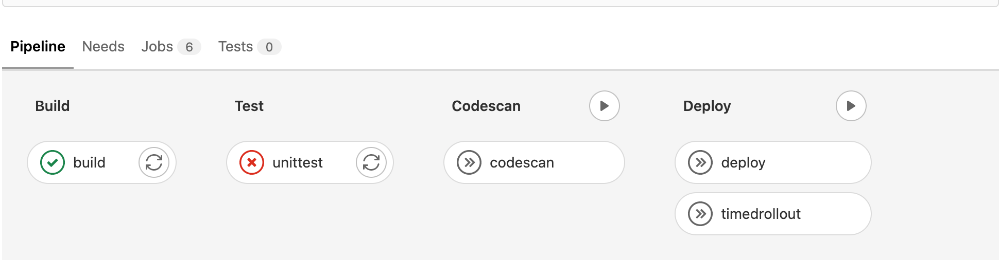

**Retry : 3 times**

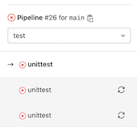

```
unittest:
  stage: test
  tags:
  	- build
  script:
    - ech "run test"  
  when: delayed
  start_in: '5'
  allow_failure: true  # allow to fail
  retry:
  	max: 2
  	when: script_failure
```

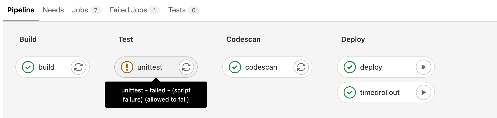


### **timeout 超时**

特定作业配置超时，作业级别的超时可以超过项目级别的超时，但不能超过Runner特定的超时。

```
build:
  script: build.sh
  timeout: 3 hours 30 minutes

test:
  script: rspec
  timeout: 3h 30m
```

### **项目设置流水线超时时间**

超时定义了作业可以运行的最长时间（以分钟为单位）。这可以在项目的"设置">" CI / CD">"常规管道"设置下进行配置 。默认值为60分钟。

**`General pipelines`**

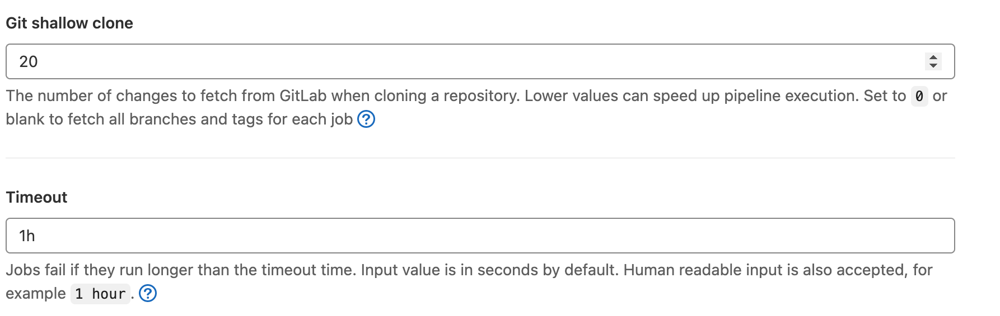

**runner超时时间**


此类超时（如果小于项目定义的超时 ）将具有优先权。此功能可用于通过设置大超时（例如一个星期）来防止Shared Runner被项目占用。未配置时，Runner将不会覆盖项目超时。

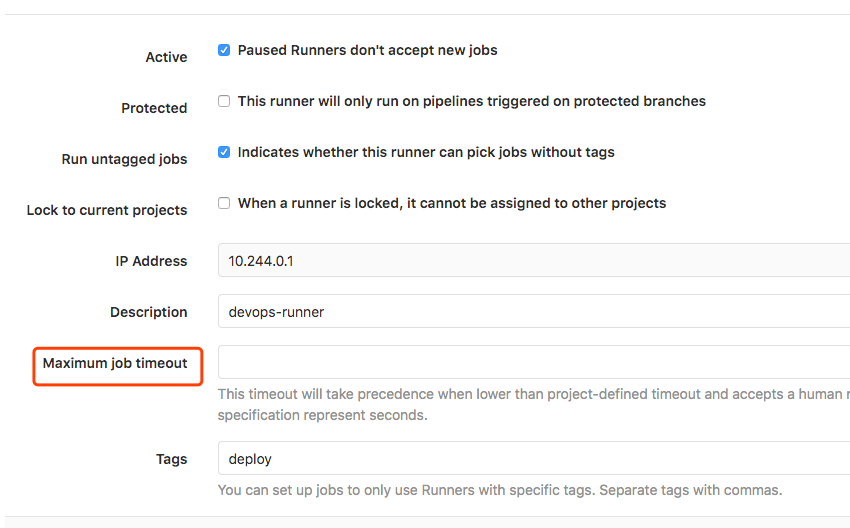

### **parallel**

配置要并行运行的作业实例数,此值必须大于或等于2并且小于或等于50。

这将创建N个并行运行的同一作业实例. 它们从`job_name` 1/N到`job_name` N/N依次命名

```
codescan:
  stage: codescan
  tags:
    - build
   only:
    - main
  script:
    - echo "codescan"
    - sleep 5;
  parallel: 5
  when: on_success
```

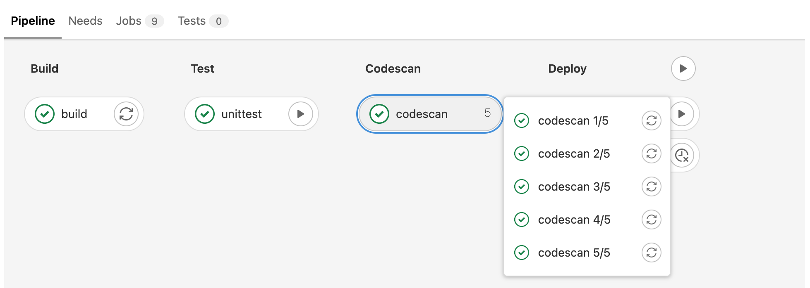

### Final script

```
before_script:
  - echo "before-script!!"

variables:
  DOMAIN: example.com

stages:
  - build
  - test
  - codescan
  - deploy
 
build:
  before_script:
    - echo "before-script in job"
  stage: build
  only:
    - main
  script:
    - echo "mvn clean "
    - echo "mvn install"
    - echo "$DOMAIN"
  after_script:
    - echo "after script in job"
  
codescan:
  stage: codescan
  tags:
    - build
  script:
    - echo "codescan"
    - sleep 5;
  parallel: 5
  when: on_success

timedrollout:
  stage: deploy
  script:
    - echo 'Rolling out 30%....'
  when: delayed
  start_in: '30'

# unittest:
#   stage: test
#   script:
#     - echo "run test"  
#   when: delayed
#   start_in: '5'
unittest:
  stage: test
  tags:
    - build
  script:
    - ech "run test"  
  when: delayed
  start_in: '5'
  allow_failure: true
  retry:
    max: 2
    when: 
      - script_failure

deploy:
  stage: deploy
  script:
    - echo "hello deploy"
    - sleep 2;
  when: manual

after_script:
  - echo "after-script"
```

## **3 Pipeline 语法 3**

**`only/except/rules/workflow`**

### **1 `only & except`only & ecxept -（逐步退出）**

only和except是两个参数用分支策略来限制jobs构建：

* only定义**哪些分支和标签的git项目将会被job执行**。
* except定义**哪些分支和标签的git项目将不会被job执行**。

```
job:
  only:
    - main
```
```
job:
  # use regexp
  only:
    - /issue-.*$/
  # use special keyword
  except:
    - branches
```

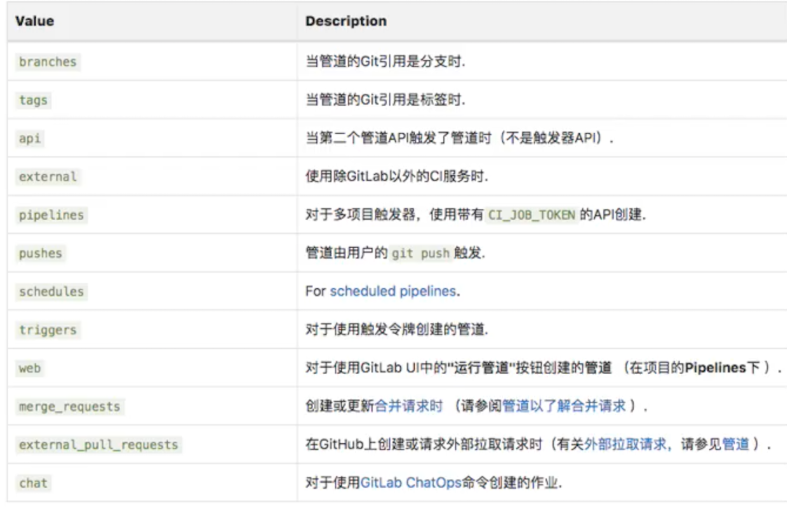

```
deploy:
  stage: deploy
  script:
    - echo "hello deploy"
    - sleep 2;
  when: manual
  only:
    - main
```

### **2 rules**

* rules允许**按顺序**评估单个规则对象的列表，直到一个匹配并为作业动态提供属性. 
* 请注意， **rules不能only/except与only/except组合使用**。

可用的规则条款包括：

* if （类似于`only:variables` ）
* changes （ `only:changes` 相同）
* exists


### **3 rules:if**

* **rules-if-条件匹配**

	* 如果DOMAIN的值匹配，则需要手动运行。
	* **不匹配`on_success`**。
	* 条件判断从上到下，匹配即停止。
	* 多条件匹配可以使用`&& ||`


```
variables:
  DOMAIN: example.com

codescan:
  stage: codescan
  tags:
    - build
  script:
    - echo "codescan"
    - sleep 5;
  #parallel: 5
  rules:
    - if: '$DOMAIN == "example.com"'
      when: manual
    - when: on_success
```

```
deploy:
  stage: deploy
  script:
    - echo "hello deploy"
    - sleep 2;
  rules:
    - if: '$DOMAIN == "example.com"'
      when: manual
    - if: '$DOMAIN == "example.com"'
      when: delayed
      start_in: '5'
    - when: on_success 
```

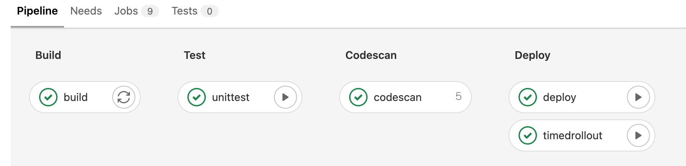


* **rules-changes-文件变化**

	* 接受文件路径数组。
	* 如果提交中`*file`文件发生的变化则为true

```
codescan:
  stage: codescan
  tags:
    - build
  script:
    - echo "codescan"
    #parallel: 5
  rules:
    - changes:
      - Dockerfile
      when: manual
    - if: '$DOMAIN == "example.com"'
      when: on_success
    - when: on_success
```

**`Dockerfile`**

```
FROM alpine:3.8
```

```
FROM alpine:3.8

ENV KUBE_LATEST_VERSION="v1.13.4"
```

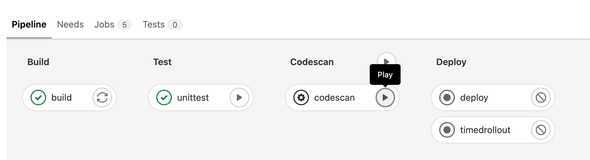


* **`rules:exists`**
	* 接受文件路径数组。当仓库中存在指定的文件时操作。

```
codescan:
  stage: codescan
  tags:
    - build
  script:
    - echo "codescan"
    - sleep 5;
  #parallel: 5
  rules:
    - exists:
      - Dockerfile
      when: manual 
    - changes:
      - Dockerfile
      when: on_success
    - if: '$DOMAIN == "example.com"'
      when: on_success
    - when: on_success
```

```
rules:
	- exists:
	  - Dockerfile
	  when: manual 
	- changes:
	  - Dockerfile
	  when: on_success
```

* **rules-`allow_failure`**
	* 使用`allow_failure: true` 
	* rules:在不停止管道本身的情况下允许作业失败或手动作业等待操作。

```
job:
  script: "echo Hello, Rules!"
  rules:
    - if: '$CI_MERGE_REQUEST_TARGET_BRANCH_NAME == "main"'
      when: manual
      allow_failure: true
```

在此示例中，如果第一个规则匹配，则作业将具有以下`when: manual`和`allow_failure: true`。

### **workflow:rules创建管道**

* 顶级workf1ow关键字适用于整个管道，并将确定是否创建管道。
* **when：可以设置为always或never， 如果未提供，则默认值always**。

```
variables:
  DOMAIN: example.com

workflow:
  rules:
    - if: '$DOMAIN == "example.com"'
    - when: always
```

### 综合实例代码

```
before_script:
  - echo "before-script!!"

variables:
  DOMAIN: example.com
  
workflow:
  rules:
    - if: '$DOMAIN == "example.com"'
      when: always
    - when: never
    
stages:
  - build
  - test
  - codescan
  - deploy

build:
  before_script:
    - echo "before-script in job"
  stage: build
  script:
    - echo "mvn clean "
    - echo "mvn install"
    - echo "$DOMAIN"
  after_script:
    - echo "after script in buildjob"
  rules:
    - exists:
      - Dockerfile
      when: on_success 
      allow_failure: true

    - changes:
      - Dockerfile
      when: manual
    - when: on_failure

unittest:
  stage: test
  script:
    - echo "run test"
  when: delayed
  start_in: '5'
  allow_failure: true
  retry:
    max: 1
    when:
      - script_failure
  timeout: 1 hours 10 minutes
  
  

deploy:
  stage: deploy
  script:
    - echo "hello deploy"
    - sleep 2;
  rules:
    - if: '$DOMAIN == "example.com"'
      when: manual
    - if: '$DOMAIN == "aexample.com"'
      when: delayed
      start_in: '5'
    - when: on_failure
  
codescan:
  stage: codescan
  script:
    - echo "codescan"
    - sleep 5;
  when: on_success
  parallel: 5
 
after_script:
  - echo "after-script"
```

## **4 cache 关键字**

### **cache 缓存**

**用来指定需要在job之间缓存的文件或目录。只能使用该项目工作空间内的路径**。不要使用缓存在阶段之间传递工件，因为缓存主要是存储编译项目所需的运行时依赖项。

**如果在job范围之外定义了cache ，则意味着它是全局设置，所有job都将使用该定义。如果未全局定义或未按job定义则禁用该功能**。

* 存储编译项目所需的运行时依赖项，指定项目工作空间中需要在job之间缓存的文件或目录。
* 全局cache定义在job之外，针对所有job生效。job中cache优先于全局。

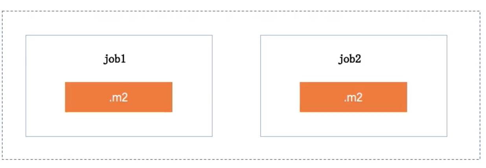

### **cache:paths**

使用paths指令选择要缓存的文件或目录，路径是相对于项目目录，不能直接链接到项目目录之外。

`$CI_PROJECT_DIR`  项目目录。**在`job build`中定义缓存，将会缓存target目录下的所有`.jar`文件**。

```
build:
  script: test
  cache:
    paths:
      - target/*.jar
```
 
当在全局定义了`cache:paths`会被`job`中覆盖。以下实例将缓存`binaries`目录。

```
cache:
  paths:
    - my/files

build:
  script: echo "hello"
  cache:
    key: build
    paths:
      - target/
```

由于缓存是在job之间共享的，如果不同的job使用不同的路径就出现了缓存覆盖的问题。

**如何让不同的job缓存不同的cache呢？设置不同的`cache:key`。**

### **cache:key  缓存标记**

为缓存做个标记，可以配置`job`、分支为`key`来实现分支、作业特定的缓存。

为不同 job 定义了不同的 `cache:key` 时， 会为每个 job 分配一个独立的 cache。

**`cache:key` 变量可以使用任何预定义变量，默认default ，从GitLab 9.0开始，默认情况下所有内容都在管道和作业之间共享。**

**按照分支设置缓存**

```
cache:
  key: ${CI_COMMIT_REF_SLUG}
```

### **`cache:key:fles` —— 文件变化自动创建缓存**

files：文件发生变化自动重新生成缓存(**files最多指定两个文件**)，提交的时候检查指定的文件。

**根据指定的文件生成密钥计算SHA校验和，如果文件未改变值为default。**

```
cache:
  key:
    files:
      - Gemfile.lock
      - package.json
  paths:
    - vendor/ruby
    - node_modules
```

### **`cache: key:prefix`-组合生成SHA校验和**

**prefix: 允许给定prefix的值与指定文件生成的秘钥组合**。

**在这里定义了全局的`cache`，如果文件发生变化则值为 `rspec-xxx111111111222222`   ，未发生变化为`rspec-default`。**

```
cache:
  key:
    files:
      - Gemfile.lock
    prefix: ${CI_JOB_NAME}
  paths:
    - vendor/ruby

rspec:
  script:
    - bundle exec rspec
```

例如，添加`$CI_JOB_NAME prefix`将使密钥看起来像：

`rspec-feef9576d21ee9b6a32e30c5c79d0a0ceb68d1e5 ` 

并且作业缓存在不同分支之间共享，如果分支更改了`Gemfile.lock` ，则该分支将为`cache:key:files`具有新的SHA校验和

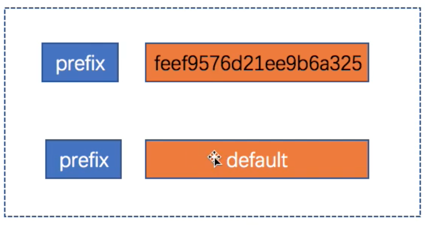

将生成一个新的缓存密钥，并为该密钥创建一个新的缓存. 如果`Gemfile.lock`未发生变化 ，则将前缀添加`default` ，因此示例中的键为`rspec-default` 。

### **`cache:policy`  策略**

**默认：在执行开始时下载文件，并在结束时重新上传文件**。称为`pull-push`缓存策略.

* `policy: pull` 跳过下载步骤
* `policy: push`  跳过上传步骤

```

stages:
  - setup
  - test

prepare:
  stage: setup
  cache:
    key: gems
    paths:
      - vendor/bundle
  script:
    - bundle install --deployment

rspec:
  stage: test
  cache:
    key: gems
    paths:
      - vendor/bundle
    policy: pull
  script:
    - bundle exec rspec ...
```

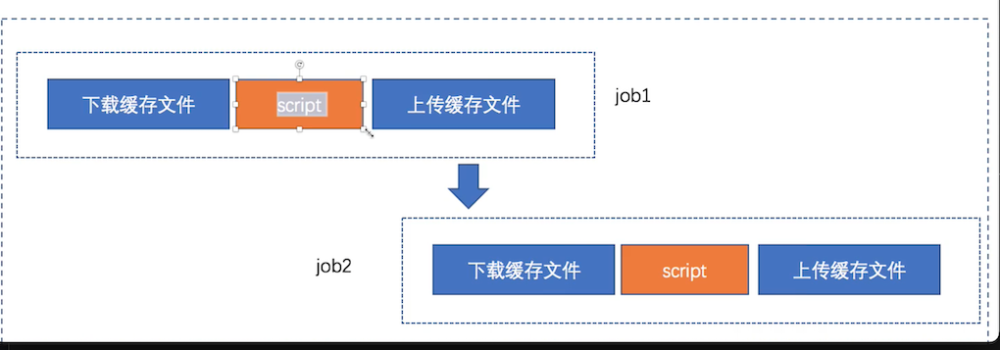

### **综合实例(一) 全局缓存**

```
before_script:
  - echo "before-script!!"

variables:
  DOMAIN: example.com

cache: 
  paths:
   - target/

stages:
  - build
  - test
  - deploy

build:
  before_script:
    - echo "before-script in job"
  stage: build
  tags:
    - build
  only:
    - main
  script:
    - ls
    - id
    - mvn clean package -DskipTests
    - ls target
    - echo "$DOMAIN"
    - false && true ; exit_code=$?
    - if [ $exit_code -ne 0 ]; then echo "Previous command failed"; fi;
    - sleep 2;
  after_script:
    - echo "after script in job"


unittest:
  stage: test
  tags:
    - build
  only:
    - main
  script:
    - echo "run test"
    - echo 'test' >> target/a.txt
    - ls target
  retry:
    max: 2
    when:
      - script_failure

deploy:
  stage: deploy
  tags:
    - build
  only:
    - main
  script:
    - echo "run deploy"
    - ls target
  retry:
    max: 2
    when:
      - script_failure


after_script:
  - echo "after-script"
```

Pipeline日志分析

build作业运行时会对项目代码打包，然后生成target目录。作业结束创建缓存。


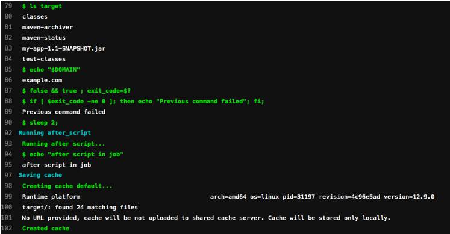

开始第二个作业test，此时会把当前目录中的target目录删除掉（因为做了git 对比）。


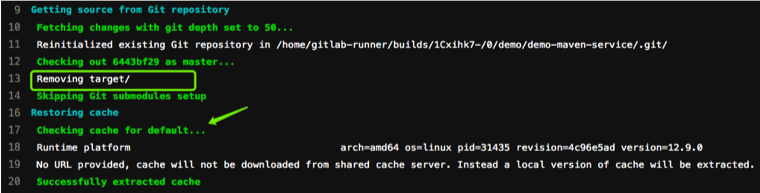

获取到第一个作业生成的缓存target目录。

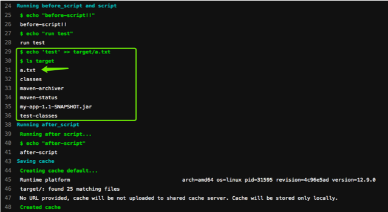

开始第三个作业，同样先删除了target目录，然后获取了第二个作业的缓存。最后生成了当前的缓存。


**Runner缓存**

在做本次实验的时候我现在本地runner清除了项目的工作目录和历史缓存。

```
[~]# cd /home/gitlab-runner/builds/1Cxihk7-/0/demo/demo-maven-service/
[rdemo-maven-service]# ls
Jenkinsfile  README.md  aaaaa  jenkins  pom.xml  src  target
[demo-maven-service]# cd ..
[demo]# ls
demo-maven-service  demo-maven-service.tmp
[demo]# rm -fr demo-maven-service
[demo]# rm -fr demo-maven-service.tmp/
[demo]# cd
[~]# cd /home/gitlab-runner/cache/
[cache]# ls
demo
[cache]# rm -rf *
```

**项目代码默认不会删除，可以发现是第二次作业的缓存**。（因为上面的例子中第三次作业并没有修改缓存内容）

```

[cache]# cd /home/gitlab-runner/builds/1Cxihk7-/0/demo/demo-maven-service/
[emo-maven-service]# ls
Jenkinsfile  README.md  aaaaa  jenkins  pom.xml  src  target
[demo-maven-service]# cd ..
[demo]# ls
demo-maven-service  demo-maven-service.tmp
[demo]# rm -fr *

[remo]# ls
demo-maven-service  demo-maven-service.tmp
[demo]# cd demo-maven-service
[demo-maven-service]# ls
Jenkinsfile  README.md  aaaaa  jenkins  pom.xml  src  target

[demo-maven-service]# cat target/a.txt
test
```
进入runner缓存目录中查看缓存。

```
[~]# cd /home/gitlab-runner/cache/demo/demo-maven-service/default/
[default]# ls
cache.zip
[default]# unzip cache.zip
Archive:  cache.zip
   creating: target/
  inflating: target/a.txt
   creating: target/classes/
   creating: target/classes/com/
   creating: target/classes/com/mycompany/
   creating: target/classes/com/mycompany/app/
  inflating: target/classes/com/mycompany/app/App.class
   creating: target/maven-archiver/
  inflating: target/maven-archiver/pom.properties
   creating: target/maven-status/
   creating: target/maven-status/maven-compiler-plugin/
   creating: target/maven-status/maven-compiler-plugin/compile/
   creating: target/maven-status/maven-compiler-plugin/compile/default-compile/
  inflating: target/maven-status/maven-compiler-plugin/compile/default-compile/createdFiles.lst
  inflating: target/maven-status/maven-compiler-plugin/compile/default-compile/inputFiles.lst
   creating: target/maven-status/maven-compiler-plugin/testCompile/
   creating: target/maven-status/maven-compiler-plugin/testCompile/default-testCompile/
  inflating: target/maven-status/maven-compiler-plugin/testCompile/default-testCompile/createdFiles.lst
  inflating: target/maven-status/maven-compiler-plugin/testCompile/default-testCompile/inputFiles.lst
  inflating: target/my-app-1.1-SNAPSHOT.jar
   creating: target/test-classes/
   creating: target/test-classes/com/
   creating: target/test-classes/com/mycompany/
   creating: target/test-classes/com/mycompany/app/
  inflating: target/test-classes/com/mycompany/app/AppTest.class
[default]# ls
cache.zip  target
[default]# cd target/
[target]# ls
a.txt  classes  maven-archiver  maven-status  my-app-1.1-SNAPSHOT.jar  test-classes
[target]# cat a.txt
test
```

此时此刻再次运行流水线作业，第一个作业用的是上个作业最后生成的缓存。

在做本次实验的时候我现在本地runner清除了项目的工作目录和历史缓存。

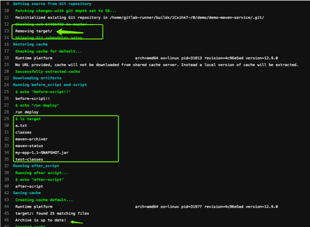

```
ll
total 12
-rw------- 1 gitlab-runner gitlab-runner 9172 Apr 29 10:27 cache.zip
drwxrwxr-x 6 root          root           127 Apr 29 10:05 target
```


结论：全局缓存生效于未在作业中定义缓存的所有作业，这种情况如果每个作业都对缓存目录做了更改，会出现缓存被覆盖的场景。

## **5 artifacts/dependencies**

### **artifacts**

用于指定在作业成功或者失败时应附加到作业的文件或目录的列表。作业完成后，工件将被发送到GitLab，并可在GitLab UI中下载。

* **`artifacts:paths`**

路径是相对于项目目录的，不能直接链接到项目目录之外。

将制品设置为target目录

```
artifacts:
  paths:
    - target/
```
 
 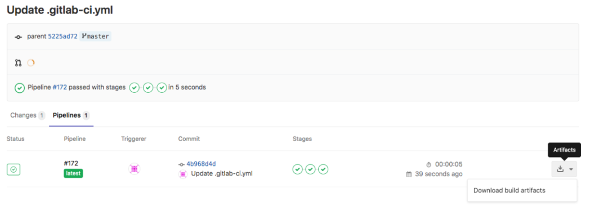

* **`artifacts:expose_as` -MR展示制品**

关键字`expose_as`可用于在合并请求 UI中公开作业工件。

例如，要匹配单个文件：

```
test:
  script: 
    - echo 1
  artifacts:
    expose_as: 'artifact 1'
    paths: 
      - path/to/file.txt
```

**使用此配置，GitLab将在指向的相关合并请求中添加链接`file1.txt`。**

 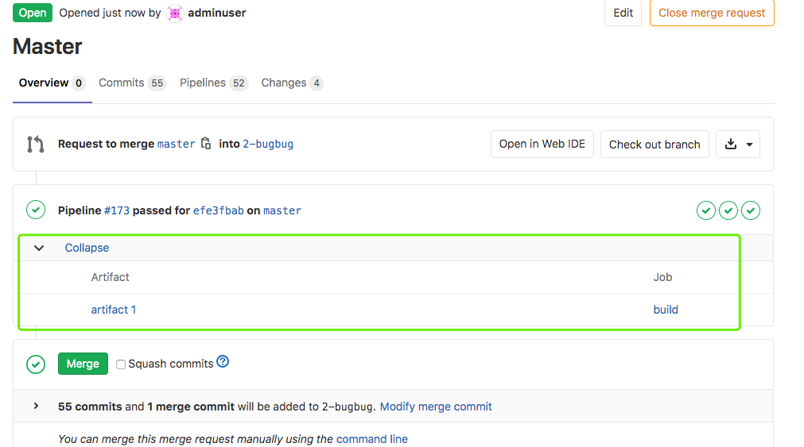
 
 制品浏览

 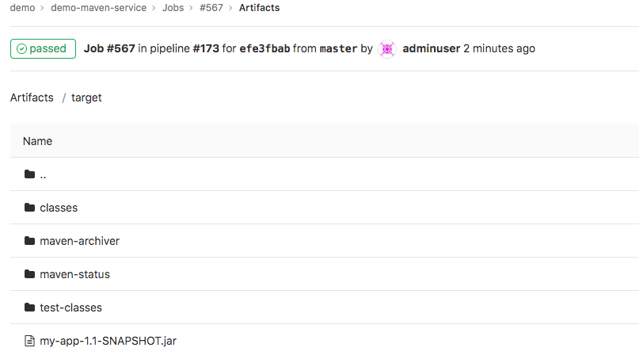
 
 请注意以下几点：

* **每个合并请求最多可以公开10个作业工件**。
* 如果指定了目录，那么如果目录中有多个文件，**则该链接将指向指向作业工件浏览器**。
* 如果开启GitlabPages可以对.html .htm .txt .json .log扩展名单个文件工件渲染工件。

* **artifacts-制品创建**

```
default-job:
  script:
    - mvn test -U
  except:
    - tags

release-job:
  script:
    - mvn package -U
  artifacts:
    paths:
      - target/*.war
    only:
      - tags
```

**`artifacts:name`**

通过name指令定义所创建的工件存档的名称。可以为每个档案使用唯一的名称。


`artifacts:name`变量可以使用任何预定义变量。默认名称是`artifacts`，下载`artifacts`改为`artifacts.zip`。

使用当**前作业的名称**创建档案

```
job:
  artifacts:
    name: "$CI_JOB_NAME"
    paths:
      - binaries/
```

使用**内部分支或标记的名称**（仅包括binaries目录）创建存档，

```
job:
  artifacts:
    name: "$CI_COMMIT_REF_NAME"
    paths:
      - binaries/
```

使用**当前作业的名称和当前分支或标记（仅包括二进制文件目录）**创建存档

```
job:
  artifacts:
    name: "$CI_JOB_STAGE-$CI_COMMIT_REF_NAME"
    paths:
      - binaries/
```

### **`artifacts:when`**

用于在作业失败时或成功而上传工件。

* `on_success`**仅在作业成功时上载工件默认值**。
* `on_failure`仅在作业失败时上载工件。
* always 上载工件，无论作业状态如何。

```
job:
  artifacts:
    when: on_failure
```

```
job:
  artifacts:
    when: on_successs
```

```
job:
  artifacts:
    when: always
```

###  `artifacts: expire_in` 制品保留时间

制品的有效期，从上传和存储到Gitlab的时间开始算起。如果末定义过期时间，则默认为30天。

`expire_in` 的值以秒为单位的经过时间，除非提供了单位。

```

‘42’
‘3 mins 4 sec’
‘2 hrs 20 min’
‘2h20min’
‘6 mos 1 day’
‘47 yrs 6 mos and 4d’
‘3 weeks and 2 days’
```

一周后过期

```
job:
  artifacts:
    expire_in: 1 week
```

### **`artifacts:reports`**

用于从作业中收集测试报告，代码质量报告和安全报告. 在GitLab的UI中显示这些报告。注意：无论作业结果（成功或失败），都将收集测试报告。

**`artifacts:reports:junit` —— 单元测试报告**

收集junit单元测试报告，收集的JUnit报告将作为工件上传到GitLab，并将自动显示在合并请求中

```
build:
  stage: build
  tags:
    - build
  only:
    - main
  script:
    - mvn test
    - mvn cobertura:cobertura
    - ls target
  artifacts:
    name: "$CI_JOB_NAME-$CI_COMMIT_REF_NAME"
    when: on_success
    expose_as: 'artifact 1'
    paths:
      - target/*.jar
    reports:
      junit: target/surefire-reports/TEST-*.xml
```

注意：如果您使用的`JUnit`工具导出到多个XML文件，则可以在一个作业中指定多个测试报告路径，它们将被自动串联到一个文件中. 使用文件名模式（ `junit: rspec-*.xml` ），文件名数组（ `junit: [rspec-1.xml, rspec-2.xml, rspec-3.xml] `）或其组合（` junit: [rspec.xml, test-results/TEST-*.xml] `）

 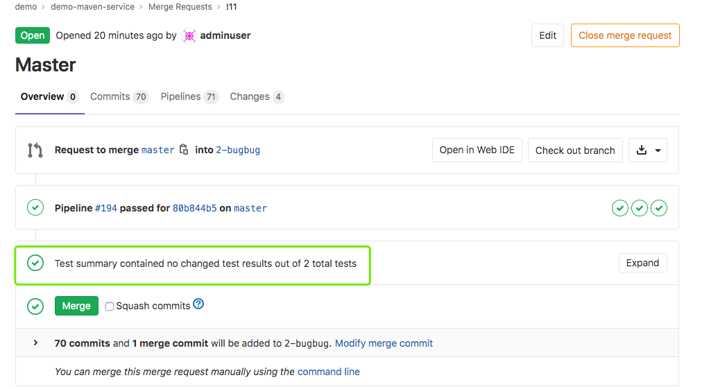
 
 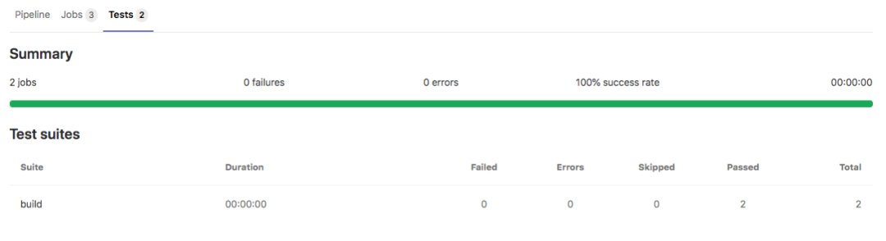


```
jobs:build:artifacts paths can't contain '*' when used with 'expose_as'
```

如果无法显示此页面，需要更改系统设置。此选项可能会加大资源占用，默认禁用了需要启用。

```

登录gitlab
su -  git
$ gitlab-rails console
--------------------------------------------------------------------------------
 GitLab:       12.9.0 (9a382ff2c82) FOSS
 GitLab Shell: 12.0.0
 PostgreSQL:   10.12
--------------------------------------------------------------------------------
Feature.enable(:junit_pipeline_view)Loading production environment (Rails 6.0.2)
irb(main):001:0>
irb(main):002:0>
irb(main):003:0> Feature.enable(:junit_pipeline_view)
=> true
irb(main):004:0>
```

参考链接：https://docs.gitlab.com/ee/ci/junit_test_reports.html

**`artifacts:reports: cobertura`-覆盖率**

```
build:
  stage: build
  tags:
    - build
  only:
    - main
  script:
    - mvn test
    - mvn cobertura:cobertura
    - ls target
  artifacts:
    name: "$CI_JOB_NAME-$CI_COMMIT_REF_NAME"
    when: on_success
    expose_as: 'artifact 1'
    paths:
      - target/*.jar
    reports:
      junit: target/surefire-reports/TEST-*.xml
      cobertura: target/site/cobertura/coverage.xml
```

**maven集成cobertura插件**

```
<plugins>
	<!-- cobertura plugin start -->
	<plugin>
		<groupId>org.codehaus.mojo</groupId>
		<artifactId>cobertura-maven-plugin</artifactId>
		<version>2.7</version>
		<configuration>
			<formats>
				<format>html</format>
				<format>xml</format>
			</formats>
		</configuration>
	</plugin>
	<!-- cobertura plugin end -->
</plugins>
```

执行 mvn cobertura:cobertura 运行测试并产生cobertura的覆盖率

### **dependencies**

定义要获取工件的作业列表，只能从当前阶段之前执行的阶段定义作业。定义一个空数组将跳过下载该作业的任何工件不会考虑先前作业的状态，因此，如果它失败或是未运行的手动作业，则不会发生错误。

如果设置为依赖项的作业的工件已过期或删除，那么依赖项作业将失败。

```
unittest:
  dependencies:
    - build
```

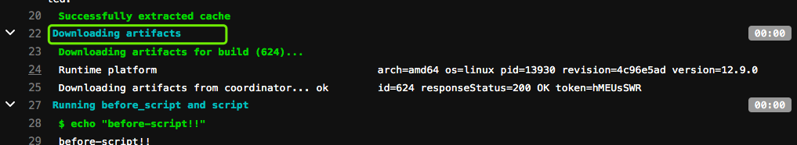

### **综合实例**

```
before_script:
  - echo "before-script!!"

variables:
  DOMAIN: example.com


cache: 
  paths:
   - target/

stages:
  - build
  - test
  - deploy
  
build:
  before_script:
    - echo "before-script in job"
  stage: build
  tags:
    - build
  only:
    - master
  script:
    - ls
    - id
    - mvn test
    - mvn cobertura:cobertura
    - ls target
    - echo "$DOMAIN"
    - false && true ; exit_code=$?
    - if [ $exit_code -ne 0 ]; then echo "Previous command failed"; fi;
    - sleep 2;
  after_script:
    - echo "after script in job"
  artifacts:
    name: "$CI_JOB_NAME-$CI_COMMIT_REF_NAME"
    when: on_success
    #expose_as: 'artifact 1'
    paths:
      - target/*.jar
      #- target/surefire-reports/TEST*.xml
    reports:
      junit: target/surefire-reports/TEST-*.xml
      cobertura: target/site/cobertura/coverage.xml
  coverage: '/Code coverage: \d+\.\d+/'


unittest:
  dependencies:
    - build
  stage: test
  tags:
    - build
  only:
    - master
  script:
    - echo "run test"
    - echo 'test' >> target/a.txt
    - ls target
  retry:
    max: 2
    when:
      - script_failure
  
deploy:
  stage: deploy
  tags:
    - build
  only:
    - master
  script:
    - echo "run deploy"
    - ls target
  retry:
    max: 2
    when:
      - script_failure
      
      

after_script:
  - echo "after-script"
```

## **6 `needs/artifacts`**


### **needs 并行阶段**

可无序执行作业，无需按照阶段顺序运行某些作业，可以让多个阶段同时运行。

```
stages:
  - build
  - test
  - deploy

module-a-build:
  stage: build
  script: 
    - echo "hello3a"
    - sleep 10

module-b-build:
  stage: build
  script: 
    - echo "hello3b"
    - sleep 10

module-a-test:
  stage: test
  script: 
    - echo "hello3a"
    - sleep 10
  needs: ["module-a-build"]

module-b-test:
  stage: test
  script: 
    - echo "hello3b"
    - sleep 10
  needs: ["module-b-build"]
```

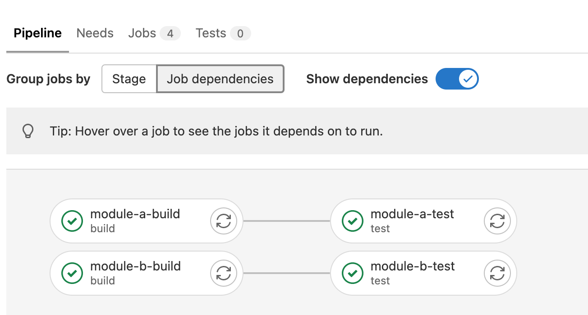

如果`needs:`设置为指向因`only/except`规则而未实例化的作业，或者不存在，则创建管道时会出现YAML错误。

暂时限制了作业在`needs:`可能需要的最大作业数分配,`ci_dag_limit_needs`功能标志已启用（默认）分配10个，如果功能被禁用为50。

```
Feature::disable(:ci_dag_limit_needs)   # 50
Feature::enable(:ci_dag_limit_needs)  #10
```

### **制品下载**

**在使用needs，可通过`artifacts: true`或`artifacts: false`来控制工件下载。默认不指定为true。**

```
module-a-test:
  stage: test
  script: 
    - echo "hello3a"
    - sleep 10
  needs: 
    - job: "module-a-build"
      artifacts: true
```

相同项目中的管道制品下载,通过将project关键字设置为当前项目的名称，并指定引用，可以使用needs从当前项目的不同管道中下载工件。


在下面的示例中，`build_job`将使用`other-refref`下载最新成功的`build-1`作业的工件：


```
build_job:
  stage: build
  script:
    - ls -lhR
  needs:
    - project: group/same-project-name
      job: build-1
      ref: other-ref
      artifacts: true
```

**不支持parallel: 运行的作业中下载工作**

## **87 `include/local`**

官方模板库：[https://gitlab.com/gitlab-org/gitlab/-/tree/master/lib/gitlab/ci/templates](https://gitlab.com/gitlab-org/gitlab/-/tree/master/lib/gitlab/ci/templates)

可以允许引入外部YAML文件，文件具有扩展名`.yml`或`.yaml` 。

**使用合并功能可以自定义和覆盖包含本地定义的`CI / CD`配置**。

相同的job会合并，参数值以源文件为准。

```
include:
  local: 'ci/localci.yml'
```


### **include: local-引入本地配置**

引入同一存储库中的文件，使用相对于根目录的完整路径进行引用，与配置文件在同一分支上使用。

`ci/localci.yml`: 定义一个作业用于发布。

```
stages:
  - deploy

deployjob:
  stage: deploy
  script:
    - echo 'deploy'
```

`.gitlab-ci.yml` 引入本地的CI文件`'ci/localci.yml'`。

```
include:
  local: 'ci/localci.yml'


stages:
  - build
  - test
  - deploy


buildjob:
  stage: build
  script: ls


testjob:
  stage: test
  script: ls
```

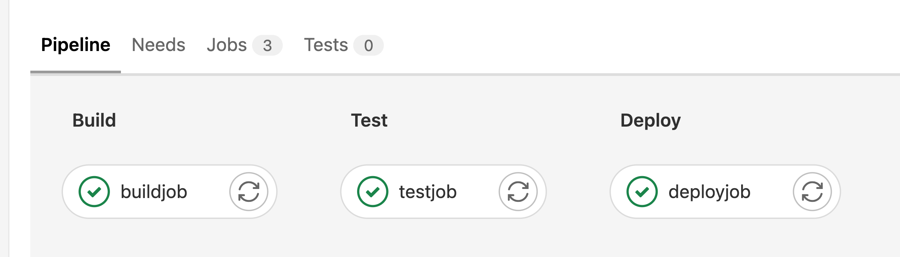


**`.gitlab-ci.yml`直接加入`deployjob`**

```
...
deployjob:
  stage: deploy
  script:
    - echo 'deploy in gitlab-ci'
```

**Job deployjob triggered 2 minutes ago by**

```
...
Skipping Git submodules setup
Executing "step_script" stage of the job script
00:00
$ echo 'deploy in gitlab-ci'
deploy in gitlab-ci
Job succeeded
```

`echo 'deploy in gitlab-ci'`  内部输出会覆盖外部引入

### **file**

包含来自另一个项目的文件

**引入 `demo/demo-java-service` 项目 main 分支 `.gitlab-ci.yml` 配置**

```
include:
  - project: demo/demo-java-service
    ref: main
    file: '.gitlab-ci.yml'
```

**新建一个项目 `demo-java-service/.gitlab-ci.yml`**

```
stages:
  - build

child-a-build:
    stage: build
    script:
        - echo "include as external file"
        - sleep 10
```

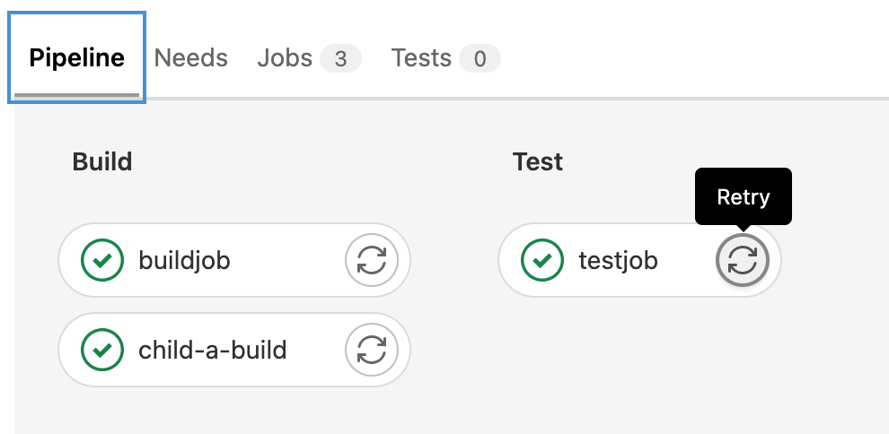

```
...
$ echo "include as external file"
include as external file
$ sleep 10
Job succeeded
```

### `include: template`-引入官方配置

只能使用官方提供的模板 [https://gitlab.com/gitlab-org/gitlab/tree/master/lib/gitlab/ci/templates](https://gitlab.com/gitlab-org/gitlab/tree/master/lib/gitlab/ci/templates)

```
include:
  - template: Auto-DevOps.gitlab-ci.yml
```

用于通过`HTTP/HTTPS`包含来自其他位置的文件，并使用完整URL进行引用. 远程文件必须可以通过简单的GET请求公开访问，因为不支持远程URL中的身份验证架构。

```
include:
  - remote: 'https://gitlab.com/awesome-project/raw/master/.gitlab-ci-template.yml'
```

`demo-mvn-project/.gitlab-ci.yml`

```
include:
  remote: 'http://127.0.0.1:32220/gitlab-instance-8f6af96c/demo-java-service/-/raw/main/.gitlab-ci.yml'
```


### **extends - 继承作业配置**

继承模板作业

```
stages:
  - test
variables:
  RSPEC: 'test'

.tests:
  script: echo "mvn test"
  stage: test
  only:
    refs:
      - branches

testjob:
  extends: .tests
  script: echo "mvn clean test"
  only:
    variables:
      - $RSPEC
```

合并后

```
testjob:
  stage: test
  script: mvn clean test
  only:
    variables:
      - $RSPEC
    refs:
      - branches
```

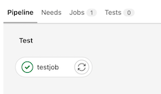

```
$ echo "mvn clean test"
mvn clean test
Job succeeded
```

### **extends&include**

**`ci/localci.yml`**

```
#stages:
#  - deploy

deployjob:
  stage: deploy
  script:
    - echo 'deploy'
  only:
    - dev

.template:
  stage: build
  script: 
    - echo "build"
  only:
    - master
```

```
include:
  local: 'ci/localci.yml'

stages:
  - test
  - build 
  - deploy

variables:
  RSPEC: 'test'

.tests:
  script: echo "mvn test"
  stage: test
  only:
    refs:
      - branches

testjob:
  extends: .tests
  script: echo "mvn clean test"
  only:
    variables:
      - $RSPEC


newbuildjob:
  script:
    - echo "123"
  extends: .template
```

## **trigger 管道触发**

当Gitlab从trigger定义创建的作业启动时，将创建一个下游管道。允许创建多项目管道和子管道。将`trigger`与`when:manual`一起使用会导致错误


* 多项目管道：**跨多个项目设置流水线，以便一个项目中的管道可以触发另一个项目中的管道**。[微服务架构]
* 父子管道：**在同一项目中管道可以触发一组同时运行的子管道，子管道仍然按照阶段顺序执行其每个作业**，但是可以自由地继续执行各个阶段，而不必等待父管道中无关的作业完成。

### **多项目管道**

当前面阶段运行完成后，触发`demo/demo-java-service`项目`master`流水线。

创建上游管道的用户需要具有对下游项目的访问权限。如果发现下游项目用户没有访问权限以在其中创建管道，则`staging`作业将被标记为***失败***。

```
stages:
  - deploy

staging:
  variables:
      ENVIRONMENT: staging
  stage: deploy
  trigger:
      project: gitlab-instance-8f6af96c/demo-java-service
      branch: main
      # strategy: depend
```

* `project`关键字，**用于指定下游项目的完整路径**。该branch关键字指定由指定的项目分支的名称。
* 使用`variables`关键字将变量传递到下游管道。全局变量也会传递给下游项目。
* 上游管道优先于下游管道。如果在上游和下游项目中定义了两个具有相同名称的变量，则在上游项目中定义的变量将优先。
* 默认情况下，一旦创建下游管道，`trigger`作业就会以`success`状态完成。
* **`strategy: depend`将自身状态从触发的管道合并到源作业**。

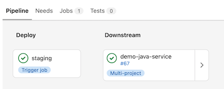


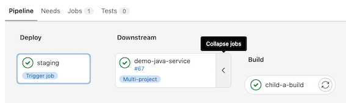

```
...
Executing "step_script" stage of the job script
00:10
$ echo "include from demo-java-service"
include from demo-java-service
$ sleep 10
Job succeeded
```

打开 depend  **`strategy: depend`将自身状态从触发的管道合并到源作业**

```
trigger:
      project: gitlab-instance-8f6af96c/demo-java-service
      branch: main
      strategy: depend
```


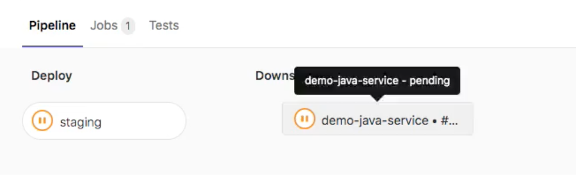


在下游项目中查看管道信息

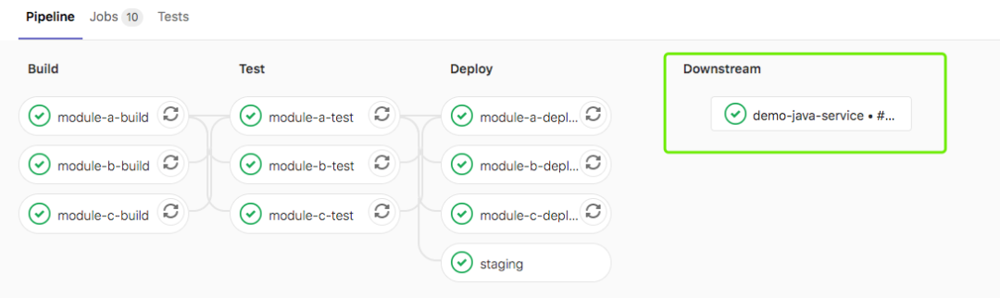

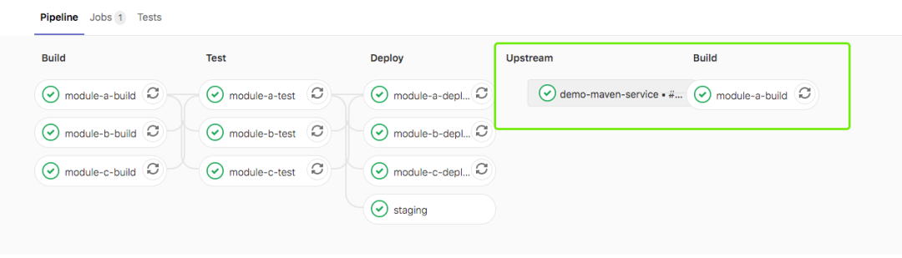

在此示例中，一旦创建了下游管道，该staging将被标记为成功。

### **父子管道 类似于 Include**

**父子流水线在一个项目中**

创建子管道ci/child01.yml

```
stages:
  - build

child-a-build:
  stage: build
  script: 
    - echo "hello3a"
    - sleep 10
```
在父管道触发子管道

```
staging2:
  variables:
    ENVIRONMENT: staging
  stage: deploy
  trigger: 
    include: ci/child01.yml  
    strategy: depend
```

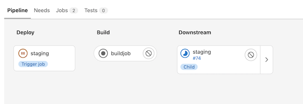

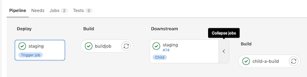

## **7 image/services/environment/inherit**

```
docker run -it -v  /Users/i515190/k8s_test/gitlab/runner-config:/etc/gitlab-runner --network=host --restart=always gitlab/gitlab-runner:v15.1.0 register \
  --non-interactive \
  --executor "shell" \
  --url "http://127.0.0.1:32220/" \
  --registration-token "nzTshoYwsnCttkyzZBxE" \
  --description "devops-runner" \
  --tag-list "newdocker" \
  --run-untagged="true" \
  --locked="false" \
  --access-level="not_protected"
```

一个注册docker执行器类型的runner。可以参考以下命令指定：

```
gitlab-runner register \
  --non-interactive \
  --executor "docker" \
  --docker-image alpine:latest \
  --url "http://127.0.0.1:32220/" \
  --registration-token "JRzzw2j1Ji6aBjwvkxAv" \
  --description "docker-runner" \
  --tag-list "newdocker" \
  --run-untagged="true" \
  --locked="false" \
  --access-level="not_protected"
```

查看所生成的配置文件。

**`vim /etc/gitlab-runner/config.toml`**

```
[[runners]]
  name = "docker-runner"
  url = "http://192.168.1.200:30088/"
  token = "xuaLZD7xUVviTsyeJAWh"
  executor = "docker"
  [runners.custom_build_dir]
  [runners.cache]
    [runners.cache.s3]
    [runners.cache.gcs]
  [runners.docker]
    pull_policy = "if-not-present"
    tls_verify = false
    image = "alpine:latest"
    privileged = false
    disable_entrypoint_overwrite = false
    oom_kill_disable = false
    disable_cache = false
    volumes = ["/cache"]
    shm_size = 0
```
**`pull_policy = "if-not-present"`**

### **image**

默认在注册runner的时候需要填写一个基础的镜像，请记住一点只要使用执行器为docker类型的runner所有的操作运行都会在容器中运行。

如果全局指定了images则所有作业使用此image创建容器并在其中运行。全局未指定image，再次查看job中是否有指定，如果有此job按照指定镜像创建容器并运行，没有则使用注册runner时指定的默认镜像。

```
#image: maven:3.6.3-jdk-8

before_script:
  - ls


build:
  image: maven:3.6.3-jdk-8
  stage: build
  tags:
    - newdocker
  script:
    - ls
    - sleep 2
    - echo "mvn clean "
    - sleep 10

deploy:
  stage: deploy
  tags:
    - newdocker
  script:
    - echo "deploy"
```

### services

工作期间运行的另一个Docker映像，**并link到image关键字定义的Docker映像。这样，您就可以在构建期间访问服务映像**.

服务映像可以运行任何应用程序，但是最常见的用例是运行数据库容器，例如mysql 。与每次安装项目时都安装mysql相比，使用现有映像并将其作为附加容器运行更容易，更快捷。

```
services:
  - name: mysql:latest
    alias: mysql-1
```

### **environment**

声明所部署的环境名称和访问地址，后续可以直接在gitlab 环境变量中查看。非常方便。

```
deploy to production:
  stage: deploy
  script: git push production HEAD:master
  environment:
    name: production
    url: https://prod.example.com
```

```
#       strategy: depend
before_script:
  - ls


build:
  image: maven:3.6.3-jdk-8
  stage: build
  tags:
    - build
  script:
    - ls
    - sleep 2
    - echo "mvn clean "
    - sleep 10

deploy:
  stage: deploy
  tags:
    - deploy
  script:
    - echo "deploy"
  environment:
    name: production
    url: https://www.baidu.com
```

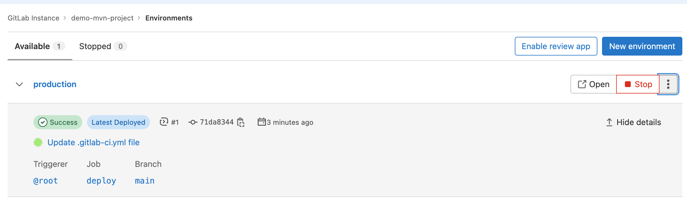

### **inherit**

使用或禁用全局定义的环境变量（variables）或默认值(default)。

使用true、false决定是否使用，默认为true

```
inherit:
  default: false
  variables: false
```

***继承其中的一部分变量或默认值使用list***

```
inherit:
  default:
    - parameter1
    - parameter2
  variables:
    - VARIABLE1
    - VARIABLE2
```


