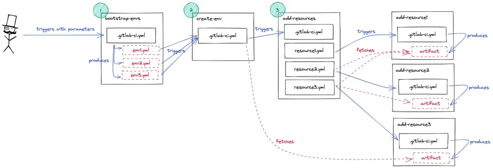
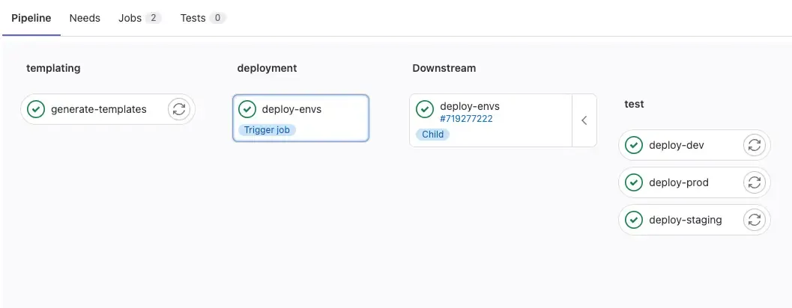

# 3 配置复杂的 Gitlab CI/CD Pipeline

假设您需要部署多个复杂环境，并且计划使用 Gitlab 流水线，该如何操作？在 Padok，我们已经遇到过这个问题，并通过结合多项目动态流水线、工件以及 Gitlab 作业之间的依赖关系解决了这个问题。

本文介绍了我们针对该问题的解决方案、我们开发的组件以及如何安排它们协同工作。目标是创建以下管道结构：



Gitlab是一个基于 Git 的 Web 源代码控制存储库，专为团队协作和生产力而设计。

它是一款非常强大的开发工具，可让您的团队掌控全局，优化工作流程以符合部署 SLA，并提供大量选项来创建复杂的 CI/CD 流水线


## **如何设置动态 Gitlab 管道？**

首先，我们需要一个能够动态运行下游管道的主作业。我们希望根据用户在输入参数中的选择创建任意数量的环境：可以是 1 个，也可以是像本例中那样的 3 个，或者更多。

问题是：如何create-env多次触发该作业？答案是：**使用动态 Gitlab 管道**

GitLab CI 中的动态管道是根据某些条件或参数以编程方式生成的。这意味着管道中的步骤和任务不是固定的，而是可以根据输入或上下文进行更改

例如，您可以使用它们自动运行一个需要执行数百次相同任务的作业，每个实例几乎完全相同，但只有细微的差别。

编写同一作业的每个变体将非常繁琐，几乎不可能。您无需编写数千行代码，而是可以使用Gitlab CI中的动态管道生成它们。

动态管道有助于管理复杂或大型的CI/CD 管道，其中的任务和依赖关系可能因上下文而异。它们允许团队自动化和定制其 CI/CD 流程，从而提高效率和效果。

```
 bootstrap-env/.gitlab-ci.yml
# boostrap-env
# ├── .gitlab-ci.yml   <--
# ├── generate_templates.py
# └── requirements.txt

variables:
ENVIRONMENTS:
description:"User input: comma-separated list of environments"
value:"dev,prod,staging"

stages:
-templating
-deployment

generate-templates:
stage:templating
image:python:3.10
before_script:
    -pipinstall-rrequirements.txt
script:
    -pythongenerate_templates.py--env$ENVIRONMENTS
artifacts:
    paths:
      -environments.yml

deploy-envs:
stage:deployment
trigger:
    include:
      -artifact:environments.yml
        job:generate-templates
strategy:depend
```


在此示例中，我们使用自定义 Python 脚本为 Gitlab CI/CD 作业生成 YAML 配置文件。

**这是流水线的第一阶段：templating。**

在第二阶段deployment，我们使用生成的文件来部署用户最初在ENVIRONMENTS变量中请求的每个环境

**因此，environments.yml 配置文件将包含 3 个作业，每个作业负责创建一个环境：dev、prod 和 staging。**



用户可以输入他们需要的环境，模板阶段将创建与需要引导的环境一样多的作业。

瞧！我们有了 3 个子作业，分别对应我们要求的 3 个环境，但是如何让它们真正创建新的环境呢？

## 如何设置多项目下游 Gitlab 管道？

其次，我们希望目标流水线架构的每个步骤都位于一个专门的 Gitlab 项目中。问题在于告诉 Gitlab：“您能否触发另一个项目的流水线来为我创建一个新环境？” Gitlab 实际上提供了两种不同的方法来实现这一点：使用trigger或调用 API。

在这个例子中，我们需要两者，因为可以触发的下游管道的最大深度为 2，但在这里我们至少需要 3！希望使用 API 触发它们会重置计数器，这样您就可以使用此技术向下移动任意层级。这是一个很酷的技巧，但需要权衡利弊。

**好的一面是，这两种方法在父子表示方面具有类似的行为。正如您在trigger作业中所期望的那样，您可以看到父项目中运行的管道，以及子项目中运行的管道，并带有指向原始项目的链接。**

然而，不利的一面是，当涉及大量变量并需要传递给子管道时，POST 命令语法会变得有点难以理解。

此外，使用 API 调用子管道的父作业不会等待其子管道终止。相反，只要 curl 命令正确执行，它们就会成功退出。当你需要后续阶段的其他作业执行这些步骤时，这可能会成为一个问题。一种解决方法是在 API 调用后添加一个等待循环。

我们研究了多种解决方案，主要是 Shell 脚本中的循环，这些循环调用 Gitlab API 之一来列出项目作业、列出管道作业或列出管道桥，具体取决于您的需要。

```
# bootstrap-env/generated-template.yml

deploy-staging:
environment:staging
variables:
    GITLAB_PROJECT_ID:123456789# the project ID of 'create-env'
    GITLAB_REF:main
script:
    - > 
      curl --request POST
      --form "token=$CI_JOB_TOKEN"
      --form "ref=$GITLAB_REF"
      --form "variables[ENVIRONMENT]=$CI_ENVIRONMENT_NAME"
      "https://gitlab.com/api/v4/projects/$GITLAB_PROJECT_ID/trigger/pipeline"
```


**这样，每个生成的作业都会触发`create-env`管道**。

**我们使用curl调用Gitlab API，并指定token触发多项目管道所需的重要参数，**

例如 。此外，我们传递相关变量：在此示例中，我们需要一个ENVIRONMENT用于后续阶段的变量。

反过来，`create-env`使用以下方式触发`add-resources`：

```
# create-env/.gitlab-ci.yml

stages:
-resources

add-env-resources:
stage:resources
rules:
    -if:$CI_PIPELINE_SOURCE=="pipeline"
trigger:
    project:"$GITLAB_GROUP/add-resources"
    branch:main
    strategy:depend

# [ ... ]
```


对于多项目管道，该trigger关键字接受 

Gitlab project 作为参数，可以是简单字符串，也可以是 project 关键字。此外，值得一提的是，该`trigger:project`语法仅适用于 Gitlab Premium 帐户。该strategy: depend选项使父管道的状态取决于其子管道的状态。

另外，请注意，rules只有当另一个管道触发时，作业才会运行。这有助于避免在代码推送和合并请求时意外创建环境……这些环境可能会迅速演变成非常严重的问题！

在架构的更深处，多项目下游管道将以相同的方式工作：resource1使用trigger逻辑调用add-resource1，依此类推。

问题解决了。然而，当涉及到文物时，事情就变得棘手了。

## 如何在 Gitlab 作业之间传递工件？

最后是工件。我们使用它们来传达有关在整个过程中创建的资源的信息。在此示例中，resource2需要有关 resource1的信息，而resource3需要有关resource1& resource2的信息。

每个管道的末尾都会创建一个工件add-resource#，我们在父级获取它们，以便在创建新资源时将变量传递给其他子级。

请毫不犹豫地查看本文顶部的第一个图表：在本节中，我们将重点关注最右侧，包括所有与资源相关的存储库和管道。

主要挑战之一是作业之间的依赖关系图：父作业必须等待子作业成功退出。然后它们才能获取生成的工件。stages对于同一项目中的作业，使用依赖策略实现起来相对容易：

```
# add-resources/.gitlab-ci.yml
# add-resources
# ├── .gitlab-ci.yml   <--
# ├── resource1.yml
# ├── resource2.yml
# └── resource3.yml

variables:
ARTIFACT_RESOURCE3:"resource3-outputs.zip"
ARTIFACT_RESOURCE2:"resource2-outputs.zip"
ARTIFACT_RESOURCE1:"resource1-outputs.zip"

stages:
-resource1
-resource2
-resource3

add-resource1:
stage:resource1
trigger:
    include:
      -local:"resource1.yml"
    strategy:depend

add-resource2:
stage:resource2
trigger:
    include:
      -local:"resource2.yml"
    strategy:depend

add-resource3:
stage:resource3
trigger:
    include:
      -local:"resource3.yml"
    strategy:depend
 ```
 
 
默认情况下，GitLab 中所有来自先前阶段的工件都会传递到后续阶段。这会导致存储、安全性和流水线速度方面的问题。为了缓解这个问题，您还可以考虑dependencies使用字段来精确指定作业所需的工件。

另一方面，当工作是多项目下游管道中不同项目的一部分时，这种stage方法是不够的，您将不得不使用needs关键字。

```
# add-resources/resource2.yml
# add-resources
# ├── .gitlab-ci.yml
# ├── resource1.yml
# ├── resource2.yml   <--
# └── resource3.yml

variables:
GITLAB_PROJECT:add-resource2
GITLAB_REF:main

# Parse artifacts to get information needed for resource2 pipeline
parse-resource1-artifact:
before_script:
    -apt-getupdate&&apt-getinstall-yzipjq
needs:
    -project:"$GITLAB_GROUP/add-resource1"
      job:add-resource1
      ref:main
      artifacts:true
script:
    -echo"Parsing resource1 artifact from \"$ARTIFACT_RESOURCE1\"..."
    ->
      RESOURCE1_ID=$(unzip -p $ARTIFACT_RESOURCE1 resource1_information.json | jq -r '.id') &&
      echo $RESOURCE1_ID

# Triggers the creation of a new resource2 resource
trigger-resource2-pipeline:
variables:
    RESOURCE1_ID:$RESOURCE1_ID
trigger:
    project:"$GITLAB_GROUP/$GITLAB_PROJECT"
    branch:$GITLAB_REF
    strategy:depend
    forward:
      pipeline_variables:true
needs:
    -parse-resource1-artifact
```


**逻辑needs优先于stage逻辑：这意味着如果同时设置了两个字段，管道将忽略阶段顺序，只关注需求**。

根据官方文档，对于工件也是如此：

“当一项工作使用时needs，它不再默认下载来自先前阶段的所有工件，因为带有的作业 needs可以在先前阶段完成之前开始”。

在这个例子中，我们确保第一个作业在运行实际管道之前从上一步检索工件：在中parse-resource1-artifact，我们下载工件，然后提取一些信息。

为了举例，我们实现了一个简单的解析逻辑，但输出可以是自定义 JSON 文件、日志、Terraform 状态、Kubernetes API 调用……您明白了。


