# **1 模板库设计Maven+NPM**

### MacOS install gitlab-runner

```
sudo curl --output /usr/local/bin/gitlab-runner "https://gitlab-runner-downloads.s3.amazonaws.com/latest/binaries/gitlab-runner-darwin-amd64"

sudo chmod +x /usr/local/bin/gitlab-runner

su - <username>

cd ~

gitlab-runner install --working-directory=~/k8s_test/gitlab/gitlab-runner

gitlab-runner start
```

```
$ gitlab-runner start
Runtime platform                                    arch=amd64 os=darwin pid=87643 revision=32fc1585 version=15.2.1

```

```
gitlab-runner register --non-interactive --executor shell --url http://127.0.0.1:32220/ --registration-token "nzTshoYwsnCttkyzZBxE" --description "local-runner" --tag-list "local" --run-untagged="true" --locked="false" --access-level="not_protected"
```

```
$ gitlab-runner register --non-interactive --executor shell --url http://127.0.0.1:32220/ --registration-token "nzTshoYwsnCttkyzZBxE" --description "local-runner" --tag-list "local" --run-untagged="true" --locked="false" --access-level="not_protected"
Runtime platform                                    arch=amd64 os=darwin pid=88396 revision=32fc1585 version=15.2.1
WARNING: Running in user-mode.                     
WARNING: Use sudo for system-mode:                 
WARNING: $ sudo gitlab-runner...                   
                                                   
Registering runner... succeeded                     runner=nzTshoYw
Runner registered successfully. Feel free to start it, but if it's running already the config should be automatically reloaded!
 
Configuration (with the authentication token) was saved in "/Users/i515190/.gitlab-runner/config.toml" 
```

```
$ gitlab-runner verify
Runtime platform                                    arch=amd64 os=darwin pid=88442 revision=32fc1585 version=15.2.1
WARNING: Running in user-mode.                     
WARNING: Use sudo for system-mode:                 
WARNING: $ sudo gitlab-runner...                   
                                                   
Verifying runner... is alive                        runner=kj_hvL6s
```

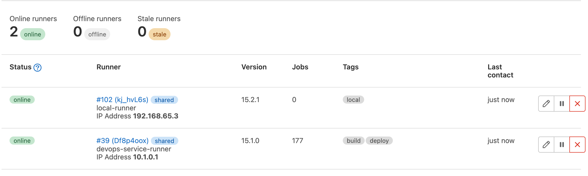


### Install maven-docker  gitlab-runner 

```
gitlab-runner register  --non-interactive  \
--executor="docker" \
--custom_build_dir-enabled="true" \
--docker-image="maven:latest" \
--url="http://127.0.0.1:32220/" \
--registration-token="nzTshoYwsnCttkyzZBxE" \
--description="docker-runner" \
--tag-list="docker" \
--run-untagged="true" \
--locked="false" \
--docker-network-mode="gitlabnetwork" \
--cache-dir="/cache" \
--docker-disable-cache="true" \
--docker-volumes="gitlab-runner-builds:~/k8s_test/gitlab/gitlab-runner" \
--docker-volumes="gitlab-runner-cache:~/k8s_test/gitlab/gitlab-runner" \
--docker-privileged="true" \
--docker-volumes="/var/run/docker.sock:/var/run/docker.sock"
```

## **模板库设计**

为了实现模板复用，减少重复代码。本次课程开始我们将使用模板库来完成流水线。开始之前还是要把语法学好便于进一步实施。

创建一个git仓库用于存放模板`demo/demo-gitlabci-service` ，然后创建一个`template`目录存放所有`pipeline`的模板，创建一个`jobs`目录存放job模板。

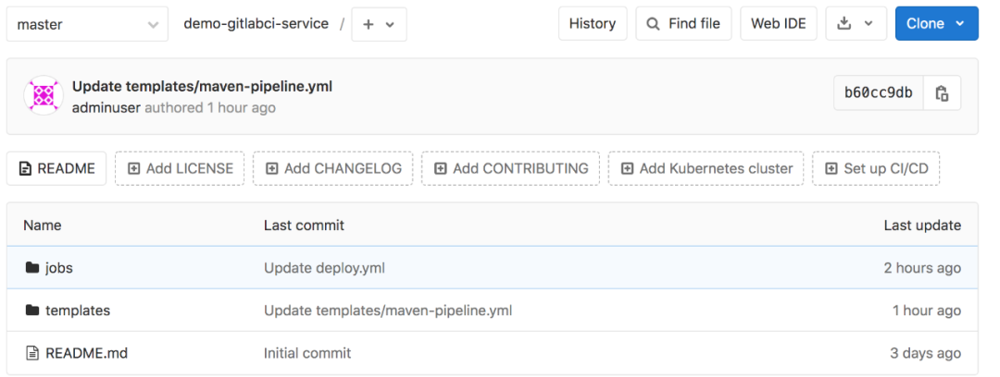

这样我们可以将一些maven、ant、gradle、npm工具通过一个job模板和不同的构建命令实现。

templates的好处是我们在其中定义了模板流水线，这些流水线可以直接让项目使用。当遇到个性化项目的时候就可以在当前项目创建`.gitlab-ci.yml`文件来引用模板文件，再进一步实现个性化需要。

* 创建一个git仓库用于存放模板
* 创建一个template目录存放所有pipeline的模板
* 创建一个jobs目录存放jiob模板。

### 创建一个Project URL / Project slug

* cidevops
* cidevops-gitlabci-service

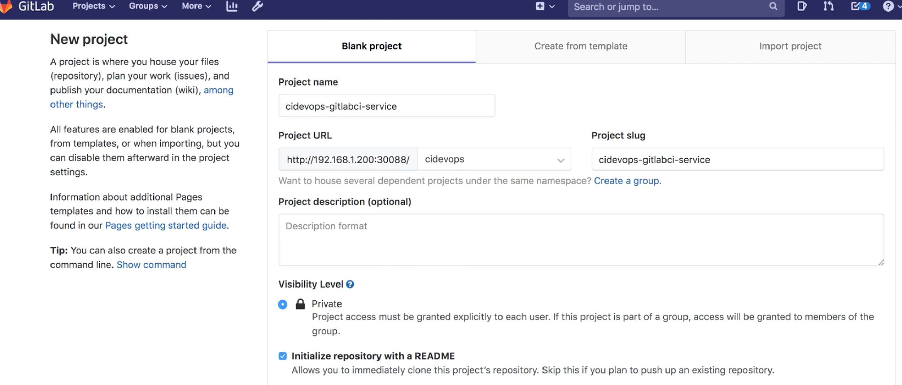

## **工具链集成-构建工具集成**

**内容大纲**

* 后端项目Maven集成
* 前端项目Npm集成

### 集成构建工貝

构建工具是用来将代码编译打包成制品的工具。

例如前端项目我们一般使用npm进行打包，后端Java项目我们一般使用maven、gradle进行打包。

构建工具很多很多，但是集成到gitlab中是一样的。所以这里简单介绍使用gitlabCI集成npm/maven完成前后端项目的构建。

**软件包下载**

* maven软件包下载
* gradle软件包下载
* ant软住包下载
* node软件包下载


### **环境配置**

首先，我们需要在runner机器中安装配置好apache-maven。

```
#解压
tar zxf apache-maven-xxxx.tar.qz -C /usr/local
tar zxf gradle-xxxx.tar.gz -C /usr/local
tar zxf node-xxxxx.tar.gz -C /usr/local
tar zxf apache-ant-xxxx.tar.gz -C /usr/local

#添加环境变量
vim /etc/profile

export MAVEN_HOME=/usr/local/apache-maven-3.6.0
export ANT_HOME=/usr/local/apache-ant-1.10.5
export GRADLE_HOME=/usr/local/gradle-5.3
export NODE_HOME=/usr/local/node-v10.15.3-linux-x64
export JAVA_HOME=/usr/local/jdk1.8.0_201
export PATH=$PATH:$MAVEN_HOME/bin:$ANT_HOME/bin:$GRADLE_HOME/bin:$NODE_HOME/bin
export PATH=$PATH:$JAVA_HOME/bin

＃ 生效全局环境变量
source /etc/profile
```

```
mvn -v
Apache Maven 3.6.3 (cecedd343002696d0abb50b32b541b8a6ba2883f)
Maven home: /usr/local/buildtools/apache-maven-3.6.3
...
```

### Maven集成

* 环境基础配置
* 创建build作业模板

[https://github.com/zeyangli/gitlabci-templates](https://github.com/zeyangli/gitlabci-templates)

* jobs  : 作业模板目录
* template : 流水线模板目录

```
jobs/
--- build.yml
--- codeanalysis.yml
--- test.yml
```

```
templates/
--- java-pipeline.yml
--- k8s-java-pipeline.yml
web-pipeline.yml
```


**使用方法**

* 标准模板： 系统设置 -> CICD -> General pipelines -> Custom CI configuration path
* 个性化： 使用include引入模板文件，进行自定义参数控制。


**`gitlabci-templates/jobs/build.yml`**


我们首先在jobs目录中创建一个`build.yml`，然后在里面编写`build`作业模板。

```
.build:
  stage: build
  tags:
    - build
  script: 
    - $BUILD_SHELL
    - ls
```

**`gitlabci-templates/jobs/test.yml`**


**我们计划将测试相关的job都定义在jobs/test.yml中，我们开始创建并编写test作业。运行测试shel并收集单元测试报告。**

```
#单元测试
.test:
  stage: test
  tags:
    - build
  script:
    - $TEST_SHELL
    - ls 
  artifacts:
    reports:
      junit: ${JUNIT_REPORT_PATH}
```

### **`gitlabci-cidevops-java-service`**

**`demo-gitlabci-service/templates/java-pipeline.yml`**

```
include:
  - project: 'cidevops/cidevops-gitlabci-service'
    ref: master
    file: 'jobs/build.yml'
  - project: 'cidevops/cidevops-gitlabci-service'
    ref: master
    file: 'jobs/test.yml'
  - project: 'cidevops/cidevops-gitlabci-service'
    ref: master
    file: 'jobs/codeanalysis.yml'

variables:
  BUILD_SHELL: 'mvn clean package  -DskipTests'  ##构建命令
  CACHE_DIR: 'target/'
  TEST_SHELL : 'mvn test'                                   ##测试命令
  JUNIT_REPORT_PATH: 'target/surefire-reports/TEST-*.xml'   ##单元测试报告
  # 代码扫描
  SCANNER_HOME : "/usr/local/buildtools/sonar-scanner-3.2.0.1227-linux"
  SCAN_DIR : "src"
  ARTIFACT_PATH : 'target/*.jar'                            ##制品目录

  #上传制品库
  ARTIFACTORY_URL: "http://192.168.1.200:30082/artifactory"
  ARTIFACTORY_NAME: "cidevops"
  TARGET_FILE_PATH: "$CI_PROJECT_NAMESPACE/$CI_PROJECT_NAME/$CI_COMMIT_REF_NAME-$CI_COMMIT_SHORT_SHA-$CI_PIPELINE_ID"
  TARGET_ARTIFACT_NAME: "$CI_PROJECT_NAME-$CI_COMMIT_REF_NAME-$CI_COMMIT_SHORT_SHA-$CI_PIPELINE_ID.jar"

  #构建镜像
  CI_REGISTRY: 'registry.cn-beijing.aliyuncs.com'
  CI_REGISTRY_USER: '610556220zy'
  #CI_REGISTRY_PASSWD: 'xxxxxxxx.'
  IMAGE_NAME: "$CI_REGISTRY/$CI_PROJECT_PATH:$CI_COMMIT_REF_NAME-$CI_COMMIT_SHORT_SHA-$CI_PIPELINE_ID"
  DOCKER_FILE_PATH: "./Dockerfile"


  
cache:
  paths:
    - ${CACHE_DIR}
    
stages:
  - build
  - test
  - parallel01
  - down_artifact


build:
  stage: build
  extends: .build
  rules:
    - when: on_success


test:
  stage: test
  extends: .test
  rules:
    - when: on_success

  
code_analysis:
  stage: parallel01
  extends: .codeanalysis-java
  
codeanalysis_mr:
  stage: parallel01
  extends: .codeanalysis-mr
  
deploy_artifact:
  stage: parallel01
  extends: .deploy-artifact
  
down_artifact:  
  stage: down_artifact
  extends: .down-artifact


build_image:
  stage: parallel01
  extends: .build-docker
```

[https://github.com/zeyangli/gitlabci-cidevops-java-service](https://github.com/zeyangli/gitlabci-cidevops-java-service)

**`gitlabci-cidevops-java-service/.gitlab-ci.yml`**

```
include:
  - project: 'cidevops/cidevops-gitlabci-service'
    ref: master
    file: 'jobs/build.yml'
     #  file: 'templates/k8s-java-pipeline.yml'
  - project: 'cidevops/cidevops-gitlabci-service'
    ref: master
    file: 'jobs/test.yml'
       
    
variables:
  BUILD_SHELL: 'mvn clean package  -DskipTests'  
  CACHE_DIR: 'target/'
  TEST_SHELL: 'mvn test'     ##测试命令
  JUNIT_REPORT_PATH: 'target/surefire-reports/TEST-*.xml'  #单元测试报告

cache:
	paths:
		- ${CACHE_DIR}
stages:
	- build
	- test

build:
  stage: build
  extends: .build
  
build:
  stage: test
  extends: .test
```

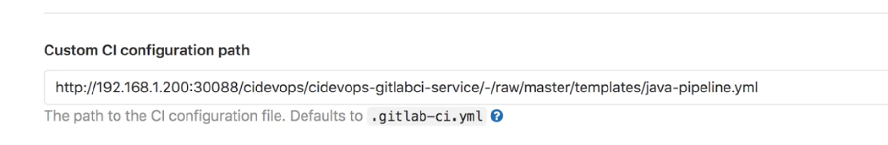

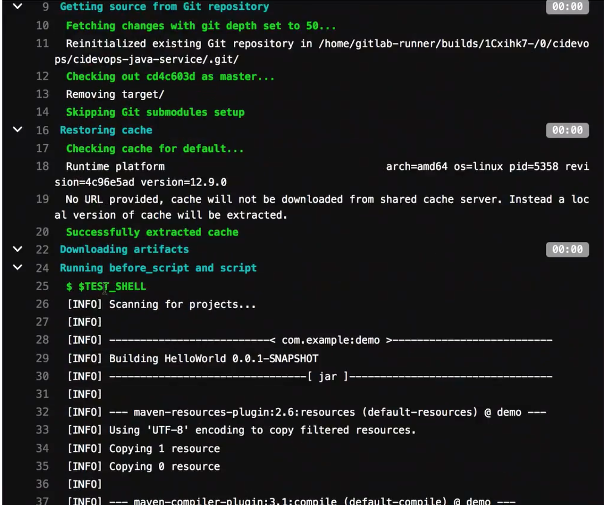

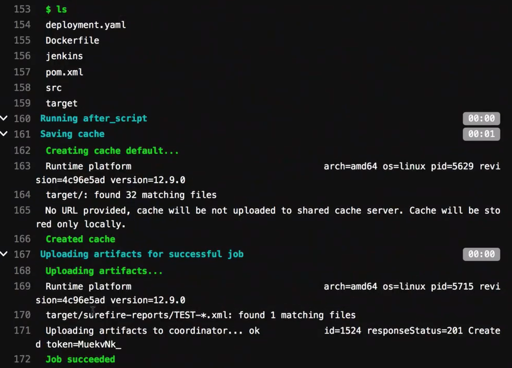


## **解决远程使用YAML的问题**

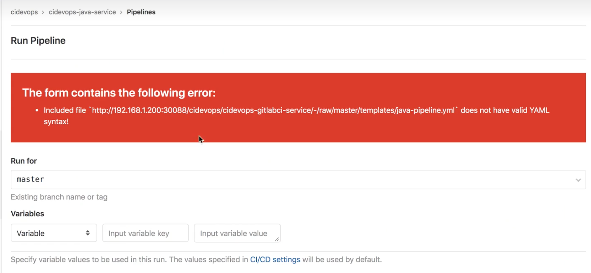

**将 Template 的 被引用的Repo 改为 Public**

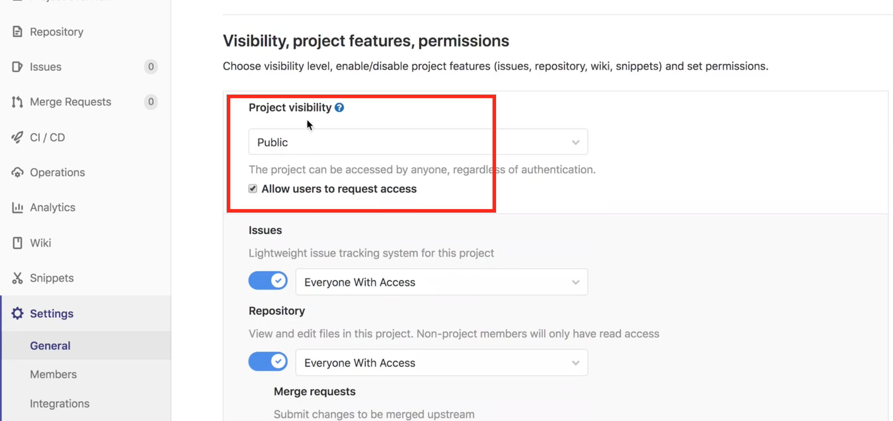

Building Processed 

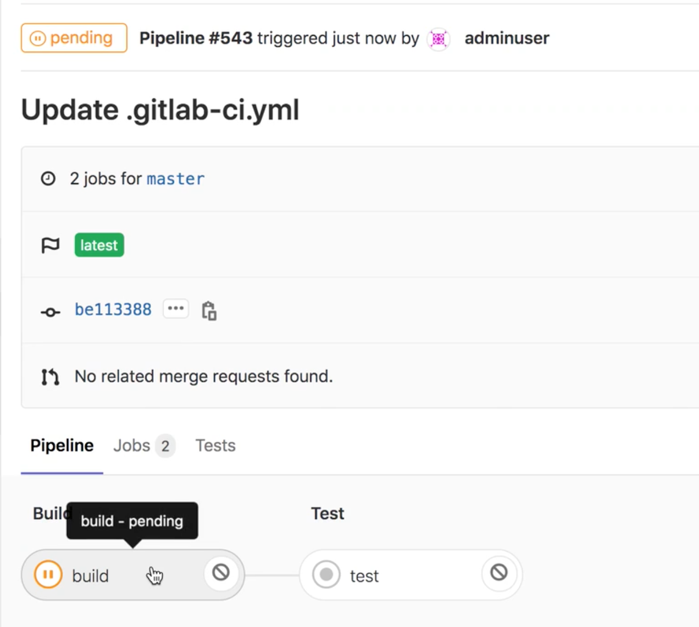

## **NPM 构建工具集成**

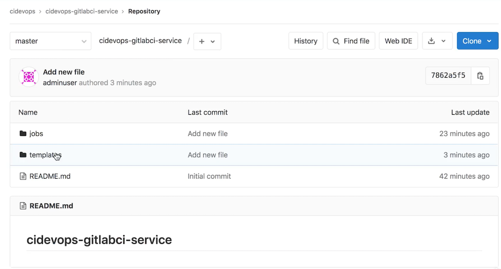

### **环境基础配置**

**确保Node已经安装好**

```
npm -v
6.13 4
```

### **扩展模板库前端代码**

`demo-gitlabci-service/templates/`

**`demo-gitlabci-service/templates/web-pipeline.yml`**

```
include:
  - project: 'cidevops/cidevops-gitlabci-service'
    ref: master
    file: 'jobs/build.yml'
    
variables:
  BUILD_SHELL: 'npm run build'     ##构建命令                                   
  CACHE_DIR  : "dist/"             ##构建缓存
  

cache:
  paths:
    - ${CACHE_DIR}
    - node_modules/
    
stages:
  - install
  - build
  
install:
  stage: install
  script:
    - 'npm install'
    
build:
  stage: build
  extends: .build
```

### 运行Pipeline

[gitlabci-cidevops-npm-service](https://github.com/zeyangli/gitlabci-cidevops-npm-service)

```
http://127.0.0.1: 32220/cidevops/cidevops-gitlabci-service/-/raw/master/templates/web-pipeline.yml
```

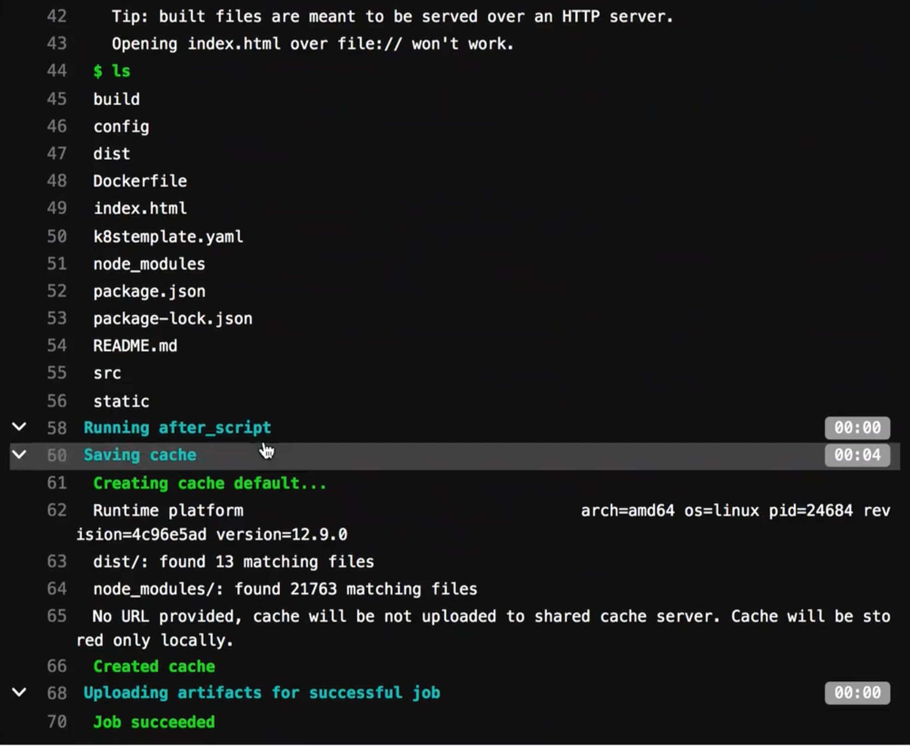