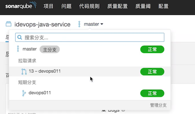
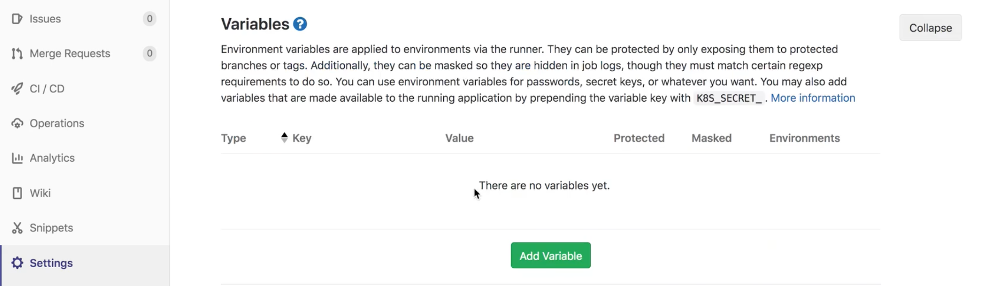
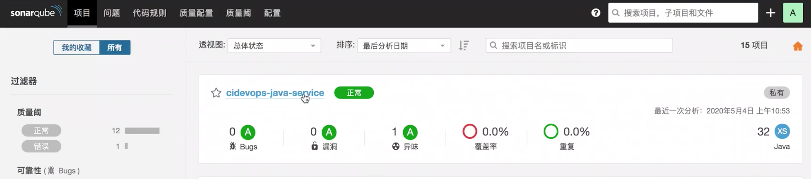
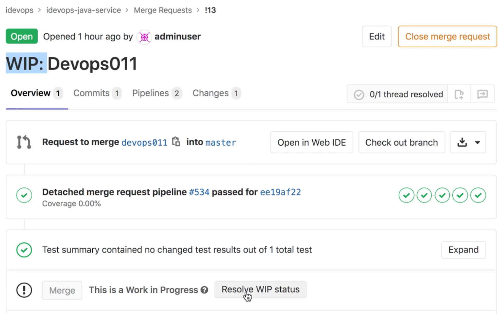
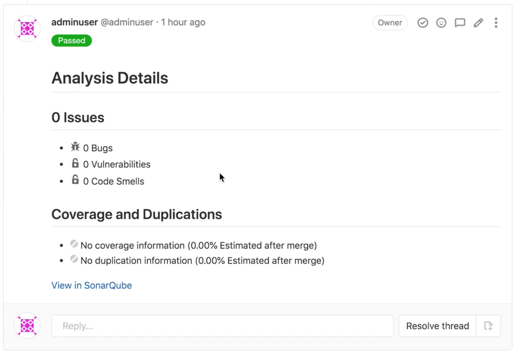
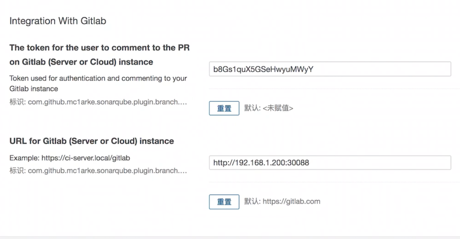
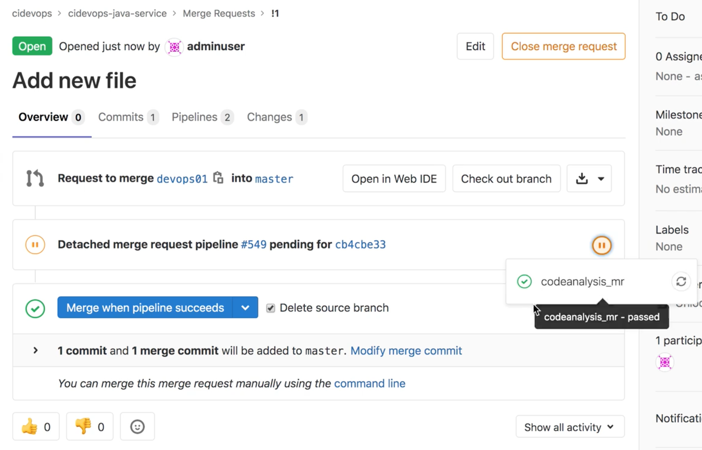
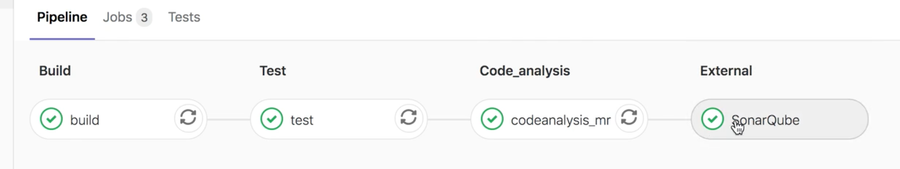

# **2 Gitlab 工具链集成-代码质量平台集成**

## **1 集成 SonarQube 代码扫描**

* 安装sonarscanner
* 创建codeanalysis.yml
* 完善流水线模板
* 运行测试


### **sonar scanner**

确保SonarQube在Runner已经安装成功

`sonar-scanner-3.2.0.1227-linux`

```
#添加环境变量
vim /etc/profile

...
export SONAR_HOME=/usr/local/buildtools/sonar-scanner-3.2.0.1227-linux/
...

＃ 生效全局环境变量
source /etc/profile
```

**Check sonar-scanner 安装成功**

```
# sonar-scanner
INFO: Scanner configuration file: /usr/local/buildtools/sonar-:
nf/sonar-scanner.properties
INFO: Project root configuration file: NONE
INFO: SonarQube Scanner 3.2.0.1227
INFO: Java 1.8.0_121 Oracle Corporation (64-bit)
INFO: Linux 4.18.0-80.e18.x86_64 amd64
INFO: User cache: /root/.sonar/cache
INFO: SonarQube server 7.9.2   ***
INFO: Default locale:
"en_US", source code encoding:
"US-ASCII" (analysis is platform dependent)
NARN: SonarScanner will require Java 11 to run starting in SonarQube 8.x
INFO: Load global settings
INFO: Load global settings (done) I time=47ms
INFO: Server id: BF41A1F2-AW9CCsOxWpKYgNGe87wL
INFO: User cache: /root/.sonar/cache    ***
INFO: Load/download plugins
INFO: Load plugins index
INFO: Load plugins index (done) I time=32ms
```

* 参考链接: https://docs.sonarqube.org/latest/analysis/gitlab-cicd/
* **扩展插件（sonarqube multiple branch）**： https://github.com/mc1arke/sonarqube-community-branch-plugin/releases

### **创建codeanalysis.yml**

* jobs  : 作业模板目录
* template : 流水线模板目录

```
jobs/
--- build.yml
--- codeanalysis.yml
--- test.yml
```

```
templates/
--- java-pipeline.yml
--- k8s-java-pipeline.yml
web-pipeline.yml
```

**`jobs/codeanalysis.yml`**

```
.codeanalysis-java:
  stage: code_analysis
  tags:
    - build
  script:
    - echo $CI_MERGE_REQUEST_IID $CI_MERGE_REQUEST_SOURCE_BRANCH_NAME  $CI_MERGE_REQUEST_TARGET_BRANCH_NAME
    - "$SCANNER_HOME/bin/sonar-scanner -Dsonar.projectKey=${CI_PROJECT_NAME} \
                                      -Dsonar.projectName=${CI_PROJECT_NAME} \
                                      -Dsonar.projectVersion=${CI_COMMIT_REF_NAME} \
                                      -Dsonar.ws.timeout=30 \
                                      -Dsonar.projectDescription=${CI_PROJECT_TITLE} \
                                      -Dsonar.links.homepage=${CI_PROJECT_URL} \
                                      -Dsonar.sources=${SCAN_DIR} \
                                      -Dsonar.sourceEncoding=UTF-8 \
                                      -Dsonar.java.binaries=target/classes \
                                      -Dsonar.java.test.binaries=target/test-classes \
                                      -Dsonar.java.surefire.report=target/surefire-reports \
                                      -Dsonar.branch.name=${CI_COMMIT_REF_NAME}"
  artifacts:
    paths:
      - "$ARTIFACT_PATH"
```

**准备工作**


在 SonarQube 项目组添加用户，为用户分配权限。使用用户token分析扫描项目

```
cd sonar
cd extensions/plugins/
...
sonarqube-community-branch-plugin-1.2.0. jar
...
```


扫描参数增加  `-Dsonar.branch.name=`

**Sonar 实现效果**



**`templates/java-pipeline.yml`**

```
include:
  - project: 'cidevops/cidevops-gitlabci-service'
    ref: master
    file: 'jobs/build.yml'
  - project: 'cidevops/cidevops-gitlabci-service'
    ref: master
    file: 'jobs/test.yml'
  - project: 'cidevops/cidevops-gitlabci-service'
    ref: master
    file: 'jobs/codeanalysis.yml'
  
variables:
  BUILD_SHELL: 'mvn clean package  -DskipTests'  ##构建命令
  CACHE_DIR: 'target/'
  TEST_SHELL : 'mvn test'                                   ##测试命令
  JUNIT_REPORT_PATH: 'target/surefire-reports/TEST-*.xml'   ##单元测试报告
  # 代码扫描
  SCANNER_HOME : "/usr/local/buildtools/sonar-scanner-3.2.0.1227-linux"
  SCAN_DIR : "src"
  ARTIFACT_PATH : 'target/*.jar'      

cache:
  paths:
    - ${CACHE_DIR}
    
stages:
  - build
  - test
  - parallel01

build:
  stage: build
  extends: .build
  rules:
    - when: on_success

test:
  stage: test
  extends: .test
  rules:
    - when: on_success

code_analysis:
  stage: parallel01
  extends: .codeanalysis-java
```

**设置Gitlab runner sonarQube登录密码**

```
sonar-scanner-3.2.0.1227-linux?# cd conf/
conf# ls
sonar-scanner.properties

conf# vim sonar-scanner.properties

＃- - - Default SonarQube server
sonar.host.url=http://192.168.1.200:32220
sonar.login=eezbcb37deeb6dfe3a07fe08fb529559b00c1b7b
```

**或者在setting里面配置密码**





## **2 Gitlab Pull 请求集成配置**


**结果 Merge Request 生成 code review 报告**





### **Sonarqube 添加 gitlab provider** 

**配置 SonarQube, 添加gitlabtoken 和服务信息 -> pull request**

```
com.github.mclarke.sonarqube.plugin.branch.pullrequest.gitlab.token=b&Gs1quX5GSeHwyuMWyY
com.github.mclarke.sonarqube.plugin.branch.pullrequest.gitlab.url=http://192.168.1.200:32220
sonar.pullrequest.provider=GitlabServer
```


 如果你想通过AP操作可以参考：
 
```
curl -u  "$ SONAR_API_TOKEN " -X POST "http://sonarqube.example.com/api/settings/set?key=sonar.pullrequest.provider&value=GitlabServer"

curl -u  "$ SONAR_API_TOKEN " -X POST " http://sonarqube.example.com/api/settings/set?key=com.github.mc1arke.sonarqube.plugin.branch.pullrequest.gitlab.url&value=http://gitlab.example.com"

curl -u " $ SONAR_API_TOKEN " -X POST " http: //sonarqube.example.com/api/settings/set?key=com.github.mc1arke.sonarqube.plugin.branch.pullrequest.gitlab.token&value=GITLAB_TOKEN"
```

添加扫描分析参数

**`jobs/codeanalysis.yml`**

```
.codeanalysis-java:
  stage: code_analysis
  tags:
    - build
  script:
    - echo $CI_MERGE_REQUEST_IID $CI_MERGE_REQUEST_SOURCE_BRANCH_NAME  $CI_MERGE_REQUEST_TARGET_BRANCH_NAME
    - "$SCANNER_HOME/bin/sonar-scanner -Dsonar.projectKey=${CI_PROJECT_NAME} \
                                      -Dsonar.projectName=${CI_PROJECT_NAME} \
                                      -Dsonar.projectVersion=${CI_COMMIT_REF_NAME} \
                                      -Dsonar.ws.timeout=30 \
                                      -Dsonar.projectDescription=${CI_PROJECT_TITLE} \
                                      -Dsonar.links.homepage=${CI_PROJECT_URL} \
                                      -Dsonar.sources=${SCAN_DIR} \
                                      -Dsonar.sourceEncoding=UTF-8 \
                                      -Dsonar.java.binaries=target/classes \
                                      -Dsonar.java.test.binaries=target/test-classes \
                                      -Dsonar.java.surefire.report=target/surefire-reports \
                                      -Dsonar.branch.name=${CI_COMMIT_REF_NAME}"
  artifacts:
    paths:
      - "$ARTIFACT_PATH"


.codeanalysis-mr:
  stage: code_analysis
  only:
    - merge_requests
  tags:
    - build
  script:
    - echo $GIT_DEPTH
    - echo $CI_MERGE_REQUEST_IID $CI_MERGE_REQUEST_SOURCE_BRANCH_NAME  $CI_MERGE_REQUEST_TARGET_BRANCH_NAME
    - echo "$SCANNER_HOME/bin/sonar-scanner -Dsonar.projectKey=${CI_PROJECT_NAME} \
                                      -Dsonar.projectName=${CI_PROJECT_NAME} \
                                      -Dsonar.projectVersion=${CI_COMMIT_REF_NAME} \
                                      -Dsonar.ws.timeout=30 \
                                      -Dsonar.projectDescription=${CI_PROJECT_TITLE} \
                                      -Dsonar.links.homepage=${CI_PROJECT_URL} \
                                      -Dsonar.sources=${SCAN_DIR} \
                                      -Dsonar.sourceEncoding=UTF-8 \
                                      -Dsonar.java.binaries=target/classes \
                                      -Dsonar.java.test.binaries=target/test-classes \
                                      -Dsonar.java.surefire.report=target/surefire-reports \
                                      -Dsonar.pullrequest.key=${CI_MERGE_REQUEST_IID} \
                                      -Dsonar.pullrequest.branch=${CI_MERGE_REQUEST_SOURCE_BRANCH_NAME} \
                                      -Dsonar.pullrequest.base=${CI_MERGE_REQUEST_TARGET_BRANCH_NAME} "
    - "$SCANNER_HOME/bin/sonar-scanner -Dsonar.projectKey=${CI_PROJECT_NAME} \
                                      -Dsonar.projectName=${CI_PROJECT_NAME} \
                                      -Dsonar.projectVersion=${CI_COMMIT_REF_NAME} \
                                      -Dsonar.ws.timeout=30 \
                                      -Dsonar.projectDescription=${CI_PROJECT_TITLE} \
                                      -Dsonar.links.homepage=${CI_PROJECT_URL} \
                                      -Dsonar.sources=${SCAN_DIR} \
                                      -Dsonar.sourceEncoding=UTF-8 \
                                      -Dsonar.java.binaries=target/classes \
                                      -Dsonar.java.test.binaries=target/test-classes \
                                      -Dsonar.java.surefire.report=target/surefire-reports \
                                      -Dsonar.pullrequest.key=${CI_MERGE_REQUEST_IID} \
                                      -Dsonar.pullrequest.branch=${CI_MERGE_REQUEST_SOURCE_BRANCH_NAME} \
                                      -Dsonar.pullrequest.base=${CI_MERGE_REQUEST_TARGET_BRANCH_NAME}  \
                                      -Dsonar.gitlab.ref_name=${CI_COMMIT_REF_NAME} \
                                      -Dsonar.gitlab.commit_sha=${CI_COMMIT_SHA}  \
                                      -Dsonar.gitlab.project_id=${CI_PROJECT_PATH} \
                                      -Dsonar.pullrequest.gitlab.repositorySlug=$CI_PROJECT_ID "
                                      
                                      #-Dsonar.branch.name=${CI_COMMIT_REF_NAME} -X "
```

**`templates/java-pipeline.yml`**

```
....
codeanalysis_mr:
  stage: parallel01
  extends: .codeanalysis-mr
```




