# **3 工具链集成-制品库集成**

* Artifactory仓库集成
* 云镜像仓库集成

## Artifactory仓库集成

**Create JFrog Artifactory** 

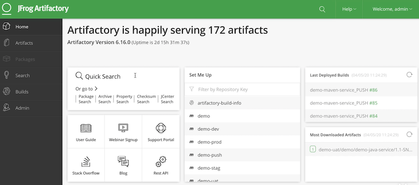

**Create one repo  `cidevops`**

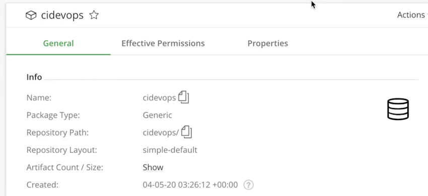

**Upload & Download**

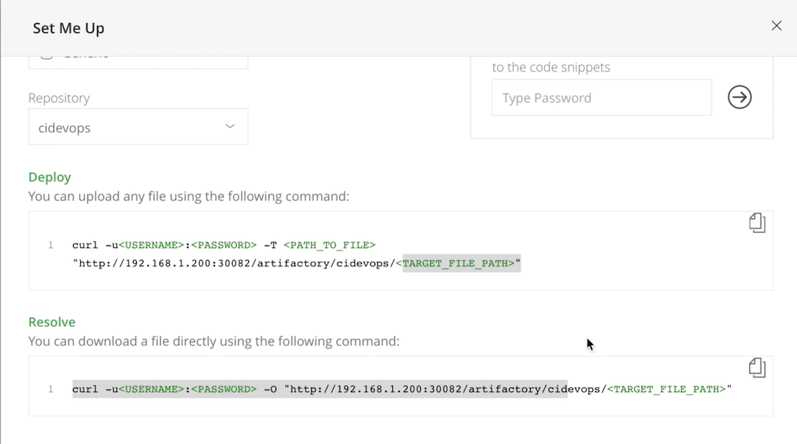

### artifactory: **`gitlabci-templates/jobs/build.yml`**

```
.build:
  stage: build
  tags:
    - build
  script: 
    - $BUILD_SHELL
    - ls
    
    

.deploy-artifact:
  stage: deploy-artifact
  tags:
    - build
  script:
    - curl -u${ARTIFACT_USER}:${ARTIFACT_PASSWD} -T ${ARTIFACT_PATH} "$ARTIFACTORY_URL/$ARTIFACTORY_NAME/$TARGET_FILE_PATH/$TARGET_ARTIFACT_NAME"


.down-artifact:
  stage: down-artifact
  tags:
    - build
  script:
    - curl -u${ARTIFACT_USER}:${ARTIFACT_PASSWD} -O "$ARTIFACTORY_URL/$ARTIFACTORY_NAME/$TARGET_FILE_PATH/$TARGET_ARTIFACT_NAME"
    - ls

.build-docker:
  stage: buildimage
  tags:
    - build
  script:
    - docker login -u $CI_REGISTRY_USER -p $CI_REGISTRY_PASSWD  $CI_REGISTRY
    - docker build -t ${IMAGE_NAME} -f ${DOCKER_FILE_PATH} .
    - docker push ${IMAGE_NAME} 
    - docker rmi ${IMAGE_NAME} 
```


###  **`cidevops-java-service/templates/java-pipeline.yml`**

```
include:
  - project: 'cidevops/cidevops-gitlabci-service'
    ref: master
    file: 'jobs/build.yml'
  - project: 'cidevops/cidevops-gitlabci-service'
    ref: master
    file: 'jobs/test.yml'
  - project: 'cidevops/cidevops-gitlabci-service'
    ref: master
    file: 'jobs/codeanalysis.yml'

variables:
  BUILD_SHELL: 'mvn clean package  -DskipTests'  ##构建命令
  CACHE_DIR: 'target/'
  TEST_SHELL : 'mvn test'                                   ##测试命令
  JUNIT_REPORT_PATH: 'target/surefire-reports/TEST-*.xml'   ##单元测试报告
  # 代码扫描
  SCANNER_HOME : "/usr/local/buildtools/sonar-scanner-3.2.0.1227-linux"
  SCAN_DIR : "src"
  ARTIFACT_PATH : 'target/*.jar'                            ##制品目录

  #上传制品库
  ARTIFACTORY_URL: "http://192.168.1.200:30082/artifactory"
  ARTIFACTORY_NAME: "cidevops"
  TARGET_FILE_PATH: "$CI_PROJECT_NAMESPACE/$CI_PROJECT_NAME/$CI_COMMIT_REF_NAME-$CI_COMMIT_SHORT_SHA-$CI_PIPELINE_ID"
  TARGET_ARTIFACT_NAME: "$CI_PROJECT_NAME-$CI_COMMIT_REF_NAME-$CI_COMMIT_SHORT_SHA-$CI_PIPELINE_ID.jar"

  
cache:
  paths:
    - ${CACHE_DIR}
    
stages:
  - build
  - test
  - parallel01
  - down_artifact


build:
  stage: build
  extends: .build
  rules:
    - when: on_success


test:
  stage: test
  extends: .test
  rules:
    - when: on_success

  
code_analysis:
  stage: parallel01
  extends: .codeanalysis-java
  
codeanalysis_mr:
  stage: parallel01
  extends: .codeanalysis-mr
  
deploy_artifact:
  stage: parallel01
  extends: .deploy-artifact
  
down_artifact:  
  stage: down_artifact
  extends: .down-artifact
```

**`cidevops-java-service`: Gitlab add jfrog `ARTIFACT_USER` and `ARTIFACT_PASSWD`**

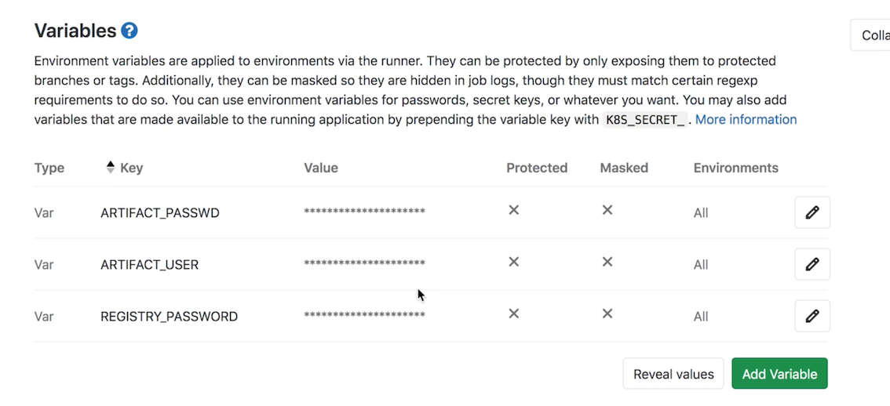

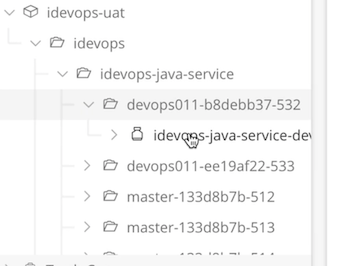

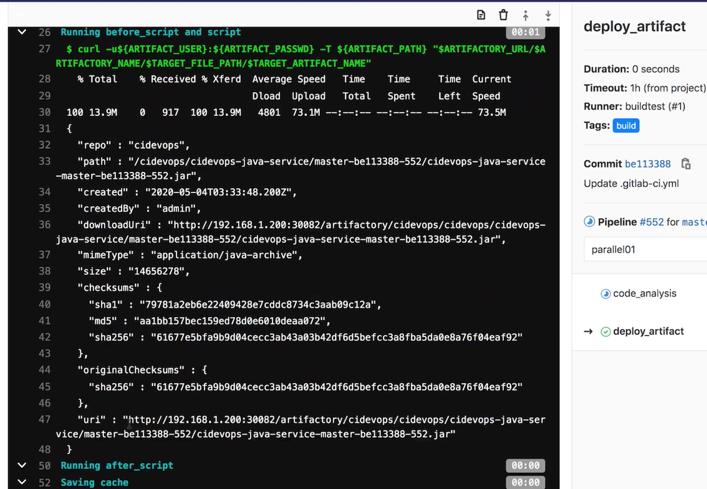

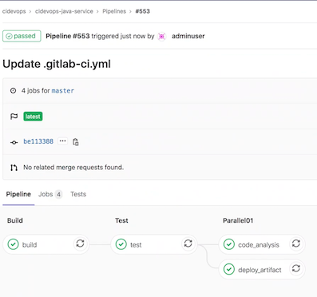

* **上传制品**

```
.deploy-artifact:
  stage: deploy-artifact
  tags:
    - build
  script:
    - curl -u${ARTIFACT_USER}:${ARTIFACT_PASSWD} -T ${ARTIFACT_PATH} "$ARTIFACTORY_URL/$ARTIFACTORY_NAME/$TARGET_FILE_PATH/$TARGET_ARTIFACT_NAME"
```

* **下载制品**

```
.down-artifact:
  stage: down-artifact
  tags:
    - build
  script:
    - curl -u${ARTIFACT_USER}:${ARTIFACT_PASSWD} -O "$ARTIFACTORY_URL/$ARTIFACTORY_NAME/$TARGET_FILE_PATH/$TARGET_ARTIFACT_NAME"
    - ls
```

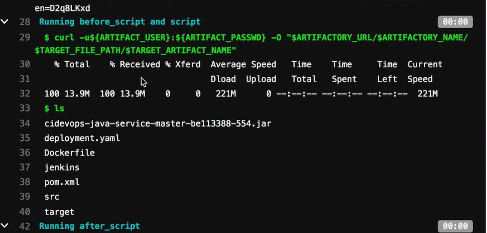

## Docker镜像仓库集成

[https://cr.console.aliyun.com/cn-beijing/instances/repositories](https://cr.console.aliyun.com/cn-beijing/instances/repositories)

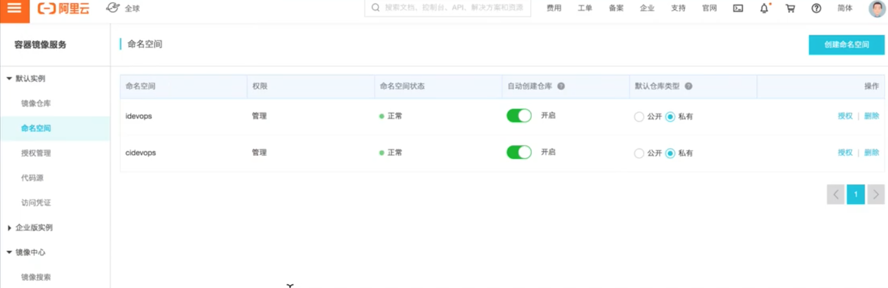

**`cidevops-java-service`: Gitlab add jfrog `GIT_REGISTRY_PASSWD`** 

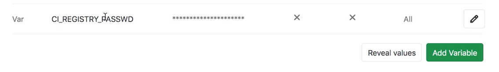

###  **`cidevops-java-service/templates/java-pipeline.yml`**

```
...

#构建镜像
CI_REGISTRY: 'registry.cn-beijing.aliyuncs.com'
CI_REGISTRY_USER: '610556220zy'
#CI_REGISTRY_PASSWD: 'xxxxxxxx.'
IMAGE_NAME: "$CI_REGISTRY/$CI_PROJECT_PATH:$CI_COMMIT_REF_NAME-$CI_COMMIT_SHORT_SHA-$CI_PIPELINE_ID"
DOCKER_FILE_PATH: "./Dockerfile"
...
build_image:
  stage: parallel01
  extends: .build-docker
```

**`cidevops-java-service/Dockerfile`**

```
FROM  openjdk:8-alpine
MAINTAINER devops

ADD target/*.jar /app.jar

# 执行命令
ENTRYPOINT ["java","-jar","/app.jar"]
```

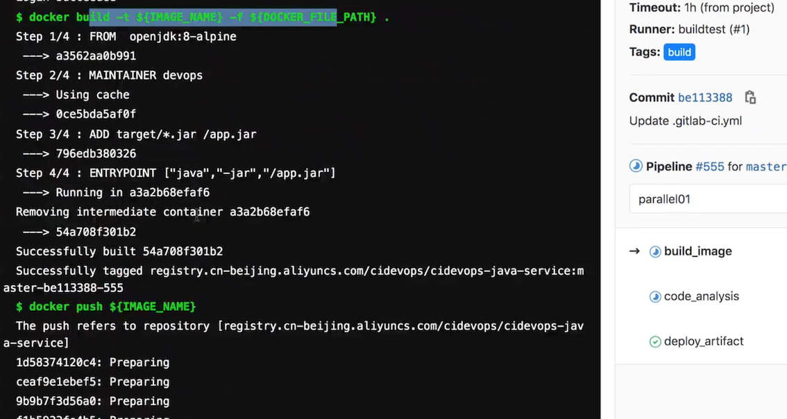

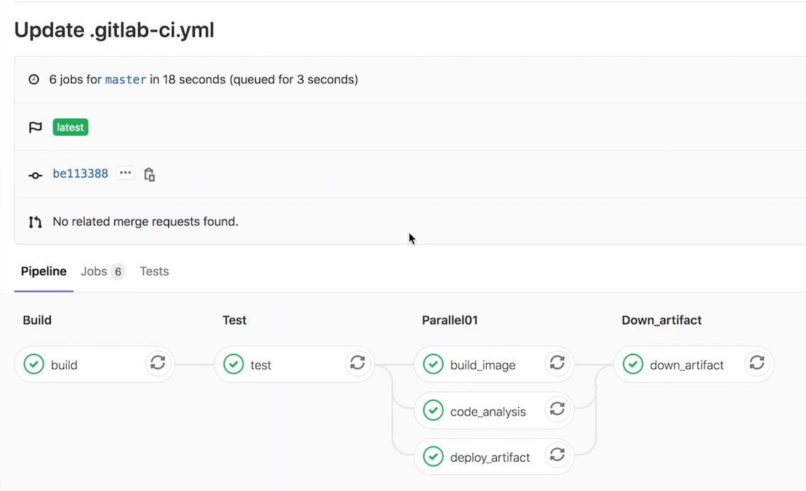
