# **4 Gitlab 自动化测试集成**

## **1 CI工具链集成-自动化测试**

* Jmeter接口测试简介
* GitlabCI集成自动化测试

> 接口测试简介

* jmeter运行接口测试
* ant + jmetert批量接口测试
* 集成CI自动化测试
* 展示测试报告

### **接口测试**


**接口**

* 接口测试定义为一种软件测试类型，用于验证两个不同软件系统之问的通信是否正确完成
* 集成两个组件的连接称为接口。**计算机世界中的此接口可以是API，Web服务等之类的东西。这些连接服务或接口的测试称为接口测试**
* **接口实际上是由一组命令，消息和其他允许设备与用户之问进行通信的属性组成的软件**。

### jmeter

* wget
* tar zxf
* export
* source


### **Jmeter接口测试**

```
# jmeter
=============================================
Don't use GUI mode for load testing !, only for Test creation and Test debugging.
For load testing, use CLI Mode (was NON GUI):
jmeter -n -t Ljmx file] -1 [results file] -e -o [Path to web report folder]
& increase Java Heap to meet your test requirements:
Modify current env variable HEAP="-Xms1g
-Xmx1g -XX:MaxMetaspaceSize=256m" in the jmeter batch file
Check: https://jmeter.apache.org/usermanual/best-practices.html
=============================================
```

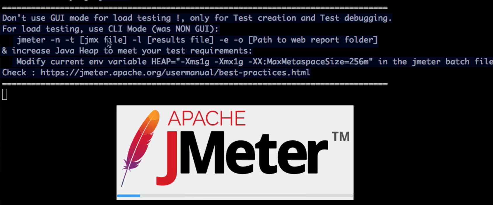

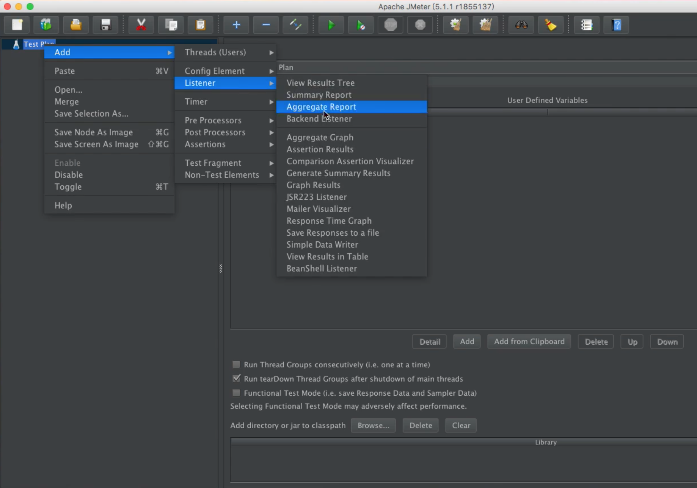

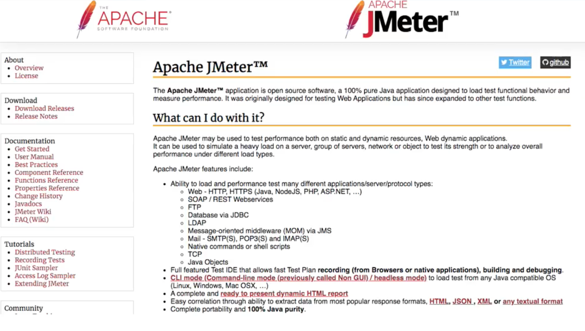

**GUI模式运行测试用例**

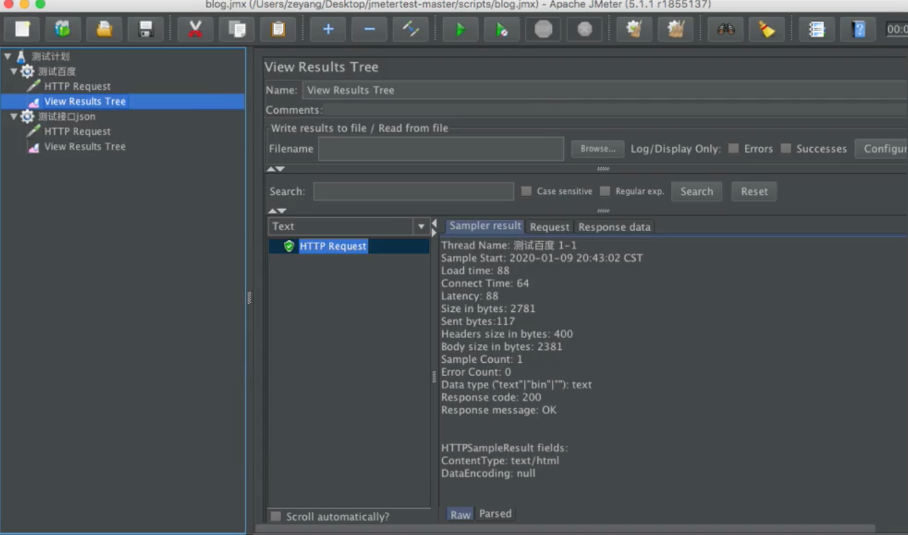

**非GUI模式运行测试用例**

参数说明：

* `-n`：非GUI模式执行JMeter
* `-t`：执行测试文件所在的位置
* `-l`: 指定生成测试结果的保存文件，jtl文件格式
* `-e`：测试结束后，生成测试报告
* `-o`：指定测试报告的存放位置

```
Error in NonGUIDriver
java. lang. IllegalArgumentException:
Report generation requires csv output
format, check
`jmeter. save. saveservice. output.format` property
```

```
jmeter -n -t scripts/blog.jmx -l report.jtl -e -o report -J jmeter.save.saveservice.output_format=csv
```

**Example**   [gitlabci-cidevops-interfacetest-service](https://github.com/zeyangli/gitlabci-cidevops-interfacetest-service)


```
$ tree gitlabci-cidevops-interfacetest-service
gitlabci-cidevops-interfacetest-service
├── README.md
├── build.xml
├── jmeter-results-detail-report_21.xsl
├── jmeter.results.shanhe.me.xsl
├── result
└── scripts
    └── testbaidu.jmx

2 directories, 5 files
```
```
 jmeter -n -t testbaidu. jmx -l report.jtl -e -o report -Jjmeter.save.saveservice.output_format=csv

Creating summariser <summary>
Created the tree successfully using testbaidu.jmx
Starting the test @ Sat May 09 15:08:34 CST 2020 (1589008114686)
Waiting for possible Shutdown/StopTestNow/HeapDump/ThreadDumpmessage on port 4445

Started: 2 Finished: 0

Started: 2 Finished: 2
Tidying up... @ Sat May 09 15:08:35 CST 2020 (1589008115639)
... end of run
```
 
## **2 Ant + Jmeter自动化测试**

**`Build. xmI`解析**

```
<?xml version="1.0" encoding="utf8"?>
<!-- 拷贝报告所需的图片资源至目标目录 -->
<project name="ant-jmeter-test" default="run" basedir=".">
    <tstamp>
        <format property="time" pattern="yyyyMMddHHmm" />
    </tstamp>
    <!-- 需要改成自己本地的jmeter目录-->  
    <property name="jmeter.home" value="/usr/local/apache-jmeter-5.1.1" />
    <!-- jmeter生成的jtl格式的结果报告的路径--> 
    <property name="jmeter.result.jtl.dir" value="./result/jtlfile" />
    <!-- jmeter生成的html格式的结果报告的路径-->
    <property name="jmeter.result.html.dir" value="./result/htmlfile" />
    <!-- ʺ生成的报告的前缀-->  
    <property name="ReportName" value="TestReport_" />
    <property name="jmeter.result.jtlName" value="${jmeter.result.jtl.dir}/${ReportName}${time}.jtl" />
    <property name="jmeter.result.htmlName" value="${jmeter.result.html.dir}/SummaryReport.html" />
    <property name="jmeter.detail.result.jtlName" value="${jmeter.result.jtl.dir}/${ReportName}${time}.jtl" />
    <property name="jmeter.detail.result.htmlName" value="${jmeter.result.html.dir}/DetailReport.html" />
    <target name="run">
        <antcall target="test" />
        <antcall target="report" />
    </target>

    <target name="test">
        <taskdef name="jmeter" classname="org.programmerplanet.ant.taskdefs.jmeter.JMeterTask" />
        <jmeter jmeterhome="${jmeter.home}" resultlog="${jmeter.result.jtlName}">
             <!-- 声明要运行的脚本“*.jmx”指包含此目录下的所有jmeter脚本-->
            <testplans dir="./scripts" includes="*.jmx" />
           <property name="jmeter.save.saveservice.output_format" value="xml"/>

        </jmeter>
    </target>
    <path id="xslt.classpath">
            <fileset dir="${jmeter.home}/lib" includes="xalan*.jar"/>
            <fileset dir="${jmeter.home}/lib" includes="serializer*.jar"/>
    </path>

    <target name="report">
        <tstamp> 
                <format property="report.datestamp" pattern="yyyy/MM/dd HH:mm" />
        </tstamp>
        <xslt 
            classpathref="xslt.classpath"
            force="true"
            in="${jmeter.detail.result.jtlName}"
            out="${jmeter.detail.result.htmlName}"
            style="./jmeter.results.shanhe.me.xsl">
            <param name="dateReport" expression="${report.datestamp}"/>
        </xslt>
        <xslt 
            classpathref="xslt.classpath"
            force="true"
            in="${jmeter.result.jtlName}"
            out="${jmeter.result.htmlName}"
            style="./jmeter-results-detail-report_21.xsl">
            <param name="dateReport" expression="${report.datestamp}"/>
        </xslt>
        <!-- 拷贝报告所需的图片资源至目标目录 --> 
        <copy todir="${jmeter.result.html.dir}">
            <fileset dir="${jmeter.home}/extras">
                <include name="collapse.png" />
                <include name="expand.png" />
            </fileset>
        </copy>
    </target>
</project>
```

```
ant -v

Apache Ant(M) version 1.9.14 compiled on March 12 2019


$ ant-f build.xml
...
<h1 id="toc_0"><strong>4 Gitlab 自动化测试集成</strong></h1>

<h2 id="toc_1"><strong>1 CI工具链集成-自动化测试</strong></h2>

<ul>
<li>Jmeter接口测试简介</li>
<li>GitlabCI集成自动化测试</li>
</ul>

<blockquote>
<p>接口测试简介</p>
</blockquote>

<ul>
<li>jmeter运行接口测试</li>
<li>ant + jmetert批量接口测试</li>
<li>集成CI自动化测试</li>
<li>展示测试报告</li>
</ul>

<h3 id="toc_2"><strong>接口测试</strong></h3>

<p></p>

<p><strong>接口</strong></p>

<ul>
<li>接口测试定义为一种软件测试类型，用于验证两个不同软件系统之问的通信是否正确完成</li>
<li>集成两个组件的连接称为接口。<strong>计算机世界中的此接口可以是API，Web服务等之类的东西。这些连接服务或接口的测试称为接口测试</strong></li>
<li><strong>接口实际上是由一组命令，消息和其他允许设备与用户之问进行通信的属性组成的软件</strong>。</li>
</ul>

<h3 id="toc_3">jmeter</h3>

<ul>
<li>wget</li>
<li>tar zxf</li>
<li>export</li>
<li>source</li>
</ul>

<h3 id="toc_4"><strong>Jmeter接口测试</strong></h3>

<div><pre><code class="language-none"># jmeter
=============================================
Don&#39;t use GUI mode for load testing !, only for Test creation and Test debugging.
For load testing, use CLI Mode (was NON GUI):
jmeter -n -t Ljmx file] -1 [results file] -e -o [Path to web report folder]
&amp; increase Java Heap to meet your test requirements:
Modify current env variable HEAP=&quot;-Xms1g
-Xmx1g -XX:MaxMetaspaceSize=256m&quot; in the jmeter batch file
Check: https://jmeter.apache.org/usermanual/best-practices.html
=============================================</code></pre></div>

<p></p>

<p></p>

<p></p>

<p><strong>GUI模式运行测试用例</strong></p>

<p></p>

<p><strong>非GUI模式运行测试用例</strong></p>

<p>参数说明：</p>

<ul>
<li><code>-n</code>：非GUI模式执行JMeter</li>
<li><code>-t</code>：执行测试文件所在的位置</li>
<li><code>-l</code>: 指定生成测试结果的保存文件，jtl文件格式</li>
<li><code>-e</code>：测试结束后，生成测试报告</li>
<li><code>-o</code>：指定测试报告的存放位置</li>
</ul>

<div><pre><code class="language-none">Error in NonGUIDriver
java. lang. IllegalArgumentException:
Report generation requires csv output
format, check
`jmeter. save. saveservice. output.format` property</code></pre></div>

<div><pre><code class="language-none">jmeter -n -t scripts/blog.jmx -l report.jtl -e -o report -J jmeter.save.saveservice.output_format=csv</code></pre></div>

<p><strong>Example</strong>   <a href="https://github.com/zeyangli/gitlabci-cidevops-interfacetest-service">gitlabci-cidevops-interfacetest-service</a></p>

<div><pre><code class="language-none">$ tree gitlabci-cidevops-interfacetest-service
gitlabci-cidevops-interfacetest-service
├── README.md
├── build.xml
├── jmeter-results-detail-report_21.xsl
├── jmeter.results.shanhe.me.xsl
├── result
└── scripts
    └── testbaidu.jmx

2 directories, 5 files</code></pre></div>

<div><pre><code class="language-none"> jmeter -n -t testbaidu. jmx -l report.jtl -e -o report -Jjmeter.save.saveservice.output_format=csv

Creating summariser &lt;summary&gt;
Created the tree successfully using testbaidu.jmx
Starting the test @ Sat May 09 15:08:34 CST 2020 (1589008114686)
Waiting for possible Shutdown/StopTestNow/HeapDump/ThreadDumpmessage on port 4445

Started: 2 Finished: 0

Started: 2 Finished: 2
Tidying up... @ Sat May 09 15:08:35 CST 2020 (1589008115639)
... end of run</code></pre></div>

<h2 id="toc_5"><strong>2 Ant + Jmeter自动化测试</strong></h2>

<p><strong><code>Build. xmI</code>解析</strong></p>

<div><pre><code class="language-none">&lt;?xml version=&quot;1.0&quot; encoding=&quot;utf8&quot;?&gt;
&lt;!-- 拷贝报告所需的图片资源至目标目录 --&gt;
&lt;project name=&quot;ant-jmeter-test&quot; default=&quot;run&quot; basedir=&quot;.&quot;&gt;
    &lt;tstamp&gt;
        &lt;format property=&quot;time&quot; pattern=&quot;yyyyMMddHHmm&quot; /&gt;
    &lt;/tstamp&gt;
    &lt;!-- 需要改成自己本地的jmeter目录--&gt;  
    &lt;property name=&quot;jmeter.home&quot; value=&quot;/usr/local/apache-jmeter-5.1.1&quot; /&gt;
    &lt;!-- jmeter生成的jtl格式的结果报告的路径--&gt; 
    &lt;property name=&quot;jmeter.result.jtl.dir&quot; value=&quot;./result/jtlfile&quot; /&gt;
    &lt;!-- jmeter生成的html格式的结果报告的路径--&gt;
    &lt;property name=&quot;jmeter.result.html.dir&quot; value=&quot;./result/htmlfile&quot; /&gt;
    &lt;!-- ʺ生成的报告的前缀--&gt;  
    &lt;property name=&quot;ReportName&quot; value=&quot;TestReport_&quot; /&gt;
    &lt;property name=&quot;jmeter.result.jtlName&quot; value=&quot;${jmeter.result.jtl.dir}/${ReportName}${time}.jtl&quot; /&gt;
    &lt;property name=&quot;jmeter.result.htmlName&quot; value=&quot;${jmeter.result.html.dir}/SummaryReport.html&quot; /&gt;
    &lt;property name=&quot;jmeter.detail.result.jtlName&quot; value=&quot;${jmeter.result.jtl.dir}/${ReportName}${time}.jtl&quot; /&gt;
    &lt;property name=&quot;jmeter.detail.result.htmlName&quot; value=&quot;${jmeter.result.html.dir}/DetailReport.html&quot; /&gt;
    &lt;target name=&quot;run&quot;&gt;
        &lt;antcall target=&quot;test&quot; /&gt;
        &lt;antcall target=&quot;report&quot; /&gt;
    &lt;/target&gt;

    &lt;target name=&quot;test&quot;&gt;
        &lt;taskdef name=&quot;jmeter&quot; classname=&quot;org.programmerplanet.ant.taskdefs.jmeter.JMeterTask&quot; /&gt;
        &lt;jmeter jmeterhome=&quot;${jmeter.home}&quot; resultlog=&quot;${jmeter.result.jtlName}&quot;&gt;
             &lt;!-- 声明要运行的脚本“*.jmx”指包含此目录下的所有jmeter脚本--&gt;
            &lt;testplans dir=&quot;./scripts&quot; includes=&quot;*.jmx&quot; /&gt;
           &lt;property name=&quot;jmeter.save.saveservice.output_format&quot; value=&quot;xml&quot;/&gt;

        &lt;/jmeter&gt;
    &lt;/target&gt;
    &lt;path id=&quot;xslt.classpath&quot;&gt;
            &lt;fileset dir=&quot;${jmeter.home}/lib&quot; includes=&quot;xalan*.jar&quot;/&gt;
            &lt;fileset dir=&quot;${jmeter.home}/lib&quot; includes=&quot;serializer*.jar&quot;/&gt;
    &lt;/path&gt;

    &lt;target name=&quot;report&quot;&gt;
        &lt;tstamp&gt; 
                &lt;format property=&quot;report.datestamp&quot; pattern=&quot;yyyy/MM/dd HH:mm&quot; /&gt;
        &lt;/tstamp&gt;
        &lt;xslt 
            classpathref=&quot;xslt.classpath&quot;
            force=&quot;true&quot;
            in=&quot;${jmeter.detail.result.jtlName}&quot;
            out=&quot;${jmeter.detail.result.htmlName}&quot;
            style=&quot;./jmeter.results.shanhe.me.xsl&quot;&gt;
            &lt;param name=&quot;dateReport&quot; expression=&quot;${report.datestamp}&quot;/&gt;
        &lt;/xslt&gt;
        &lt;xslt 
            classpathref=&quot;xslt.classpath&quot;
            force=&quot;true&quot;
            in=&quot;${jmeter.result.jtlName}&quot;
            out=&quot;${jmeter.result.htmlName}&quot;
            style=&quot;./jmeter-results-detail-report_21.xsl&quot;&gt;
            &lt;param name=&quot;dateReport&quot; expression=&quot;${report.datestamp}&quot;/&gt;
        &lt;/xslt&gt;
        &lt;!-- 拷贝报告所需的图片资源至目标目录 --&gt; 
        &lt;copy todir=&quot;${jmeter.result.html.dir}&quot;&gt;
            &lt;fileset dir=&quot;${jmeter.home}/extras&quot;&gt;
                &lt;include name=&quot;collapse.png&quot; /&gt;
                &lt;include name=&quot;expand.png&quot; /&gt;
            &lt;/fileset&gt;
        &lt;/copy&gt;
    &lt;/target&gt;
&lt;/project&gt;</code></pre></div>

<div><pre><code class="language-none">
```

**运行ant测试**

```
ant -v

Apache Ant(M) version 1.9.14 compiled on March 12 2019


$ ant -f build.xml
...
BUILD SUCCESSFUL
Total time: 5 seconds
```

**测试报告**

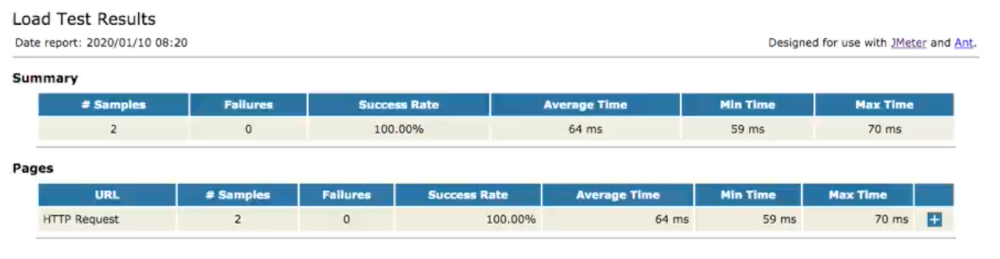

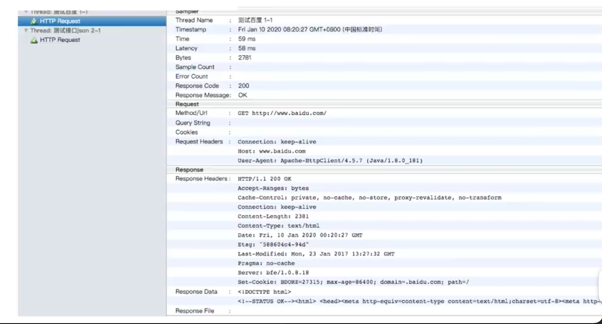


**非GUI模式运行测试用例**

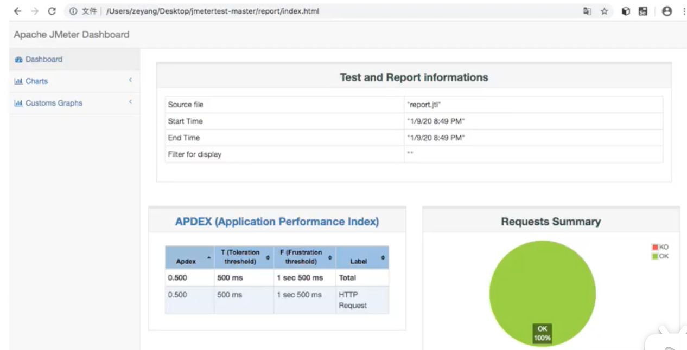

### **自动化测试集成**

**开启gitlab pages for project `gitlabci-cidevops-interfacetest-service`** 

`vim /etc/gitlab/gitlab.rb`

```
##! Define to enable GitLab Pages
pages_external_url = "http://pages.gitlab.com/"
gitlab_pages['enable' ] = true
gitlab_pages[ 'inplace_chroot'] = true
```

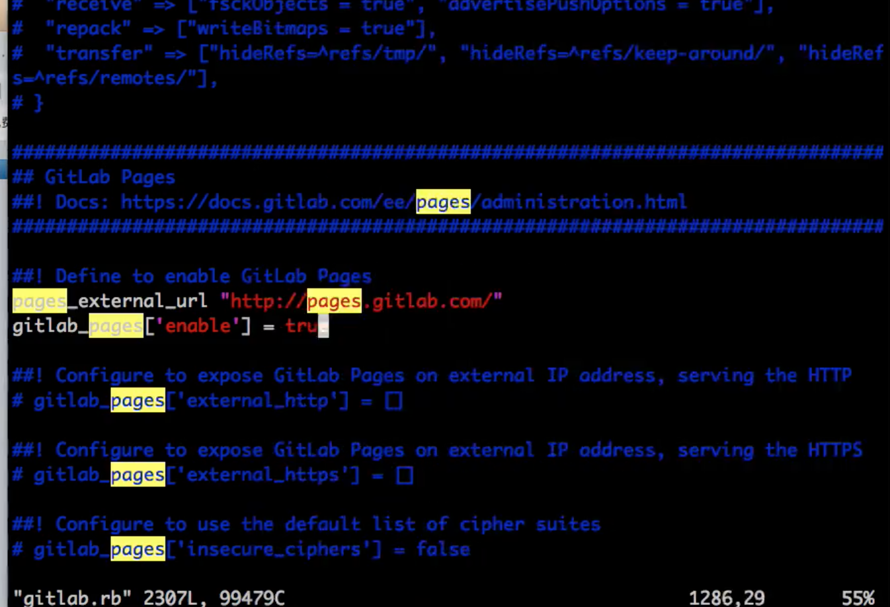

```
gitlab-ctl reconfigure
```

更新`gitlab.ymI`文件

```
containers:
  - name: gitlab
  image: qitlab/qitlab-ce:12.9.0-ce.0
  imagePullPolicy: IfNotPresent
  ports:
	- containerPort: 30088
		name: web
		protocol: TCP
	- containerPort: 22
		name: agent
		protocol: TCP
  - containerPort: 80
		name: page
		protocol: TCP
```

**开放80端口**

```
---
apiVersion: v1
kind: Service
metadata:
  name: gitlab
  namespace: devops
  labels:
    name: gitlab
spec:
  ports:
    - name: http
      port: 80
      targetPort: http
      nodePort: 32220
    - name: ssh
      port: 22
      targetPort: ssh
      nodePort: 30022
    - name: page
      port: 80
      targetPort: 80
      nodePort: 30022
  type: NodePort
  selector:
    name: gitlab
```	

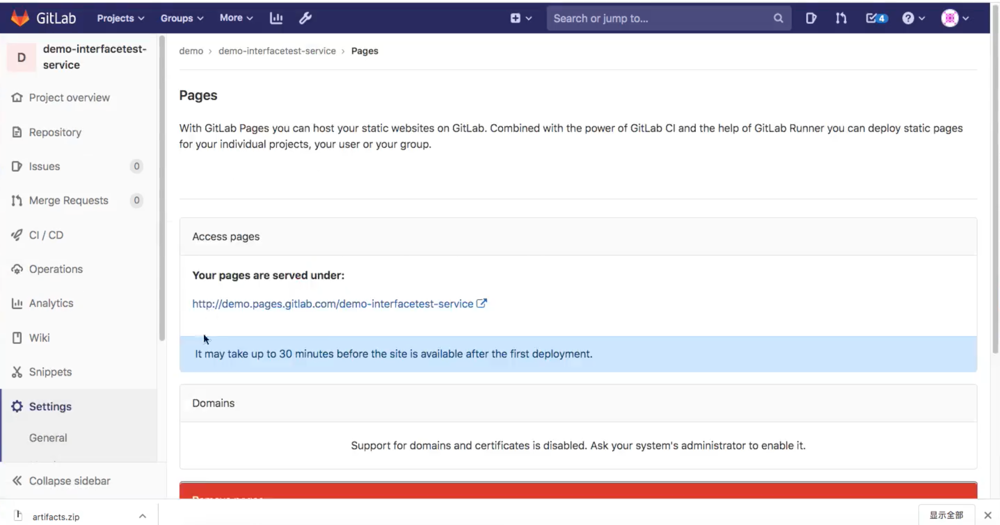

**`.gitlab-ci.yaml`**

```
stages:
  - tests
  - deploy
  
interface_test:
  stage: tests
  tags:
    - build
  script:
    - ant -Djmeter.home=/usr/local/buildtools/apache-jmeter-5.2.1
  artifacts:
    paths:
      - result/htmlfile/
  
pages:
  stage: deploy
  dependencies:
    - interface_test
  script:
    - mv result/htmlfile/ public/
  artifacts:
    paths:
      - public
    expire_in: 30 days
  only:
    - master
```

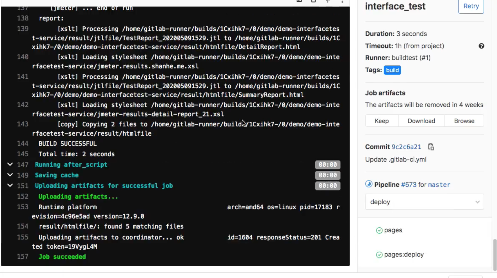

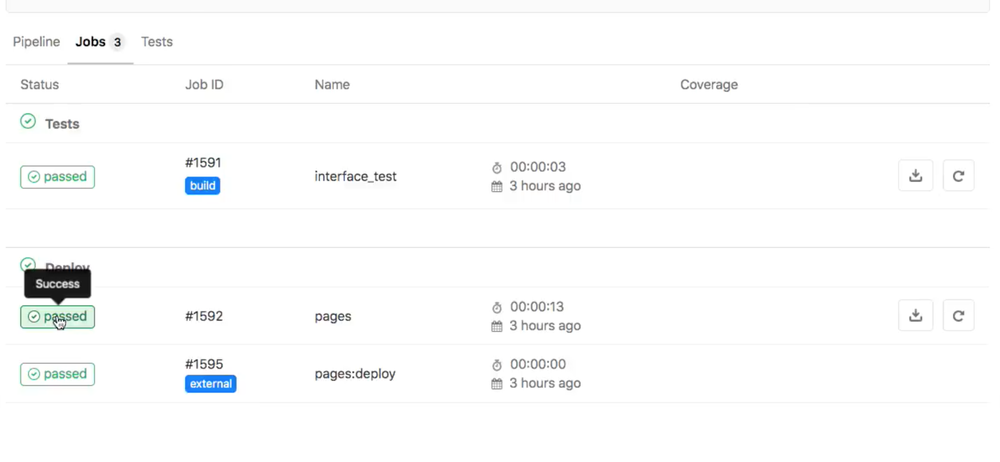

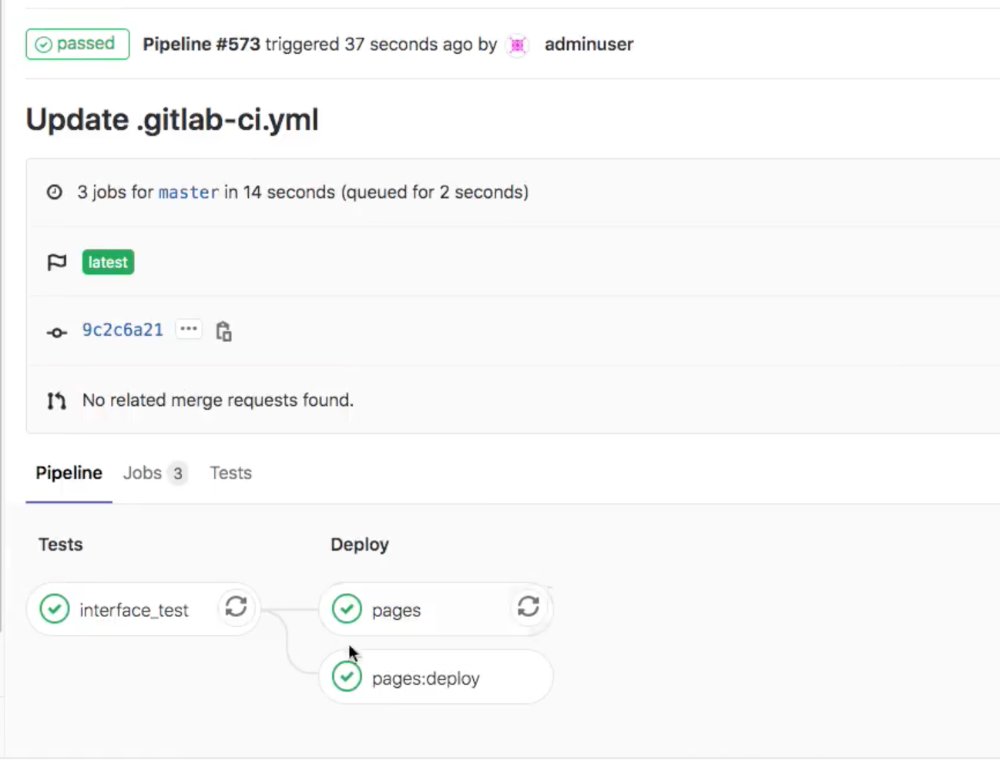


**成果展示**

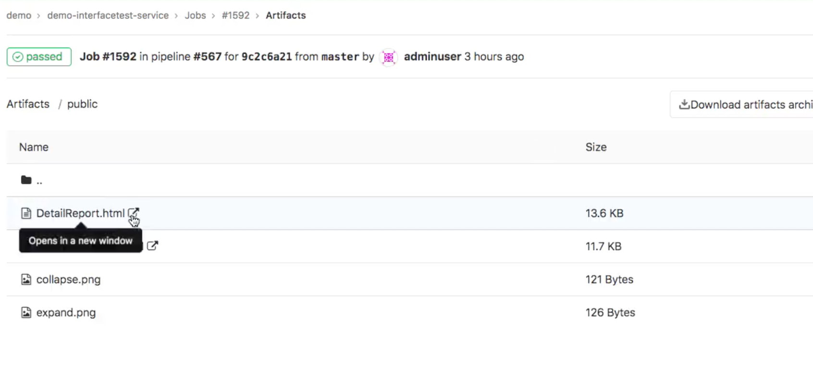

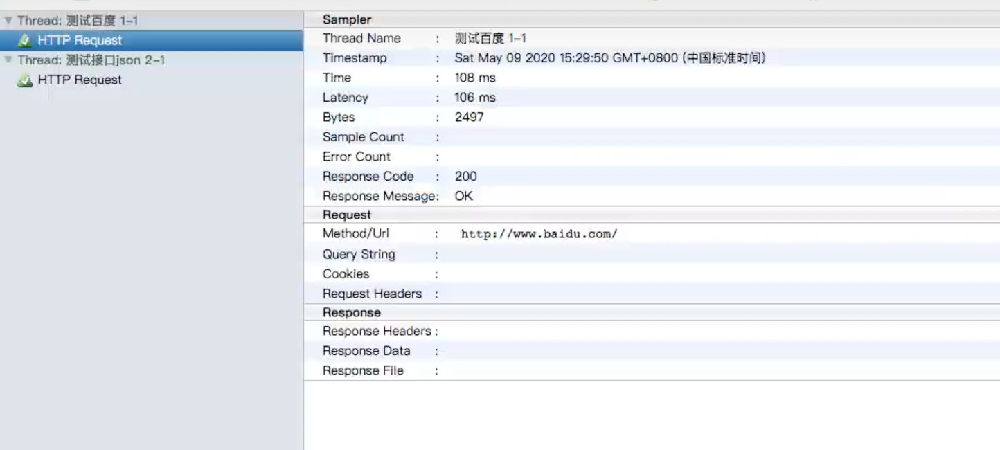

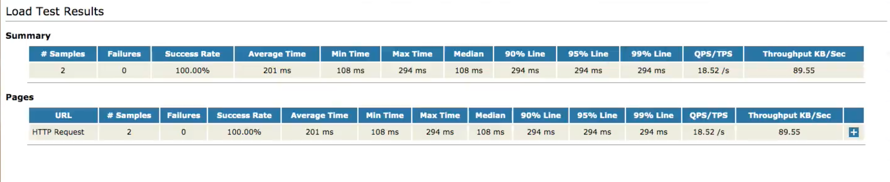

## **3 上下游项目触发自动化测试**

**`gitlabci-templates/jobs/test.yml`**

```
#单元测试

.test:
  stage: test
  tags:
    - build
  script:
    - $TEST_SHELL
    - ls 
  artifacts:
    reports:
      junit: ${JUNIT_REPORT_PATH}

.interfacetest:
	stage: interface_test
	trigger:
		project: cidevops/cidevops-interfacetest-service
		branch: master
		strategy: depend
```


**`cidevops-java-service/templates/java-pipeline.yml`**

```
nclude:
  - project: 'cidevops/cidevops-gitlabci-service'
    ref: master
    file: 'jobs/build.yml'
  - project: 'cidevops/cidevops-gitlabci-service'
    ref: master
    file: 'jobs/test.yml'
  - project: 'cidevops/cidevops-gitlabci-service'
    ref: master
    file: 'jobs/codeanalysis.yml'

variables:
  BUILD_SHELL: 'mvn clean package  -DskipTests'  ##构建命令
  CACHE_DIR: 'target/'
  TEST_SHELL : 'mvn test'                                   ##测试命令
  JUNIT_REPORT_PATH: 'target/surefire-reports/TEST-*.xml'   ##单元测试报告
  # 代码扫描
  SCANNER_HOME : "/usr/local/buildtools/sonar-scanner-3.2.0.1227-linux"
  SCAN_DIR : "src"
  ARTIFACT_PATH : 'target/*.jar'                            ##制品目录

  #上传制品库
  ARTIFACTORY_URL: "http://192.168.1.200:30082/artifactory"
  ARTIFACTORY_NAME: "cidevops"
  TARGET_FILE_PATH: "$CI_PROJECT_NAMESPACE/$CI_PROJECT_NAME/$CI_COMMIT_REF_NAME-$CI_COMMIT_SHORT_SHA-$CI_PIPELINE_ID"
  TARGET_ARTIFACT_NAME: "$CI_PROJECT_NAME-$CI_COMMIT_REF_NAME-$CI_COMMIT_SHORT_SHA-$CI_PIPELINE_ID.jar"

  
cache:
  paths:
    - ${CACHE_DIR}
    
stages:
  - build
  - test
  - parallel01
  - down_artifact
  - interface_test


build:
  stage: build
  extends: .build
  rules:
    - when: on_success


test:
  stage: test
  extends: .test
  rules:
    - when: on_success

  
code_analysis:
  stage: parallel01
  extends: .codeanalysis-java
  
codeanalysis_mr:
  stage: parallel01
  extends: .codeanalysis-mr
  
deploy_artifact:
  stage: parallel01
  extends: .deploy-artifact
  
down_artifact:  
  stage: down_artifact
  extends: .down-artifact
  
interfact_test:
	stage: interface_test
	extends: .interfacetest
```

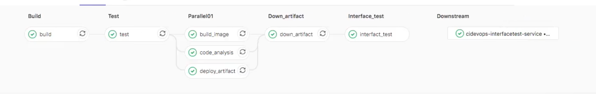

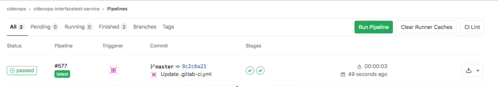

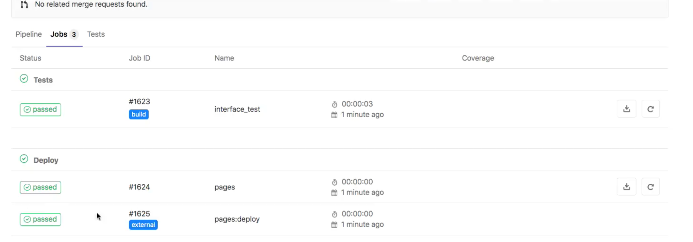


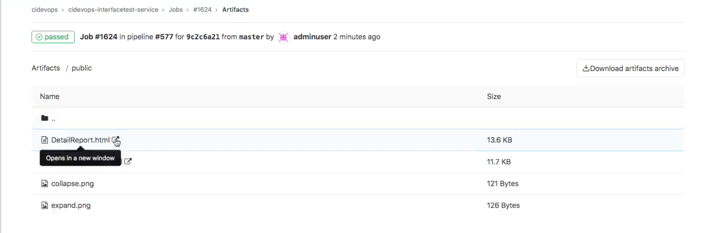
