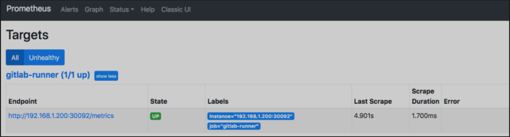
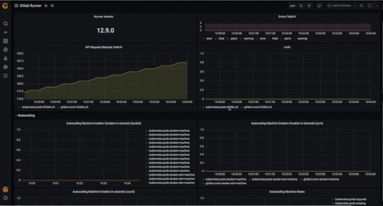
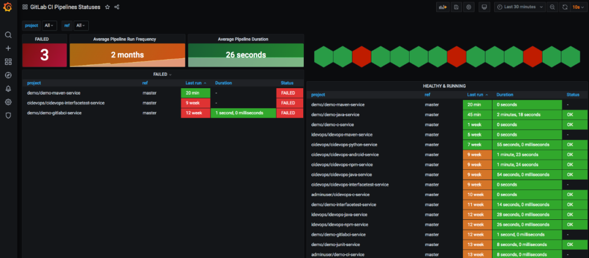

# **5 GitLabCI/CD Prom构建数据采集与监控**

## 使用Prometheus对GitLab Runner监控

* 1.1 配置GitLab Runner监控
* 1.2 配置GitLabCI 流水线监控

本文主要阐述如何配置GitLabRunner和GitLabCI/CD流水线的数据采集与监控。

### 1.1 配置GitLab Runner监控

GitLab Runner本地具有Prometheus指标，可以访问嵌入式HTTP服务器，通过`/metrics` 路径公开。该服务器（如果已启用）可以被`Prometheus`监视系统抓取，或通过任何其他HTTP客户端进行访问。


公开的信息包括：

* Runner业务逻辑指标（例如，当前正在运行的作业数）
* Go特定的流程指标（垃圾收集统计信息，goroutines，memstats等）
* 常规指标（内存使用情况，CPU使用情况，文件描述符使用情况等）

这些指标是运维人员监视和了解GitLab Runners的一种方式。例如，您可能会对Runner主机上的平均负载和作业数量感兴趣。

Runner默认是没有开启内置的HTTP服务，可以通过两种方式配置指标HTTP服务器：

* 在`config.toml`文件中配置全局选项 `listen_address`。
* 在Runner启动的时候添加`--listen-address`命令选项。

在这里我直接修改的`config.toml`文件，内容参考如下：

```
$ cat config.toml 
listen_address = "[::]:9252"
concurrent = 10
check_interval = 30
log_level = "info"
```

修改Runner配置后需要重启, 随后通过`netstat`查看监听的端口。

```
bash-5.0$ netstat -anlpt | grep 9252
tcp        0      0 :::9252                 :::*                    LISTEN      1/gitlab-runner
tcp        0      0 ::ffff:10.244.0.102:9252 ::ffff:10.244.0.1:35880 ESTABLISHED 1/gitlab-runner
tcp        0      0 ::ffff:10.244.0.102:9252 ::ffff:10.244.0.107:36184 ESTABLISHED 1/gitlab-runner
tcp        0      0 ::ffff:10.244.0.102:9252 ::ffff:10.244.0.103:57404 ESTABLISHED 1/gitlab-runner
```

当9252端口被监听，内容的HTTP服务器就启动了。此时我们可以获取指标数据。

```
curl 127.0.0.1:9252/metrics

# HELP gitlab_runner_api_request_statuses_total The total number of api requests, partitioned by runner, endpoint and status.
# TYPE gitlab_runner_api_request_statuses_total counter
gitlab_runner_api_request_statuses_total{endpoint="request_job",runner="6i2MzLuX",status="204"} 178
# HELP gitlab_runner_autoscaling_machine_creation_duration_seconds Histogram of machine creation time.
# TYPE gitlab_runner_autoscaling_machine_creation_duration_seconds histogram
gitlab_runner_autoscaling_machine_creation_duration_seconds_bucket{executor="docker+machine",le="30"} 0
gitlab_runner_autoscaling_machine_creation_duration_seconds_bucket{executor="docker+machine",le="37.5"} 0
gitlab_runner_autoscaling_machine_creation_duration_seconds_bucket{executor="docker+machine",le="46.875"} 0
gitlab_runner_autoscaling_machine_creation_duration_seconds_bucket{executor="docker+machine",le="58.59375"} 0
gitlab_runner_autoscaling_machine_creation_duration_seconds_bucket{executor="docker+machine",le="73.2421875"} 0
gitlab_runner_autoscaling_machine_creation_duration_seconds_bucket{executor="docker+machine",le="91.552734375"} 0
gitlab_runner_autoscaling_machine_creation_duration_seconds_bucket{executor="docker+machine",le="114.44091796875"} 0
gitlab_runner_autoscaling_machine_creation_duration_seconds_bucket{executor="docker+machine",le="143.0511474609375"} 0
gitlab_runner_autoscaling_machine_creation_duration_seconds_bucket{executor="docker+machine",le="178.81393432617188"} 0
gitlab_runner_autoscaling_machine_creation_duration_seconds_bucket{executor="docker+machine",le="223.51741790771484"} 0
gitlab_runner_autoscaling_machine_creation_duration_seconds_bucket{executor="docker+machine",le="+Inf"} 0
gitlab_runner_autoscaling_machine_creation_duration_seconds_sum{executor="docker+machine"} 0
gitlab_runner_autoscaling_machine_creation_duration_seconds_count{executor="docker+machine"} 0
gitlab_runner_autoscaling_machine_creation_duration_seconds_bucket{executor="docker-ssh+machine",le="30"} 0
gitlab_runner_autoscaling_machine_creation_duration_seconds_bucket{executor="docker-ssh+machine",le="37.5"} 0
gitlab_runner_autoscaling_machine_creation_duration_seconds_bucket{executor="docker-ssh+machine",le="46.875"} 0
gitlab_runner_autoscaling_machine_creation_duration_seconds_bucket{executor="docker-ssh+machine",le="58.59375"} 0
gitlab_runner_autoscaling_machine_creation_duration_seconds_bucket{executor="docker-ssh+machine",le="73.2421875"} 0
gitlab_runner_autoscaling_machine_creation_duration_seconds_bucket{executor="docker-ssh+machine",le="91.552734375"} 0
gitlab_runner_autoscaling_machine_creation_duration_seconds_bucket{executor="docker-ssh+machine",le="114.44091796875"} 0
gitlab_runner_autoscaling_machine_creation_duration_seconds_bucket{executor="docker-ssh+machine",le="143.0511474609375"} 0
gitlab_runner_autoscaling_machine_creation_duration_seconds_bucket{executor="docker-ssh+machine",le="178.81393432617188"} 0
gitlab_runner_autoscaling_machine_creation_duration_seconds_bucket{executor="docker-ssh+machine",le="223.51741790771484"} 0
gitlab_runner_autoscaling_machine_creation_duration_seconds_bucket{executor="docker-ssh+machine",le="+Inf"} 0
gitlab_runner_autoscaling_machine_creation_duration_seconds_sum{executor="docker-ssh+machine"} 0
gitlab_runner_autoscaling_machine_creation_duration_seconds_count{executor="docker-ssh+machine"} 0
# HELP gitlab_runner_autoscaling_machine_states The current number of machines per state in this provider.
```

接下来我们配置Prometheus对数据收集，然后通过Grafana展示。更新Prometheus配置文件。

```
- job_name: 'gitlab-runner'
      metrics_path: '/metrics'
      scheme: http
      bearer_token: bearer_token
      static_configs:
          - targets: ['192.168.1.200:30092']
```

然后，访问http://192.168.1.200:30003/new/targets, 目标为up。



最后，我们找一个Grafana模板展示数据。https://grafana.com/grafana/dashboards/9631 下载JSON文件，导入。



### 1.2 配置GitLabCI 流水线监控

有时候对于运维管理人员来说，我们需要看到整个平台的流水线状态。类似于Jenkins一样有统一的面板展示。在GitLab中每个项目都有CI/CD数据的展示。需要进入每个项目才能看到，这样非常不便。在这里我们安装配置：`gitlab-ci-pipelines-exporter`来实现对GitLabCI流水线状态的展示。

首先我们需要下载`chart`源码，然后修改`values.yaml`中的`GitLab`配置。配置GitLab服务器的地址和Token、需要同步的项目。

```
git clone https://github.com/mvisonneau/gitlab-ci-pipelines-exporter.git


vim chart/values.yaml

##关键配置
## Actual configuration of the exporter
##
config:
  # # Full configuration syntax reference available here:
  # # https://github.com/mvisonneau/gitlab-ci-pipelines-exporter/blob/master/docs/configuration_syntax.md
  gitlab:
    url: http://192.168.1.200:30088
  #   # You can also configure the token using --gitlab-token
  #   # or the $GCPE_GITLAB_TOKEN environment variable
    token: Z-smAyB8pFyttu6D2d_J
  # projects:
  #   - name: foo/project
  #   - name: bar/project
  wildcards:
    - owner:
      name: cidevops
      kind: group
      
      
helm install gitlabci-pipline-exporter --namespace gitlab-runner ./chart
```

配置**Prometheus**：修改配置文件添加目标。

```
 - job_name: 'gitlab-runner-ci-pipeline'
      metrics_path: '/metrics'
      scheme: http
      bearer_token: bearer_token
      static_configs:
          - targets: ['10.1.234.132:80']
```

添加Grafana面板`https://grafana.com/grafana/dashboards/10620`。下载JSON文件然后导入。最终效果如下：



