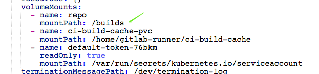

# **1 基于K8S安装部署Runner**

### **配置Chart存储库**

```
helm repo add gitlab https://charts.gitlab.io

helm repo list

$ helm repo list | grep gitlab
gitlab  https://charts.gitlab.io 


helm search repo -l gitlab/gitlab-runner
```


```
helm fetch gitlab/gitlab-runner --version=0.44.0

tar zxvf gitlab-runner-0.44.0.tgz

$ tree gitlab-runner
gitlab-runner
├── CHANGELOG.md
├── CONTRIBUTING.md
├── Chart.yaml
├── LICENSE
├── Makefile
├── NOTICE
├── README.md
├── templates
│   ├── NOTES.txt
│   ├── _cache.tpl
│   ├── _env_vars.tpl
│   ├── _helpers.tpl
│   ├── configmap.yaml
│   ├── deployment.yaml
│   ├── hpa.yaml
│   ├── role-binding.yaml
│   ├── role.yaml
│   ├── secrets.yaml
│   ├── service-account.yaml
│   ├── service-session-server.yaml
│   ├── service.yaml
│   └── servicemonitor.yaml
└── values.yaml

1 directory, 22 files
```

### **更新配置信息**

**values.yaml**

```
image:
  registry: registry.gitlab.com
  image: gitlab-org/gitlab-runner
  # tag: alpine-v11.6.0

## 镜像下载策略
imagePullPolicy: IfNotPresent

## Gitlab服务器地址
gitlabUrl: http://127.0.0.1:32220

## runner注册token
runnerRegistrationToken: "nzTshoYwsnCttkyzZBxE"

## 终止之前注销所有跑步者
unregisterRunner: true

## 当停止管道时等待其作业终止时间
terminationGracePeriodSeconds: 3600

## 配置最大井发作业数
concurrent: 10

## 新作业检查间隔
checkInterval: 30

## GitlabRunner日志级别 debug, info, warn, error, fatal, panic
logLevel: info


sessionServer:
  enabled: false

## For RBAC support:
rbac:
  create: true
  resources: ["pods", "pods/exec", "secrets"]
  verbs: ["get", "list", "watch", "create", "patch", "delete"]
  
 podSecurityPolicy:
    enabled: false
    resourceNames:
    - gitlab-runner

metrics:
  enabled: true
  
  portName: metrics
  
  port: 9252

  serviceMonitor:
    enabled: false
    
service:
  enabled: false
  
  type: ClusterIP
  locked: false
  tags: "kubernetes-runner, k8s"
```

> 未创建rbac
> 
> ERROR: Job failed (system failure): pods is forbidden:
User "system:serviceaccount:gitlab-runner:default" cannot create resource "pods" in API group
in the namespace "gitlab-runner"

```
$ kubectl create ns gitlab-runner
namespace/gitlab-runner created
```

### **部署  chart**

```
helm3 template --dry-run k8s-runner gitlab-runner/ -n devops

$ helm3 install gitlab-runner gitlab-runner/ -n devops

NAME: gitlab-runner
LAST DEPLOYED: Fri Aug 26 23:21:45 2022
NAMESPACE: devops
STATUS: deployed
REVISION: 1
TEST SUITE: None
NOTES:
Your GitLab Runner should now be registered against the GitLab instance reachable at: "http://127.0.0.1:32220"

Runner namespace "devops" was found in runners.config template.
```


```
helm upgrade gitlab-runner gitlab-runner -namespace devops
```

### **发布应用到K8S环境**
                     
**运行流水线测试**            

```
image: maven:3.6.3-jdk-8

before_script:
	- ls

services:
	- name: mysql: latest
	- alias: mysql-1

build:
	image: maven: 3.6.3-jdk-8
	stage: build
	tags:
		- k8s
	script:
	 - ls
   - sleep 2
   - echo "mvn clean "
   - sleep 10

deploy:
	stage: deploy
	tags:
		- k8s
	script:
		- echo "deploy"
	environment:
		name: production
		url: http://www.baidu.com
```


## **2 在 K8S 中发布应用**

### **准备工作**

```
kubectl create secret docker-registry cidevops
	--docker-server=registry.cn-beijing.aliyuncs.com\
	--docker-username=XXXX \
	--docker-password=xxxx\
	--docker-email=test@test.com -n cidevops
```

### **准备工作**

创建名称空间

```
kubectl create ns cidevops
```

**`cidevops-gitlabci-service/jobs/deploy.yml`**

```
.deploy-k8s:
  stage: deploy
  tags:
    - build
  script:
    - sed -i "s#__namespace__#${NAMESPACE}#g" deployment.yaml 
    - sed -i "s#__appname__#${APP_NAME}#g" deployment.yaml 
    - sed -i "s#__containerport__#${CONTAINER_PORT}#g" deployment.yaml 
    - sed -i "s#__nodeport__#${NODE_PORT}#g" deployment.yaml 
    - sed -i "s#__imagename__#${IMAGE_NAME}#g" deployment.yaml 
    - kubectl apply -f deployment.yaml
  after_script:
   - sleep 10
   - kubectl get pod  -n $NAMESPACE
```

**`cidevops-gitlabci-service/templates/k8s-java-pipeline.yml`**

* `stage: deploy`


```
deploy_k8s:
  stage: deploy
  extends: .deploy-k8s
  rules:
    - if: " $RUN_DEPLOY == 'no' "
      when: never
    - if: " $MANUAL_BRANCH  == 'master' "
      when: manual
    - when: always
  environment:
    name: $ENV_NAME
    url: $ENV_URL
```


* 完整： **`k8s-java-pipeline.yml`**

```
include:
  - project: 'cidevops/cidevops-gitlabci-service'
    ref: master
    file: 'jobs/build.yml'
  - project: 'cidevops/cidevops-gitlabci-service'
    ref: master
    file: 'jobs/test.yml'
  - project: 'cidevops/cidevops-gitlabci-service'
    ref: master
    file: 'jobs/codeanalysis.yml'
  - project: 'cidevops/cidevops-gitlabci-service'
    ref: master
    file: 'jobs/deploy.yml'

variables:
  GIT_CLONE_PATH: $CI_BUILDS_DIR/builds/$CI_PROJECT_NAMESPACE/$CI_PROJECT_NAME/$CI_PIPELINE_ID
  GIT_CHECKOUT: "false"
  MVN_OPTS: "-Dmaven.repo.local=/home/gitlab-runner/m2"
  BUILD_SHELL: 'mvn clean package  -DskipTests -Dmaven.repo.local=/home/gitlab-runner/ci-build-cache/maven  --settings=./settings.xml'  ##构建命令
  TEST_SHELL : 'mvn test -Dmaven.repo.local=/home/gitlab-runner/ci-build-cache/maven  --settings=./settings.xml'                        ##测试命令
  JUNIT_REPORT_PATH: 'target/surefire-reports/TEST-*.xml'   ##单元测试报告
  
  # 代码扫描
  SCANNER_HOME : ""
  SCAN_DIR : "src"
  ARTIFACT_PATH : 'target/*.jar'                            ##制品目录

  #上传制品库
  ARTIFACTORY_URL: "http://192.168.1.200:30082/artifactory"
  ARTIFACTORY_NAME: "cidevops"
  TARGET_FILE_PATH: "$CI_PROJECT_NAMESPACE/$CI_PROJECT_NAME/$CI_COMMIT_REF_NAME-$CI_COMMIT_SHORT_SHA-$CI_PIPELINE_ID"
  TARGET_ARTIFACT_NAME: "$CI_PROJECT_NAME-$CI_COMMIT_REF_NAME-$CI_COMMIT_SHORT_SHA-$CI_PIPELINE_ID.jar"

  #构建镜像
  CI_REGISTRY: 'registry.cn-beijing.aliyuncs.com'
  CI_REGISTRY_USER: '610556220zy'
  #CI_REGISTRY_PASSWD: 'xxxxxxxx.'
  IMAGE_NAME: "$CI_REGISTRY/$CI_PROJECT_PATH:$CI_COMMIT_REF_NAME-$CI_COMMIT_SHORT_SHA-$CI_PIPELINE_ID"
  DOCKER_FILE_PATH: "./Dockerfile"

  #部署k8s
  RUN_DEPLOY: "yes"
  APP_NAME: "$CI_PROJECT_NAME"
  CONTAINER_PORT: 8081
  NODE_PORT: 30185
  ENV_NAME: "staging"
  ENV_URL: "http://192.168.1.200:30185"
  NAMESPACE: "$CI_PROJECT_NAME-$CI_PROJECT_ID-$CI_ENVIRONMENT_SLUG"
  
  
  
image: docker:latest

    
stages:
  - build
  - test
  - parallel01
  - down_artifact
  - deploy
  - interface_test

before_script:
  - ls /home/gitlab-runner/ci-build-cache/builds/
  - echo  $CI_BUILDS_DIR
  - echo  $KUBE_URL $KUBE_TOKEN $KUBE_CA_PEM $KUBE_CA_PEM_FILE
  - export


build:
  variables:
    GIT_CHECKOUT: "true"
  tags:
    - k8s
  image: maven:3.6.3-jdk-8
  stage: build
  extends: .build
  rules:
    - when: on_success
  after_script:
    - ls target/

test:
  before_script:
    - ls target/
  tags:
    - k8s
  image: maven:3.6.3-jdk-8
  stage: test
  extends: .test
  rules:
    - when: on_success
  after_script:
    - ls target/

code_analysis:
  tags:
    - k8s
  image: sonarsource/sonar-scanner-cli:latest
  stage: parallel01
  script:
    - ls target/
    - echo $CI_MERGE_REQUEST_IID $CI_MERGE_REQUEST_SOURCE_BRANCH_NAME  $CI_MERGE_REQUEST_TARGET_BRANCH_NAME
    - "sonar-scanner -Dsonar.projectKey=${CI_PROJECT_NAME} \
                  -Dsonar.projectName=${CI_PROJECT_NAME} \
                  -Dsonar.projectVersion=${CI_COMMIT_REF_NAME} \
                  -Dsonar.ws.timeout=30 \
                  -Dsonar.projectDescription=${CI_PROJECT_TITLE} \
                  -Dsonar.links.homepage=${CI_PROJECT_URL} \
                  -Dsonar.sources=${SCAN_DIR} \
                  -Dsonar.sourceEncoding=UTF-8 \
                  -Dsonar.java.binaries=target/classes \
                  -Dsonar.java.test.binaries=target/test-classes \
                  -Dsonar.java.surefire.report=target/surefire-reports \
                  -Dsonar.host.url=http://192.168.1.200:30090 \
                  -Dsonar.login=ee2bcb37deeb6dfe3a07fe08fb529559b00c1b7b \
                  -Dsonar.branch.name=${CI_COMMIT_REF_NAME}" 
                  
build_image:
  before_script:
    - ls target/
  tags:
    - k8s
  image: docker:latest
  services:
    - name: docker:dind
  stage: parallel01
  extends: .build-docker


deploy_k8s:
  image: lucj/kubectl:1.17.2
  tags:
    - k8s
    - kubernetes-runner
  stage: deploy
  script:
    - kubectl config set-cluster my-cluster --server=${KUBE_URL} --certificate-authority="${KUBE_CA_PEM_FILE}"
    - kubectl config set-credentials admin --token=${KUBE_TOKEN}
    - sed -i "s#__namespace__#${NAMESPACE}#g" deployment.yaml 
    - sed -i "s#__appname__#${APP_NAME}#g" deployment.yaml 
    - sed -i "s#__containerport__#${CONTAINER_PORT}#g" deployment.yaml 
    - sed -i "s#__nodeport__#${NODE_PORT}#g" deployment.yaml 
    - sed -i "s#__imagename__#${IMAGE_NAME}#g" deployment.yaml 
    - sed -i "s#__CI_ENVIRONMENT_SLUG__#${CI_ENVIRONMENT_SLUG}#g" deployment.yaml 
    - sed -i "s#__CI_PROJECT_PATH_SLUG__#${CI_PROJECT_PATH_SLUG}#g" deployment.yaml
    - cat deployment.yaml
    - kubectl apply -f deployment.yaml  
  environment:
    name: $ENV_NAME
    url: $ENV_URL

  
interfact_test:
  inherit:
    variables: false
  stage: interface_test
  extends: .interfacetest
```


**`gitlabci-cidevops-java-service/deployment.yaml`**

```
kind: Deployment
apiVersion: apps/v1
metadata:
  labels:
    k8s-app: __appname__
    app.gitlab.com/env: __CI_ENVIRONMENT_SLUG__
    app.gitlab.com/app: __CI_PROJECT_PATH_SLUG__
  name: __appname__
  namespace: __namespace__
  annotations:
    app.gitlab.com/env: __CI_ENVIRONMENT_SLUG__
    app.gitlab.com/app: __CI_PROJECT_PATH_SLUG__
spec:
  replicas: 1
  revisionHistoryLimit: 10
  selector:
    matchLabels:
      k8s-app: __appname__
  template:
    metadata:
      labels:
        k8s-app: __appname__
        app.gitlab.com/env: __CI_ENVIRONMENT_SLUG__
        app.gitlab.com/app: __CI_PROJECT_PATH_SLUG__
      namespace: __namespace__
      name: __appname__
    spec:
      containers:
        - name: __appname__
          image: __imagename__
          imagePullPolicy: IfNotPresent
          ports:
            - containerPort: __containerport__
              name: web
              protocol: TCP
      serviceAccountName: __appname__
      imagePullSecrets:
        - name: __namespace__
---
apiVersion: v1
kind: ServiceAccount
metadata:
  labels:
    k8s-app: __appname__
  name: __appname__
  namespace: __namespace__
---
kind: Service
apiVersion: v1
metadata:
  labels:
    k8s-app: __appname__
  name: __appname__
  namespace: __namespace__
spec:
  type: NodePort
  ports:
    - name: web
      port: __containerport__
      targetPort: __containerport__
      nodePort: __nodeport__
  selector:
    k8s-app: __appname__
```

### **`gitlabci-cidevops-java-service/.gitlab-ci.yml`**

```
include:
    - project: 'cidevops/cidevops-gitlabci-service'
      ref: master
      file: 'templates/k8s-java-pipeline.yml'
  
  
variables:
  BUILD_SHELL: 'mvn clean package  -DskipTests'  
```

最终效果


## **2 配置Runner 持久化构建缓存**

### **准备工作**

runner配置信息可以通过参数指定，也可以以环境变量方式设置。详细内容可以通过 `gitlab-runner register -h` 获取到相关参数和变量名称。

在使用官方提供的runner镜像注册runner，默认的runner配置文件在`/home/gitlab-runner/.gitlab-runner/config.toml`


**参考文档**

[https://docs.gitlab.com/charts/advanced/persistent-volumes/#make-changes-to-the-persistentvolumeclaim](https://docs.gitlab.com/charts/advanced/persistent-volumes/#make-changes-to-the-persistentvolumeclaim)


### **重建gitlab-runner**

**values.yml**

```
## GitLab Runner Image
##
## By default it's using gitlab/gitlab-runner:alpine-v{VERSION}
## where {VERSION} is taken from Chart.yaml from appVersion field
##
## ref: https://hub.docker.com/r/gitlab/gitlab-runner/tags/
##
image: gitlab/gitlab-runner:alpine-v12.9.0

## 镜像下载策略
imagePullPolicy: IfNotPresent

## Gitlab服务器地址
gitlabUrl: http://192.168.1.200:32220/

## runner注册token
runnerRegistrationToken: "JRzzw2j1Ji6aBjwvkxAv"

## 终止之前注销所有跑步者
unregisterRunners: true


## 当停止管道时等待其作业终止时间
terminationGracePeriodSeconds: 3600

## Set the certsSecretName in order to pass custom certficates for GitLab Runner to use
## Provide resource name for a Kubernetes Secret Object in the same namespace,
## this is used to populate the /home/gitlab-runner/.gitlab-runner/certs/ directory
## ref: https://docs.gitlab.com/runner/configuration/tls-self-signed.html#supported-options-for-self-signed-certificates
##
# certsSecretName:


## 配置最大并发作业数
concurrent: 10

## 新作业检查间隔
checkInterval: 30

## GitlabRunner日志级别 debug, info, warn, error, fatal, panic
logLevel: info

## Configure GitLab Runner's logging format. Available values are: runner, text, json
## ref: https://docs.gitlab.com/runner/configuration/advanced-configuration.html#the-global-section
##
# logFormat:

## For RBAC support:
rbac:
  create: true
  ## Define specific rbac permissions.
  resources: ["pods", "pods/exec", "secrets"]
  verbs: ["get", "list", "watch", "create", "patch", "delete"]

  ## Run the gitlab-bastion container with the ability to deploy/manage containers of jobs
  ## cluster-wide or only within namespace
  clusterWideAccess: false

  ## Use the following Kubernetes Service Account name if RBAC is disabled in this Helm chart (see rbac.create)
  ##
  # serviceAccountName: default

  ## Specify annotations for Service Accounts, useful for annotations such as eks.amazonaws.com/role-arn
  ##
  ## ref: https://docs.aws.amazon.com/eks/latest/userguide/specify-service-account-role.html
  ##
  # serviceAccountAnnotations: {}

## Configure integrated Prometheus metrics exporter
## ref: https://docs.gitlab.com/runner/monitoring/#configuration-of-the-metrics-http-server
metrics:
  enabled: true

## Configuration for the Pods that that the runner launches for each new job
##
runners:
  ## Default container image to use for builds when none is specified
  ##
  image: ubuntu:16.04

  ## Specify one or more imagePullSecrets
  ##
  ## ref: https://kubernetes.io/docs/tasks/configure-pod-container/pull-image-private-registry/
  ##
  # imagePullSecrets: []

  ## Specify the image pull policy: never, if-not-present, always. The cluster default will be used if not set.
  ##
  imagePullPolicy: "if-not-present"

  ## Defines number of concurrent requests for new job from GitLab
  ## ref: https://docs.gitlab.com/runner/configuration/advanced-configuration.html#the-runners-section
  ## 限制来自GitLab的对新作业的并发请求数
  requestConcurrency: 1

  ## Specify whether the runner should be locked to a specific project: true, false. Defaults to true.
  ##
  locked: false

  ## Specify the tags associated with the runner. Comma-separated list of tags.
  ##
  ## ref: https://docs.gitlab.com/ce/ci/runners/#using-tags
  ##
  tags: "kubernetes-runner,k8s"

  ## Specify if jobs without tags should be run.
  ## If not specified, Runner will default to true if no tags were specified. In other case it will
  ## default to false.
  ##
  ## ref: https://docs.gitlab.com/ce/ci/runners/#allowing-runners-with-tags-to-pick-jobs-without-tags
  ##
  runUntagged: true

  ## Specify whether the runner should only run protected branches.
  ## Defaults to False.
  ##
  ## ref: https://docs.gitlab.com/ee/ci/runners/#protected-runners
  ##
  protected: false

  ## Run all containers with the privileged flag enabled
  ## This will allow the docker:dind image to run if you need to run Docker
  ## commands. Please read the docs before turning this on:
  ## ref: https://docs.gitlab.com/runner/executors/kubernetes.html#using-docker-dind
  ##
  privileged: true

  ## The name of the secret containing runner-token and runner-registration-token
  # secret: gitlab-runner

  ## Namespace to run Kubernetes jobs in (defaults to the same namespace of this release)
  ##
  # namespace:

  ## The amount of time, in seconds, that needs to pass before the runner will
  ## timeout attempting to connect to the container it has just created.
  ## ref: https://docs.gitlab.com/runner/executors/kubernetes.html
  pollTimeout: 180

  ## Set maximum build log size in kilobytes, by default set to 4096 (4MB)
  ## ref: https://docs.gitlab.com/runner/configuration/advanced-configuration.html#the-runners-section
  outputLimit: 4096

  ## Distributed runners caching
  ## ref: https://gitlab.com/gitlab-org/gitlab-runner/blob/master/docs/configuration/autoscale.md#distributed-runners-caching
  ##
  ## If you want to use s3 based distributing caching:
  ## First of all you need to uncomment General settings and S3 settings sections.
  ##
  ## Create a secret 's3access' containing 'accesskey' & 'secretkey'
  ## ref: https://aws.amazon.com/blogs/security/wheres-my-secret-access-key/
  ##
  ## $ kubectl create secret generic s3access \
  ##   --from-literal=accesskey="YourAccessKey" \
  ##   --from-literal=secretkey="YourSecretKey"
  ## ref: https://kubernetes.io/docs/concepts/configuration/secret/
  ##
  ## If you want to use gcs based distributing caching:
  ## First of all you need to uncomment General settings and GCS settings sections.
  ##
  ## Access using credentials file:
  ## Create a secret 'google-application-credentials' containing your application credentials file.
  ## ref: https://docs.gitlab.com/runner/configuration/advanced-configuration.html#the-runnerscachegcs-section
  ## You could configure
  ## $ kubectl create secret generic google-application-credentials \
  ##   --from-file=gcs-application-credentials-file=./path-to-your-google-application-credentials-file.json
  ## ref: https://kubernetes.io/docs/concepts/configuration/secret/
  ##
  ## Access using access-id and private-key:
  ## Create a secret 'gcsaccess' containing 'gcs-access-id' & 'gcs-private-key'.
  ## ref: https://docs.gitlab.com/runner/configuration/advanced-configuration.html#the-runners-cache-gcs-section
  ## You could configure
  ## $ kubectl create secret generic gcsaccess \
  ##   --from-literal=gcs-access-id="YourAccessID" \
  ##   --from-literal=gcs-private-key="YourPrivateKey"
  ## ref: https://kubernetes.io/docs/concepts/configuration/secret/
  cache: {}
    ## General settings
    # cacheType: s3
    # cachePath: "gitlab_runner"
    # cacheShared: true

    ## S3 settings
    # s3ServerAddress: s3.amazonaws.com
    # s3BucketName:
    # s3BucketLocation:
    # s3CacheInsecure: false
    # secretName: s3access

    ## GCS settings
    # gcsBucketName:
    ## Use this line for access using access-id and private-key
    # secretName: gcsaccess
    ## Use this line for access using google-application-credentials file
    # secretName: google-application-credentials

  ## Build Container specific configuration
  ##
  builds: {}
    # cpuLimit: 200m
    # memoryLimit: 256Mi
    # cpuRequests: 100m
    # memoryRequests: 128Mi

  ## Service Container specific configuration
  ##
  services: {}
    # cpuLimit: 200m
    # memoryLimit: 256Mi
    # cpuRequests: 100m
    # memoryRequests: 128Mi

  ## Helper Container specific configuration
  ##
  helpers: {}
    # cpuLimit: 200m
    # memoryLimit: 256Mi
    # cpuRequests: 100m
    # memoryRequests: 128Mi
    # image: gitlab/gitlab-runner-helper:x86_64-latest

  ## Service Account to be used for runners
  ##
  # serviceAccountName:

  ## If Gitlab is not reachable through $CI_SERVER_URL
  ##
  # cloneUrl:

  ## Specify node labels for CI job pods assignment
  ## ref: https://kubernetes.io/docs/concepts/configuration/assign-pod-node/
  ##
  # nodeSelector: {}

  ## Specify pod labels for CI job pods
  ##
  # podLabels: {}

  ## Specify annotations for job pods, useful for annotations such as iam.amazonaws.com/role
  # podAnnotations: {}

  ## Configure environment variables that will be injected to the pods that are created while
  ## the build is running. These variables are passed as parameters, i.e. `--env "NAME=VALUE"`,
  ## to `gitlab-runner register` command.
  ##
  ## Note that `envVars` (see below) are only present in the runner pod, not the pods that are
  ## created for each build.
  ##
  ## ref: https://docs.gitlab.com/runner/commands/#gitlab-runner-register
  ##
  # env:
  #   NAME: VALUE


## Configure securitycontext
## ref: http://kubernetes.io/docs/user-guide/security-context/
##
securityContext:
  fsGroup: 65533
  runAsUser: 100


## Configure resource requests and limits
## ref: http://kubernetes.io/docs/user-guide/compute-resources/
##
resources: {}
  # limits:
  #   memory: 256Mi
  #   cpu: 200m
  # requests:
  #   memory: 128Mi
  #   cpu: 100m

## Affinity for pod assignment
## Ref: https://kubernetes.io/docs/concepts/configuration/assign-pod-node/#affinity-and-anti-affinity
##
affinity: {}

## Node labels for pod assignment
## Ref: https://kubernetes.io/docs/user-guide/node-selection/
##
nodeSelector: {}
  # Example: The gitlab runner manager should not run on spot instances so you can assign
  # them to the regular worker nodes only.
  # node-role.kubernetes.io/worker: "true"

## List of node taints to tolerate (requires Kubernetes >= 1.6)
## Ref: https://kubernetes.io/docs/concepts/configuration/taint-and-toleration/
##
tolerations: []
  # Example: Regular worker nodes may have a taint, thus you need to tolerate the taint
  # when you assign the gitlab runner manager with nodeSelector or affinity to the nodes.
  # - key: "node-role.kubernetes.io/worker"
  #   operator: "Exists"

## Configure environment variables that will be present when the registration command runs
## This provides further control over the registration process and the config.toml file
## ref: `gitlab-runner register --help`
## ref: https://docs.gitlab.com/runner/configuration/advanced-configuration.html
##
# envVars:
#   - name: RUNNER_EXECUTOR
#     value: kubernetes

## list of hosts and IPs that will be injected into the pod's hosts file
hostAliases: []
  # Example:
  # - ip: "127.0.0.1"
  #   hostnames:
  #   - "foo.local"
  #   - "bar.local"
  # - ip: "10.1.2.3"
  #   hostnames:
  #   - "foo.remote"
  #   - "bar.remote"

## Annotations to be added to manager pod
##
podAnnotations: {}
  # Example:
  # iam.amazonaws.com/role: <my_role_arn>

## Labels to be added to manager pod
##
podLabels: {}
  # Example:
  # owner.team: <my_cool_team>

## HPA support for custom metrics:
## This section enables runners to autoscale based on defined custom metrics.
## In order to use this functionality, Need to enable a custom metrics API server by
## implementing "custom.metrics.k8s.io" using supported third party adapter
## Example: https://github.com/directxman12/k8s-prometheus-adapter
##
#hpa: {}
  # minReplicas: 1
  # maxReplicas: 10
  # metrics:
  # - type: Pods
  #   pods:
  #     metricName: gitlab_runner_jobs
  #     targetAverageValue: 400m
```

```
## 更新
helm upgrade gitlab-runner --namespace gitlab-runner ./gitlab-runner
```

### **跑一个传统的打包流水线**

`.gitlba-ci.yaml`

```
image: maven:3.6.3-jdk-8

before_script:
	- ls

services:
	- name: mysql:latest
		alias: mysql-1

build:
	image: maven:3.6.3-jdk-8
	stage: build
	tags:
		- k8s
	script:
		- ls
		- sleep 2
		- mvn clean package -DskipTests
		- sleep 10

deploy:
	stage: deploy
	tags:
		- k8s
	script:
		- echo "deploy"
	environment:
		name: production
		ur: http://www.baidu.com
```

**下载依赖包将会花费大量的时间**


### **解决构建缓存问题**

所谓的构建缓存就是我们在进行maven/npm等构建工具打包时所依赖的包。默认会在私服中获取，加快构建速度可以在本地缓存一份。

在此，我们需要创建PVC来持久化构建缓存，加速构建速度。为了节省存储空间决定不在每个项目中存储构建缓存，而是配置全局缓存。

准备本机缓存目录

```
/opt/ci-build-cache
[ci-build-cache]# ls
builds    maven 
```

首先，创建一个PVC用于挂载到pod中使用。

**`buildcache-pvc.yml`**

```
apiVersion: v1
kind: PersistentVolume
metadata:
  name: ci-build-cache-pv
  namespace: gitlab-runner
  labels:
    type: local
spec:
  storageClassName: manual
  capacity:
    storage: 10Gi
  accessModes:
    - ReadWriteOnce
  hostPath:
    path: "/opt/ci-build-cache"
---
apiVersion: v1
kind: PersistentVolumeClaim
metadata:
  name: ci-build-cache-pvc
  namespace: gitlab-runner
spec:
  storageClassName: manual
  accessModes:
    - ReadWriteOnce
  resources:
    requests:
      storage: 5Gi
```

使用命令查看验证

```
kubect1 create -f buildcache-pvc.yml
```

```
# kubectl get pvc -n gitlab-runner
NAME                 STATUS   VOLUME              CAPACITY   ACCESS MODES   STORAGECLASS   AGE
ci-build-cache-pvc   Bound    ci-build-cache-pv   10Gi       RWO            manual     5h41m
```

vc准备好了，考虑到不能每次部署runner都手动挂载pvc，需要自定义gitlab-runner chart，优化runner配置。

* **第一步：编辑value.yml文件，添加构建缓存信息配置。**

`gitlab-runner/value.yml`

```
## configure build cache
cibuild:
  cache:
    pvcName: ci-build-cache-pvc
    mountPath: /home/gitlab-runner/ci-build-cache
```

第二步：编辑`templates/configmap.yml`文件，`entrypoint`部分添加`runner`配置。在start之前添加，这样runner在创建构建pod的时候会根据配置挂载pvc。


```
...

# add build cache
cat >>/home/gitlab-runner/.gitlab-runner/config.toml <<EOF
  [[runners.kubernetes.volumes.pvc]]
  name = "{{.Values.cibuild.cache.pvcName}}"
  mount_path = "{{.Values.cibuild.cache.mountPath}}"
EOF

# Start the runner
exec /entrypoint run --user=gitlab-runner \
  --working-directory=/home/gitlab-runner
```

到此gitlab-runner chart部分配置就完成了，接下来可以通过Helm命令进行创建和更新了。

```
helm install gitlab-runner04 ./gitlab-runner --namespace gitlab-runner
helm upgrade gitlab-runner04 ./gitlab-runner --namespace gitlab-runner
```

使用以上命令部署完成后，可以在gitlab admin页面和k8s面板查看runner的状态，确保部署成功。查看pod配置。

```
cat /home/gitlab-runner/.gitlab-runner/config.toml

....
[[runners.kubernetes.volumes.pvc]]
name =  "ci-build-cache-pvc"
mount_path = "/home/gitlab-runner/ci-build-cache"
```


部署完成了，后续使用构建工具打包时添加指定缓存目录。例如：maven

```
mvn clean package  -DskipTests -Dmaven.repo.local=/home/gitlab-runner/ci-build-cache/maven  
```

`.gitlba-ci.yaml`

```
image: maven:3.6.3-jdk-8

before_script:
	- ls

services:
	- name: mysql:latest
		alias: mysql-1

build:
	image: maven:3.6.3-jdk-8
	stage: build
	tags:
		- k8s
	script:
		- ls
		- sleep 2
		- mvn clean package -DskipTests -Dmaven.repo.local=/home/gitlab-runner/ci-build-cache/maven  
		- sleep 10

deploy:
	stage: deploy
	tags:
		- k8s
	script:
		- echo "deploy"
	environment:
		name: production
		ur: http://www.baidu.com
```

**发现构建速度很快证明已经完成构建缓存配置**。可以配合查看本地缓存目录是否有更新。


> 会产生一个新的runner 而非原来的gitlab-runner


**`cd  /ci-build-cache/maven`**


**打包可以快速结束**


## **3 解决构建制品问题**

在kubernetes中对cache支持一般，我们可以使用artifacts进行代替。但是考虑到artifacts收集制品会占用存储空间，所以准备研究下如何配置统一的缓存。实际上我们可以将repo目录做成持久化。


```
...
build:
	image: maven:3.6.3-jdk-8
	stage: build
	tags:
		- k8s
	script:
		- ls
		- sleep 2
		- mvn clean package -DskipTests -Dmaven.repo.local=/home/gitlab-runner/ci-build-cache/maven  
		- ls target/

test:
	image: maven:3.6.3-jdk-8
	stage: test
	tags:
		- k8s
	script:
		- ls target/
		- sleep 2
		- mvn test -DskipTests -Dmaven.repo.local=/home/gitlab-runner/ci-build-cache/maven  
		- sleep 10
```

**Test之前已经被clean掉了， test失败**


**`demo-maven-service`**

```
test:
	variables:
		GIT_CHECKOUT: "false"
	image: maven:3.6.3-jdk-8
	stage: test
	tags:
		- k8s
	script:
		- ls target/
		- sleep 2
		- mvn test -DskipTests -Dmaven.repo.local=/home/gitlab-runner/ci-build-cache/maven  
		- sleep 10
```


**经过测试，在使用kubernetes执行器创建的构建pod会默认挂载一个空目录。**

**此目录用于存储每次下载的代码，因为是空目录的原因导致后续测试pod无法获取需要重新下载代码**，这还不要紧，重要的是构建生成的文件target目录都不存在了导致后续步骤接连失败。


由于yaml文件都是有官方默认配置的，问题不好定位。这其实是个两年前的问题了。 [https://gitlab.com/gitlab-org/gitlab-runner/-/issues/3148](https://gitlab.com/gitlab-org/gitlab-runner/-/issues/3148) 。最后经过分析直接将持久化的pvc挂载到空目录中的某个目录中。

**需要配置runner自定义构建目录，但是构建目录必须是在`$CI_BUILD_DIRS`目录里面。**



准备本地的工作目录

```
/opt/ci-build-dir
```

创建repo持久化pvc

```
apiVersion: v1
kind: PersistentVolume
metadata:
  name: ci-build-dir-pv
  namespace: gitlab-runner
  labels:
    type: local
spec:
  storageClassName: manual
  capacity:
    storage: 10Gi
  accessModes:
    - ReadWriteOnce
  hostPath:
    path: "/opt/ci-build-dir"
---
apiVersion: v1
kind: PersistentVolumeClaim
metadata:
  name: ci-build-dir-pvc
  namespace: gitlab-runner
spec:
  storageClassName: manual
  accessModes:
    - ReadWriteOnce
  resources:
    requests:
      storage: 5Gi
```
使用命令验证

```
# kubectl get pvc -n gitlab-runner
NAME                 STATUS   VOLUME              CAPACITY   ACCESS MODES   STORAGECLASS   AGE
ci-build-cache-pvc   Bound    ci-build-cache-pv   10Gi       RWO            manual         6h41m
ci-build-dir-pvc     Bound    ci-build-dir-pv     10Gi       RWO            manual         3h11m
```

### `values.yaml`

* 编译`values.yaml`文件添加注册配置变量。
* `RUNNER_BUILDS_DIR`定义构建目录。
* `CUSTOM_BUILD_DIR_ENABLED`开启自定义构建目录配置。

```
envVars:
  - name: RUNNER_BUILDS_DIR
    value: "/home/gitlab-runner/ci-build-dir/"
  - name: CUSTOM_BUILD_DIR_ENABLED
    value: true
```

添加repo目录缓存配置，我们把自定义的构建目录放到默认构建目录的下面builds目录中。

```
## configure build cache
cibuild:
  cache:
    pvcName: ci-build-cache-pvc
    mountPath: /home/gitlab-runner/ci-build-cache
  builds:
    pvcName: ci-build-dir-pvc
    mountPath: /home/gitlab-runner/ci-build-dir/builds
```

### **编辑`templates/configmap.yml`**

**`gitlab-runner/templates/configmap.yaml`**

```
    # add build cache
    cat >>/home/gitlab-runner/.gitlab-runner/config.toml <<EOF
      [[runners.kubernetes.volumes.pvc]]
      name = "{{.Values.cibuild.cache.pvcName}}"
      mount_path = "{{.Values.cibuild.cache.mountPath}}"
      [[runners.kubernetes.volumes.pvc]]
      name = "{{.Values.cibuild.builds.pvcName}}"
      mount_path = "{{.Values.cibuild.builds.mountPath}}"
    EOF
```
 
**更新runner**

```
helm install gitlab-runner04 ./gitlab-runner --namespace gitlab-runner
helm upgrade gitlab-runner04 ./gitlab-runner --namespace gitlab-runner
```

```
bash-5.0$ cat /home/gitlab-runner/.gitlab-runner/config.toml

[[runners]]
	name = "gitlab-runner-gitlab-runner-7dcbd59€74-nxdnm
	output limit = 4096
	request_concurrency = 1
	url = "http://192.168.1.200:30088/"
	token = "ywKfhgyp9AQkkc-bMjgC"
	executor = "kubernetes"
	builds_dir = "home/gitlab-runner/ci-build-dir/"
	[runners.custom_build_dir]
		enabled = true
	[runners.cache]
		[runners.cache.s3]
		[runners.cache.gcs]
	....
	[[runners.kubernetes.volumes.pvc]]
	name = "ci-build-cache-pvc"
	mount_path =  "/home/gitlab-runner/ci-build-cache"
	[[runners.kubernetes.volumes.pvc]]
	name = "ci-build-cache-pvc"
	mount_path =  "/home/gitlab-runner/ci-build-dir/builds"
```


`.gitlab-ci.yaml`

```
variables:
  GIT_CLONE_PATH: $CI_BUILDS_DIR/builds/$CI_PROJECT_NAMESPACE/$CI_PROJECT_NAME/$CI_PIPELINE_I
```


经过测试在本地的pv中能够看到，下载的代码文件。但是默认每次每个job运行的时候都会获取远程最新的代码，会把构建目录删除掉，此时就需要配置git checkout策略了。其实按照我们目前的场景，不需要每个作业都下载代码。只要第一个作业下载好最新的代码，然后运行流水线即可。当在运行流水线的过程中遇到新代码提交可以放到下次流水线执行。

需要在ci文件中定义`GIT_CHECKOUT`变量，默认值为true，即每次都需要代码下载。我们将全局配置为false然后在build作业中配置为true。也就实现了只在build作业下载最新代码了。

```
GIT_CHECKOUT: "false" 
```


* 参考链接：http://s0docs0gitlab0com.icopy.site/ee/ci/yaml/README.html#git-checkout

