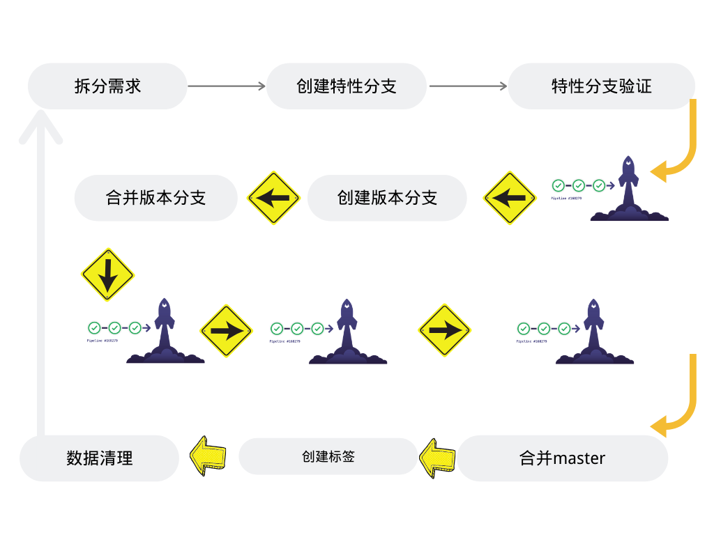
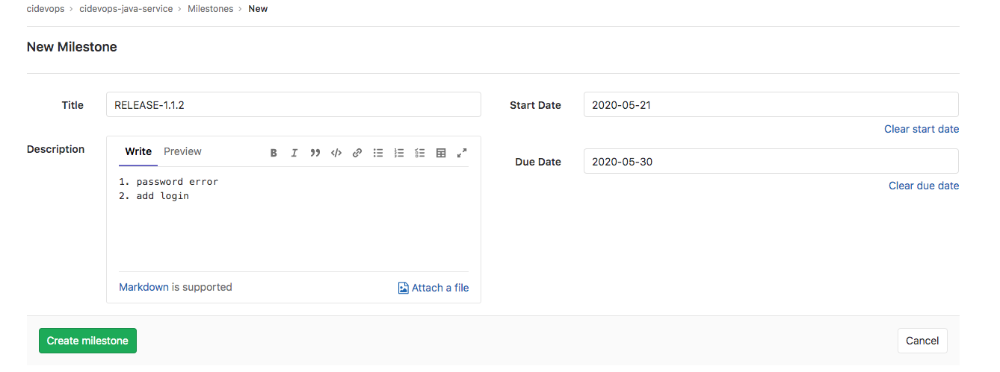
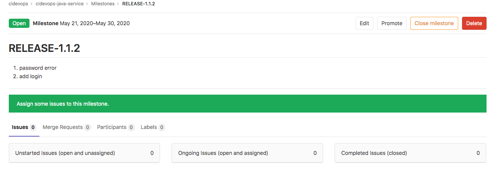
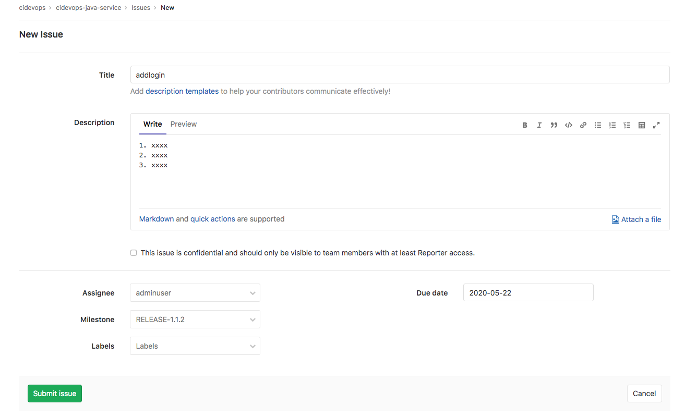
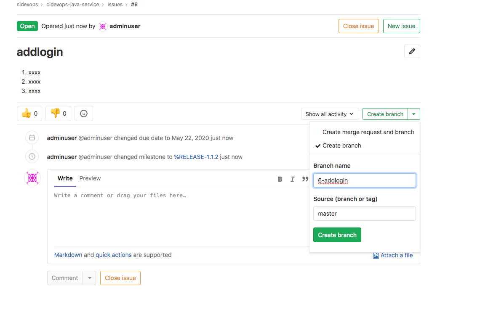
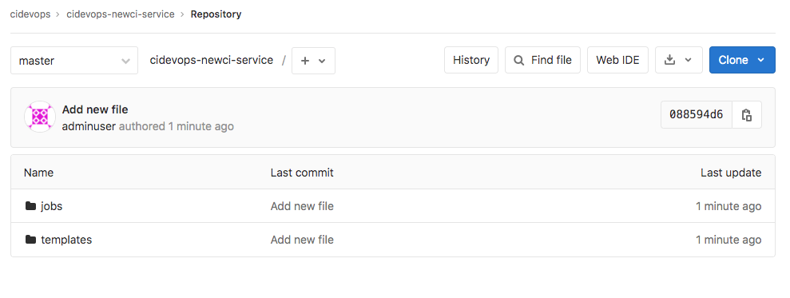
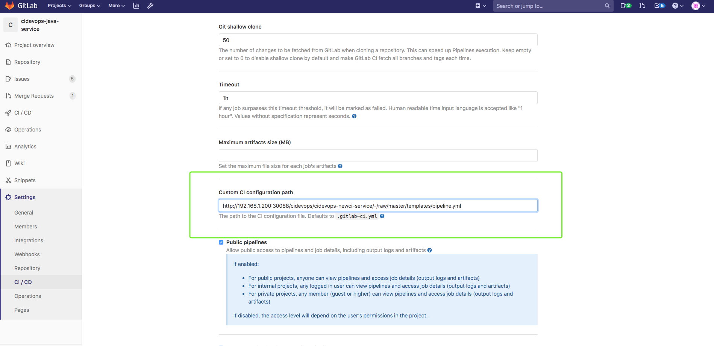

# **1 流水线设计及提交**

## **1 流水线设计规划**

**工作流**

**创建issue –> 创建特性分支 –> 特性分支提交流水线 –> 合并分支流水线 –> 发布分支流水线**

1. 创建issues关联特性分支 （特征以数字开头的分支为特性分支）
2. 特性分支提交代码，触发提交流水线（构建验证部署到特性环境）
3. 特性环境验证完成，合并到RELEASE分支。（触发合并流水线进行代码扫描，流水线成功才能合并）
4. RELEASE分支手动发布 （UAT，STAG，PROD）
5. 生产发布完成后RELEASE分支合并到Master分支，并基于master分支创建Release tag。

### **GitLab Flow**

* http://dockone.io/article/2350 11个原则
* https://www.jianshu.com/p/bb94ebfe883b gitlab上milestone和issues的简单使用

## **2 需求部分准备工作**

**创建里程碑**

**创建issue**

## **3 流水线设计准备工作**

### **1. 准备java项目**

github ： [https://github.com/zeyangli/gitlabci-cidevops-java-service](https://github.com/zeyangli/gitlabci-cidevops-java-service)

### **2. 准备模板库**

[https://github.com/zeyangli/gitlabci-templates](https://github.com/zeyangli/gitlabci-templates)

### **3. 准备可用的runner**

根据之前内容安装部署runner

chart ： [https://github.com/zeyangli/gitlabci-runner-chart-k8s](https://github.com/zeyangli/gitlabci-runner-chart-k8s)

### **4.设置项目CI文件**

