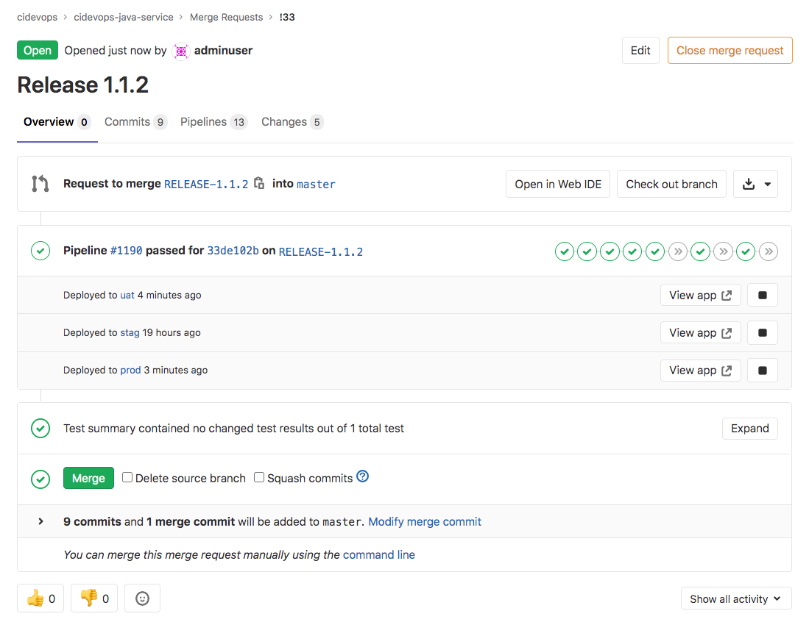
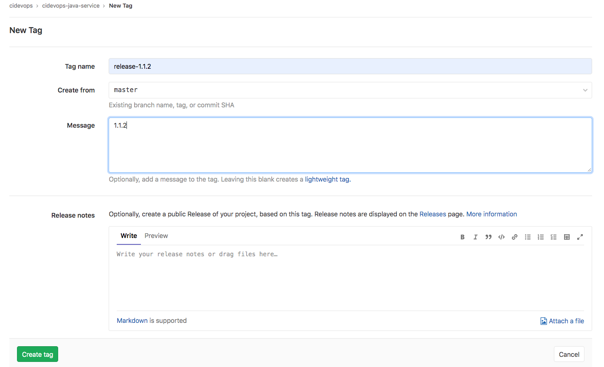
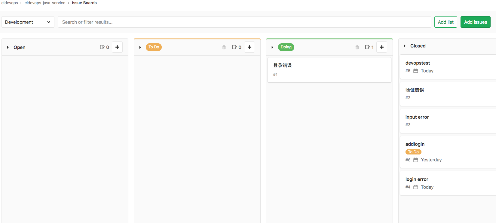
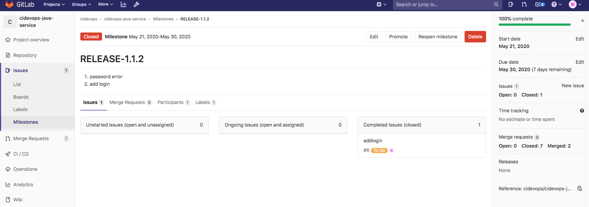

# **3 流水线运行**

## **1 流水线触发控制**

使用`workflow:rules` 进行流水线控制，我们会用到Pipeline的变量，通过变量限制条件。

* 预定义变量参考文档：[https://docs.gitlab.com//12.9/ee/ci/variables/predefined_variables.html](https://docs.gitlab.com//12.9/ee/ci/variables/predefined_variables.html)
* 变量匹配语法： [https://docs.gitlab.com//12.9/ee/ci/variables/README.html#supported-syntax](https://docs.gitlab.com//12.9/ee/ci/variables/README.html#supported-syntax)
* re2语法：[https://github.com/google/re2/wiki/Syntax](https://github.com/google/re2/wiki/Syntax)

### **排除新建分支的流水线**

运行流水线您会发现，所有新创建的分支的`CI_COMMIT_BEFORE_SHA`为40个0。

```
 $ export

 declare -x CI_BUILD_BEFORE_SHA="0000000000000000000000000000000000000000"
 declare -x CI_COMMIT_BEFORE_SHA="0000000000000000000000000000000000000000"
```

```
## 流水线控制
workflow:
  rules:
    - if: $CI_COMMIT_BEFORE_SHA == "0000000000000000000000000000000000000000"
      when: never
    - when: always
```

```
#$CI_COMMIT_REF_NAME =~ /\d-*/
#$CI_COMMIT_REF_NAME =~ /^RELEASE-*/  ||
```

### **合并流水线再进行构建验证**

如果是一个刚刚开始关注代码质量的团队，避免不了出现代码扫描的失败。 改进初期出现错误很正常，如果在初期就把质量阈配置的很严格，这会导致每次提交代码都会产生错误。所以我们可以适当的放开流水线的代码扫描（也就是流水线暂时不进行质量阈检查）。

如果不扫描就无法知道代码的准确质量，所以我们准备流水线仅扫描不检查质量阈，而合并流水线会将代码质量展示在评论区。类似于这种情况我们可以设置流水线成功后才能合并。

默认是提交触发流水线运行，**而设置了"流水线成功后合并"会检查原分支的最后一次提交的状态是否为success，如果是success则运行合并**。 我们配置流水线在出现合并请求的时候，进行代码验证。

```
## 流水线控制
workflow:
  rules:
    - if: $CI_MERGE_REQUEST_ID
```
 
## **2 部署流水线实践**

我们将应用的部署文件也存储在代码库中管理，可能每个应用在各个环境中的配置文件不一致。所有分为三个配置文件 `deployment-uat.yml`、 `deployment-stag.yml`、 `deployment-prod.yml`

**`jobs/deploy.yml`**

```
## 应用发布


## 使用kubectl镜像发布
.deploy_k8s:
  stage: deploy
  script:
    - echo $KUBE_TOKEN
    - kubectl config set-cluster my-cluster --server=${KUBE_URL} --certificate-authority="${KUBE_CA_PEM_FILE}"
    - kubectl config set-credentials admin --token=${KUBE_TOKEN}
    - ls -a 
    - sed -i "s#__namespace__#${NAMESPACE}#g" ${DEPLOY_FILE}
    - sed -i "s#__appname__#${APP_NAME}#g" ${DEPLOY_FILE}
    - sed -i "s#__containerport__#${CONTAINER_PORT}#g" ${DEPLOY_FILE} 
    - sed -i "s#__nodeport__#${NODE_PORT}#g" ${DEPLOY_FILE} 
    - sed -i "s#__imagename__#${IMAGE_NAME}#g" ${DEPLOY_FILE} 
    - sed -i "s#__CI_ENVIRONMENT_SLUG__#${CI_ENVIRONMENT_SLUG}#g" ${DEPLOY_FILE}
    - sed -i "s#__CI_PROJECT_PATH_SLUG__#${CI_PROJECT_PATH_SLUG}#g" ${DEPLOY_FILE}
    - sed -i "s#__ingressdomain__#${ENV_URL}#g" ${DEPLOY_FILE}
    - cat ${DEPLOY_FILE}
    - "kubectl create secret docker-registry ${APP_NAME} \
            --docker-server=${CI_REGISTRY} \
            --docker-username=$CI_REGISTRY_USER \
            --docker-password=${CI_REGISTRY_PASSWD} \
            --docker-email=test@test.com -n ${NAMESPACE} || echo 'secrets already exists'"
    - kubectl apply -f ${DEPLOY_FILE}
  environment:
    name: "${ENV_NAME}"
    url: "http://${ENV_NAME}.${CI_PROJECT_NAMESPACE}.${CI_PROJECT_NAME}.devops.com"
    on_stop: "${ROLL_NAME}"
  
## 回滚
.rollout_k8s:
  stage: deploy
  script:
    - rm -rf $HOME/.kube
    - kubectl config set-cluster my-cluster --server=${KUBE_URL} --certificate-authority="${KUBE_CA_PEM_FILE}"
    - kubectl config set-credentials admin --token=${KUBE_TOKEN}
    - kubectl rollout history deployment ${APP_NAME} -n ${NAMESPACE}
    - kubectl rollout undo deployment ${APP_NAME} -n ${NAMESPACE}
  environment:
    name: "${ENV_NAME}"
    action: stop
```

**`templates/pipeline.yml`**

```
include:
  - project: 'cidevops/cidevops-newci-service'
    ref: master
    file: 'jobs/build.yml'
  - project: 'cidevops/cidevops-newci-service'
    ref: master
    file: 'jobs/test.yml'
  - project: 'cidevops/cidevops-newci-service'
    ref: master
    file: 'jobs/codeanalysis.yml'
  - project: 'cidevops/cidevops-newci-service'
    ref: master
    file: 'jobs/deploy.yml'


variables:
  ## 全局配置
  GIT_CLONE_PATH: $CI_BUILDS_DIR/builds/$CI_PROJECT_NAMESPACE/$CI_PROJECT_NAME/$CI_PIPELINE_ID    
  GIT_CHECKOUT: "false"

  ## 依赖容器镜像
  BUILD_IMAGE: "maven:3.6.3-jdk-8"
  SONAR_IMAGE: "sonarsource/sonar-scanner-cli:latest"
  
  ## 构建测试参数
  MAVEN_OPTS: "-Dmaven.repo.local=/home/gitlab-runner/ci-build-cache/maven "
  BUILD_SHELL: 'mvn clean package  -DskipTests  --settings=./settings.xml '  ##构建命令
  TEST_SHELL : 'mvn test  --settings=./settings.xml '                        ##测试命令
  JUNIT_REPORT_PATH: 'target/surefire-reports/TEST-*.xml'   ##单元测试报告

  ## 代码扫描
  SONAR_PROJECT_LANG: "JAVA"
  SONAR_SOURCE_DIR : "src" 
  SONAR_SERVER_URL: "http://192.168.1.200:30090" 
  SONAR_SERVER_LOGIN: "ee2bcb37deeb6dfe3a07fe08fb529559b00c1b7b" 
  SONAR_SCAN_ARGS: "-Dsonar.sources=${SONAR_SOURCE_DIR} 
                   -Dsonar.java.binaries=target/classes 
                   -Dsonar.java.test.binaries=target/test-classes 
                   -Dsonar.java.surefire.report=target/surefire-reports "

  #构建镜像
  CI_REGISTRY: 'registry.cn-beijing.aliyuncs.com'
  CI_REGISTRY_USER: '610556220zy'
  #CI_REGISTRY_PASSWD: 'xxxxxxxx.'
  IMAGE_NAME: "$CI_REGISTRY/$CI_PROJECT_PATH:$CI_COMMIT_REF_NAME-$CI_COMMIT_SHORT_SHA"
  DOCKER_FILE_PATH: "./Dockerfile"

  #部署应用k8s
  RUN_DEPLOY: "yes"
  APP_NAME: "$CI_PROJECT_NAME"
  CONTAINER_PORT: 8081
  #NODE_PORT: 30185
  NAMESPACE: "$CI_PROJECT_NAME-$CI_PROJECT_ID-$CI_ENVIRONMENT_SLUG"


## 流水线控制
workflow:
  rules:
    - if: $CI_MERGE_REQUEST_ID
    - if: $CI_PIPELINE_SOURCE == 'web'
    - if: $CI_COMMIT_BEFORE_SHA == "0000000000000000000000000000000000000000"
      when: never


## 运行阶段  
stages:
  - build
  - test
  - parallel01
  - get_analysis_result
  - deploy
  - rollout


cache:
  paths:
    - target/
    
before_script:
  - export
    
    
################# Jobs Configure #####################
## 构建作业
build:
  variables:
    GIT_CHECKOUT: "true"
  image: ${BUILD_IMAGE}
  extends: .build

## 测试作业
test:
  image: ${BUILD_IMAGE}
  extends: .test
  before_script:
    - ls 
    - ls target/

## 代码扫描
code_analysis:
  stage: parallel01
  image: ${SONAR_IMAGE}
  extends: .code_analysis

## 获取构建结果
get_analysis_result:
  image: curlimages/curl:7.70.0
  extends: .get_analysis_result
  needs:
    - code_analysis

## 构建镜像
build_image:
  image: docker:latest
  services:
    - name: docker:dind
  stage: parallel01
  extends: .build-docker

## feature发布应用
deploy_feature:
  variables:
    DEPLOY_FILE: 'deployment.yaml'
    ENV_NAME: 'feature'
  stage: deploy
  image: lucj/kubectl:1.17.2
  extends: .deploy_k8s
  rules:
    - if: $CI_COMMIT_REF_NAME =~ /^RELEASE-*/ 
      when: never
    - if: $CI_COMMIT_REF_NAME =~ /\d-*/
      when: manual
    - when: never
    
## 应用回滚
rollout_feature:
  stage: rollout
  image: lucj/kubectl:1.17.2
  extends: .rollout_k8s
  rules:
    - if: $CI_COMMIT_REF_NAME =~ /^RELEASE-*/ 
      when: never
    - if: $CI_COMMIT_REF_NAME =~ /\d-*/
      when: manual
    - when: never

## UAT
deploy_uat:
  variables:
    DEPLOY_FILE: 'config/deployment-uat.yaml'
    ENV_NAME: 'uat'
  stage: deploy
  image: lucj/kubectl:1.17.2
  extends: .deploy_k8s
  rules:
    - if: $CI_COMMIT_REF_NAME =~ /^RELEASE-*/ 
      when: manual
    - when: never

## UAT应用回滚
rollout_uat:
  stage: rollout
  image: lucj/kubectl:1.17.2
  extends: .rollout_k8s
  rules:
    - if: $CI_COMMIT_REF_NAME =~ /^RELEASE-*/ 
      when: manual
    - when: never

## STAG
deploy_stag:
  variables:
    DEPLOY_FILE: 'config/deployment-stag.yaml'
    ENV_NAME: 'stag'
  stage: deploy
  image: lucj/kubectl:1.17.2
  extends: .deploy_k8s
  rules:
    - if: $CI_COMMIT_REF_NAME =~ /^RELEASE-*/ 
      when: manual
    - when: never

## STAG应用回滚
rollout_stag:
  stage: rollout
  image: lucj/kubectl:1.17.2
  extends: .rollout_k8s
  rules:
    - if: $CI_COMMIT_REF_NAME =~ /^RELEASE-*/ 
      when: manual
    - when: never

## PROD
deploy_prod:
  variables:
    DEPLOY_FILE: 'config/deployment-prod.yaml'
    ENV_NAME: 'prod'
  stage: deploy
  image: lucj/kubectl:1.17.2
  extends: .deploy_k8s
  rules:
    - if: $CI_COMMIT_REF_NAME =~ /^RELEASE-*/ 
      when: manual
    - when: never

## PROD应用回滚
rollout_prod:
  stage: rollout
  image: lucj/kubectl:1.17.2
  extends: .rollout_k8s
  rules:
    - if: $CI_COMMIT_REF_NAME =~ /^RELEASE-*/ 
      when: manual
    - when: never
```

## **流水线回滚作业优化**

**`jobs/deploy.yml` 基于原先内容无太大变化，移除了enviroment定义**。

```
## 应用发布


## 使用kubectl镜像发布
.deploy_k8s:
  stage: deploy
  script:
    - echo $KUBE_TOKEN
    - kubectl config set-cluster my-cluster --server=${KUBE_URL} --certificate-authority="${KUBE_CA_PEM_FILE}"
    - kubectl config set-credentials admin --token=${KUBE_TOKEN}
    - ls -a 
    - sed -i "s#__namespace__#${NAMESPACE}#g" ${DEPLOY_FILE}
    - sed -i "s#__appname__#${APP_NAME}#g" ${DEPLOY_FILE}
    - sed -i "s#__containerport__#${CONTAINER_PORT}#g" ${DEPLOY_FILE} 
    - sed -i "s#__nodeport__#${NODE_PORT}#g" ${DEPLOY_FILE} 
    - sed -i "s#__imagename__#${IMAGE_NAME}#g" ${DEPLOY_FILE} 
    - sed -i "s#__CI_ENVIRONMENT_SLUG__#${CI_ENVIRONMENT_SLUG}#g" ${DEPLOY_FILE}
    - sed -i "s#__CI_PROJECT_PATH_SLUG__#${CI_PROJECT_PATH_SLUG}#g" ${DEPLOY_FILE}
    - sed -i "s#__ingressdomain__#${ENV_URL}#g" ${DEPLOY_FILE}
    - cat ${DEPLOY_FILE}
    - "kubectl create secret docker-registry ${APP_NAME} \
            --docker-server=${CI_REGISTRY} \
            --docker-username=$CI_REGISTRY_USER \
            --docker-password=${CI_REGISTRY_PASSWD} \
            --docker-email=test@test.com -n ${NAMESPACE} || echo 'secrets already exists'"
    - kubectl apply -f ${DEPLOY_FILE}


## 回滚
.rollout_k8s:
  stage: deploy
  script:
    - rm -rf $HOME/.kube
    - kubectl config set-cluster my-cluster --server=${KUBE_URL} --certificate-authority="${KUBE_CA_PEM_FILE}"
    - kubectl config set-credentials admin --token=${KUBE_TOKEN}
    - kubectl rollout history deployment ${APP_NAME} -n ${NAMESPACE}
    - kubectl rollout undo deployment ${APP_NAME} -n ${NAMESPACE}
```

**template/pipeline.yml**


```
include:
  - project: 'cidevops/cidevops-newci-service'
    ref: master
    file: 'jobs/build.yml'
  - project: 'cidevops/cidevops-newci-service'
    ref: master
    file: 'jobs/test.yml'
  - project: 'cidevops/cidevops-newci-service'
    ref: master
    file: 'jobs/codeanalysis.yml'
  - project: 'cidevops/cidevops-newci-service'
    ref: master
    file: 'jobs/deploy.yml'


variables:
  ## 全局配置
  GIT_CLONE_PATH: $CI_BUILDS_DIR/builds/$CI_PROJECT_NAMESPACE/$CI_PROJECT_NAME/$CI_PIPELINE_ID    
  GIT_CHECKOUT: "false"

  ## 依赖容器镜像
  BUILD_IMAGE: "maven:3.6.3-jdk-8"
  SONAR_IMAGE: "sonarsource/sonar-scanner-cli:latest"
  
  ## 构建测试参数
  MAVEN_OPTS: "-Dmaven.repo.local=/home/gitlab-runner/ci-build-cache/maven "
  BUILD_SHELL: 'mvn clean package  -DskipTests  --settings=./settings.xml '  ##构建命令
  TEST_SHELL : 'mvn test  --settings=./settings.xml '                        ##测试命令
  JUNIT_REPORT_PATH: 'target/surefire-reports/TEST-*.xml'   ##单元测试报告

  ## 代码扫描
  SONAR_PROJECT_LANG: "JAVA"
  SONAR_SOURCE_DIR : "src" 
  SONAR_SERVER_URL: "http://192.168.1.200:30090" 
  SONAR_SERVER_LOGIN: "ee2bcb37deeb6dfe3a07fe08fb529559b00c1b7b" 
  SONAR_SCAN_ARGS: "-Dsonar.sources=${SONAR_SOURCE_DIR} 
                   -Dsonar.java.binaries=target/classes 
                   -Dsonar.java.test.binaries=target/test-classes 
                   -Dsonar.java.surefire.report=target/surefire-reports "

  #构建镜像
  CI_REGISTRY: 'registry.cn-beijing.aliyuncs.com'
  CI_REGISTRY_USER: 'xxxxxx'
  #CI_REGISTRY_PASSWD: 'xxxxxxxx.'
  IMAGE_NAME: "$CI_REGISTRY/$CI_PROJECT_PATH:$CI_COMMIT_REF_NAME-$CI_COMMIT_SHORT_SHA"
  DOCKER_FILE_PATH: "./Dockerfile"

  #部署应用k8s
  RUN_DEPLOY: "yes"
  APP_NAME: "$CI_PROJECT_NAME"
  CONTAINER_PORT: 8081
  #NODE_PORT: 30185
  NAMESPACE: "$CI_PROJECT_NAME-$CI_PROJECT_ID-$CI_ENVIRONMENT_SLUG"


## 流水线控制
workflow:
  rules:
    #- if: $CI_MERGE_REQUEST_ID
    - if: $CI_PIPELINE_SOURCE == 'web'
    - if: $CI_COMMIT_BEFORE_SHA == "0000000000000000000000000000000000000000"
      when: never


## 运行阶段  
stages:
  - build
  - test
  - parallel01
  - get_analysis_result
  - deploy-feature
  - rollout-feature
  - deploy-uat
  - rollout-uat
  - deploy-stag
  - rollout-stag
  - deploy-prod
  - rollout-prod

cache:
  paths:
    - target/
    
before_script:
  - export
    
    
################# Jobs Configure #####################
## 构建作业
build:
  variables:
    GIT_CHECKOUT: "true"
  image: ${BUILD_IMAGE}
  extends: .build

## 测试作业
test:
  image: ${BUILD_IMAGE}
  extends: .test
  before_script:
    - ls 
    - ls target/

## 代码扫描
code_analysis:
  stage: parallel01
  image: ${SONAR_IMAGE}
  extends: .code_analysis

## 获取构建结果
get_analysis_result:
  image: curlimages/curl:7.70.0
  extends: .get_analysis_result
  needs:
    - code_analysis

## 构建镜像
build_image:
  image: docker:latest
  services:
    - name: docker:dind
  stage: parallel01
  extends: .build-docker


#################Deploy Feature Jobs Configure #####################
## feature发布应用
deploy_feature:
  variables:
    DEPLOY_FILE: 'deployment.yaml'
    ENV_NAME: 'feature'
  stage: deploy-feature
  image: lucj/kubectl:1.17.2
  extends: .deploy_k8s
  rules:
    - if: $CI_COMMIT_REF_NAME =~ /^RELEASE-*/ 
      when: never
    - when: manual
  environment:
    name: "${ENV_NAME}"
    url: "http://${ENV_NAME}.${CI_PROJECT_NAMESPACE}.${CI_PROJECT_NAME}.devops.com"
    on_stop: "rollout_feature"
    
## 应用回滚
rollout_feature:
  variables:
    DEPLOY_FILE: 'deployment.yaml'
    ENV_NAME: 'feature'
  stage: rollout-feature
  image: lucj/kubectl:1.17.2
  extends: .rollout_k8s
  rules:
    - if: $CI_COMMIT_REF_NAME =~ /^RELEASE-*/ 
      when: never
    - if: $CI_COMMIT_REF_NAME =~ /\d-*/
      when: manual
    - when: never
  environment:
    name: "${ENV_NAME}"
    action: stop

#################Deploy UAT Jobs Configure #####################
## UAT
deploy_uat:
  variables:
    DEPLOY_FILE: 'config/deployment-uat.yaml'
    ENV_NAME: 'uat'
  stage: deploy-uat
  image: lucj/kubectl:1.17.2
  extends: .deploy_k8s
  rules:
    - if: $CI_COMMIT_REF_NAME =~ /^RELEASE-*/ 
      when: manual
    - when: never
  environment:
    name: "${ENV_NAME}"
    url: "http://${ENV_NAME}.${CI_PROJECT_NAMESPACE}.${CI_PROJECT_NAME}.devops.com"
    on_stop: "rollout_uat"

## UAT应用回滚
rollout_uat:
  variables:
    DEPLOY_FILE: 'config/deployment-uat.yaml'
    ENV_NAME: 'uat'
  stage: rollout-uat
  image: lucj/kubectl:1.17.2
  extends: .rollout_k8s
  rules:
    - if: $CI_COMMIT_REF_NAME =~ /^RELEASE-*/ 
      when: on_failure
    - when: never
  environment:
    name: "${ENV_NAME}"
    action: stop

#################Deploy STAG Jobs Configure #####################
## STAG
deploy_stag:
  variables:
    DEPLOY_FILE: 'config/deployment-stag.yaml'
    ENV_NAME: 'stag'
  stage: deploy-stag
  image: lucj/kubectl:1.17.2
  extends: .deploy_k8s
  rules:
    - if: $CI_COMMIT_REF_NAME =~ /^RELEASE-*/ 
      when: manual
    - when: never
  environment:
    name: "${ENV_NAME}"
    url: "http://${ENV_NAME}.${CI_PROJECT_NAMESPACE}.${CI_PROJECT_NAME}.devops.com"
    on_stop: "rollout_stag"
  needs:
    - deploy_uat

## STAG应用回滚
rollout_stag:
  variables:
    DEPLOY_FILE: 'config/deployment-stag.yaml'
    ENV_NAME: 'stag'
  stage: rollout-stag
  image: lucj/kubectl:1.17.2
  extends: .rollout_k8s
  rules:
    - if: $CI_COMMIT_REF_NAME =~ /^RELEASE-*/ 
      when: on_failure
    - when: never
  environment:
    name: "${ENV_NAME}"
    action: stop
  needs:
    - deploy_stag

#################Deploy PROD Jobs Configure #####################
## PROD
deploy_prod:
  variables:
    DEPLOY_FILE: 'config/deployment-prod.yaml'
    ENV_NAME: 'prod'
  stage: deploy-prod
  image: lucj/kubectl:1.17.2
  extends: .deploy_k8s
  rules:
    - if: $CI_COMMIT_REF_NAME =~ /^RELEASE-*/ 
      when: manual
    - when: never
  environment:
    name: "${ENV_NAME}"
    url: "http://${ENV_NAME}.${CI_PROJECT_NAMESPACE}.${CI_PROJECT_NAME}.devops.com"
    on_stop: "rollout_prod"
  needs:
    - deploy_stag

## PROD应用回滚
rollout_prod:
  variables:
    DEPLOY_FILE: 'config/deployment-prod.yaml'
    ENV_NAME: 'prod'
  stage: rollout-prod
  image: lucj/kubectl:1.17.2
  extends: .rollout_k8s
  rules:
    - if: $CI_COMMIT_REF_NAME =~ /^RELEASE-*/ 
      when: on_failure
    - when: never
  environment:
    name: "${ENV_NAME}"
    action: stop
  needs:
    - deploy_prod
```


## **3 发版完成后操作**

### **1.将版本分支合并到master分支**



### **2.基于master分支创建版本标签**



### **3.关闭issues 和里程碑**



