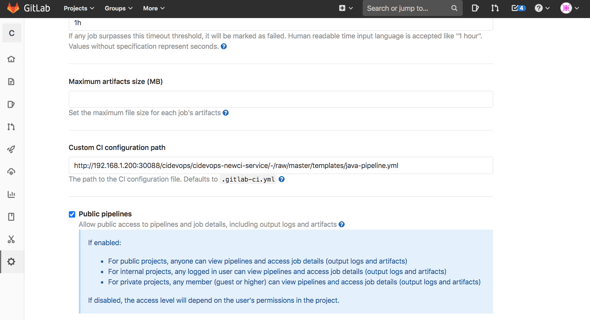
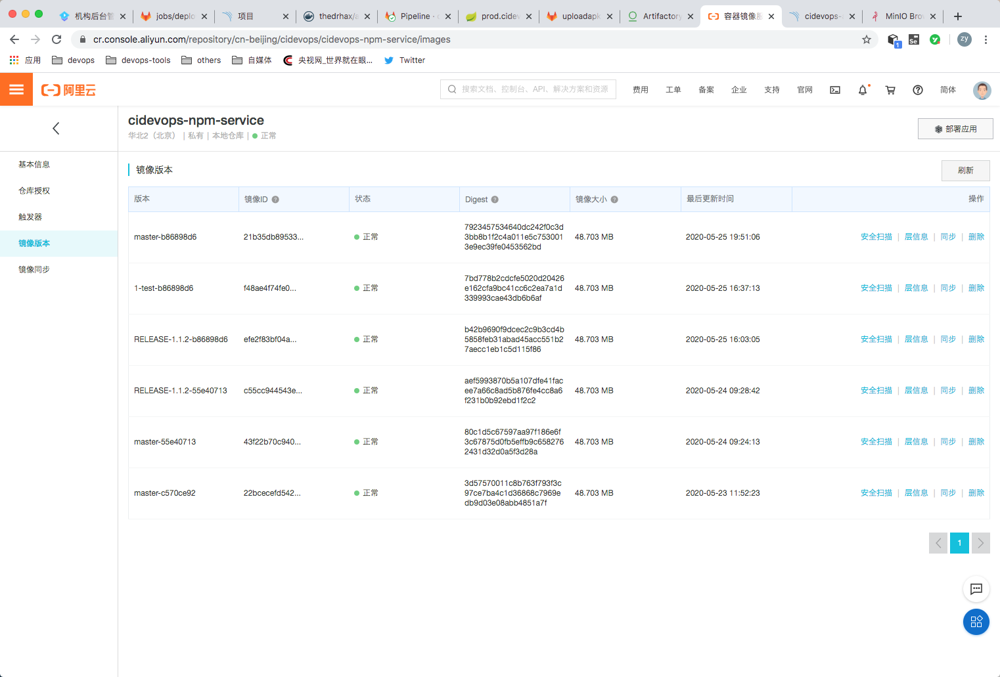
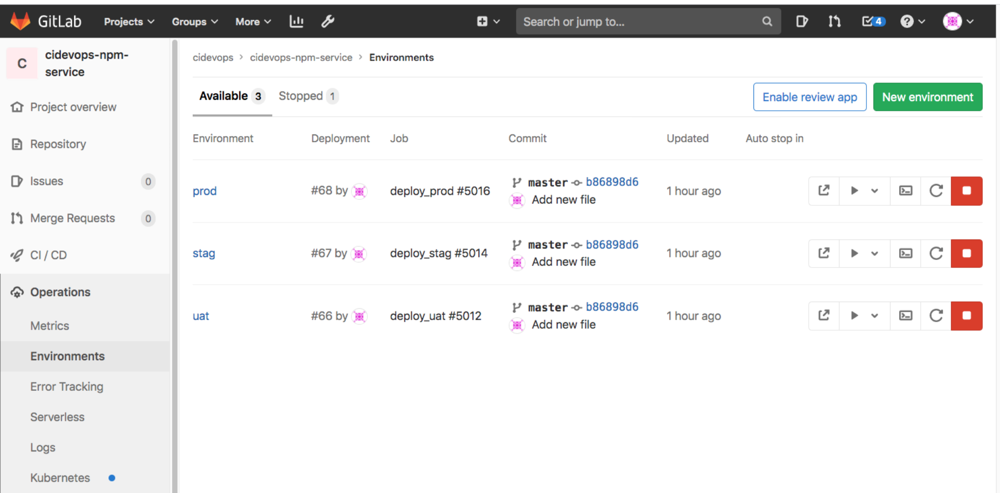
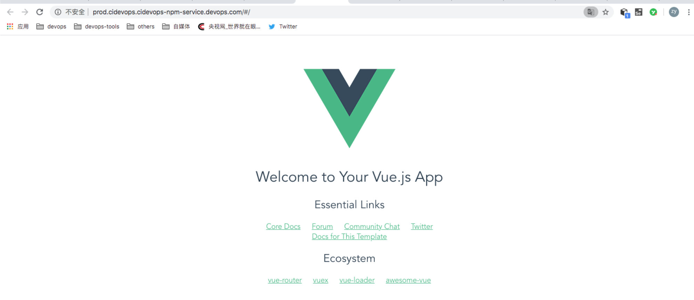
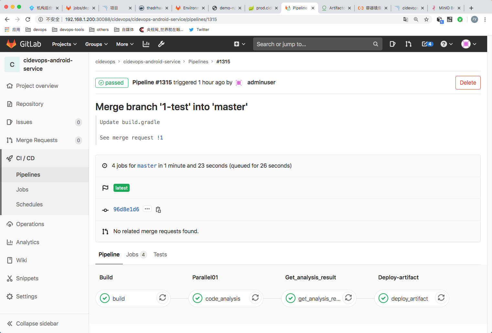
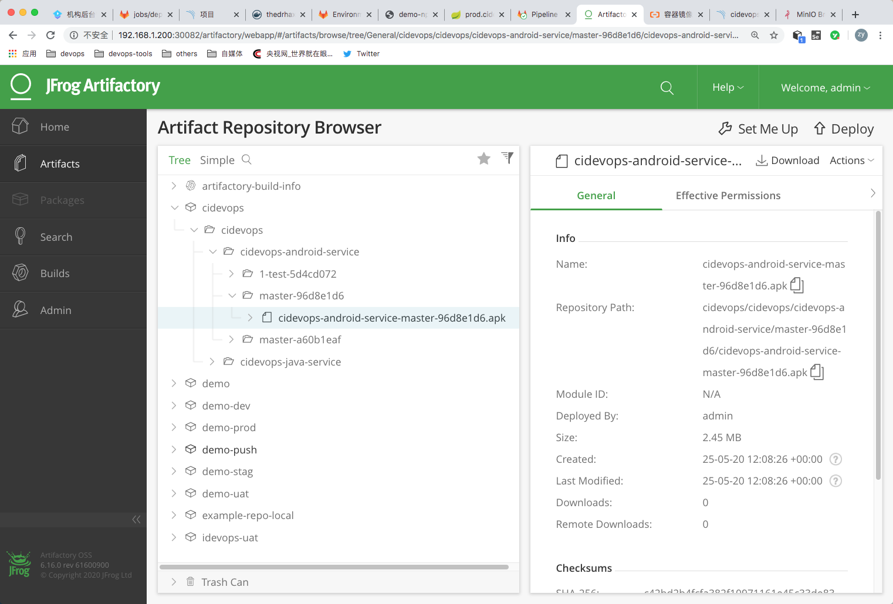

# **2 项目流水线(JAVA+NPM+安卓)**

## **1 后端Java项目流水线**

**`templates/java-pipeline.yml`**

**导入作业模板**

```
include:
  - project: 'cidevops/cidevops-newci-service'
    ref: master
    file: 'templates/default-pipeline.yml'
```

**配置项目参数**

```
variables:
  ## 全局配置
  GIT_CLONE_PATH: ${CI_BUILDS_DIR}/builds/${CI_PROJECT_NAMESPACE}/${CI_PROJECT_NAME}/${CI_PIPELINE_ID}    
  GIT_CHECKOUT: "false"
  CACHE_DIR: "target/"

  ## 作业控制
  RUN_PIPELINE_BUILD:   "yes"     #是否运行构建 yes/no 
  RUN_PIPELINE_TEST:    "yes"      #是否运行测试 yes/no 
  RUN_CODE_ANALYSIS:    "yes"     #是否代码扫描 yes/no 
  RUN_BUILD_IMAGE:      "yes"     #是否生成镜像 yes/no
  RUN_DEPLOY_ARTIFACTS: "no"      #是否上传制品 yes/no
  RUN_DEPLOY_K8S:       "yes"     #是否发布K8S yes/no

  ## 依赖容器镜像
  BUILD_IMAGE: "maven:3.6.3-jdk-8"
  CURL_IMAGE: "curlimages/curl:7.70.0"
  SONAR_IMAGE: "sonarsource/sonar-scanner-cli:latest"
  KUBECTL_IMAGE: "lucj/kubectl:1.17.2"
  
  
  ## 构建测试参数
  MAVEN_OPTS: "-Dmaven.repo.local=/home/gitlab-runner/ci-build-cache/maven "  #maven构建参数
  BUILD_SHELL: 'mvn clean package  -DskipTests  --settings=./settings.xml '   #构建命令
  #GRADLE_OPTS: ""               #gradle构建参数

  ## 单元测试参数
  TEST_SHELL : 'mvn test  --settings=./settings.xml   '       #测试命令
  JUNIT_REPORT_PATH: 'target/surefire-reports/TEST-*.xml'   #单元测试报告

  ## 代码扫描
  SONAR_SOURCE_DIR : "src"                                          #项目源码目录
  SONAR_SERVER_URL: "http://192.168.1.200:30090"                    #SonarQube服务器信息
  SONAR_SERVER_LOGIN: "ee2bcb37deeb6dfe3a07fe08fb529559b00c1b7b"    #Sonar Token最好在项目中定义。
  SONAR_SCAN_ARGS: "-Dsonar.sources=${SONAR_SOURCE_DIR} 
                   -Dsonar.java.binaries=target/classes 
                   -Dsonar.java.test.binaries=target/test-classes 
                   -Dsonar.java.surefire.report=target/surefire-reports "                                     #项目扫描参数

  ## 构建镜像
  CI_REGISTRY: 'registry.cn-beijing.aliyuncs.com'               #镜像仓库地址              
  CI_REGISTRY_USER: 'xxxxxx'                               #仓库用户信息
  #CI_REGISTRY_PASSWD: 'xxxxxxxx.'                              #仓库用户密码
  IMAGE_NAME: "${CI_REGISTRY}/${CI_PROJECT_PATH}:${CI_COMMIT_REF_NAME}-${CI_COMMIT_SHORT_SHA}"     #镜像名称
  DOCKER_FILE_PATH: "./Dockerfile"                              #Dockerfile位置

  ## 上传制品库(artifactory)
  #ARTIFACTORY_URL: "http://192.168.1.200:30082/artifactory"     #制品库地址
  #ARTIFACTORY_NAME: "${CI_PROJECT_NAMESPACE}"                   #制品库名称
  #ARTIFACT_PACKAGE: "jar"                                       #制品类型
  #ARTIFACT_PATH: "target/*.${ARTIFACT_PACKAGE}"                 #制品位置
  #TARGET_FILE_PATH: "${CI_PROJECT_NAMESPACE}/${CI_PROJECT_NAME}/${CI_COMMIT_REF_NAME}-${CI_COMMIT_SHORT_SHA}"   #目标制品位置(目录结构)
  #TARGET_ARTIFACT_NAME: "${CI_PROJECT_NAME}-${CI_COMMIT_REF_NAME}-${CI_COMMIT_SHORT_SHA}.${ARTIFACT_PACKAGE}"   #目标制品名称

  ## 部署应用k8s
  APP_NAME: "$CI_PROJECT_NAME"                #应用名称 <-->deploymentName
  CONTAINER_PORT: "8081"                      #服务端口 <--> servicesPort
  NAMESPACE: "$CI_PROJECT_NAME-$CI_PROJECT_ID-$CI_ENVIRONMENT_SLUG"             #名称空间
  ENV_URL: "${ENV_NAME}.${CI_PROJECT_NAMESPACE}.${CI_PROJECT_NAME}.devops.com"  #IngressHosts
```

**项目指定ci文件**



**运行流水线测试**


docker镜像仓库


部署环境演示


## **2 前端项目流水线实践**


* 使用npm打包（需要用到npm镜像）
* 编写Dockerfile （需要用到nginx镜像）
* 编写Deployment部署文件

基于默认容器流水线模板，改造成前端流水线。

**`templates/web-pipeline.yml`**


**导入作业模板**

```
include:
  - project: 'cidevops/cidevops-newci-service'
    ref: master
    file: 'templates/default-pipeline.yml'
```

**配置全局参数**

```
ariables:
  ## 全局配置
  GIT_CLONE_PATH: ${CI_BUILDS_DIR}/builds/${CI_PROJECT_NAMESPACE}/${CI_PROJECT_NAME}/${CI_PIPELINE_ID}    
  GIT_CHECKOUT: "false"
  CACHE_DIR: "dist/"

  ## 作业控制
  RUN_PIPELINE_BUILD:   "yes"     #是否运行构建 yes/no 
  RUN_PIPELINE_TEST:    "no"      #是否运行测试 yes/no 
  RUN_CODE_ANALYSIS:    "yes"     #是否代码扫描 yes/no 
  RUN_BUILD_IMAGE:      "yes"     #是否生成镜像 yes/no
  RUN_DEPLOY_ARTIFACTS: "no"      #是否上传制品 yes/no
  RUN_DEPLOY_K8S:       "yes"     #是否发布K8S yes/no

  ## 依赖容器镜像
  BUILD_IMAGE: "node:14.3.0-alpine3.11"
  CURL_IMAGE: "curlimages/curl:7.70.0"
  SONAR_IMAGE: "sonarsource/sonar-scanner-cli:latest"
  KUBECTL_IMAGE: "lucj/kubectl:1.17.2"
  
  
  ## 构建测试参数
  MAVEN_OPTS: ""                #maven构建参数 
  GRADLE_OPTS: ""               #gradle构建参数
  BUILD_SHELL: " npm config set prefix /home/gitlab-runner/ci-build-cache/npm
                npm config set cache  /home/gitlab-runner/ci-build-cache/npm
                npm config set registry https://registry.npm.taobao.org
                npm install  
                npm run build "            #构建命令

  ## 单元测试参数
  #TEST_SHELL : 'echo npm run test  '       #测试命令
  #JUNIT_REPORT_PATH: 'target/surefire-reports/TEST-*.xml'   #单元测试报告

  ## 代码扫描
  SONAR_SOURCE_DIR : "src"                                          #项目源码目录
  SONAR_SERVER_URL: "http://192.168.1.200:30090"                    #SonarQube服务器信息
  SONAR_SERVER_LOGIN: "ee2bcb37deeb6dfe3a07fe08fb529559b00c1b7b"    #Sonar Token最好在项目中定义。
  SONAR_SCAN_ARGS: "-Dsonar.sources=${SONAR_SOURCE_DIR}"                                               #项目扫描参数

  ## 构建镜像
  CI_REGISTRY: 'registry.cn-beijing.aliyuncs.com'               #镜像仓库地址              
  CI_REGISTRY_USER: 'xxxxxx'                               #仓库用户信息
  #CI_REGISTRY_PASSWD: 'xxxxxxxx.'                              #仓库用户密码
  IMAGE_NAME: "${CI_REGISTRY}/${CI_PROJECT_PATH}:${CI_COMMIT_REF_NAME}-${CI_COMMIT_SHORT_SHA}"     #镜像名称
  DOCKER_FILE_PATH: "./Dockerfile"                              #Dockerfile位置

  ## 上传制品库(artifactory)
  #ARTIFACTORY_URL: "http://192.168.1.200:30082/artifactory"     #制品库地址
  #ARTIFACTORY_NAME: "${CI_PROJECT_NAMESPACE}"                   #制品库名称
  #ARTIFACT_PACKAGE: "jar"                                       #制品类型
  #ARTIFACT_PATH: "target/*.${ARTIFACT_PACKAGE}"                 #制品位置
  #TARGET_FILE_PATH: "${CI_PROJECT_NAMESPACE}/${CI_PROJECT_NAME}/${CI_COMMIT_REF_NAME}-${CI_COMMIT_SHORT_SHA}"   #目标制品位置(目录结构)
  #TARGET_ARTIFACT_NAME: "${CI_PROJECT_NAME}-${CI_COMMIT_REF_NAME}-${CI_COMMIT_SHORT_SHA}.${ARTIFACT_PACKAGE}"   #目标制品名称

  ## 部署应用k8s
  APP_NAME: "$CI_PROJECT_NAME"                #应用名称 <-->deploymentName
  CONTAINER_PORT: "80"                      #服务端口 <--> servicesPort
  NAMESPACE: "$CI_PROJECT_NAME-$CI_PROJECT_ID-$CI_ENVIRONMENT_SLUG"             #名称空间
  ENV_URL: "${ENV_NAME}.${CI_PROJECT_NAMESPACE}.${CI_PROJECT_NAME}.devops.com"  #IngressHosts


## 缓存
cache:
  paths:
    - ${CACHE_DIR}
    - node_modules/
```

**指定CI文件**


运行流水线测试


docker镜像仓库



部署环境演示





## **3 移动端安卓项目流水线实践**

### **1. 查找android 开发环境镜像**

```
thedrhax/android-sdk:4333796-5.6.1
```

### **2. 修改项目中依赖库为阿里云**

`build.gradle`

阿里云镜像仓库源 https://maven.aliyun.com/mvn/view

```
buildscript {
    repositories {
       //google()
       // jcenter()
       maven { url 'https://maven.aliyun.com/repository/public/' }
       maven { url 'https://maven.aliyun.com/repository/google' }
       maven { url 'https://maven.aliyun.com/repository/jcenter' }
    }
    dependencies {
        classpath 'com.android.tools.build:gradle:3.0.0'
    }
}
allprojects {
    repositories {
       maven { url 'https://maven.aliyun.com/repository/public/' }
       maven { url 'https://maven.aliyun.com/repository/google' }
       maven { url 'https://maven.aliyun.com/repository/jcenter' }
    }
}

task clean(type: Delete) {
    delete rootProject.buildDir
}
```

### **3. 流水线模板**

```
include:
  - project: 'cidevops/cidevops-newci-service'
    ref: master
    file: 'templates/default-pipeline.yml'

variables:
  ## 全局配置
  GIT_CLONE_PATH: ${CI_BUILDS_DIR}/builds/${CI_PROJECT_NAMESPACE}/${CI_PROJECT_NAME}/${CI_PIPELINE_ID}    
  GIT_CHECKOUT: "false"
  CACHE_DIR: "app/build/outputs/apk/release"

  ## 作业控制
  RUN_PIPELINE_BUILD:   "yes"     #是否运行构建 yes/no 
  RUN_PIPELINE_TEST:    "no"      #是否运行测试 yes/no 
  RUN_CODE_ANALYSIS:    "yes"     #是否代码扫描 yes/no 
  RUN_BUILD_IMAGE:      "no"     #是否生成镜像 yes/no
  RUN_DEPLOY_ARTIFACTS: "yes"      #是否上传制品 yes/no
  RUN_DEPLOY_K8S:       "no"     #是否发布K8S yes/no

  ## 依赖容器镜像
  BUILD_IMAGE: "thedrhax/android-sdk:4333796-5.6.1"
  CURL_IMAGE: "curlimages/curl:7.70.0"
  SONAR_IMAGE: "sonarsource/sonar-scanner-cli:latest"
  KUBECTL_IMAGE: "lucj/kubectl:1.17.2"
  
  
  ## 构建测试参数
  MAVEN_OPTS: ""                #maven构建参数 
  GRADLE_OPTS: "-Dgradle.user.home=/home/gitlab-runner/ci-build-cache/gradle"               #gradle构建参数
  BUILD_SHELL: " gradle clean build  "            #构建命令

  ## 单元测试参数
  #TEST_SHELL : 'echo npm run test  '       #测试命令
  #JUNIT_REPORT_PATH: 'target/surefire-reports/TEST-*.xml'   #单元测试报告

  ## 代码扫描
  SONAR_SOURCE_DIR : "app/src"                                          #项目源码目录
  SONAR_SERVER_URL: "http://192.168.1.200:30090"                    #SonarQube服务器信息
  SONAR_SERVER_LOGIN: "ee2bcb37deeb6dfe3a07fe08fb529559b00c1b7b"    #Sonar Token最好在项目中定义。
  SONAR_SCAN_ARGS: "-Dsonar.sources=${SONAR_SOURCE_DIR} -Dsonar.java.binaries=app/build/intermediates/classes/release/ " #项目扫描参数

  ## 构建镜像
  #CI_REGISTRY: 'registry.cn-beijing.aliyuncs.com'               #镜像仓库地址              
  #CI_REGISTRY_USER: 'xxxxxx'                               #仓库用户信息
  #CI_REGISTRY_PASSWD: 'xxxxxxxx.'                              #仓库用户密码
  #IMAGE_NAME: "${CI_REGISTRY}/${CI_PROJECT_PATH}:${CI_COMMIT_REF_NAME}-${CI_COMMIT_SHORT_SHA}"     #镜像名称
  #DOCKER_FILE_PATH: "./Dockerfile"                              #Dockerfile位置

  ## 上传制品库(artifactory)
  ARTIFACTORY_URL: "http://192.168.1.200:30082/artifactory"     #制品库地址
  ARTIFACTORY_NAME: "${CI_PROJECT_NAMESPACE}"                   #制品库名称
  ARTIFACT_PACKAGE: "apk"                                       #制品类型
  ARTIFACT_PATH: "app/build/outputs/apk/release/*.${ARTIFACT_PACKAGE}"                 #制品位置
  TARGET_FILE_PATH: "${CI_PROJECT_NAMESPACE}/${CI_PROJECT_NAME}/${CI_COMMIT_REF_NAME}-${CI_COMMIT_SHORT_SHA}"   #目标制品位置(目录结构)
  TARGET_ARTIFACT_NAME: "${CI_PROJECT_NAME}-${CI_COMMIT_REF_NAME}-${CI_COMMIT_SHORT_SHA}.${ARTIFACT_PACKAGE}"   #目标制品名称

  ## 部署应用k8s
  #APP_NAME: "$CI_PROJECT_NAME"                #应用名称 <-->deploymentName
  #CONTAINER_PORT: "80"                      #服务端口 <--> servicesPort
  #NAMESPACE: "$CI_PROJECT_NAME-$CI_PROJECT_ID-$CI_ENVIRONMENT_SLUG"             #名称空间
  #ENV_URL: "${ENV_NAME}.${CI_PROJECT_NAMESPACE}.${CI_PROJECT_NAME}.devops.com"  #IngressHosts
```






FAQ

由于我们配置了`gradle.user.home`缓存到持久化存储中，所以这个缓存目录要有权限才行。否则会出现以下错误。

```
$ gradle -v

FAILURE: Build failed with an exception.

* What went wrong:
Failed to load native library 'libnative-platform.so' for Linux amd64.

* Try:
Run with --stacktrace option to get the stack trace. Run with --info or --debug option to get more log output. Run with --scan to get full insights.

* Get more help at https://help.gradle.org
```
```
chmod 777 -R /opt/ci-build-cache/gradle 
```

