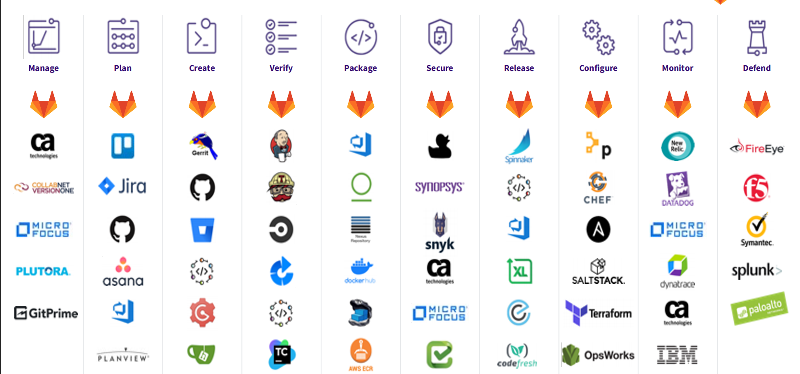
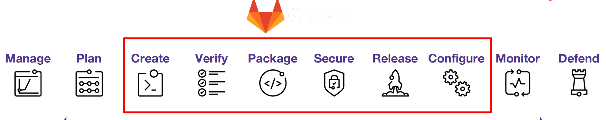
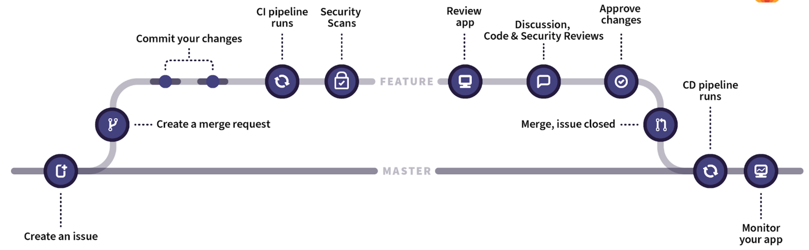
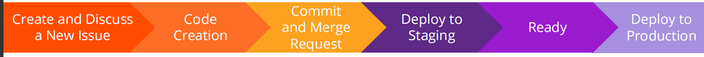
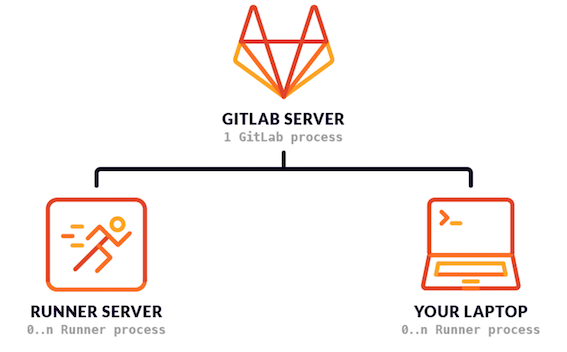
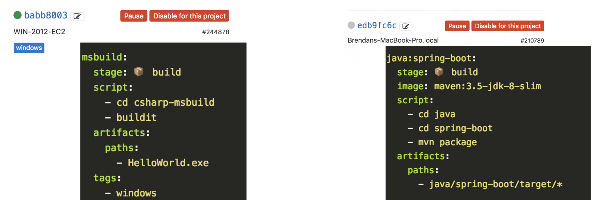
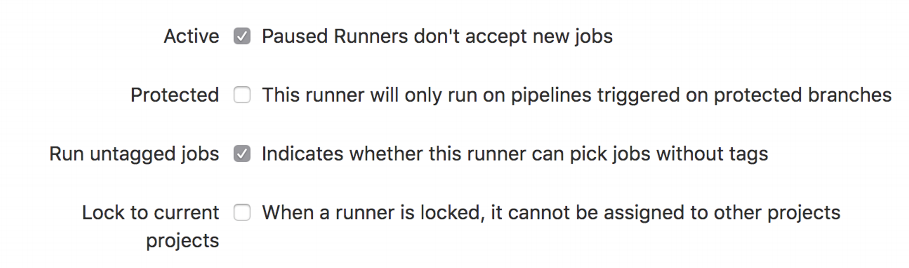
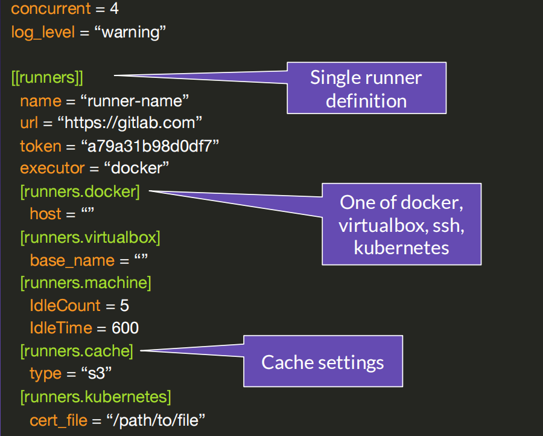

# **1 GitLab Certified CI/CD Specialist Training**

**GitLab aims to replace multiple tools across the lifecycle**

## **Gitlab CICD**

### **10 Different DevOps Stages- All with Different Features**

* **Manage**
	* Audit Management
	* Authentication and Authorization
	* Cycle Analytics
	* DevOps Score
	* Code Analytics
	* Value Stream Management
	* Workflow Policies

* **Plan**	
	* Project Management
	* Kanban Boards
	* Time Tracking
	* Agile Portfolio Management
	* Service Desk
	* Reguirements Management
	* Quality Management

* **Create**
	* Source Code Management
	* Code Review
	* Wiki
	* Web IDE
	* Snippets
	* Design Management
	* Live Coding

* **Verify**
	* Continuous Integration (CI)
	* Code Quality
	* Performance Testing
	* Usability Testing
	* System Testing
	* Accessibility Testing

* **Package**
	* Package Registry
	* Container Registry
	* Dependency Proxy
	* Helm Chart Registry

* **Secure**
	* SAST
	* Secret Detection
	* DAST
	* Dependency Scanning
	* Container Scanning
	* License Management
	* IAST
	* Fuzzing

* **Release**
	* Continuous Delivery (CD)
	* Release Orchestration
	* Pages
	* Review apps
	* Incremental Rollout
	* Feature Flags
	* **Release Governance**
	* **Secrets Management**

* **Configure**
	* **Auto DevOps**
	* **Kubernetes Configuration**
	* **ChatOps**
	* **Runbook Configuration**
	* Serverless
	* PaaS
	* Chaos Engineering
	* Cluster Cost Optimization

* **Monitor**
	* Metrics
	* Logging
	* Tracing
	* Cluster Monitoring
	* Error Tracking
	* Incident Management
	* Synthetic Monitoring
	* Status Page

* Defend
	* Runtime Application Self Protection
	* Web Application Firewall
	* Threat Detection
	* Behavior Analytics
	* Vulnerability Management
	* Data Loss Prevention
	* Container Network Security

**What we will focus on for CI/CD**

Single Conversation / Single Data Store  / Single Permission Model  /  Single Interface / Governance and Security / Team Collaboration / Lifecycle Analytics

### **GitLab Flow**

**GitLab Workflow—Example**

* Create and Discuss a New Issue
	* Team creates an issue
	* Team applies "Discussion" label
	* Team discusses using Comments

* Code Creation
	* Backend team starts work and developer starts writing code
	* Developer assigns issue to themselves
	* Developer adds  “Working on” label

* **Commit and Merge Request**
	* Developer creates Commits.
	* Developer pushes commits to a feature-branch
	* Developer creates a Merge Request (MR)
	* Backend team changes labels to  “Frontend”

* **Deploy to Staging**
	* Frontend  developer starts working on issue
	* Developer assigns issue to themselves
	* Developer adds  “Working on” label
	* Team reviews and refines code
	* Team stages code
	* Team changes label to “Staging”
	* After successful implementation team changes label to “Ready“

* **Ready**
	* Technical documentation team adds Docs label
	* Marketing team adds “Marketing" label
	* Technical team removes Docs label when done.
	* When done marketing team removes “Marketing” label and adds “Production” label

* **Deploy to Production**
	* Release team merges MR and deploys feature to production
	* Release team closes issue

### **What is Continuous Integration/Continuous Delivery?**

* **Continuous Integration** is the practice of integrating code into a shared repository and building/testing each change automatically, as early as possible usually several times a day
* **Continuous Delivery** adds that the software can be released to production at any time, often by automatically pushing changes to a staging system.
* **Continuous Deployment** goes further and pushes changes to production automatically

### **GitLab Basic CI/CD Workflow**

https://docs.gitlab.com/ee/ci/introduction/index.html

**A deeper look into the CI/CD workflow**

### **Why use CI/CD?**

CI/CD encourages collaboration across all departments and makes code creation and management easy, as well as provides the following specific benefits.

* **CI Detects Errors Quickly**: Fix errors while they are fresh in your mind
* **CI Reduces Integration Problems**: Smaller problems are easier to digest and it ensures the problems don’t compound
* **CI Allows Teams to Develop Faster**: More confidence among the developers allows for less bottlenecking

* **CD Delivers Value Quickly and More Often**

Get fast feedback on what your end users care about

* **CD Ensures Every Change is Releasable**

This lowers the risk of each release allows releases 
to be “boring”

## **2 Architecture & Runners**

**Configuration File + Runner (eg. agent, pet, bastion)**

* `.gitlab-ci.yml`
	* I need to run the job “build” before “test”

*  `GitLab Runner`
	
### **Runner Architecture** 

A GitLab Runner is a **lightweight, highly-scalable agent that picks up a CI job through the coordinator API of 
GitLab CI/CD**, runs the job, and sends the result back to the GitLab instance.

These are typically created by your admin and made visible in the GitLab UI for certain tasks and jobs. They  will have the following architecture:

### **Shared vs. Specific Runners**

**Shared Runners**： Can be used by any project

* Included in the pool for all projects
* Managed by GitLab Admin
* Typically autoscaling or otherwise scaled

**Specific Runners**： Tied to one or more specific projects

* In the pool for ONLY specific projects
* Managed by Runner Owner(s)
* Typically for specialized builds, or if an org needs to do so for billing

### **Tagged vs. Untagged**

### **Protected vs. Non-Protected**

**Protected**

* **ONLY runs jobs from  Protected Branches  / Protected Tags**
* Typically used for runners containing **deploy keys or other sensitive capabilities**

**Non-Protected**

* Runs jobs from ANY branch
* Used for **ANY build**

### **Additional Runner Options**

### **Executors: Common**

* **Shell**: Directly run commands as if writing them into terminal 
(bash or sh) or command prompt (cmd) or powershell
* **Docker Machine**: “Master” machine scales up runners with *any* executor on demand Typical in cloud deployments
* Docker: Execute inside of a docker image **Most common!**
* **Kubernetes**: Runs as a pod in a K8s cluster **Can also feature auto-scaling**
 
### **Executors: Less Common**

* **VirtualBox**: Base VM for runner Main “master” creates a new VM for each needed runner
* **Parallels**: Hint: Parallels is a nice platform on top of VirtualBox
*  **SSH**: 
	*  Similar to shell, but not as many features (bash only, no caching)
	*  Does allow you to SSH and execute commands on a machine you might not want to install runner on

### `config.toml`: Global Settings

