# **2 Anatomy of a Pipeline**

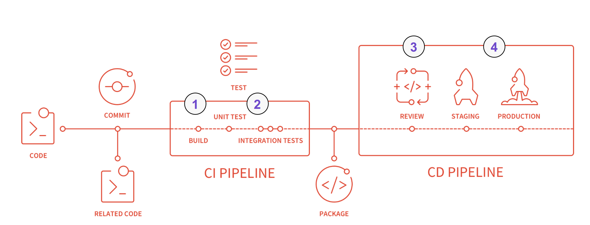

* **[Basic Pipeline](https://docs.gitlab.com/ee/ci/pipelines/pipeline_architectures.html#basic-pipelines)**
* **[Directed Acyclic Graph Pipelines]( https://docs.gitlab.com/ee/ci/pipelines/pipeline_architectures.html#directed-acyclic-graph-pipelines)**
* **[Child / Parent Pipelines](https://docs.gitlab.com/ee/ci/pipelines/pipeline_architectures.html#directed-acyclic-graph-pipelines)**


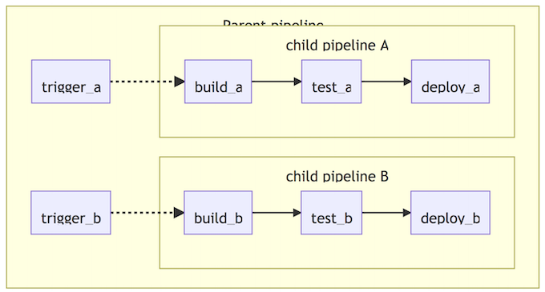

**GitLab Pipeline Graph**

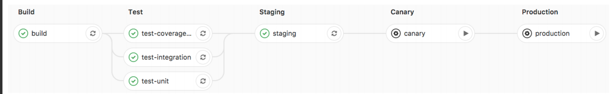

* Pipeline graph
* Shows how jobs are executed in stages
* Stages are run in serial to each other
* Jobs in each stage executed in parallel
* If one job in a stage fails, the next stage is not (usually) executed


**`.gitlab-ci.yml` Example**

```
image: registry.gitlab.com/gitlab-examples/kubernetes-deploy

stages: 
	- build 
	- deploy
variables:
	KUBE_DOMAIN: example.com

build:
	stage: build
	script: 
		- command build
	only: 
		- master

deploy: 
	stage: deploy
	script: 
		- command deploy 
	environment:
		name: production
		url: http://production.example.com 
	variables:
		DISABLE_POSTGRES: "yes" 
		only: 
			- master
```

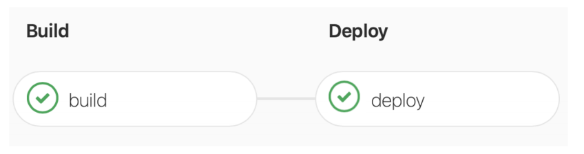

### **Basic Parameters**

```
- image
- services
- script
- before_script & after_script
- variables
- environment
```

```
- cache
- artifacts
- rules
- tags
- when
```

### **Basic Parameters**

```
test:
	script:
		- apt-get update -qy
		- bundle install --path /cache
		- bundle exec rake test

staging:
	stage: deploy
	script:
		- gem install dpl
		- dpl --provider=heroku --app=ruby-test-staging --api-key=$HEROKU_KEY
	only:
	- master

production:
	stage: deploy
	script:
	- gem install dpl
	- dpl --provider=heroku --app=ruby-prod --api-key=$HEROKU_PROD_KEY
	only:
	- tags
```

### **Image**

* Images are pulled from Docker Hub by default

Use of a public image:

```
image: ruby:2.3
```

* Images stored in the GitLab Container Registry

Use of a custom image:

```
image: 'registry.gitlab.com/gitlab-org/ci-trainingsample:latest'
```

`image: registry.example.com/k8-deploy:latest`


### **Services & Variables**

**Services:** Services lines tell the Runner that additional images are needed

```
services:
	- postgres
```


**Variables:** Variables also defined in `Project > 
Settings > CI/CD > Variables`

```
variables:
	POSTGRES_DB: rails-sample-1_test
	POSTGRES_USER: root
	POSTGRES_PASSWORD: ”xyzzy”
```

**`.gitlab-ci.yml`**

```
image: registry.example.com/k8-deploy:latest
services:
	- postgres
variables:
	POSTGRES_DB: rails-sample-1_test
```

### **Stages**

**Default Stages: Build, Test, Deploy**

**User can define custom stages & any number of jobs per 
stage**

```
stages:
	- build
	- test
	- review
	- deploy
```

* **Build**: Source code and other dependencies are combined and built
* **Test**: Automated tests are run to validate the 
code and behavior
* **Review**: The code is put through review apps for peer review and final approvals
* **Deploy**: The final product is deployed to a designated environment


**Stages seperate jobs into logical sections while Jobs perform the actual tasks**

### **Jobs and Scripts**

* Each Stage Can Have Multiple Jobs
* Jobs Run In Parallel
* Scripts Can Be Defined Several Different Ways
* Script Examples

```
build-code:
	stage: build
	script: build-it.sh

build-other-code:
	stage: build
	script: src/other/code/build-it.sh
```

`script: command build`

```
script: 
	- npm install
	- npm build
```

```
script: scripts/build_script.sh
```

```
image: registry.example.com/k8-deploy:latest
services: 
	- postgres

variables: 
	- POSTGRES_DB: rails-sample-1_test

stages:
	- build
	- test
	- deploy

deploy-code:
	stage: deploy
	script:
	- command deploy
```

### **Environments**

The environment keyword defines where the app is deployed and is defined by 3 parts.

```
environment: 
	name: prod
	url: http://$CI_PROJECT_NAME.$KUBE_DOMAIN
when: manual
```

**When** triggers jobs & stages manually (e.g. deploy to 
production)

### **Only & Except- Restricting When a Job is Executed**

```
pseudo-deploy:
	stage: deploy
	script:
	- command deploy_review
	only:
	- branches
	except:
	- master
	environment: 
		name: review
		url: http://$CI_PROJECT_NAME-review.$KUBE_DOMAIN
```

* **Only**: The name of branch to execute on (in this case all branches)
* **Except**: Branches NOT to execute on with exception to the Master Branch
 

The rules syntax is an improved, more powerful solution for defining when jobs should run or not. **Consider using rules instead of only/except to get the most out of your pipelines.**


### **`before_script` & `after_script`**

**Run before and after the script defined in each job**

* Can update the image with the latest version of components
* They run within the job and can interact with the job

**`before_script`**

is used to define a command that should be **run before each job, including deploy jobs, but after the restoration of any artifacts**

```
before_script:
	- echo $CI_BUILD_STAGE
	- apt-get update
	- apt-get install node-js -y 
	- bundle install
	- npm install
after_script:
	- rm temp/*.tmp
```

**`after_script`**

is used to define the command that will be run 
after each job, including failed ones.

### **Cache & Artifacts**

**Cache is used to pass information** between jobs & stages by storing project dependencies

```
cache:
	paths: 
		- binary/
		- .config
```

There may be build artifacts you want to save

```
artifacts:
	when: on_success
	paths: 
		- bin/target
```

```
image: registry.example.com/k8-deploy:latest
services: 
	- postgres

variables: 
	- POSTGRES_DB: rails-sample-1_test

cache:
	paths: 
	- binary/
	
stages:
	- build
	- test
	- deploy

build-it:
	stage: build
	script:
	- command build
	only:
	- master
	artifacts:
		when: on_success
		paths:
		- bin/target
		
deploy-code:
	stage: deploy
	script:
	- command deploy
	environment:
		name: production
		url: http://$CI_PROJECT_NAME.$KUBE_DOMAIN
	when: manual
	only:
	- master
```


### **Tags**

Only execute on runners with the ‘ruby’ and ‘test’ tags

```
job-name:
	tags: 
		- ruby
		- test
```

```
build-it:
	stage: build
	script:
	- command build
	only:
	- master
	tags: 
		- ruby
		- test
	artifacts:
		when: on_success
		paths:
		- bin/target
```

## **Advanced Keywords and DRY**

### **Advanced Parameters**

```
- dependencies
- needs
- parallel
- trigger
- include
- extends
- “.” anchors & <
```

**dependencies**

```
build:osx:
	stage: build
	script: make build:osx
	artifacts:
		paths: 
			- binaries/

build:linux:
	stage: build
	script: make build:linux
	artifacts:
		paths: 
			- binaries/

test:osx:
	stage: test
	script: make test:osx
	dependencies: 
		- build:osx

test:linux:
	stage: test
	script: make test:linux
	dependencies: 
		- build:linux

deploy:
	stage: deploy 
	script: make deploy
```

* paths
* dependencies

**Scenario**

By default, **all artifacts from all previous stages are 
passed**, but you can use the dependencies parameter to define a **limited list of jobs (or no jobs) to fetch artifacts from**.

**Example**


In the following example, we define two jobs with 
artifacts, `build:osx` and `build:linux`. When the 
`test:osx` is executed, the artifacts from `build:osx` 
will be downloaded and extracted in the context of 
the build. The same happens for `test:linux` and 
artifacts from `build:linux`.

The job deploy will download artifacts from all 
previous jobs because of the stage precedence.

### **needs**

```
linux:build:
	stage: build

mac:build:
	stage: build

lint:
	stage: test
	needs: []

linux:rspec:
	stage: test
	needs: ["linux:build"]

linux:rubocop:
	stage: test
	needs: ["linux:build"]

mac:rspec:
	stage: test
	needs: ["mac:build"]

mac:rubocop:
	stage: test
	needs: ["mac:build"]

production: 
	stage: deploy
```

**Scenario:** 

The `needs:` keyword enables executing jobs out-of-order, allowing you to implement a **directed acyclic 
graph** in your CI configuration.

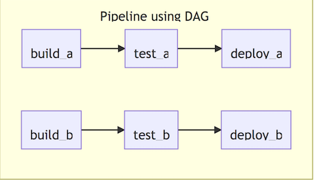

This lets you run some jobs without waiting for 
other ones, disregarding stage ordering so you can 
have multiple stages running concurrently.

**Example:**
Linux path: the `linux:rspec` and `linux:rubocop` jobs 
will be run as soon as the `linux:build` job finishes 
without waiting for mac:build to finish.

macOS `path:` the `mac:rspec` and `mac:rubocop` jobs 
will be run as soon as the `mac:build` job finishes, 
without waiting for `linux:build` to finish.

### **parallel**

```
# Gemfile
source 'https://rubygems.org'
gem 'rspec'
gem 'semaphore_test_boosters'

++++++
# .gitlab-ci.yml
test:
	parallel: 3
	script: 
		- bundle 
		- bundle exec rspec_booster --job $CI_NODE_INDEX/$CI_NODE_TOTAL
```

**Scenario**

parallel allows you to configure how many 
instances of a job to run in parallel. This value has 
to be greater than or equal to two (2) and less than 
or equal to 50.

**Example**

A simple example using Semaphore Test Boosters 
and RSpec to run some Ruby tests.


### **trigger**

```
rspec:
	stage: test
	script: bundle exec rspec

staging:
	stage: deploy 
	trigger:
		project: my/deployment 
		branch: stable
```

**Scenario**

**trigger allows you to start a downstream pipeline**. When a job created from trigger definition is started by GitLab, a downstream pipeline gets created.

**Example**

It is possible to configure a branch name that GitLab will use to create a downstream pipeline with.


## **Variable Precedence & Scoping**

### **Variable Priority**

The order of precedence for variables is (from 
highest to lowest):

1. **Trigger** variables, **scheduled** pipeline 
variables, or **manual** pipeline run variables
2. **Project-level** variables or protected variables.
3. **Group-level** variables or protected variables.
4. **Inherited environment variables**.
5. YAML-defined **job-level variables**.
6. YAML-defined **global variables**
7. **Deployment variables**.
8. **Predefined environment variables**

Scenario

* `API_TOKEN=secure` as a project variable.
* `API_TOKEN=yaml` in your `.gitlab-ci.yml`.

`API_TOKEN` will take the value secure as the project variables take precedence over those defined in `.gitlab-ci.yml`.

## **Registry & Deployments**

### **What are Package and Container Registries?**

* **Package Registry**


GitLab Packages allows organizations to utilize GitLab as a private repository for a variety of common package managers. Users are able to build and publish packages, which can be easily consumed as a dependency in downstream projects.


* **Container Registry**

A secure and private registry for Docker images built-in to GitLab. Creating, pushing, and retrieving images works out of the box with GitLab CI/CD.


## **Security Scanning & Reports**

### **GitLab Application Security**

GitLab can check your application for security vulnerabilities that may lead to unauthorized access, data leaks, denial of services, and more. GitLab reports vulnerabilities in the merge request so you can fix them before merging.


The Security Dashboard provides a high-level view of vulnerabilities detected in your projects, pipeline, and groups.

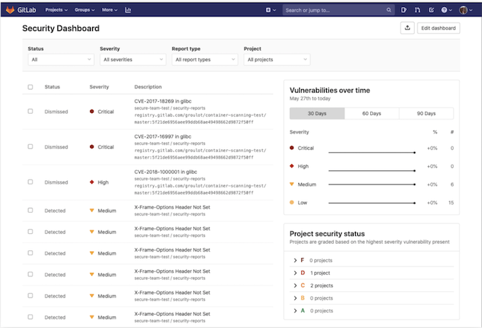

### **Security Configuration**

The security configuration page displays the configuration state of each of the security features and can be accessed through a project’s sidebar nav.

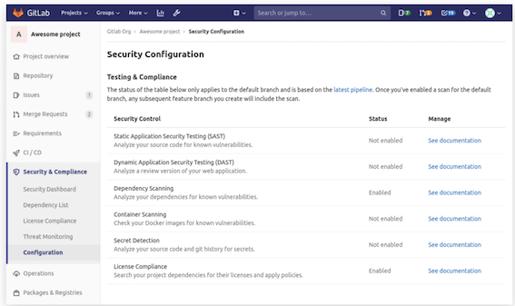

### **Static Application Security Testing (SAST)**

**Static Application Security Testing (SAST) is used to analyze your source code for known vulnerabilities.**


GitLab checks the SAST report, compares the found vulnerabilities between the source and target branches, and shows the information right on the merge request.

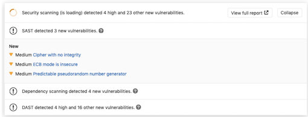


### **Configuration**

**Enabling Docker-in-Docker**

```
include:
	- template: SAST.gitlab-ci.yml

variables:
	SAST_DISABLE_DIND: "false"
```

**Enabling Kubesec analyzer**

```
include:
	- template: SAST.gitlab-ci.yml

variables:
	SCAN_KUBERNETES_MANIFESTS: "true"
```

### **Code Quality Overview**

With the help of GitLab CI/CD, you can analyze your source code quality using GitLab Code Quality.

Code Quality:

* Uses Code [Climate Engines](https://codeclimate.com/), which are free and open source. Code Quality doesn’t require a Code Climate subscription.
* Runs in pipelines using an Docker image built in GitLab Code Quality project.
* Can make use of a template. 
* Is available with Auto DevOps.


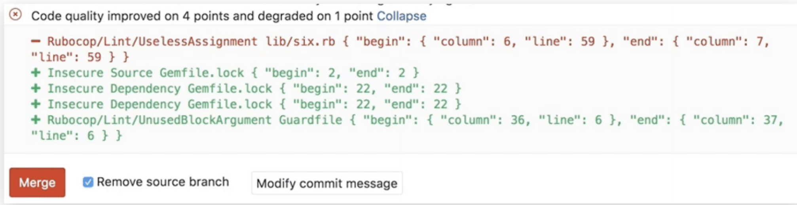

### **How Code Quality Works**

First, you need GitLab Runner configured:

* Information on the built-in GitLab Code Quality template.
* Examples of manual GitLab configuration for earlier GitLab versions

**Once you setup the Runner, include the Code Quality template in your CI configuration:**

```
include:
	- template: Code-Quality.gitlab-ci.yml

code_quality:
	artifacts:
		paths: [gl-code-quality-report.json]
```

**Code Quality Reports**

Once the Code Quality job has completed:

* The full list of code quality violations generated by a pipeline is available in the Code Quality tab of the 
Pipeline Details page.
* Potential changes to code quality are shown directly in the merge request. The Code Quality widget in 
the merge request compares the reports from the base and head of the branch, then lists any violations that will be resolved or created when the branch is merged.
* The full JSON report is available as a downloadable artifact for the `code_quality` job

### **Container Scanning**

Your application’s Docker image may itself be based on Docker images that contain known vulnerabilities.By including an extra job in your pipeline that scans for those vulnerabilities and displays them in a merge request, you can use GitLab to audit your Docker-based apps.

You can enable container scanning by doing one of the following:

* Include the CI job in your existing `.gitlab-ci.yml` file
* Implicitly use Auto Container Scanning provided by Auto DevOps.

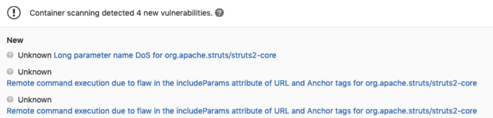


### **Junit Testing**

It is very common that a CI/CD pipeline contains a test job that will verify your code. If the tests fail, the pipeline fails and users get notified. The person that works on the merge request will have to check the job logs and see where the tests failed so that 
they can fix them.


You can configure your job to use JUnit test reports, and GitLab will display a report on the merge request so that it’s easier and faster to identify the failure without having to check the entire log

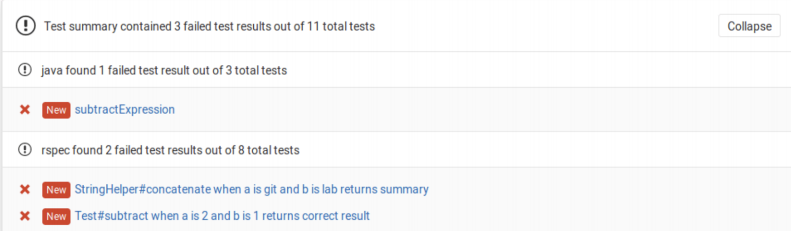

