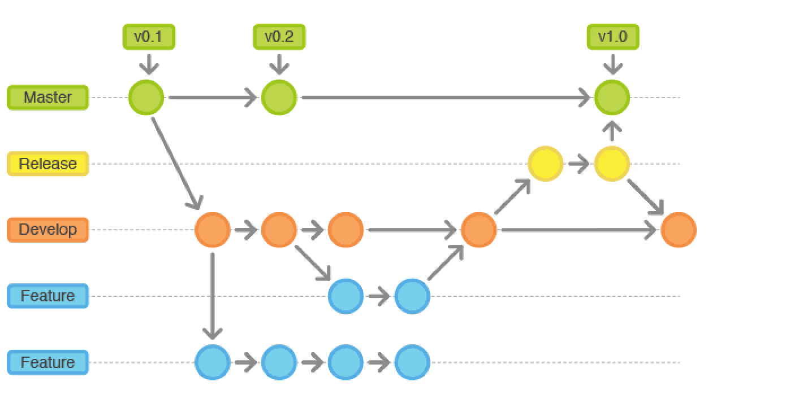
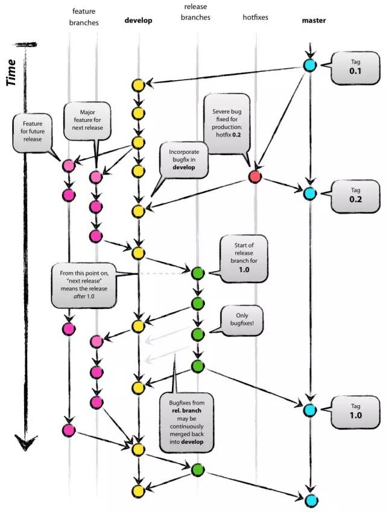
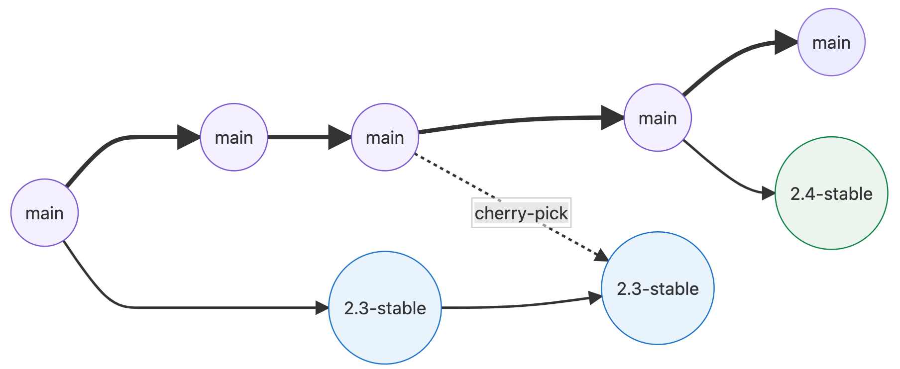
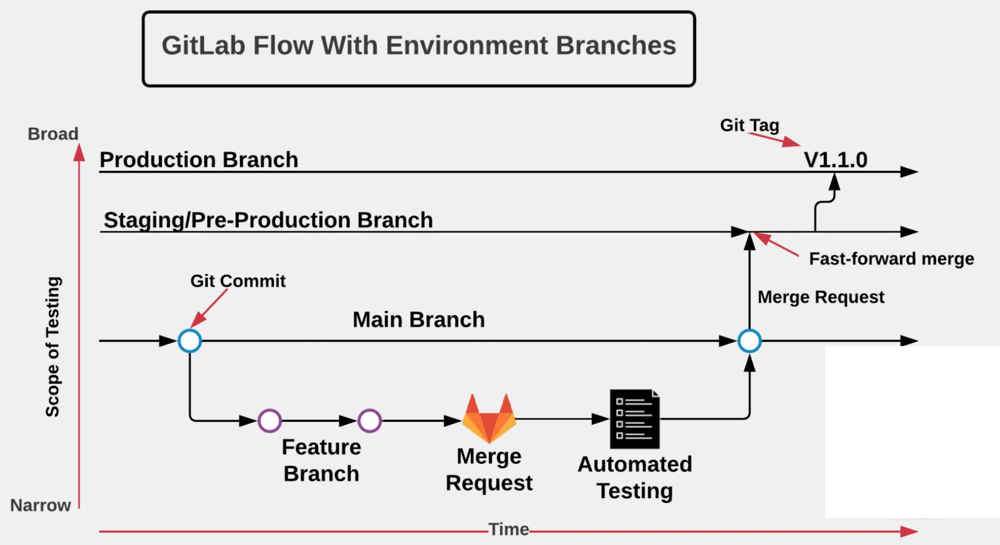
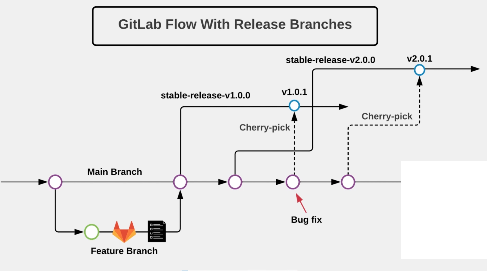

# **L1 Gitlab branch Strategy**


https://docs.gitlab.com/ee/topics/gitlab_flow.html

## **1 Requirement** 



Once **develop** has acquired enough features for a release (or a predetermined release date is approaching), you **fork a release branch off** of develop. 

Creating this branch starts the next release cycle, so **no new features can be added after this point**. *Only bug fixes, documentation generation, and other release-oriented tasks should go in this branch*(which includes testing also). 


Once it's ready to ship, the release gets merged into master and tagged with a version number. In addition, **it should be merged back into develop**, which may have progressed since the release was initiated. 


Using a dedicated branch to prepare releases makes it possible for one team to polish the current release while another team continues working on features for the next release. 

It also creates well-defined phases of development (e.g., it's easy to say, 'this week we're preparing for version 4.0" and to actually see it in the structure of the repository). 


## Basic Description



It suggests a main branch and a separate develop branch, with supporting branches for features, releases, and hotfixes. 

* **The development happens on the develop branch, moves to a release branch, and is finally merged into the main branch**.

* master：The official version that can be provided to users；
* develop：Version used to generate code(nightly）；
* feature：For developing a function；
* hotfix：Used to fix bugs in online code；
* release：**Release branch, integrate feature branch for release**。

### The first problem 


* The first problem is that developers **must use the develop branch and not main**.  
	* **main is reserved for code that is released to production**. 
	* It is a convention to call your default branch main and to mostly branch from and merge to this. Because most tools automatically use the main branch as the default, it is annoying to have to switch to another branch.

### The second problem

Git flow is the complexity introduced by the hotfix and release branches。

Frequently, developers make mistakes such as merging changes only into main and not into the develop branch. The reason for these errors is that Git flow is too complicated for most use cases. For example, many projects do releases but don’t need to do hotfixes.

### **Release branches with GitLab flow**

You should work with release branches only if you need to release software to the outside world. In this case, each branch contains a minor version, such as `2.3-stable` or `2.4-stable`:



After announcing a release branch, only add serious bug fixes to the branch. 

If possible, first merge these bug fixes into main, and then cherry-pick them into the release branch. If you start by merging into the release branch, **you might forget to cherry-pick them into main, and then you’d encounter the same bug in subsequent releases**. 

**Merging into main and then cherry-picking into release is called an “upstream first” policy,** 

### Squashing commits with rebase

With Git, you can use an interactive rebase (`rebase -i`) to squash multiple commits into one or reorder them. This feature helps you replace a couple of small commits with a single commit, or if you want to make the order more logical:

```
pick c6ee4d3 add a new file to the repo
pick c3c130b change readme

# Rebase 168afa0..c3c130b onto 168afa0
#
# Commands:
# p, pick = use commit
# r, reword = use commit, but edit the commit message
# e, edit = use commit, but stop for amending
# s, squash = use commit, but meld into previous commit
# f, fixup = like "squash", but discard this commit's log message
# x, exec = run command (the rest of the line) using shell
#
# These lines can be re-ordered; they are executed from top to bottom.
#
# If you remove a line here THAT COMMIT WILL BE LOST.
#
# However, if you remove everything, the rebase will be aborted.
#
# Note that empty commits are commented out
~
```

## Gitlab Flow with 	Environment Branches




