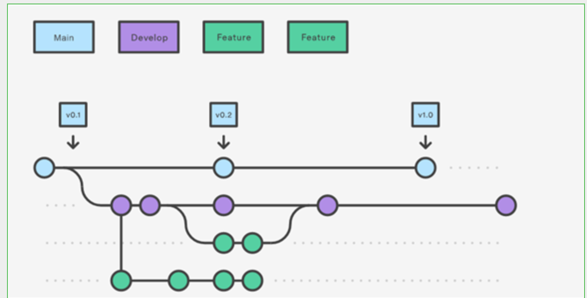
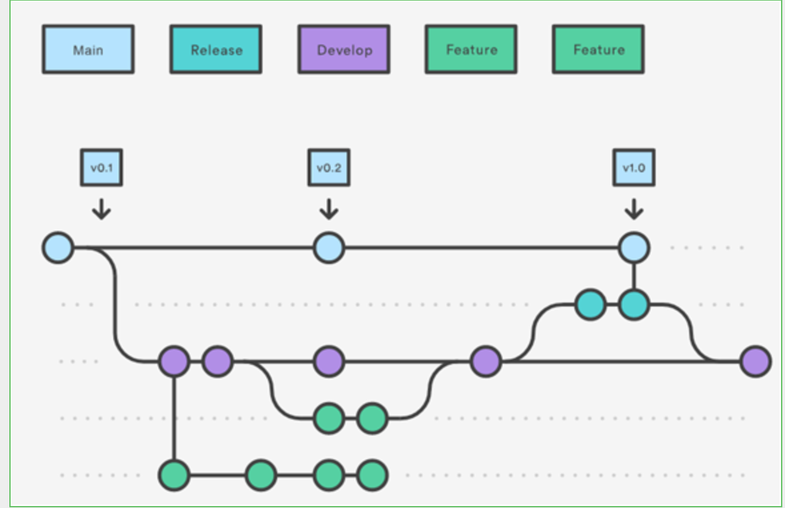
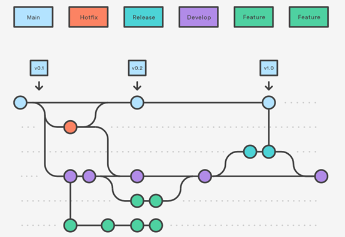

# **2 Gitflow Workflow**

> Reference:
>
> https://www.atlassian.com/git/tutorials/comparing-workflows/gitflow-workflow

Giflow is an alternative Git branching model that involves the use of feature branches and multiple primary branches.

Gitflow can be used for projects that have a scheduled release cycle.  it assigns very specific roles to different branches and defines how and when they should interact. In addition to **feature** branches, it uses individual branches for preparing, maintaining, and recording releases. 

## How doest it work

### Develop and main branches

* The **main** branch stores the **official release** history
* The **develop** branch serves as an **integration branch for features**.
* Tag all commits in the **main branch with a version number**.

The first step is to complement the default main with a develop branch. A simple way to do this is for one developer to create an empty develop branch locally and push it to the server:

```
git branch develop
git push -u origin develop
```

**Develop branch** will contain the complete history of the project, whereas **main will contain an abridged version**. 

Other developers should now clone the central repository(develop) and create a tracking branch for develop.

When using the `git-flow `extension library, executing `git flow init` on an existing repo will create the **develop branch**:

```
$ git flow init


Initialized empty Git repository in ~/project/.git/
No branches exist yet. Base branches must be created now.
Branch name for production releases: [main]
Branch name for "next release" development: [develop]


How to name your supporting branch prefixes?
Feature branches? [feature/]
Release branches? [release/]
Hotfix branches? [hotfix/]
Support branches? [support/]
Version tag prefix? []


$ git branch
* develop
 main
```

### Feature branches

* Each new feature should reside in its own branch, which can be pushed to the central repository for backup/collaboration(Develop). 
* Instead of branching off of main, feature branches use **develop as their parent branch**. 
* When a feature is complete, it gets merged back into **develop**. 
* **Features should never interact directly with main**.



Feature branches are generally created off to the **latest develop branch**.

**Creating a feature branch**

* Without the git-flow extensions:

```
git checkout develop
git checkout -b feature_branch
```

* When using the git-flow extension:

```
git flow feature start feature_branch
```

When you’re done with the development work on the feature, **the next step is to merge the `feature_branch` into `develop`**.

* Without the git-flow extensions:

```
git checkout develop
git merge feature_branch
```
* Using the git-flow extensions:

```
git flow feature finish feature_branch
```

### Release branches



* Once develop has acquired enough features for a release (or a predetermined release date is approaching), you **fork** a release branch off of **develop**. 
* Creating this branch starts the next release cycle, **so no new features can be added** after this point—only bug fixes, **documentation generation, and other release-oriented tasks** should go in this branch. 
* Once it's ready to ship, **the release branch gets merged into main and tagged with a version number**. 
* In addition, it should be **merged back into develop**, which may have progressed since the release was initiated.

Like feature branches, release branches are based on the develop branch. 

A new release branch can be created using the following methods.

* Without the git-flow extensions:

```
git checkout develop
git checkout -b release/0.1.0
```

When using the git-flow extensions:

```
$ git flow release start 0.1.0
Switched to a new branch 'release/0.1.0''
```

Once the release is ready to ship, it will get merged it into **main** and **develop**, then the **release branch will be deleted**. 


It’s important to **merge back into develop** because critical updates may have been added to the release branch and **they need to be accessible to new features**.

To finish a release branch, use the following methods:

```
git checkout main
git merge release/0.1.0
```

```
git flow release finish '0.1.0'
```

### Hotfix branches



Maintenance or “hotfix” branches are used to **quickly patch production releases**. 

Hotfix branches are a lot like release branches and feature branches except **they're based on main instead of develop**. 

This is the only branch that should **fork directly off of main**. 

**As soon as the fix is complete, it should be merged into both main and develop** (or the current release branch), and **main should be tagged with an updated version number**.

```
git checkout main
git checkout -b hotfix_branch
```

```
$ git flow hotfix start hotfix_branch
```

Similar to finishing a **release** branch, a hotfix branch gets merged into **both main and develop**.

```
git checkout main
git merge hotfix_branch
git checkout develop
git merge hotfix_branch
git branch -D hotfix_branch
```

```
$ git flow hotfix finish hotfix_branch
```

### Example

A complete example demonstrating a Feature Branch Flow is as follows. Assuming we have a repo setup with a main branch.

```
git checkout main
git checkout -b develop
git checkout -b feature_branch


# work happens on feature branch
git checkout develop
git merge feature_branch

git checkout main
git merge develop

# purge the the feature branch
git branch -d feature_branch
```

In addition to the feature and release flow, a hotfix example is as follows:

```
git checkout main
git checkout -b hotfix_branch
# work is done commits are added to the hotfix_branch

# hotfix branch gets merged into both main and develop
git checkout develop
git merge hotfix_branch
git checkout main
git merge hotfix_branch
```


## Summary

* The workflow is great for a **release-based** software workflow.
* Gitflow offers a dedicated channel for **hotfixes to production**.


The overall flow of Gitflow is:

* A **develop** branch is created from **main**
* A **release** branch is created from **develop**
* **Feature** branches are created from **develop**
* When a **feature** is complete it is merged into the **develop** branch
* When the **release** branch is done it is merged into **develop and main**
* If an issue in **main** is detected a **hotfix** branch is created from **main**
* Once the **hotfix** is complete it is merged to both **develop and main**
