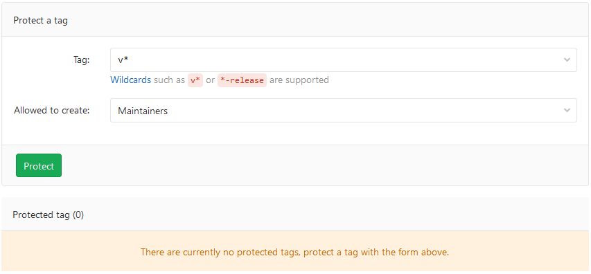
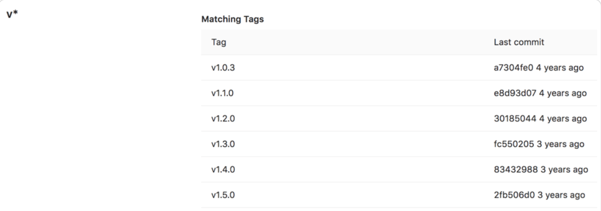

# **L3 Gitlab branch Settup Action**

## **1 Default branch**

A default branch has special configuration options not shared by other branches:

* **It cannot be deleted**.
* **It’s initially protected against forced pushes**.
* When a merge request uses an **issue closing pattern** to close an issue, the work is merged into this branch.

**Protect initial default branches**

* **Not protected** - Both developers and maintainers can push new commits and force push.
* **Protected against pushes** - Developers cannot push new commits, but are allowed to accept merge requests to the branch. Maintainers can push to the branch.
* **Partially protected** - Both developers and maintainers can push new commits, but cannot force push.
* **Fully protected** - **Developers cannot push new commits, but maintainers can**. No one can force push.

## **2 Protected branches**

### **Who can modify a protected branch**

| Action                   | Who can do it                                                 |
| ------------------------ | ------------------------------------------------------------- |
| Protect a branch         | At least the Maintainer role.                                 |
| Push to the branch       | GitLab administrators and anyone with Allowed permission. (1) |
| Force push to the branch | No one.                                                       |
| Delete the branch        | No one. (2)                                                   |

### **Configure multiple protected branches by using a wildcard**

If both a specific rule and a wildcard rule apply to the same branch, the most permissive rule controls how the branch behaves.

For merge controls to work properly, set **Allowed to push** to a broader set of users than **Allowed to merge**.

### Prerequisite:

**You must have at least the Maintainer role.**

**To protect multiple branches at the same time:**

| Wildcard protected branch | Matching branches                                            |
| ------------------------- | ------------------------------------------------------------ |
| `*-stable	`             | `production-stable, staging-stable`                        |
| `production/*`          | `production/app-server`, `production/load-balancer`      |
| `*gitlab*`              | `gitlab`, `gitlab/staging`, `master/gitlab/production` |

### **Create a protected branch**

Users with **at least the Developer** role can create a protected branch.

* Allowed to **push** is set to **No one**
* Allowed to **merge** is set to **Developers**.

**You can create a protected branch by using the UI or API only.**

### **Require everyone to submit merge requests for a protected branch**

**You can force everyone to submit a merge request**, rather than allowing them to check in directly to a protected branch.

* Settings > Repository
* Expand **Protected branches**.
* From the Allowed to **merge list**, select **Developers + Maintainers**.
* From the **Allowed to push list**, select **No one**.

### **Allow everyone to push directly to a protected branch**

* Settings > Repository.
* Expand **Protected branches**.
* From the **Allowed to push** list, select **Developers + Maintainers**.

### **Require Code Owner approval on a protected branch （PREMIUM）**

* Expand Protected branches.
* From the **Allowed to push** and **Allowed to merge lists**, select the settings you want.
* To allow all users with push access to force push, turn on the **Allowed to force push toggle**.
* To reject code pushes that change files listed in the **CODEOWNERS** file, turn on the Require **approval from code owners** toggle

## **3 Protected tags**

Protected tags:

* Allow control over who has permission to create tags.
* Prevent accidental update or deletion once created.

Each rule allows you to match either:

### **Configuring protected tags**

* Settings > Repository.
* From the **Tag** dropdown list, select the tag you want to protect or type and select **Create wildcard**. In the screenshot below, we chose to protect all tags matching `v*`



### **Wildcard protected tags**

| Wildcard Protected Tag | Matching Tags                 |
| ---------------------- | ----------------------------- |
| `v*	`                | `v1.0.0, version-9.1`       |
| `*-deploy	`          | `march-deploy, 1.0-deploy`  |
| `*gitlab*`           | `gitlab, gitlab/v1`         |
| `*`                  | `v1.0.1rc2, accidental-tag` |

Two different wildcards can potentially match the same tag. **For example, `*-stable` and `production-*` would both match a `production-stable` tag**.

In that case, if any of these protected tags have a setting like **Allowed to create**, **then `production-stable` also inherit this setting**.

If you select a protected tag’s name, GitLab displays a list of all matching tags:



## **Push rules**

Push rules give you more control over what can and can’t be pushed to your repository. While GitLab offers protected branches, you may need more specific rules, such as:

* **Evaluating the contents of a commit**.
* **Confirming commit messages match expected formats**.
* **Enforcing branch name rules**.
* **Evaluating the details of files**.
* **Preventing Git tag removal**.

### **Enable global push rules**

You can create push rules for all new projects to inherit, but they can be overridden at the project level or the group level. All projects created after you configure global push rules inherit this configuration.

Prerequisite:

**You must be an administrator.**

### Override global push rules per project

The push rule of an **individual project overrides the global push rule**.

To override global push rules for a specific project, or to update the rules for an existing project to match new global push rules:

### Verify users

Use these rules to validate users who make commits.

* **Reject unverified users**: Users must have a confirmed email address.
* **Check whether the commit author is a GitLab user**: The commit author and committer must have an email address that’s been verified by GitLab.
* **Commit author’s email**: Both the author’s and committer’s email addresses must match the regular expression. To allow any email address, leave empty.

### **Validate commit messages**

* **Require expression in commit messages**: Messages must match the expression. To allow any commit message, leave empty. Uses multiline mode, which can be disabled by using (?-m).

For example, if every commit should reference a Jira issue (like Refactored css. Fixes JIRA-123.), the regular expression would be JIRA\-\d+.

* **Reject expression in commit messages**: Commit messages must not match the expression. To allow any commit message, leave empty. Uses multiline mode, which can be disabled by using (?-m).

### **Validate branch names**

To validate your branch names, enter a regular expression for **Branch name**. To allow any branch name, leave empty.

Your default branch is always allowed. Certain formats of branch names are restricted by default for security purposes.

Some validation examples:

* Branches must start with JIRA-.

```
`^JIRA-`

```

* Branches must end with -JIRA.

```
`-JIRA$`
```

* Branches must be between 4 and 15 characters long, accepting only lowercase letters, numbers and dashes.

```
`^[a-z0-9\\-]{4,15}$`
```

### **Prevent unintended consequences**

* **Reject unsigned commits**: Commit must be signed through GPG
* **Do not allow users to remove Git tags with git push**: Users cannot use git push to remove Git tags. Users can still delete tags in the UI.

### **Validate files**

* Prevent pushing secret files:
* **Prohibited file names**: Files that do not exist in the repository must not match the regular expression
* **Maximum file size**: Added or updated files must not exceed this file size (in MB)
