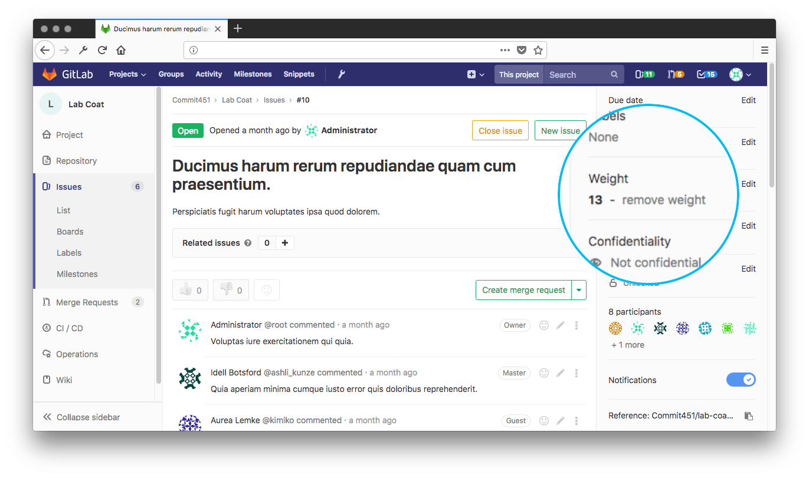

# **L4 GitLab Project Management: Agile Planning with GitLab**


## **Agile planning with GitLab**

Large enterprises have adopted Agile at enterprise scale through a variety of frameworks, **including Scaled Agile Framework (SAFe), Spotify, and Large Scale Scrum (LeSS)**.

GitLab enables teams to apply Agile practices and principles to organize and manage their work, whatever their chosen methodology.

## **GitLab Benefits**

As a single application for the complete DevOps lifecycle, GitLab is:

* **Seamless**: GitLab supports collaboration and visibility for Agile teams
  * From planning to deployment and beyond
  * With a single user experience and a common set of tools.
* **Integrated**: Manage projects in the same system where you perform your work.
* **Scalable**: Organize multiple Agile teams to achieve enterprise Agile scalability.
* **Flexible**: Customize out-of-the-box functionality to the needs of your methodology, whether you’re rolling your own flavor of Agile or adopting a formal framework.
* **Easy to learn**: See our Quick Start guide on setting up Agile teams.

## **3 Manage Agile projects**

GitLab enables lean and Agile project management from basic issue tracking to Scrum and Kanban-style project management. Whether you’re simply tracking a few issues or managing the complete DevOps lifecycle across a team of developers, GitLab has your team covered.

* **Plan, assign, and track** with **issues**.
* **Organize work** with labels , iterations and milestones.
* **Visualize work** with **boards**.
* **Correlate work with output** using **merge requests**、

## **4 Mapping Agile artifacts to GitLab features**

| Agile artifact        | GitLab feature                               |
| --------------------- | -------------------------------------------- |
| User story            | **Issues**                             |
| Task                  | **Task lists**                         |
| Epic                  | **Epics**                              |
| Points and estimation | **Weights**                            |
| Product backlog       | **Issue lists and prioritized labels** |
| Sprint/iteration      | **Milestones**                         |
| Burndown chart        | **Burndown charts**                    |
| Agile board           | **Issue boards**                       |

### Features

* **Issues**: **Start with an issue** that captures a single feature that delivers business value for users.
* **Tasks**: Often, a user story is further separated into individual tasks. You can create a task list within an issue’s description in GitLab, to further identify those individual tasks.
* **Issue boards**: Everything is in one place. Track issues and communicate progress without switching between products. One interface to follow your issues from backlog to done.
* **Epics**: Manage your portfolio of projects more efficiently and with less effort by tracking groups of issues that share a theme, across projects and milestones with epics.
* **Milestones**: Track issues and merge requests created to achieve a broader goal in a certain period of time with GitLab milestones.
* **Roadmaps**: Start date and/or due date can be visualized in a form of a timeline. The epics roadmap page shows such a visualization for all the epics which are under a group and/or its subgroups.
* **Labels**: Create and assigned to individual issues, which then allows you to filter the issue lists by a single label or multiple labels.
* **Burndown Chart:** Track work in real time, and mitigate risks as they arise. Burndown charts allow teams to visualize the work scoped in a current sprint as they are being completed.
* **Points and Estimation**: Indicate the estimated effort with issues by assigning weight attributes and indicate estimated effort
* **Collaboration**: The ability to contribute conversationally is offered throughout GitLab in issues, epics, merge requests, commits, and more!
* **Traceability**: Align your team’s issues with subsequent merge requests that give you complete traceability from issue creation to end once the related pipeline passes.
* **Wikis**: A system for documentation called Wiki, if you are wanting to keep your documentation in the same project where your code resides.
* **Enterprise Agile Frameworks**: Large enterprises have adopted Agile at enterprise scale using a variety of frameworks. GitLab can support SAFe, Spotify, Disciplined Agile Delivery and more.

## **An Agile iteration with GitLab**

### Projects

GitLab projects are used to organize your work and host your codebase. You can create a project to track issues, plan work, collaborate on code, and continuously build, test, and use built-in CI/CD to deploy your app.

Projects can be made available publicly, internally, or privately, with no limit on the number of private projects that can be created.


### Groups

In order to manage multiple projects (portfolios of projects), the GitLab Group is the entity that enables strategic planning and tracking of business initiatives through delivery.

**At the Group Level, you can manage sub-groups, projects, epics, milestones, roadmaps and group level boards.**


### **User stories → GitLab issues**

The issue in Gitlab is the fundamental planning object.

It is where the team documents the use case in the description, discusses the approach, estimates the size/effort (issue weight), tracks actual time/effort, assigns work, and tracks progress. Labels enable the team to tag issues, track status, and associate issues with different initiatives.

You can use issues for many purposes, customized to your needs and workflow.

* Discuss the implementation of an idea.
* Track tasks and work status.
* Accept feature proposals, questions, support requests, or bug reports.
* Elaborate on code implementations.

When creating an issue you can set its due dates, importance, confidentiality, dependencies on other issues, link it to another issue, and add task lists.

You can also create issues via email to receive issue tickets from people without access to your GitLab instance.


### **Task → GitLab task lists**

Often, **a user story is further separated into individual tasks.** You can create a task list within an issue’s description in GitLab, to further identify those individual tasks.


```
- [x] Completed task
- [ ] Incomplete task
  - [ ] Sub-task 1
  - [x] Sub-task 2
  - [ ] Sub-task 3

1. [x] Completed task
2. [ ] Incomplete task
   1. [ ] Sub-task 1
   2. [x] Sub-task 2
```

### **Epics → GitLab epics**

In order to track groups of related projects and issues, the GitLab epic gives product owners and leaders the ability to link and manage work over an extended time frame. An epic can span multiple milestones and makes it easier to manage the overall flow and priority of work.

**GitLab epics allow you to group issues that share a common theme across projects and milestones**; this enables you to manage your portfolio of projects more efficiently.

Example epics could include Security, GraphQL upgrades, or User Onboarding.

GitLab recommends using epics for the following scenarios:

* When your team is working on a large feature involving multiple discussions in different issues on different projects in a group.
* To track when work for a group of issues is targeted to begin and end.
* **To discuss and collaborate on feature ideas and scope at a high level**.


### **Labels**

**GitLab labels** make it easier to keep track of your issues and projects within GitLab, especially as your organization grows and you use GitLab for longer.

**Labels allow you to tag your work in a flexible way, which allows you to easily track and find items you’re interested in.**

GitLab recommends these use cases for labels:

* Categorize epics, issues, and merge requests using colors and descriptive titles like bug, feature request, or docs.
* Dynamically filter and manage epics, issues, and merge requests.
* Search lists of issues, merge requests, and epics—as well as issue boards.


### **Points and estimation → GitLab issue weights**

Also in this meeting, user stories are communicated, and the level of technical effort is estimated for each in-scope user story. In GitLab, issues have a weight attribute, which you would use to indicate the estimated effort.

In this meeting (or in subsequent ones), user stories are further broken down to technical deliverables, sometimes documenting technical plans and architecture.

In GitLab, this information can be documented in the issue, or in the merge request description, as the merge request is often the place where technical collaboration happens.

During the sprint (GitLab milestone), development team members pick up user stories to work on, one by one.

In GitLab, issues have assignees. So you would assign yourself to an issue to reflect that you are now working on it. We’d recommend that you create an empty and linked-to-issue merge request right away to start the technical collaboration process, even before creating a single line of code.



### **Product backlog → GitLab issue lists and prioritized labels**

**Issue lists and prioritized labels**

The product or business owners typically create these user stories to reflect the needs of the business and customers. They are prioritized in a product backlog to capture urgency and desired order of development.

The product owner communicates with stakeholders to determine the priorities and constantly refines the backlog. In GitLab, there are dynamically generated issue lists which users can view to track their backlog. Labels can be created and assigned to individual issues, which then allows you to filter the issue lists by a single label or multiple labels. This allows for further flexibility. Priority labels can even be used to also order the issues in those lists.

### **Sprint/iteration → Milestones**

While milestones at the project level often align to sprints, at the group level, milestones can be created for all the projects and sub-groups within the group. This way, teams can stay in synch with each other and focus on common release targets.

**In practice, you give a milestone a title, with an optional start date and optional due date. Milestones can be used to track Agile sprints or releases.**


### **Burndown Charts**

GitLab burndown charts allow you to see your completion progress of a milestone.

**GitLab plots this for you in a clear and well-presented chart**. You will be able to track your work in real-time and identify any risk of delays much earlier.


### Agile board

A GitLab board allows you to organize a workflow your team can use to easily manage their work.

Boards show you the issues being worked on, who is assigned to each issue, and where issues are in the workflow.

On your board, issues appear as cards in vertical lists which teams can move across lanes to reflect where work currently is in the workflow. **Boards work seamlessly with Scrum and Kanban methodologies, and multiple boards can be created within the same project.**


### **Roadmaps**

A roadmap visualizes upcoming work in your product development workflow. They allow everyone to have the same understanding and improve communication for projects currently in progress.

Teams use roadmaps to outline future product functionality, as well as the release of new features.

GitLab’s roadmap displays epics and milestones in a group containing a start date or due date—visualized in the form of a timeline. On each epic in the roadmap, you can view the epic’s title, start date, due date, and completed weight percentage.


### **Wikis**

GitLab’s wiki is a documentation tool that allows you to keep documentation in the same project as your codebase. Each GitLab project has its own wiki. Every wiki is a separate Git repository, so you can create wiki pages in the web interface, or locally using Git. Agile teams can also use a wiki to store their cycle’s retrospective meetings history.

### **Traceability**

GitLab provides automated linking of issues to the current state of your code through merge requests where developers implement and deliver the code changes. This is a powerful project management feature for visibility.

In the description of a merge request, developers can link to an issue using its ID. They can then use helpers that let GitLab know the merge request is part of the work for the issue. Alternatively, it could be the final piece of work required and the issue will automatically close once the merge request is released. This automated project management ensures boards are always reflecting work progress accurately.


### **Merge Request**

The Merge Request is the linkage between the issue and the actual code changes. The merge request captures the design, implementation details (code changes), discussions (code reviews), approvals, testing (CI Pipeline), and security scans.


### **Larger Organizations**

GitLab’s project management tools support large organizations too; they can organize multiple Agile teams to achieve enterprise Agile scalability. Scaled Agile methodologies that large organizations might be using include: Scaled Agile Framework (SAFe), Spotify, Disciplined Agile Delivery , and more. All of these can be supported with GitLab’s project management solutions.
