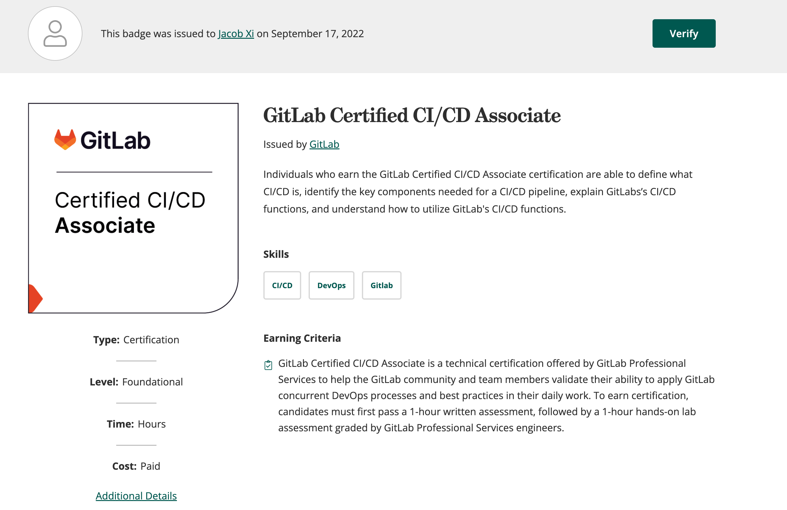
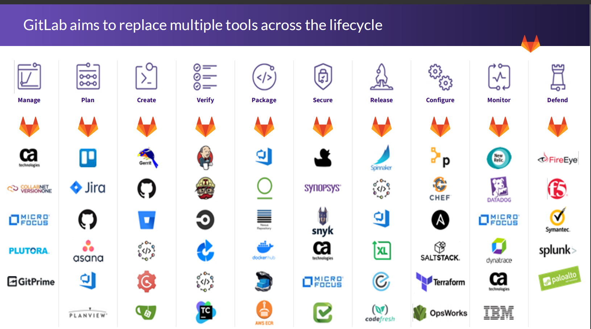

# **手摸手 Gitlab CICD & Project Management教程**

> Started at July 9th, 2022 By Jacob Xi

## **JX's chit-chat**

> Hi, this part is fucking new and freshing🤔

记录一下生活，今日Aug 21st 2022。近日发现，不懂技术的人，只能做二传手，没有能力的人，只会去吵架。人就是这样，别总提自己拥有软实力，那真的就是软。没有本事的人，只会瞎BBB。

PS: 今年第一个证书，DP900 还会远吗

> 说说最近看的新剧和小说吧

* 赛博朋克：边缘跑手 Cyberpunk: Edgerunners, CDPR YYDS
* House of the Dragon 血龙狂舞 YYDS

### **证书 & Badge:**

[https://www.credly.com/badges/5ed43677-e884-413a-882d-3bd206832889/public_url](https://www.credly.com/badges/5ed43677-e884-413a-882d-3bd206832889/public_url)

## 内容简介

* Gitlab 简介，branch Strategy，基于虚拟机和K8S环境的安装
* GitLab Runner安装注册配置管理
* GitLabCI系列之流水线语法 (Hands On Assessment)
* Gitlab工具链集成（模板库设计Maven+NPM，代码质量平台SonarQube，JFrog Artifactory 仓库集成， 自动化测试集成Jmeter）
* Gitlab + Kubernetes集成
* Gitlab流水线最佳实践，项目交付流水线
* Gitlab Project Management

### **Previous on my Technolog book**

> [手摸手Prometheus&amp;Thanos监控技术与实战教程](https://chao-xi.github.io/jxprombook/)
>
> [手摸手 Jenkins 战术教程 (大师版）](https://chao-xi.github.io/jxjenkinsbook/)
>
> [手摸手 Elasticsearch7 技术与实战教程](https://chao-xi.github.io/jxes7book/)
>
> [手摸手 Redis 技术与实战教程](https://chao-xi.github.io/jxredisbook/)
>
> [手摸手 Chef &amp; Ansible 技术与实战教程](https://chao-xi.github.io/jxchefbook/)
>
> [手摸手分布式与流式系统 (In progress)](https://chao-xi.github.io/jxdmsbook/)
>
> [Azure 103&amp;900 Tutorial (In progress)](https://chao-xi.github.io/jxazurebook/)
>
> [手摸手 Linux Performance &amp; 面试实战教程](https://chao-xi.github.io/jxperfbook/)
>
> [手摸手 Databases 全教程](https://chao-xi.github.io/jxdatabasebook/)
>
> [AWS Certified Data Analytics Tutorial](https://chao-xi.github.io/jxawscbdbook/)
>
> [Istio &amp; Service Mesh 战术教程](https://chao-xi.github.io/jxistiobook/)
>
> [AWS Certification Solutions Architect Book](https://chao-xi.github.io/jxawscsaabook/)
>
> [手摸手Prometheus&amp;Thanos监控技术与实战教程](https://chao-xi.github.io/jxprombook/)
>
> [Distributed Message System Book(Kafka)](https://chao-xi.github.io/jxdmsbook/)

## **Salut! C'est Moi**

> Do or Do not, there is no try

Hello, this is me, Jacob. Currently, I'm working as IT Cloud Architect in UBS, and I'm the certified AWS Solution Architect and Certified Azure Administrator, Kubernetes Specialist, Jenkins & Gitlab CI/CD and ElasticStack enthusiast.

I was working as Backend Engineer in New York City and achieved my CS master degree in SIT, America. Believe it or not, I'll keep writing, more and more books will come out at such dramatic and unprecedented 2021.

If you have anything want to talk to me directly, you can reach out for via email xichao2015@outlook.com。

Salute, c'est moi, Jacob. Actuellement, je travaille en tant qu'ingénieur iT Cloud Architect dans SAP, et je suis architecte de solution AWS certifié et administrateur Azure certifié, spécialiste Kubernetes et passionné de CI/CD.

Je travaillais en tant qu'ingénieur backend à New York et j'ai obtenu mon master CS à SIT, en Amérique. Croyez-le ou non, je continuerai à écrire, de plus en plus de livres sortiront cette année.

## **To be continue**

I will start working on Fintech book later on and in future, I will put more effort do finish "Hashicorp Book".🙂

